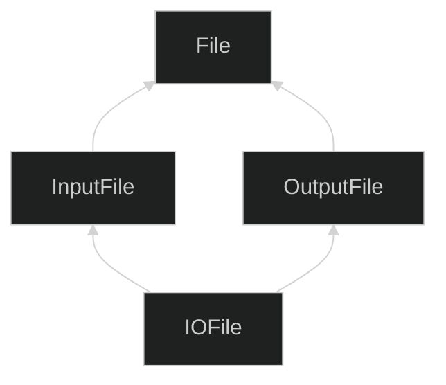
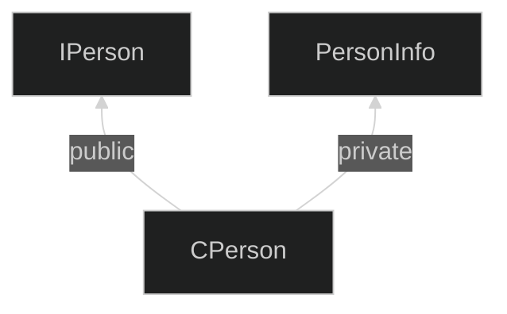

이 글은 아래의 책을 자세히 정리한 후, 정리한 글을 GPT에게 요약을 요청하여 작성되었습니다.  
이펙티브 C++ 제3판, 스콧 마이어스 저자, 곽용재 번역
{: .notice--warning}

# 📦 6. 상속, 그리고 객체 지향 설계
## 👉🏻 항목 40: 다중 상속은 심사숙고해서 사용하자

### ⚠️ 문제 1: 이름 모호성

```cpp
class BorrowableItem {
public:
	// 라이브러리에서 체크아웃
	void checkOut();
	...
};

class ElectronicGadget {
private:
	// 테스트를 실시하고, 성공 여부 반환
	bool checkOut() const;
	...
};

// 다중 상속
class MP3Player:
	public BorrowableItem,
	public ElectronicGadget
{ ... };

int main() {
	MP3Player mp;
	// 어떤 checkOut을 사용할 것인지 알 수 없음!
	mp.checkOut(); // ❌ 모호성 에러
}
```

**문제:**

- 두 클래스의 checkOut 함수의 영역이 **public과 private로 다름**에도 불구하고, **모호성이 생긴다**
- C++ 컴파일러는 최적 일치(best-match) 함수인지 확인한 후, 함수의 **접근 가능성을 점검**한다
- 즉, public과 private는 점검도 되지 않음

**해결:**

```cpp
mp.BorrowableItem::checkOut(); // ✅ 명시적으로 지정
```

직접 클래스를 명시함으로써 해결할 수 있다.

---

### ⚠️ 문제 2: 죽음의 MI 마름모꼴 (Deadly Diamond of MI)

```cpp
class File { ... }; // 변수 a가 있다 가정
class InputFile: public File { ... };
class OutputFile: public File { ... };
class IOFile:
	public InputFile,
	public OutputFile
{ ... };
```

**계층 구조:**



**문제:**

- `File 클래스`의 복사본이 **2개 존재**하게 된다
- `변수 a`도 **2개가 생긴다**

---

### ✅ 해결: 가상 기본 클래스 (Virtual Base Class)

```cpp
class File { ... }; // 변수 a가 있다 가정
class InputFile: virtual public File { ... };
class OutputFile: virtual public File { ... };
class IOFile:
	public InputFile,
	public OutputFile
{ ... };
```

**개선된 점:**

- 이전과 달리, `변수 a` **1개만** 가진다

**하지만 비용이 크다:**

1. **크기 증가**
    - 객체의 크기가 커진다
2. **속도 저하**
    - 접근 속도가 느려진다
3. **초기화 복잡도 증가**
    - 초기화가 필요한 가상 기본 클래스로부터 파생된 경우:
        - 거리와 상관없이 **가상 기본 클래스의 존재를 염두**에 두어야 한다
        - 기존 클래스 계통에 파생 클래스를 추가할 때도, **가상 기본 클래스의 초기화를 떠맡아야** 한다

---

### 📌 가상 기본 클래스 사용 지침

### **1. 쓸 필요가 없다면, 가상 기본 클래스를 사용하지 말자**

> 비가상 상속을 사용하자
> 

### **2. 써야 한다면, 가상 기본 클래스에는 데이터를 넣지 말자**

> 초기화와 대입의 복잡성을 줄일 수 있다
> 

---

### ✅ 다중 상속의 올바른 사용 예제

인터페이스 클래스와 구현 클래스를 결합하는 예제:

### 인터페이스 클래스 정의

```cpp
// 인터페이스 클래스
class IPerson {
public:
	virtual ~IPerson();

	virtual string name() const = 0;
	virtual string birthDate() const = 0;
};
```

### 구현 도우미 클래스 정의

```cpp
class DatabaseID { ... };

class PersonInfo {
public:
	explicit PersonInfo(DatabaseID pid);
	virtual ~PersonInfo();

	virtual const char* theName() const;
	virtual const char* theBirthDate() const;
	...
private:
	virtual const char* valueDelimOpen() const;
	virtual const char* valueDelimClose() const;
	...
};

const char* PersonInfo::valueDelimOpen() const {
	return "[";
}

const char* PersonInfo::valueDelimClose() const {
	return "]";
}

// [Homer]과 같이 형식화된 이름을 반환한다.
const char* PersonInfo::theName() const {
	// 구시대적인 스타일임
	static char value[Max_Formmated_Field_Value_Length];

	strcpy(value, valueDelimOpen());
	strcat(value, valueDelimClose());
	return value;
}
```

### 다중 상속을 사용한 구현 클래스

```cpp
// 다중상속 MI, private 상속이 사용됨
class CPerson: public IPerson, private PersonInfo {
public:
	explicit CPerson(DatabaseID pid): PersonInfo(pid) {}

	// 기본 클래스의 순수 가상 함수에 구현 제공
	virtual string name() const {
		return PersonInfo::theName();
	}
	virtual string birthDate() const {
		return PersonInfo::theBirthDate();
	}

private:
	// 이 재정의 버전을 통해 Homer와 같이 이름이 반환된다.
	const char* valueDelimOpen() const { return ""; }
	const char* valueDelimClose() const { return ""; }
};
```

### 사용 예시

```cpp
// 데이터베이스 ID로부터 IPerson 객체를 만드는 팩토리 함수
// 이 구조가 헷갈리면, 항목 31을 보자.
shared_ptr<IPerson> makePerson(DatabaseID personIdentifier) {
	return make_shared<CPerson>(personIdentifier);
}

// 사용자로부터 데이터베이스 ID를 얻는 함수
DatabaseID askUserForDatabaseID();

int main() {
	DatabaseID id(askUserForDatabaseID());
	shared_ptr<IPerson> pp(makePerson(id));

	// 이후 *pp의 조작을 위해 IPerson의 멤버 함수 사용
	...
}
```

---

### 💡 CPerson 구현 분석

**설계 결정:**

1. **CPerson과 PersonInfo의 관계**
    - is-implemented-in-terms-of 관계이다
    - 아래의 방식으로 구현될 수 있다:
        - 객체 합성(항목 38)
        - private 상속(항목 39)
2. **private 상속을 선택한 이유**
    - valueDelimOpen(), valueDelimClose()의 **재정의가 필요**하다
    - → **private 상속 사용**
3. **public 상속을 선택한 이유**
    - CPerson 클래스는 **IPerson 인터페이스를 구현**해야 한다
    - → **public 상속 사용**

**결론:**

> 다중 상속 필요
> 

**계층 구조:**



---

### 📊 다중 상속 사용 패턴 정리

| 패턴 | 첫 번째 상속 | 두 번째 상속 | 목적 |
| --- | --- | --- | --- |
| **인터페이스 + 구현** | public (인터페이스) | private (구현 도우미) | 권장 패턴 |
| **여러 인터페이스** | public | public | 주의 필요 (모호성) |
| **마름모꼴 상속** | 가상 상속 필요 | 가상 상속 필요 | 가능한 피하기 |

---

### ⚠️ 다중 상속 사용 시 주의사항

### **피해야 할 경우:**

- 단순히 코드 재사용을 위해 사용
- 명확한 설계 이유 없이 사용
- 마름모꼴 계층 구조가 필요한 경우 (가상 상속의 비용이 큼)

### **사용할 수 있는 경우:**

- **인터페이스 클래스**로부터 public 상속
- **구현을 돕는 클래스**로부터 private 상속
- 이 두 가지가 섞이는 경우

---

### 🧐 정리

1. **다중 상속은 모호성 문제를 일으켜, 가상 상속이 필요해질 수 있다.**  
이름 충돌과 마름모꼴 상속 문제를 주의해야 한다.
2. **가상 상속은 비용이 크다:**
    - 크기 비용 ⇡
    - 속도 비용 ⇡
    - 초기화 및 대입 연산 복잡도 ⇡
    
    **→ 가상 기본 클래스에는 데이터를 두지 않는 것이 좋다**
    
3. **다중 상속을 제대로 쓰는 경우 중 하나:**
    - 인터페이스 클래스로부터 **public 상속**
    - 구현을 돕는 클래스로부터 **private 상속**
    
    **→ 이 두 가지가 섞이는 경우이다**
    
4. **다중 상속은 단일 상속보다 복잡하므로 심사숙고해서 사용하자.**  
명확한 설계 이유가 있을 때만 사용하고, 가능하면 단순한 대안을 먼저 고려하자.