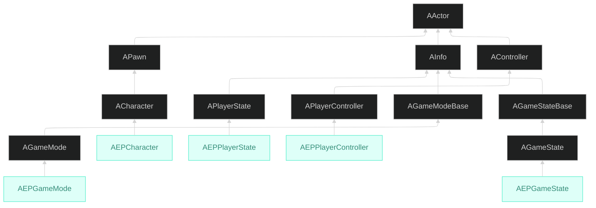

📌 **EmploymentProj 1단계 Gameplay Framework**의 첫 글입니다.
[👾 깃허브](https://github.com/SoftHamzzi/UE5-EmploymentProj) ·
[📋 기획](https://github.com/SoftHamzzi/UE5-EmploymentProj/blob/main/DOCS/GAME.md) ·
[📚 시리즈 목차](/devlog/EP_Main)
{: .notice--info}

## 개요

게임플레이의 뼈대를 세우는 글이다.

이 단계에서 실제로 결정한 것은 두 가지이다.

1. **어느 베이스 클래스를 상속할 것인가**: `AGameMode`냐 `AGameModeBase`냐
2. **어느 값을 클라이언트에게 보여줄 것인가**: 서버 전용으로 둘 것과 `GameState`로 올릴 것

두 번째가 이 프로젝트의 성격을 결정한다.
타르코프류 추출 슈터라서 **은폐가 기본값**이고, 공개는 예외이다.

---

## 클래스 구조



`AGameStateBase`와 `APlayerState`가 둘 다 `AInfo` 계열이라는 게 눈에 띈다.
`AInfo`는 **월드에 위치를 갖지 않는 액터**이다.
"게임 정보를 들고 있지만 공간에 존재하지 않는 것"이라는 성격이 상속 구조에 그대로 드러난다.

| 클래스 | 역할 |
|---|---|
| `AEPCharacter` | 플레이어가 조종하는 존재. 위치·애니메이션 |
| `AEPGameMode` | **서버에만 존재**. 게임 규칙, 매치 판정, 스폰 규칙 |
| `AEPGameState` | GameMode의 값 중 **클라가 알아도 되는 것**만 복제 |
| `AEPPlayerState` | 플레이어별 상태(킬 수, 추출 여부). 나중에 ASC도 여기 |
| `AEPPlayerController` | 입력, HUD, 서버 요청 송신 |

### PlayerController가 어디에 존재하는지: 나중에 중요해진다

| | 서버 | 소유 클라 | 다른 클라 |
|---|---|---|---|
| 인스턴스 | **전원 분량 존재** | 자기 것 1개 | 없음 |
| 하는 일 | `Server_` RPC 수신, 권한 판정, `RestartPlayer` | 입력, HUD, `Server_` 송신 | - |

"클라이언트 것"이라고 생각하기 쉽지만 **서버에도 플레이어 수만큼 있다.**
없으면 `Server_` RPC를 받을 대상이 없으니 당연하다.

이걸 지금 확실히 해두는 이유가 있다. 나중에 [2-6편](/devlog/EP_Replication-6)에서
크로스헤어 위젯을 만들 때 `IsLocalController()` 검사를 해야 하는데,
그 이유가 정확히 **서버에도 PlayerController가 있어서 서버에서도 위젯이 생성되기 때문**이다.

---

## 설계 결정 1: `AGameMode` vs `AGameModeBase`

`AGameMode`를 골랐다.

| | `AGameModeBase` | `AGameMode` |
|---|---|---|
| 매치 상태 | **없음** | `MatchState` + 내장 상태머신 |
| 훅 | `StartPlay` 정도 | `HandleMatchIsWaitingToStart` / `HandleMatchHasStarted` / `HandleMatchHasEnded` |
| 리스폰·스폰 | 있음 | 있음 |
| 딸려오는 전제 | 없음 | `bDelayedStart`, `ReadyToStartMatch()`, 매치메이킹 흐름 |

**고른 이유:** 이 게임은 *대기 → 진행 → 종료*가 명확한 매치 기반이다.
상태머신을 직접 만들면 결국 엔진이 이미 가진 것을 다시 짜게 된다.
[1-3편](/devlog/EP_Gameplay_Framework-3)에서 저 훅 세 개를 전부 오버라이드하게 되는데,
그게 이 선택의 실질적인 회수이다.

**대신 포기한 것:** `AGameMode`는 매치메이킹을 전제한 클래스이다.
`bDelayedStart`, `ReadyToStartMatch()` 같은 것들이 딸려온다.
싱글플레이나 로비 없는 코옵이었다면 `AGameModeBase`가 더 가볍다.

---

## 설계 결정 2: 무엇을 `GameState`로 승격할 것인가

### 먼저, "복제 경계"라는 표현은 정확하지 않다

`AEPGameMode`의 `AlivePlayerCount`를 클라이언트가 못 보는 건 **내가 결정한 게 아니다.**
`AGameModeBase`는 애초에 클라이언트에 스폰되지 않는다. 복제할 방법 자체가 없다.

진짜 결정은 반대 방향이다.

> **GameMode가 아는 것 중 무엇을 GameState로 올릴 것인가.**

올리지 않으면 자동으로 은폐되고, 올리면 전 클라이언트가 본다.
그래서 판단 기준은 하나이다. **UI에 그려야 하는가.**

| 값 | 어디에 | 판단 |
|---|---|---|
| `MatchPhase` | GameState (승격) | 매치 상태 UI를 그려야 함 |
| `RemainingTime` | GameState (승격) | 타이머 UI를 그려야 함 |
| `AlivePlayerCount` | **GameMode (비승격)** | 남은 인원을 아는 순간 긴장감이 사라짐 |
| 스폰 포인트 사용 이력 | **GameMode (비승격)** | 클라가 알면 상대 스폰 위치 추론 가능 |

### 엔진이 이미 `MatchState`를 복제하는데 왜 하나 더 두는가

`AGameStateBase`가 아니라 **`AGameState`를 상속**하면 이게 딸려온다.

```cpp
// Engine/Classes/GameFramework/GameState.h:34
UPROPERTY(ReplicatedUsing=OnRep_MatchState, BlueprintReadOnly, VisibleInstanceOnly, Category = GameState)
FName MatchState;

// Engine/Private/GameState.cpp:193
DOREPLIFETIME( AGameState, MatchState );
```

그럼에도 `EEPMatchPhase MatchPhase`를 따로 뒀다.

```cpp
// EPGameState.h
UPROPERTY(ReplicatedUsing = OnRep_MatchPhase, BlueprintReadOnly, Category="Match")
EEPMatchPhase MatchPhase;
```

| | 엔진 `FName MatchState` | 프로젝트 `EEPMatchPhase` |
|---|---|---|
| 대역폭 | FName (네트워크 GUID 경로) | **uint8 1바이트** |
| 타입 안전성 | 오타가 런타임에만 드러남 | 컴파일 타임에 잡힘 |
| 상태 수 | 엔진 6종(`EnteringMap`, `WaitingToStart`, `InProgress`, `WaitingPostMatch`, `LeavingMap`, `Aborted`) | **게임에 필요한 3종만** |
| UI 매핑 | 문자열 비교 | `switch` |

엔진의 6단계는 **엔진의 관심사**이다(레벨 스트리밍, 심리스 트래블).
게임 UI가 알아야 할 건 *대기 중이냐 / 하는 중이냐 / 끝났냐* 셋뿐이다.
그래서 엔진 상태머신은 그대로 쓰되, **클라에 내보내는 표현만 좁혔다.**

전환 자체는 엔진 상태머신이 하고, 우리는 훅에서 열거형을 갱신만 한다.
→ [1-3편](/devlog/EP_Gameplay_Framework-3)

---

## 설계 결정 3: 돈과 생존자 수

### 결정 A: 돈을 `PlayerState`의 숫자로 두지 않는다

돈을 인벤토리 **아이템**으로 둔다.

이유는 사망 규칙이다. 이 게임은 *사망 시 소지품 전부 손실*이 핵심 규칙인데,
돈이 `PlayerState`의 `int32 Money`면 **사망 처리 코드에 "돈도 0으로" 한 줄을 따로 써야** 한다.
인벤토리 아이템이면 인벤토리가 사라질 때 같이 사라진다. 규칙이 한 곳에만 있다.

자판기 상호작용 가능 여부도 `PlayerState.Money >= Price`가 아니라
`Inventory.HasItem("Cash", Price)`로 판단한다.

### 결정 B: 생존자 수를 승격하지 않는다

배틀로얄은 남은 인원을 크게 띄운다. 추출 슈터는 반대이다.
*맵에 누가 남았는지 모르는 것* 자체가 긴장의 원천이다.

그래서 `AlivePlayerCount`는 `AEPGameMode`에만 둔다.
서버 전용 클래스에 두는 것만으로 은폐가 성립하므로, 별도 방어 코드가 필요 없다.

---

## 폴더 구조

`Public/` / `Private/` 를 나누고, 그 아래를 **기능별**로 갈랐다.

```
Source/EmploymentProj/
├── Public/
│   ├── Core/       # Character, GameMode, GameState, PlayerController, PlayerState
│   ├── Combat/     # CombatComponent, Weapon
│   ├── Movement/   # CharacterMovement
│   ├── Data/       # ItemDefinition, WeaponDefinition
│   └── Types/      # EPTypes.h
└── Private/        # Public 구조를 그대로 미러링
```

지금은 단일 모듈이라 `Public`/`Private` 분리의 실익이 크지 않다.
그럼에도 나눈 이유는 **나중에 모듈을 쪼갤 때 헤더 노출 범위를 다시 정리하는 비용**이 크기 때문이다.
지금 지키면 공짜고, 나중에 하면 전수 조사가 된다.

---

## 코드

### `EPTypes.h`: 공용 열거형

```cpp
UENUM(BlueprintType)
enum class EEPMatchPhase : uint8 { Waiting, Playing, Ended };

UENUM(BlueprintType)
enum class EEPItemRarity : uint8 { Common, Uncommon, Rare, Legendary };

UENUM(BlueprintType)
enum class EEPFireMode : uint8 { Single, Burst, Auto };
```

전부 `uint8` 기반이다. 복제되는 열거형은 밑바탕 타입이 곧 대역폭이다.

### 소유 클라이언트에게만 복제

```cpp
// EPPlayerState.cpp
void AEPPlayerState::GetLifetimeReplicatedProps(TArray<FLifetimeProperty>& OutLifetimeProps) const
{
    Super::GetLifetimeReplicatedProps(OutLifetimeProps);

    // 킬 수는 공개 정보가 아니다: 본인에게만
    DOREPLIFETIME_CONDITION(AEPPlayerState, KillCount,    COND_OwnerOnly);
    DOREPLIFETIME_CONDITION(AEPPlayerState, bIsExtracted, COND_OwnerOnly);
}
```

### GameMode → GameState 승격

```cpp
// AEPGameMode::HandleMatchHasStarted()
// GameMode는 클라이언트에 존재하지 않으므로, 보여줄 값은 GameState에 얹는다
EPGameState->SetMatchPhase(EEPMatchPhase::Playing);
```

---

## 이 뼈대 위에 다음 편들이 얹는 것

| 편 | 이 글의 무엇 위에 |
|---|---|
| [1-2](/devlog/EP_Gameplay_Framework-2) 입력 | `AEPPlayerController`가 InputAction을 소유, `AEPCharacter`가 바인딩 |
| [1-3](/devlog/EP_Gameplay_Framework-3) 매치 흐름 | `AGameMode` 훅 3개 오버라이드 → `EEPMatchPhase` 갱신 |
| [1-4](/devlog/EP_Gameplay_Framework-4) 스폰 | `AEPGameMode::ChoosePlayerStart` 오버라이드 |
| [2-5](/devlog/EP_Replication-5) 복제 설계 | 여기서 정한 "은폐가 기본" 원칙을 `COND_*` 선택으로 확장 |

---

## 다음 편
→ [1-2. Enhanced Input으로 FPS 캐릭터 구현](/devlog/EP_Gameplay_Framework-2)
