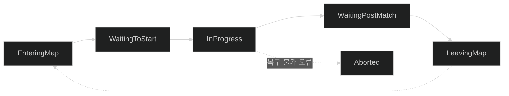
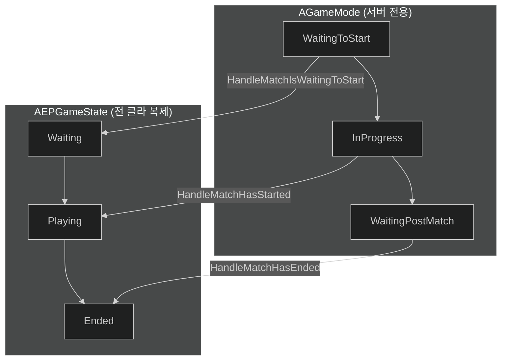
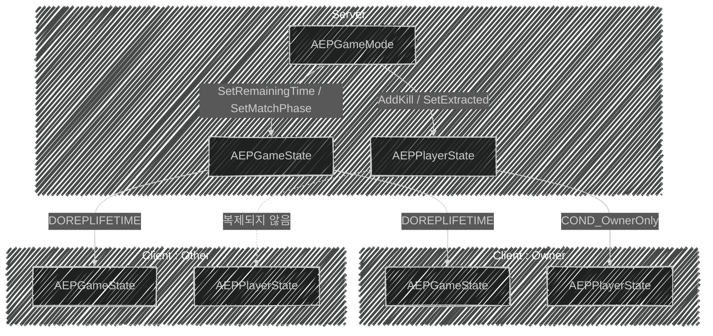

📌 **EmploymentProj 1단계 Gameplay Framework** 세 번째 글입니다.
[👾 깃허브](https://github.com/SoftHamzzi/UE5-EmploymentProj) ·
[📚 시리즈 목차](/devlog/EP_Main) ·
[← 1-2. Enhanced Input](/devlog/EP_Gameplay_Framework-2)
{: .notice--info}

## 개요

매치의 시작과 끝을 만들고, 그 상태를 클라이언트에게 보여준다.

이 글의 결론을 한 줄로 먼저 적는다.

> **상태머신을 직접 만들지 않았다. `AGameMode`에 내장된 것을 그대로 쓰고,
> 클라이언트에 내보내는 표현만 3개로 좁혔다.**

### 서버 권한형 모델

클라이언트는 요청하고, 서버가 검증하고, 결과를 복제받는다.
클라이언트가 자기 상태를 직접 바꿔봐야 서버에는 아무 일도 일어나지 않는다.

### 복제가 필요한 이유

- `AGameMode`는 **서버에만 존재**한다. 클라이언트에는 인스턴스 자체가 없다.
  → 클라가 알아야 할 값은 `GameState`로 올려야 한다.
- 클라이언트끼리 같은 화면을 보려면 값이 동기화되어야 한다.

---

## 엔진 상태머신을 그대로 쓴다

### `AGameMode`의 기본 `MatchState`



| 상태 | 진입 시 호출되는 훅 | 특징 |
|---|---|---|
| `EnteringMap` | - | 월드 로딩 중. 액터 틱 없음 |
| `WaitingToStart` | `HandleMatchIsWaitingToStart()` | **플레이어 Pawn이 아직 없음** |
| `InProgress` | `HandleMatchHasStarted()` | 전원 `RestartPlayer` → Pawn 스폰 |
| `WaitingPostMatch` | `HandleMatchHasEnded()` | 틱은 계속. 신규 참가 불가 |
| `LeavingMap` | `HandleLeavingMap()` | 맵 전환 |
| `Aborted` | - | `AbortMatch()` 호출 시. 복구 불가 오류용 |

**우리가 실제로 거는 훅은 6개 중 3개이다**. `WaitingToStart` / `InProgress` / `WaitingPostMatch`.
나머지는 엔진의 관심사(레벨 스트리밍, 심리스 트래블)라 게임 코드가 볼 일이 없다.

### `WaitingToStart`에 Pawn이 없는 이유

문서에 있는 얘기가 아니라 코드에 있는 얘기이다.

```cpp
// GameMode.cpp
bool AGameMode::PlayerCanRestart_Implementation(APlayerController* Player)
{
    if (!IsMatchInProgress())
    {
        return false;                    // ← WaitingToStart면 여기서 끝
    }
    return Super::PlayerCanRestart_Implementation(Player);
}
```

접속 → `HandleStartingNewPlayer` → `RestartPlayer` 경로가 여기서 막힌다.
그래서 대기 중에 들어온 플레이어는 **PlayerController만 있고 Pawn이 없다.**
`HandleMatchHasStarted`가 전원을 순회하며 `RestartPlayer`를 부르는 것도 이 때문이다.

```cpp
// GameMode.cpp:208-215
for (FConstPlayerControllerIterator It = GetWorld()->GetPlayerControllerIterator(); It; ++It)
{
    APlayerController* PC = It->Get();
    if (PC && (PC->GetPawn() == nullptr) && PlayerCanRestart(PC))
    {
        RestartPlayer(PC);
    }
}
```

### `BeginPlay`가 불리는 지점은 **두 곳**이다

이건 헷갈리기 쉬운 부분이다.

```cpp
// GameMode.cpp:148-161
void AGameMode::HandleMatchIsWaitingToStart()
{
    ...
    // Calls begin play on actors, unless we're about to transition to match start
    if (!ReadyToStartMatch())
    {
        GetWorldSettings()->NotifyBeginPlay();       // ① 대기가 발생하면 여기서
    }
}

// GameMode.cpp:203-221
void AGameMode::HandleMatchHasStarted()
{
    ...
    // First fire BeginPlay, if we haven't already in waiting to start match
    GetWorldSettings()->NotifyBeginPlay();           // ② 아니면 여기서
}
```

| `ReadyToStartMatch()` 최초 결과 | `BeginPlay` 시점 |
|---|---|
| **참** (즉시 시작) | `HandleMatchHasStarted`: ② |
| **거짓** (인원 대기) | `HandleMatchIsWaitingToStart`: ① |

우리는 `MinPlayersToStart`를 걸어놨으므로 보통 ①이다.
즉 **매치가 시작될 무렵엔 `BeginPlay`가 이미 끝나 있다.**

> ⚠️ **알고 둬야 할 잠복 위험**
>
> `AEPGameMode::HandleMatchHasStarted()`는 `Super::` 호출 **전에** 스포너를 돌린다.
>
> ```cpp
> for (TActorIterator<AEPItemSpawner> It(GetWorld()); It; ++It)
>     It->SpawnLoot();                 // ← Super 이전
> Super::HandleMatchHasStarted();       // ← 여기서 NotifyBeginPlay()
> ```
>
> 지금은 `AEPItemSpawner`에 `BeginPlay` 오버라이드가 없어서 안전하다.
> 하지만 스포너가 `BeginPlay`에서 무언가를 초기화하게 되면,
> ②번 경로(즉시 시작)에서 **초기화 전에 `SpawnLoot()`가 도는** 버그가 된다.

---

## 우리 상태로 좁히기



엔진의 6단계는 엔진의 관심사고, UI가 알아야 할 건 **대기 / 진행 / 종료** 셋이다.
그래서 전환은 엔진에게 맡기고, 훅에서 열거형만 갱신한다.

```cpp
void AEPGameMode::HandleMatchIsWaitingToStart()
{
    Super::HandleMatchIsWaitingToStart();

    EPGameState = GetGameState<AEPGameState>();
    if (EPGameState == nullptr) return;
    EPGameState->SetMatchPhase(EEPMatchPhase::Waiting);
}

void AEPGameMode::HandleMatchHasStarted()
{
    for (TActorIterator<AEPItemSpawner> It(GetWorld()); It; ++It)
        It->SpawnLoot();

    Super::HandleMatchHasStarted();
    if (EPGameState == nullptr) return;

    EPGameState->SetMatchPhase(EEPMatchPhase::Playing);
    EPGameState->SetRemainingTime(MatchDuration);
    GetWorldTimerManager().SetTimer(MatchTimerHandle, this,
                                    &AEPGameMode::TickMatchTimer, 1.0f, true);
}

void AEPGameMode::HandleMatchHasEnded()
{
    Super::HandleMatchHasEnded();
    if (EPGameState == nullptr) return;

    GetWorldTimerManager().ClearTimer(MatchTimerHandle);
    EPGameState->SetMatchPhase(EEPMatchPhase::Ended);
}
```

### 매치 시작 조건

`ReadyToStartMatch()`를 오버라이드해서 최소 인원을 걸었다.

```cpp
bool AEPGameMode::ReadyToStartMatch_Implementation()
{
    if (!Super::ReadyToStartMatch_Implementation()) return false;   // bDelayedStart, 인원>0 검사
    return GetNumPlayers() >= MinPlayersToStart;
}
```

이 함수가 참을 반환하면 엔진이 알아서 `StartMatch()`를 부르고,
`InProgress`로 전이하면서 `HandleMatchHasStarted()`가 불린다.
**우리는 조건만 답하고, 전이는 엔진이 한다.**

### 매치 종료 조건: 현재는 하나뿐이다

```cpp
void AEPGameMode::TickMatchTimer()
{
    EPGameState->SetRemainingTime(EPGameState->GetRemainingTime() - 1.0f);
    if (EPGameState->GetRemainingTime() <= 0.0f)
        EndmatchByTimeout();          // → EndMatch()
}
```

> **정직하게 적어둔다.** 종료 경로는 **타이머 만료 하나뿐**이다.
> `CheckMatchEndConditions()`(생존자 기반 종료)는 **자리만 만들어두고 비어 있다.**
>
> 비워둔 이유가 있다. 이 게임에서 "생존자"의 정의는 *살아 있는 사람*이 아니라
> ***아직 탈출하지도 죽지도 않은 사람*** 이다. 탈출 시스템(5단계)이 없는 상태에서
> 조건을 확정하면 나중에 다시 짜야 한다. 그래서 훅 지점만 잡아뒀다.
>
> 함께 남겨둔 문제: `OnPlayerKilled`는 `Killer`가 없으면(낙사 등) 조기 반환해서
> `AlivePlayerCount`가 줄지 않는다. 킬 크레딧과 생존자 카운트를 분리해야 한다.

---

## GameState 복제

```cpp
// EPGameState.h
UPROPERTY(ReplicatedUsing = OnRep_RemainingTime, BlueprintReadOnly, Category="Match")
float RemainingTime;

UPROPERTY(ReplicatedUsing = OnRep_MatchPhase, BlueprintReadOnly, Category="Match")
EEPMatchPhase MatchPhase;
```

```cpp
void AEPGameState::GetLifetimeReplicatedProps(TArray<FLifetimeProperty>& OutLifetimeProps) const
{
    Super::GetLifetimeReplicatedProps(OutLifetimeProps);
    DOREPLIFETIME(AEPGameState, RemainingTime);
    DOREPLIFETIME(AEPGameState, MatchPhase);
}
```

`DOREPLIFETIME`은 **서버가 원본을 갖고 모든 클라이언트에 내려보낸다**는 뜻이다.
복제는 단방향이다. 서버가 무언가를 "공유받는" 일은 없다.

`ReplicatedUsing`을 쓴 이유는 나중에 UI를 붙이기 위해서이다.
지금은 `UE_LOG`만 찍지만, OnRep 지점이 잡혀 있으면 위젯 연결은 한 줄인다.

### 타이머를 매 초 복제하는 게 최선인가

동작은 한다. 그런데 네트워크 설계 관점에서 한 번 따져볼 값이다.

| | 매 초 카운트다운 복제 (현재) | **종료 시각 1회 복제** |
|---|---|---|
| 대역폭 | 매치 내내 초당 float × 전 클라 | **최초 1회** |
| 클라 표시 | OnRep이 올 때만 갱신 → 1초 단위로 뚝뚝 | `EndTime - GetServerWorldTimeSeconds()` → 매 프레임 부드럽게 |
| 패킷 손실 | 한 번 놓치면 1초 멈춤 | 영향 없음 (다음 프레임 재계산) |
| 시간 연장/단축 | 자동 반영 | 값 재복제 필요 (드묾) |

그리고 이 프로젝트에는 이미 `GetServerWorldTimeSeconds()`가 있다.
[3-2편](/devlog/EP_NetPrediction-2)의 리와인드가 쓰는 그 시계이다.
**같은 도구가 이미 있는데 타이머만 옛 방식**인 셈이다.

지금은 매치 길이가 짧고 클라 수가 적어 실익이 없어 두었지만,
바꿀 때 바꿀 지점과 이유는 명확하다.

---

## PlayerState 복제: 은폐가 기본

```cpp
void AEPPlayerState::GetLifetimeReplicatedProps(TArray<FLifetimeProperty>& OutLifetimeProps) const
{
    Super::GetLifetimeReplicatedProps(OutLifetimeProps);

    DOREPLIFETIME_CONDITION(AEPPlayerState, KillCount,    COND_OwnerOnly);
    DOREPLIFETIME_CONDITION(AEPPlayerState, bIsExtracted, COND_OwnerOnly);
}
```

타르코프에서 킬 수는 공개 정보가 아니다. 내 킬 수는 나만 안다.
`COND_OwnerOnly`로 소유 클라이언트에게만 내려보낸다.

값 변경은 서버 전용 함수를 통해서만 한다.

```cpp
void AEPPlayerState::AddKill()
{
    if (!HasAuthority()) return;      // 서버 권한 확인
    KillCount++;
}
```

RPC로 만들 수도 있지만, **호출자가 이미 서버(GameMode)**이다.
클라이언트가 요청할 이유가 없는 값이라 평범한 함수 + 권한 검사로 충분하다.
"클라가 요청할 일이 있는가"가 RPC를 만들지 말지의 기준이다.

### 사망 여부 변수를 두지 않은 이유

이 시점에는 두지 않았다. 시체를 별도 액터로 만들 계획이었고,
그러면 *"시체 액터가 존재한다 = 죽었다"*가 되어 변수가 중복이기 때문이다.

---

## 복제 흐름도



`AEPGameMode`는 어느 클라이언트 박스에도 없다. 그게 핵심이다.

---

## 이 글 이후 바뀐 것

- 사망 처리에 **`AEPCorpse` 액터**가 실제로 추가됨. 캐릭터에 `IsDead()`도 생김
- `AEPPlayerState`가 **GAS의 `UAbilitySystemComponent` 소유자**가 됨 (4단계)
- `CheckMatchEndConditions()`는 여전히 비어 있음. 탈출 시스템(5단계) 이후 채울 예정

---

## 다음 편
→ [1-4. 스폰 시스템과 DataAsset 설계](/devlog/EP_Gameplay_Framework-4)
