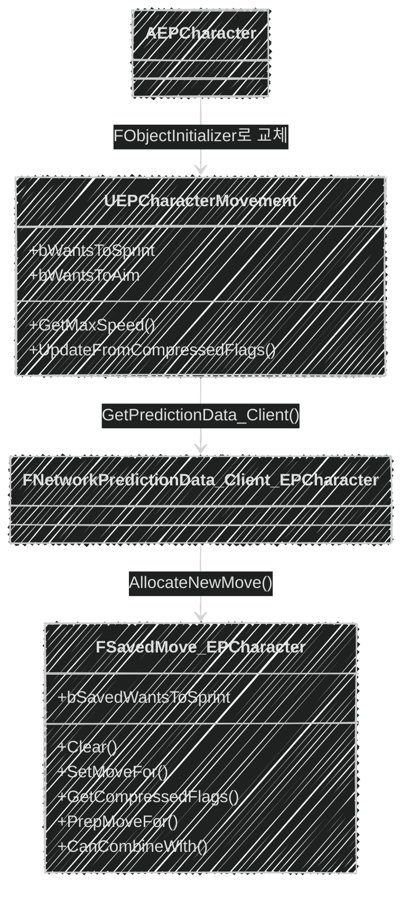

📌 **EmploymentProj 2단계 Replication** 첫 번째 글입니다.
[👾 깃허브](https://github.com/SoftHamzzi/UE5-EmploymentProj) ·
[📚 시리즈 목차](/devlog/EP_Main) ·
[← 1-4. 스폰 시스템과 DataAsset 설계](/devlog/EP_Gameplay_Framework-4)
{: .notice--info}

## 문제

[1-2편](/devlog/EP_Gameplay_Framework-2)에서 만든 Sprint는 이렇게 동작했다.

```cpp
UPROPERTY(ReplicatedUsing=OnRep_IsSprinting)
bool bIsSprinting;

UFUNCTION(Server, Reliable)
void Server_SetSprinting(bool bNewSprinting);
```

```cpp
void AEPCharacter::Input_StartSprint(const FInputActionValue& Value)
{
    Server_SetSprinting(true);      // ← RPC
}

void AEPCharacter::Server_SetSprinting_Implementation(bool bNewSprinting)
{
    bIsSprinting = bNewSprinting;
    GetCharacterMovement()->MaxWalkSpeed = bIsSprinting ? SprintSpeed : WalkSpeed;
}

void AEPCharacter::OnRep_IsSprinting()
{
    GetCharacterMovement()->MaxWalkSpeed = bIsSprinting ? SprintSpeed : WalkSpeed;   // ← 여기서야 클라가 빨라짐
}
```

문제가 **두 개** 있었다.

### ① 왕복 지연만큼 늦게 달린다

```
[클라] Shift ─────────────► [서버] MaxWalkSpeed = 650
                                        │ 복제
[클라] 이제서야 빨라짐 ◄────────────────┘
```

핑 80ms면 **Shift를 누르고 80ms 뒤에** 캐릭터가 빨라진다.
FPS에서 이 지연은 그대로 느껴진다.

### ② 그 RPC가 **매 프레임** 나갔다

이게 진짜 문제였다. 당시 바인딩이 이랬다.

```cpp
EIC->BindAction(SprintAction, ETriggerEvent::Triggered, this, &AEPCharacter::Input_StartSprint);
```

`ETriggerEvent::Triggered`는 **키를 누르고 있는 동안 매 프레임** 발화한다.
`Started`가 아니다. 즉 Shift를 누르고 있는 내내 `Server_SetSprinting(true)`가
**60fps면 초당 60번** 나가고 있었다. 그것도 **Reliable**로,
순서 보장과 재전송 큐를 쓰는, 가장 비싼 종류의 RPC로요.

이 글은 저 두 문제를 **하나의 리팩터링**으로 없앤 기록이다.

---

## 답: 상태를 이동 패킷에 실는다

Character Movement Component는 이미 클라 → 서버로 이동 패킷을 보내고 있다.
그 패킷에는 **`uint8` 압축 플래그 1바이트**가 항상 들어 있다.

```cpp
// UCharacterMovementComponent.h
enum CompressedFlags
{
    FLAG_JumpPressed   = 0x01,
    FLAG_WantsToCrouch = 0x02,
    FLAG_Reserved_1    = 0x04,
    FLAG_Reserved_2    = 0x08,
    // Remaining bit masks are available for custom flags.
    FLAG_Custom_0 = 0x10,
    FLAG_Custom_1 = 0x20,
    FLAG_Custom_2 = 0x40,
    FLAG_Custom_3 = 0x80,
};
```

**상위 4비트가 비어 있다.** Sprint를 `FLAG_Custom_0`, ADS를 `FLAG_Custom_1`에 실으면

> **추가 대역폭은 0바이트이다.**

이미 보내던 1바이트의 빈 비트를 쓰는 것이기 때문이다.

### 결과

| | 기존 (Server RPC) | 변경 (CompressedFlags) |
|---|---|---|
| 전송량 | Reliable RPC **초당 60회** + `bool` 프로퍼티 복제 | **0바이트** (기존 1바이트의 빈 비트 재사용) |
| 신뢰성 부담 | Reliable, ACK·재전송·순서 보장 | 이동 패킷에 편승 (별도 보장 불필요) |
| 클라 반응 | 왕복 지연 후 | **즉시** (로컬 예측) |
| 보정 시 | Sprint 상태 소실 → 걷기 속도로 리플레이 → 스냅 | SavedMove에 보존 → 같은 속도로 리플레이 |
| 코드량 | 적음 | 많음 (SavedMove 3종 확장) |
| 적합한 상태 | 이동 속도와 무관한 것 (무기 교체 등) | **이동 속도에 영향을 주는 것** |

마지막 줄이 판단 기준이다.
**속도를 바꾸는 상태는 반드시 이동 패킷을 타야 한다.** 안 그러면 예측이 어긋난다.

---

## 구조



| 클래스 | 하는 일 |
|---|---|
| `UEPCharacterMovement` | 상태 보관, 속도 계산, 서버에서 플래그 복원 |
| `FSavedMove_EPCharacter` | 프레임별 상태 스냅샷 → 압축 → 리플레이 시 복원 |
| `FNetworkPredictionData_Client_EPCharacter` | 위 SavedMove를 만들도록 연결 |
| `AEPCharacter` | 기본 CMC를 커스텀 CMC로 교체, 입력 → 플래그 |

---

## 매 프레임 실제 호출 순서

여기서 내가 **처음에 잘못 이해했던 부분**을 짚고 간다.

`GetMaxSpeed()`는 `SetMoveFor()`가 부르는 함수라서 "SetMoveFor가 이동을 계산하고,
그때 속도를 물어보는구나"라고 생각했다. **아니다.**

```cpp
// FSavedMove_Character::SetMoveFor
CharacterOwner = Character;
DeltaTime      = InDeltaTime;
SetInitialPosition(Character);
AccelMag       = NewAccel.Size();
...
MaxSpeed = Character->GetCharacterMovement()->GetMaxSpeed();   // ← 여기서 부르긴 한다
```

이 호출의 목적은 **이동 계산이 아니라 `MaxSpeed`를 SavedMove에 기록하는 것**이다.
왜 기록하냐면, 뒤의 `CanCombineWith`가 비교하려고.

진짜 이동 속도를 정하는 호출자는 따로 있다.

```cpp
// CharacterMovementComponent.cpp:3796: CalcVelocity()
float MaxSpeed = GetMaxSpeed();
```

`CalcVelocity`는 `PhysWalking` / `PhysFalling`에서 매 서브스텝 불린다.
그리고 `SetMoveFor`는 **"매 프레임 이동을 계산하는 함수"가 아니라
"이 Move에 필요한 값을 채우는 함수"**이다.

정리하면 한 프레임은 이렇게 흐른다.

```
[매 프레임. 클라]
TickComponent
 └ ControlledCharacterMove
     └ ReplicateMoveToServer
         ├ ① AllocateNewMove()        → FSavedMove_EPCharacter 생성
         ├ ② NewMove->SetMoveFor()    → 이동 '전' 상태 스냅샷 (MaxSpeed 기록)
         ├ ③ PerformMovement()        → 실제 이동
         │      └ PhysWalking → CalcVelocity → GetMaxSpeed()   ★ 여기가 진짜
         ├ ④ NewMove->PostUpdate()    → 이동 '후' 결과 기록
         └ ⑤ CallServerMove()         → GetCompressedFlags() → 전송
```

**`GetMaxSpeed()`의 진짜 정체**는 "SetMoveFor가 부르는 함수"가 아니라

> **클라 예측 · 서버 시뮬레이션 · 보정 리플레이, 세 경로가 모두 타면서
> 반드시 같은 답을 내야 하는 함수**

이다. 셋 중 하나라도 다른 답을 내면 그게 바로 위치 불일치이고, 스냅이다.
그래서 이 함수에 들어가는 입력(`bWantsToSprint`)을 세 경로 모두에 실어 나르는 것이
이 글 전체의 목적이다.

---

## UEPCharacterMovement

### 상태 보관

```cpp
UCLASS()
class EMPLOYMENTPROJ_API UEPCharacterMovement : public UCharacterMovementComponent
{
    GENERATED_BODY()
public:
    // UPROPERTY가 아니다: 프로퍼티 복제를 타지 않고 CompressedFlags로만 전달된다
    uint8 bWantsToSprint : 1;
    uint8 bWantsToAim : 1;

    UPROPERTY(EditDefaultsOnly, Category = "Movement")
    float SprintSpeed = 650.f;

    UPROPERTY(EditDefaultsOnly, Category = "Movement")
    float AimSpeed = 200.f;

    virtual float GetMaxSpeed() const override;
    virtual void UpdateFromCompressedFlags(uint8 Flags) override;
    virtual FNetworkPredictionData_Client* GetPredictionData_Client() const override;
};
```

`UPROPERTY`가 아닌 게 핵심이다. 복제 시스템을 **일부러 안 쓴다.**

### 속도 계산

```cpp
float UEPCharacterMovement::GetMaxSpeed() const
{
    if (bWantsToSprint && IsMovingOnGround()) return SprintSpeed;
    if (bWantsToAim) return AimSpeed;
    return Super::GetMaxSpeed();
}
```

Sprint가 ADS보다 우선이다(둘 다 켜져 있으면 Sprint).
`IsMovingOnGround()` 조건은 **공중에서 Sprint 속도로 활공하는 것을 막기 위함**인데,
이게 나중에 예상 못 한 곳에서 걸린다. 아래 `CanCombineWith` 절에서 다시 나온다.

> 🐛 **여기 버그가 하나 있다. 웅크린 채 질주할 수 있다.**
>
> ```cpp
> // 엔진 UCharacterMovementComponent::GetMaxSpeed(): CharacterMovementComponent.cpp:3510
> case MOVE_Walking:
> case MOVE_NavWalking:
>     return IsCrouching() ? MaxWalkSpeedCrouched : MaxWalkSpeed;
> ```
>
> `Super::GetMaxSpeed()`가 웅크림을 반영해 `MaxWalkSpeedCrouched`를 돌려주는데,
> 내 코드는 그걸 **보기도 전에** `SprintSpeed`로 반환해버린다.
> 결과: 웅크린 자세(작은 피탄 면적) + 650 속도.
>
> 예측 불일치는 **아니다**. 클라·서버 모두 같은 함수를 타니까. 순수한 밸런스 버그이다.
> 고치려면 조건 하나면 된다.
>
> ```cpp
> if (bWantsToSprint && IsMovingOnGround() && !IsCrouching()) return SprintSpeed;
> ```
>
> 이 글에서는 발견 사실만 적고 코드는 그대로 뒀다.

### 서버에서 복원

```cpp
void UEPCharacterMovement::UpdateFromCompressedFlags(uint8 Flags)
{
    Super::UpdateFromCompressedFlags(Flags);          // Jump/Crouch 기본 플래그
    bWantsToSprint = (Flags & FSavedMove_Character::FLAG_Custom_0) != 0;
    bWantsToAim    = (Flags & FSavedMove_Character::FLAG_Custom_1) != 0;
}
```

서버가 이동 패킷을 받으면 여기서 상태를 되살리고, 그 상태로 `GetMaxSpeed()`를 부른다.
**클라가 방금 쓴 것과 같은 값**이 나온다.

### 예측 데이터 연결

```cpp
FNetworkPredictionData_Client* UEPCharacterMovement::GetPredictionData_Client() const
{
    if (!ClientPredictionData)
    {
        UEPCharacterMovement* MutableThis = const_cast<UEPCharacterMovement*>(this);
        MutableThis->ClientPredictionData = new FNetworkPredictionData_Client_EPCharacter(*this);
    }
    return ClientPredictionData;
}
```

- 이건 **지연 초기화(lazy initialization)**이다. 싱글턴이 아니다.
  `ClientPredictionData`는 **CMC 인스턴스마다 하나씩** 있다.
  캐릭터가 10개면 10개이다.
- `const` 함수 안에서 멤버를 채워야 해서 `const_cast`를 쓴다.
  엔진 원본도 똑같이 한다. ([const_cast 정리](https://softhamzzi.github.io/cpp/cpp_1_3))

---

## FSavedMove_EPCharacter

SavedMove는 **클라가 매 프레임 만드는 이동 스냅샷**이다.
서버 보정이 오면 이 스냅샷들을 순서대로 다시 재생해서 위치를 재계산한다.
확장하지 않으면 리플레이 중에 Sprint 상태가 사라져서 **걷기 속도로 재계산**되고,
결과가 어긋나서 또 스냅이 난다.

`UCLASS`가 아닌 순수 C++ 클래스라 `Super`를 못 쓴다. 부모를 명시한다.

```cpp
void FSavedMove_EPCharacter::Clear()
{
    FSavedMove_Character::Clear();
    bSavedWantsToSprint = false;
    bSavedWantsToAim    = false;
}
```

SavedMove는 **풀에서 재사용**된다. 초기화를 빠뜨리면 이전 프레임의 Sprint가 남는다.

```cpp
uint8 FSavedMove_EPCharacter::GetCompressedFlags() const
{
    uint8 Result = FSavedMove_Character::GetCompressedFlags();
    if (bSavedWantsToSprint) Result |= FSavedMove_Character::FLAG_Custom_0;
    if (bSavedWantsToAim)    Result |= FSavedMove_Character::FLAG_Custom_1;
    return Result;
}
```

```cpp
void FSavedMove_EPCharacter::SetMoveFor(ACharacter* C, float InDeltaTime,
                                        FVector const& NewAccel,
                                        FNetworkPredictionData_Client_Character& ClientData)
{
    FSavedMove_Character::SetMoveFor(C, InDeltaTime, NewAccel, ClientData);
    UEPCharacterMovement* CMC = Cast<UEPCharacterMovement>(C->GetCharacterMovement());
    bSavedWantsToSprint = CMC->bWantsToSprint;      // CMC → SavedMove
    bSavedWantsToAim    = CMC->bWantsToAim;
}

void FSavedMove_EPCharacter::PrepMoveFor(ACharacter* C)
{
    FSavedMove_Character::PrepMoveFor(C);
    UEPCharacterMovement* CMC = Cast<UEPCharacterMovement>(C->GetCharacterMovement());
    CMC->bWantsToSprint = bSavedWantsToSprint;      // SavedMove → CMC (리플레이용)
    CMC->bWantsToAim    = bSavedWantsToAim;
}
```

두 함수는 **정확히 반대 방향**이다. `SetMoveFor`는 담고, `PrepMoveFor`는 되돌린다.
`PrepMoveFor`가 없으면 보정 리플레이 중 `GetMaxSpeed()`가 걷기 속도를 반환한다.

### CanCombineWith: 이게 왜 필요한지가 제일 헷갈렸다

```cpp
bool FSavedMove_EPCharacter::CanCombineWith(const FSavedMovePtr& NewMove,
                                            ACharacter* Character, float MaxDelta) const
{
    FSavedMove_EPCharacter* Other = static_cast<FSavedMove_EPCharacter*>(NewMove.Get());
    if (bSavedWantsToSprint != Other->bSavedWantsToSprint) return false;
    if (bSavedWantsToAim    != Other->bSavedWantsToAim)    return false;
    return FSavedMove_Character::CanCombineWith(NewMove, Character, MaxDelta);
}
```

**먼저 결합(combine)이 뭔지부터.** 흔한 오해가 "N프레임을 하나로 뭉친다"인데,
엔진이 실제로 하는 건 **두 개짜리 쌍 검사**이다.

```cpp
// CharacterMovementComponent.cpp:8850
if (PendingMove->CanCombineWith(NewMovePtr, CharacterOwner,
        ClientData->MaxMoveDeltaTime * CharacterOwner->GetActorTimeDilation(*MyWorld)))
```

보류 중인 `PendingMove` 하나와 방금 만든 `NewMove` 하나. 그리고 상한이 있다.

```cpp
, MaxMoveDeltaTime(0.125f)     // FNetworkPredictionData_Client_Character 생성자
```

```cpp
// FSavedMove_Character::CanCombineWith
if (NewMove->DeltaTime + DeltaTime >= MaxDelta) { return false; }
```

누적 **0.125초**를 넘으면 더 못 합친다. 그러니까 "10프레임을 1개로"가 아니라
**"보내기를 한 프레임 미뤘다가 합쳐 보내는 것을, 최대 0.125초까지 반복"**이다.
효과는 *전송 빈도 감소*지, 무한 압축이 아니다.

**그럼 우리 오버라이드는 왜 필요한가?** 부모가 이미 이걸 하고 있는데도요.

```cpp
// FSavedMove_Character::CanCombineWith
if (!FMath::IsNearlyEqual(MaxSpeed, NewMove->MaxSpeed, MaxSpeedThresholdCombine))
{
    return false;
}
```

`SetMoveFor`가 기록해둔 그 `MaxSpeed`이다. Sprint를 켜면 650, 끄면 600,
**부모 검사만으로도 Sprint↔Walk는 이미 안 합쳐진다.** 중복 아닌가?

**공중에서는 아니다.**

```cpp
if (bWantsToSprint && IsMovingOnGround()) return SprintSpeed;
//                    ^^^^^^^^^^^^^^^^^^ 공중이면 거짓
```

점프 중에는 Sprint를 켜든 끄든 `GetMaxSpeed()`가 **같은 값**을 돌려준다.
그러면 부모의 `MaxSpeed` 비교는 통과하고, **플래그가 서로 다른 두 Move가 합쳐진다.**
합쳐진 Move의 `CompressedFlags`는 하나뿐이니 서버가 받는 Sprint 상태가
실제 입력과 달라지고, 착지하는 순간 서버와 클라의 `MaxSpeed`가 갈린다. 보정, 스냅.

우리 오버라이드는 **"플래그가 다르면 속도가 같아도 합치지 않는다"**를 보장한다.
부모 코드를 읽기 전엔 이 세 줄이 왜 있는지 저도 설명하지 못했다.

---

## CMC 교체

`ACharacter`가 이미 만들어버린 CMC는 `CreateDefaultSubobject`로 못 바꾼다.
**부모 생성자가 도는 시점에** 클래스를 갈아끼워야 한다.

```cpp
AEPCharacter::AEPCharacter(const FObjectInitializer& ObjectInitializer)
    : Super(ObjectInitializer.SetDefaultSubobjectClass<UEPCharacterMovement>(
        ACharacter::CharacterMovementComponentName))
{
    UEPCharacterMovement* Movement = Cast<UEPCharacterMovement>(GetCharacterMovement());
    Movement->NavAgentProps.bCanCrouch = true;
}
```

```cpp
/**
 * 기본 클래스에서 정의된 서브오브젝트에 대해 사용할 클래스를 설정한다.
 * 이때 설정하는 클래스는 기본 클래스에서 사용한 클래스의 하위 클래스여야 한다.
 */
template<class T>
const FObjectInitializer& SetDefaultSubobjectClass(FName SubobjectName) const
```

생성자 시그니처가 **반드시 `(const FObjectInitializer&)`**여야 한다.

`bCanCrouch`를 찾느라 상속 계보를 한참 탔다.
`UCharacterMovementComponent` → `UPawnMovementComponent` → `UNavMovementComponent` →
`FMovementProperties NavAgentProps` → 여기 있었다.
이걸 켜지 않으면 `Crouch()`를 불러도 아무 일도 일어나지 않는다.

---

## 입력 처리

```cpp
void AEPCharacter::Input_StartSprint(const FInputActionValue& Value)
{
    if (UEPCharacterMovement* CMC = Cast<UEPCharacterMovement>(GetCharacterMovement()))
        CMC->bWantsToSprint = true;
}
```

**RPC가 사라졌다.** 플래그만 세우면
다음 프레임에 `GetMaxSpeed()` → 로컬 즉시 반영 → `SetMoveFor()` → `GetCompressedFlags()` →
이동 패킷에 편승해 서버까지 간다.

그리고 [1-2편](/devlog/EP_Gameplay_Framework-2)에서 지적했던
`ETriggerEvent::Triggered` 바인딩이 **여기서는 문제가 되지 않는다.**
매 프레임 불려도 하는 일이 `bool` 대입 한 줄이기 때문이다.
네트워크로 나가는 건 어차피 CMC가 알아서 한다.
*"매 프레임 발화하는 입력에 RPC를 걸지 마라"*가 결론이지, 바인딩 자체가 죄는 아니었다.

### ADS

```cpp
void AEPCharacter::Input_StartADS(const FInputActionValue& Value)
{
    if (UEPCharacterMovement* CMC = Cast<UEPCharacterMovement>(GetCharacterMovement()))
    {
        CMC->bWantsToAim    = true;
        CMC->bWantsToSprint = false;      // 조준 중 질주 금지
    }
    if (IsLocallyControlled() && FirstPersonCamera)
        FirstPersonCamera->SetFieldOfView(60.f);
}
```

여기서 **무엇이 복제되고 무엇이 안 되는지**를 정확히 갈라둔다.

| | 경로 | 복제 |
|---|---|---|
| `bWantsToAim` (속도 200) | `FLAG_Custom_1` → 이동 패킷 | **된다** (클라 → 서버) |
| FOV 60° | 로컬 카메라 | 안 된다 (`IsLocallyControlled()`) |

*"ADS는 시각 효과라 복제할 필요가 없다"*는 틀린 정리이다.
ADS는 이동 속도를 바꾸므로 **반드시** 서버가 알아야 한다.
복제하지 않는 건 **FOV뿐**이다.

> **아직 못 한 것 두 가지**
>
> 1. **다른 플레이어는 상대의 ADS를 볼 수 없다.** CompressedFlags는
>    *소유 클라 → 서버* 단방향이다. 서버는 알지만 다른 클라이언트로는 안 나간다.
>    조준 자세를 시각화하려면 별도 복제 경로가 필요하다.
>    → [2-6편](/devlog/EP_Replication-6)에서 애니메이션 상태를 다룰 때 다시 나온다.
> 2. `SetFieldOfView(60.f)`는 **즉시 전환**이다. 보간이 없어 툭 끊긴다.
>    `FMath::FInterpTo`로 매 틱 좁히는 게 맞다.

### Crouch

```cpp
void AEPCharacter::Input_Crouch(const FInputActionValue& Value)   { Crouch(); }
void AEPCharacter::Input_UnCrouch(const FInputActionValue& Value) { UnCrouch(); }
```

웅크리기는 `FLAG_WantsToCrouch`로 **엔진이 이미 같은 방식으로 처리하고 있다.**
우리가 한 건 그 패턴을 두 개 더 만든 것뿐이다.
바꿔 말하면, **엔진이 왜 이렇게 만들었는지를 따라 한 것**이 이 리팩터링이다.

---

## 전체 흐름

```
[클라]
 1. Input_StartSprint()        → bWantsToSprint = true
 2. GetMaxSpeed()              → 650 → 로컬 예측 이동 (지연 0)
 3. SetMoveFor()               → bSavedWantsToSprint = true
 4. GetCompressedFlags()       → FLAG_Custom_0 ON → 전송 (추가 0바이트)

[서버]
 5. UpdateFromCompressedFlags() → bWantsToSprint 복원
 6. GetMaxSpeed()               → 650 → 서버 위치 계산
 7. 클라 결과와 비교 → 일치: ACK / 불일치: 보정

[클라, 보정 시]
 8. 서버 위치로 리셋
 9. 미확인 SavedMove 리플레이
      PrepMoveFor() → bWantsToSprint 복원 → GetMaxSpeed() → 650
      ★ 여기가 핵심. 상태를 저장해뒀기에 같은 속도로 재계산된다
```

9번이 이 구조 전체의 존재 이유이다.
보정은 어차피 일어난다. 중요한 건 **보정 후 재계산이 원래 계산과 같은 답을 내는가**이다.

---

## 이 구조의 수명: 커스텀 플래그는 4개뿐이다

```cpp
FLAG_Custom_0 = 0x10,
FLAG_Custom_1 = 0x20,
FLAG_Custom_2 = 0x40,
FLAG_Custom_3 = 0x80,
```

**4비트가 전부이다.** 나는 2개(Sprint, ADS)를 썼고 2개 남았다.

이 게임에는 앞으로 슬라이딩·기대기·무기 거치 같은 게 붙을 수 있다.
5번째가 필요해지는 순간, 혹은 **bool이 아닌 값**(조준 강도 0~1 같은)이
필요해지는 순간 이 구조로는 안 된다.

그때의 경로는 `FCharacterNetworkMoveData`를 상속해서 `Serialize()`에 필드를 직접 싣는 것이다.

```cpp
class FEPNetworkMoveData : public FCharacterNetworkMoveData
{
    virtual bool Serialize(UCharacterMovementComponent& CMC, FArchive& Ar,
                           UPackageMap* Map, ENetworkMoveType MoveType) override;
    // 여기에 임의의 필드를 실을 수 있다
};
```

지금은 2비트로 충분해서 안 간다. **하지만 한계가 어디인지는 알고 있다.**

---

## 배운 것

**1. 엔진이 이미 만들어둔 통로를 찾는 게 먼저다.**
새 RPC를 만들기 전에 *"이미 나가고 있는 패킷에 자리가 있나"*를 봐야 했다.
있었다. 4비트나요.

**2. 부모 구현을 안 읽으면 내 오버라이드가 왜 필요한지 설명 못 한다.**
`CanCombineWith`가 그랬다. 부모가 이미 `MaxSpeed`를 비교하고 있어서
한동안 "이거 중복 아닌가" 싶었고, `IsMovingOnGround()` 때문에 공중에서만
필요하다는 걸 알고서야 납득했다.

**3. 삽질, Rider 전환.**
이 단계에서 Visual Studio → Rider로 옮겼다.
Peek Definition 습관이 안 통하고 단축키가 낯설어서, 하필 **엔진 소스를
가장 많이 뒤져야 하는 단계**에 도구가 발목을 잡았다.
지금 보면 이때 익혀둔 게 3단계 리와인드 디버깅에서 크게 도움이 됐다.

---

## 이 글 이후 바뀐 것

- `GetMaxSpeed()`가 조기 반환에서 **배율 곱 방식**으로 바뀌었다.
  GAS의 `MoveSpeedMultiplier`(둔화·버프)를 곱해야 했기 때문이다.

  ```cpp
  float Base = Super::GetMaxSpeed();
  if (bWantsToSprint && IsMovingOnGround()) Base = SprintSpeed;
  else if (bWantsToAim) Base = AimSpeed;
  return Base * MoveSpeedMultiplier;
  ```

- `UEPCharacterMovement::OnMovementUpdated`에 델리게이트가 추가됐다.
  서버가 이동을 처리한 **정확한 시각**을 리와인드 시스템에 알려주기 위해서이다.
  → [3-2편](/devlog/EP_NetPrediction-2)에서 이게 왜 필요했는지 나온다.
- 웅크림+Sprint 버그, ADS FOV 보간, 타 클라 ADS 표시는 아직 미수정이다.

---

## 다음 편
→ [2-2. MetaHuman 통합과 LeaderPose](/devlog/EP_Replication-2)
