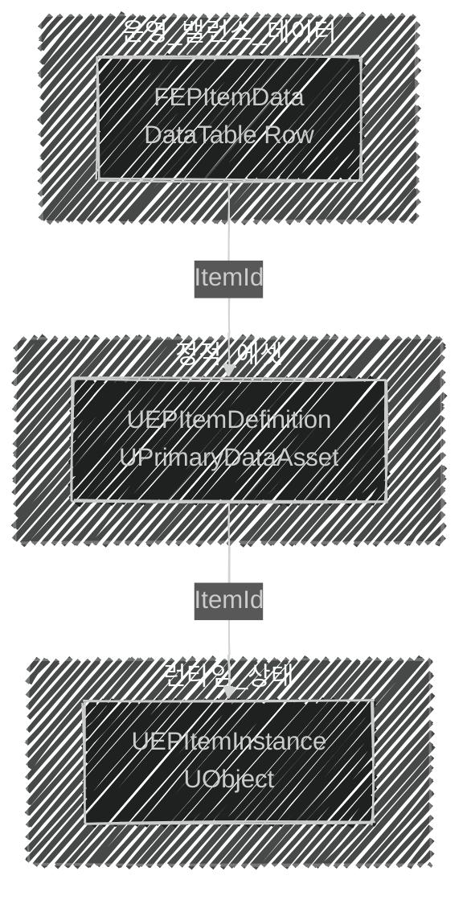

📌 **EmploymentProj 2단계 Replication** 세 번째 글입니다.
[👾 깃허브](https://github.com/SoftHamzzi/UE5-EmploymentProj) ·
[📚 시리즈 목차](/devlog/EP_Main) ·
[← 2-2. MetaHuman 통합](/devlog/EP_Replication-2)
{: .notice--info}

## 문제

타르코프식 게임에서는 **같은 이름의 두 아이템이 서로 다른 상태**를 가진다.
바닥에 떨어진 AK74는 탄이 3발, 내 가방의 AK74는 30발.
이름은 같고 스펙도 같은데 **개체가 다르다.**

[1-4편](/devlog/EP_Gameplay_Framework-4)에서 만든 구조로는 이게 표현이 안 됐다.

```cpp
// UEPWeaponData : UPrimaryDataAsset   ← UEPItemData와 아무 상속 관계 없음
FName WeaponName;
float Damage = 20.f;
uint8 MaxAmmo = 30;

// AEPWeapon : AActor
UPROPERTY(ReplicatedUsing = OnRep_CurrentAmmo)
uint8 CurrentAmmo = 0;      // ← 런타임 상태가 액터에 직접
```

문제가 세 개였다.

**① 무기가 아이템이 아니다.** `UEPWeaponData`가 `UEPItemData`를 상속하지 않아
"인벤토리 슬롯에 무기를 넣는다" 같은 공통 처리를 타입 시스템이 거부한다.

**② 상태가 액터에 산다.** `CurrentAmmo`가 `AEPWeapon`에 있다.
장착을 해제하면서 액터를 파괴하면 **탄약 수가 같이 사라진다.**
가방에 넣어둔 총이 매번 만탄이 되는 셈이다.

**③ `FItemData` 구조체가 아무데도 연결되지 않은 채 떠 있었다.**

②가 결정적이었다. *"상태는 액터보다 오래 살아야 한다."*

---

## 세 겹으로 나눈다



| 계층 | 클래스 | 담당 | 누가 바꾸나 | 언제 바뀌나 |
|---|---|---|---|---|
| Row | `FEPItemData` | 가격·스택·슬롯·등급 | 기획자 (CSV) | 패치 |
| Definition | `UEPItemDefinition` | 메시·아이콘·FX·애님 레이어 | 개발자 | 빌드 |
| Instance | `UEPItemInstance` | 탄약·내구도·수량 | 게임 | **매 초** |

**"누가 바꾸나 / 언제 바뀌나"가 다르면 분리한다.** 이게 계층을 가른 기준이다.
셋을 잇는 건 `FName ItemId` 하나이다.

### Row: 표로 보고 싶은 값

```cpp
USTRUCT(BlueprintType)
struct FEPItemData : public FTableRowBase
{
    FName          ItemId;              // Row Name과 동일하게 유지
    EEPItemType    ItemType;
    FText          DisplayName;
    FText          Description;
    EEPItemRarity  Rarity;
    int32          MaxStack  = 1;
    int32          SlotSize  = 1;
    int32          SellPrice = 100;
    bool           bIsQuestItem = false;
    TSoftObjectPtr<UEPItemDefinition> ItemDefinition;
};
```


DataTable로 둔 이유는 **비교하며 조정해야 하는 값들**이기 때문이다.
가격은 한 아이템만 보고 정할 수 없다. 표로 늘어놓고 서로 견줘야 한다.
CSV 익스포트가 되니 스프레드시트로 나가서 일괄 수정도 된다.

### Definition: 에셋과 함께 봐야 하는 값

```cpp
UCLASS(BlueprintType, Blueprintable)
class UEPItemDefinition : public UPrimaryDataAsset
{
    FName ItemId;
    FDataTableRowHandle ItemDataRow;
    TSoftObjectPtr<UStaticMesh> WorldMesh;   // 바닥에 떨어진 모습
    TSoftObjectPtr<UTexture2D>  Icon;
    virtual FPrimaryAssetId GetPrimaryAssetId() const override;
};

UCLASS(BlueprintType, Blueprintable)
class UEPWeaponDefinition : public UEPItemDefinition
{
    EEPFireMode FireMode;
    float Damage, FireRate, ReloadTime;
    float BaseSpread, SpreadPerShot, MaxSpread, SpreadRecoveryRate;
    float ADSSpreadMultiplier, MovingSpreadMultiplier;
    float RecoilPitch, RecoilYaw, RecoilRecoveryRate;
    TArray<FVector2D> RecoilPattern;
    TSubclassOf<UAnimInstance> WeaponAnimLayer;
    TSoftObjectPtr<USkeletalMesh> WeaponMesh;
};
```

**여기서 원칙이 하나 어긋난 것처럼 보인다.**
"밸런스는 CSV로"라고 해놓고 `Damage`, `RecoilPitch`가 Definition에 있다.

기준을 다시 세우면 이렇다.

| | 어디에 | 왜 |
|---|---|---|
| 가격·스택·등급·슬롯 | Row (CSV) | 여러 아이템을 **나란히 놓고** 비교하며 조정 |
| 반동·탄퍼짐·발사율 | Definition | **메시·애님 레이어와 함께 보면서** 손맛으로 튜닝 |
| 탄약·내구도 | Instance | 개체마다 다름 |

반동 값은 숫자만 봐서는 정할 수 없다. 쏴 보면서 맞춘다.
그러니 무기 에셋 옆에 있는 게 맞다. `SellPrice`와는 성격이 다른 값이다.

> **`UPrimaryDataAsset`을 고른 이유는 메모리가 아니다.**
> [1-4편](/devlog/EP_Gameplay_Framework-4)에서 엔진 헤더로 확인했듯,
> `UPrimaryDataAsset`이 더 주는 건 `GetPrimaryAssetId()`뿐이다.
> 메모리를 아끼는 건 위 코드의 `TSoftObjectPtr`이지 베이스 클래스가 아니다.
>
> 진짜 이점은 **참조 없이 이름으로 찾을 수 있다**는 것이다.
> 루팅 테이블이 굴러야 어느 아이템이 필요한지 정해지는 게임이라,
> 정적 참조 그래프로는 표현이 안 된다.

### Instance: 개체마다 다른 값

```cpp
UCLASS(BlueprintType)
class UEPItemInstance : public UObject
{
    FGuid InstanceId;
    FName ItemId;
    int32 Quantity = 1;
    int32 SchemaVersion = 1;
    UPROPERTY(Transient) TObjectPtr<UEPItemDefinition> CachedDefinition;

    static UEPItemInstance* CreateInstance(UObject* Outer, FName InItemId,
                                           UEPItemDefinition* InDefinition = nullptr);
};

UCLASS(BlueprintType)
class UEPWeaponInstance : public UEPItemInstance
{
    int32 CurrentAmmo = 0;
    float Durability  = 100.f;
};
```

같은 `ItemId("Weapon_AK74")`라도 인스턴스마다 `CurrentAmmo`가 다르다.
이걸로 처음 문제가 풀린다.

---

## 여기서 솔직하게: 이 시점의 미완성 두 가지

포트폴리오라서 더 정확히 적는다. **이 리팩터링은 자리를 만든 것이지 이사를 끝낸 게 아니다.**

### ① 이 인스턴스는 아무것도 복제하지 않았다

당시 코드에 이런 주석이 있었다.

```cpp
// 서브오브젝트 복제 지원 (인벤토리 복제 시 필요)
virtual bool IsSupportedForNetworking() const override { return true; }
```

`IsSupportedForNetworking()`은 **"이 UObject를 네트워크 참조로 가리킬 수 있다"**는
자격 표시이다. 값이 실제로 오가려면 세 가지가 더 필요하다.

| 필요한 것 | 당시 상태 |
|---|---|
| `UPROPERTY(Replicated)` 지정 | ❌ 전부 `BlueprintReadOnly`뿐 |
| `GetLifetimeReplicatedProps()` | ❌ 없음 |
| 소유 액터의 서브오브젝트 등록 (`ReplicateSubobjects` / `AddReplicatedSubObject`) | ❌ 없음 |

즉 이 시점의 `UEPWeaponInstance::CurrentAmmo`는 **서버에만 존재하는 값**이었고,
클라이언트 UI에 탄약을 띄우는 건 여전히 `AEPWeapon::CurrentAmmo`
(`ReplicatedUsing`)가 하고 있었다.

**상태를 옮긴 게 아니라 옮길 곳을 만든 단계였다.** 그게 사실이다.

### ② `ItemId`로 조회하는 주체가 없었다

흐름도는 `Row → Definition → Instance`로 이어지는데, 팩토리 전문은 이랬다.

```cpp
UEPItemInstance* UEPItemInstance::CreateInstance(UObject* Outer, FName InItemId,
                                                 UEPItemDefinition* InDefinition)
{
    UEPItemInstance* Instance = NewObject<UEPItemInstance>(Outer);
    Instance->InstanceId       = FGuid::NewGuid();
    Instance->ItemId           = InItemId;
    Instance->CachedDefinition = InDefinition;   // ← 호출자가 준 걸 담을 뿐
    return Instance;
}
```

`InDefinition`의 기본값은 `nullptr`이다.
**`ItemId`로 DataTable을 찾고 소프트 포인터를 로드해서 Definition을 얻는 코드가 없다.**

`ItemId`가 연결 키라는 게 이 설계의 핵심 주장인데,
**그 키로 조회하는 책임을 누구에게도 주지 않은 것**이 이 시점의 빈칸이었다.
나중에 이 빈칸을 정확히 겨냥한 클래스가 생긴다(아래).

---

## 알고 넘어간 것: 키가 세 곳에 있다

```cpp
FEPItemData        { FName ItemId; TSoftObjectPtr<UEPItemDefinition> ItemDefinition; }
UEPItemDefinition  { FName ItemId; FDataTableRowHandle ItemDataRow; }   // ← 역방향 참조
UEPItemInstance    { FName ItemId; }
```

**`ItemId`가 세 벌 있고, Row와 Definition은 서로를 가리킨다.**
Row 이름이 `Weapon_AK74`인데 Definition에 `Weapon_AK47`을 넣어도
컴파일되고 저장되고, **런타임에 조용히 못 찾는다.**

선택지는 셋이었다.

| 방법 | 비용 | 효과 |
|---|---|---|
| Row Name을 유일 진실로, Definition의 `ItemId` 제거 | 구조 변경 | 불일치가 불가능해짐 |
| 한 방향만 남기고 역참조 삭제 | 작음 | 순환 제거 |
| 에디터 검증(`IsDataValid`) 추가 | 가장 작음 | 저장 시 경고 |

**세 번째를 골랐다.** 데이터 편집 편의(양방향 조회)를 유지하면서
실수만 잡는 쪽이다.

```cpp
#if WITH_EDITOR
    virtual EDataValidationResult IsDataValid(FDataValidationContext& Context) const override;
#endif
```

### `FGuid`는 16바이트다

```cpp
Instance->InstanceId = FGuid::NewGuid();
```

전역 유일 ID는 DB 저장까지 보면 맞는 선택이다.
다만 **인벤토리 200칸이면 ID만으로 3.2KB**이다.
흔한 절충은 *"DB에는 GUID, 세션 안에서는 서버가 발급한 `uint32` 핸들"*이다.
지금 규모에선 바꾸지 않았지만, 크기는 알고 쓴다.

---

## 이 글 이후 바뀐 것: Instance가 UObject를 그만뒀다

현재 프로젝트에 `UEPItemInstance`는 **없다.** 런타임 상태는 구조체가 됐다.

```cpp
// EPTypes.h
USTRUCT(BlueprintType)
struct FEPItemState
{
    GENERATED_BODY()
    UPROPERTY(BlueprintReadWrite) int32 Charges = 0;
    UPROPERTY(BlueprintReadWrite) float Durability = 100.0f;
};
```

`FGuid`도 `SchemaVersion`도 `CachedDefinition`도 사라졌다. 필드 두 개이다.

### 왜 뒤집혔나

| | `UObject` 인스턴스 | `USTRUCT` 상태 |
|---|---|---|
| 다형성 (`UEPWeaponInstance`) | 가능 | 불가 |
| 복제 | 서브오브젝트 등록 필요, 비쌈 | `TArray` + 델타 복제 |
| 소유권 이전 (가방 → 바닥 → 시체) | Outer 재지정 필요 | **값 복사** |
| GC | 아이템 수만큼 UObject | 없음 |
| 인벤토리 500칸 | UObject 500개 | 배열 하나 |

결정타는 **소유권 이전**이었다.
추출 슈터에서 아이템은 끊임없이 옮겨 다닌다. 가방에서 바닥으로, 바닥에서 시체로,
시체에서 다른 사람 가방으로. UObject는 옮길 때마다 Outer와 복제 등록이 따라다닌다.
구조체는 그냥 대입이다.

```cpp
// EPPickup.h: 상태를 값으로 들고 다닌다
void InitPickup(FName InItemId, const FEPItemState& InState);
const FEPItemState& GetState() const { return State; }
```

**주목할 점: 3계층 구조 자체는 그대로 살아남았다.**
바뀐 건 세 번째 계층의 *그릇*뿐이다.
Row도 Definition도 `ItemId` 연결도 손대지 않았다.
경계를 제대로 그어놨으면 한 층을 통째로 갈아도 나머지가 안 무너진다.
이 리팩터링이 옳았다는 증거는 그거였다.

### 조회 주체가 생겼다

위 ②의 빈칸을 채운 클래스이다.

```cpp
UCLASS()
class UEPItemDefinitionSubsystem : public UGameInstanceSubsystem
{
    const FEPItemData*  FindData(FName ItemId) const;
    UEPItemDefinition*  FindDefinition(FName ItemId) const;
    bool MakeItemState(FName ItemId, FEPItemState& OutState) const;

private:
    TMap<FName, FEPItemData> DataCache;
    UPROPERTY() TMap<FName, TObjectPtr<UEPItemDefinition>> DefinitionCache;
    TSharedPtr<FStreamableHandle> DefinitionHandle;   // 로드 수명 관리
};
```

`ItemId → Row`, `ItemId → Definition`을 한 곳에서 캐시하고,
`MakeItemState`가 초기 상태 생성까지 맡는다.
인스턴스마다 `CachedDefinition`을 들고 있던 방식은 없어졌다.

**연결은 개체의 일이 아니라 시스템의 일이었다.**

### 그 외

- `UEPItemDefinition`에 `TSubclassOf<UGameplayAbility> GrantedAbility` 추가,
  *"이 아이템을 들면 어떤 능력이 생기는가"*를 데이터로 표현.
  [2-4편](/devlog/EP_Replication-4)의 `Server_Fire` RPC가 결국 여기로 흡수된다.
- `UEPWeaponDefinition`에 `EEPBallisticType`(히트스캔/고속탄/저속탄) 추가.

---

## 참고

- [Epic, Manage Item and Data in an Unreal Engine Game](https://dev.epicgames.com/documentation/ko-kr/unreal-engine/coder-05-manage-item-and-data-in-an-unreal-engine-game)

---

## 다음 편
→ [2-4. CombatComponent 분리와 사격 파이프라인](/devlog/EP_Replication-4)
