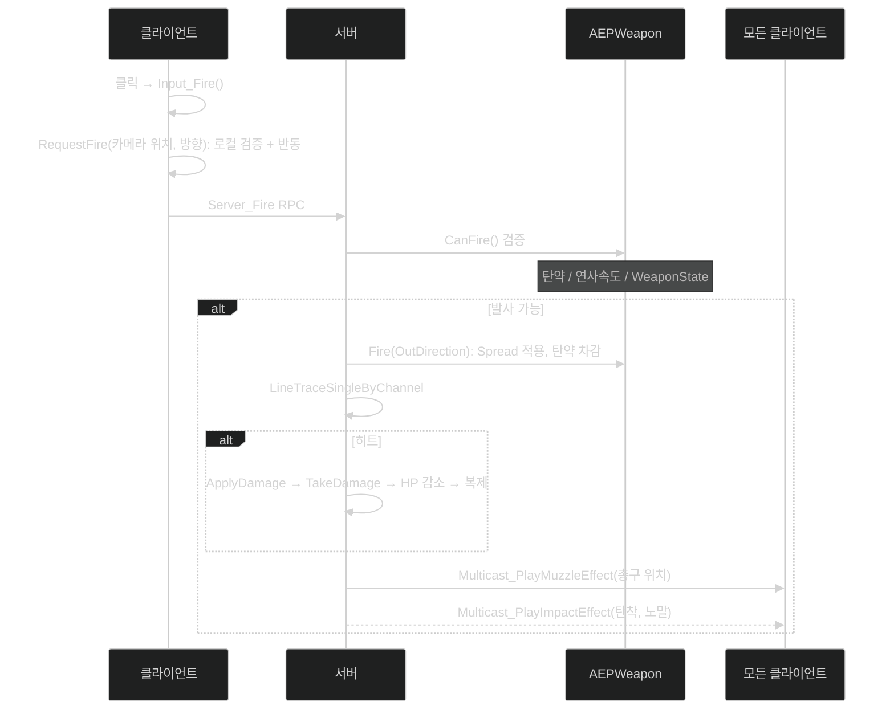

📌 **EmploymentProj 2단계 Replication** 네 번째 글입니다.
[👾 깃허브](https://github.com/SoftHamzzi/UE5-EmploymentProj) ·
[📚 시리즈 목차](/devlog/EP_Main) ·
[← 2-3. 아이템 3계층](/devlog/EP_Replication-3)
{: .notice--info}

## 왜 분리했나

전투 로직이 `AEPCharacter`에 들어 있었다.

```cpp
class AEPCharacter : public ACharacter
{
    AEPWeapon* EquippedWeapon;

    UFUNCTION(Server, Reliable)
    void Server_Fire(FVector Origin, FVector Direction);

    UFUNCTION(NetMulticast, Unreliable)
    void Multicast_PlayFireEffect(FVector MuzzleLocation);

    virtual float TakeDamage(...) override;
    // + 이동, 입력, HP, 사망
};
```

> **먼저 정정할 것이 하나.**
> 처음 이 글을 쓸 때 나는 분리 이유를 *"EPCharacter.cpp가 수천 줄이 됐다"*고 적었다.
> **사실이 아니다.** git으로 확인하니 분리 직전 **309줄**이었다.
>
> ```
> $ git show 7e74d70^:.../EPCharacter.cpp | wc -l
> 309
> ```
>
> 저장소가 공개돼 있으니 30초면 들통날 과장이었고, 무엇보다 **불필요했다.**
> 진짜 이유가 따로 있었으니까.

**진짜 이유는 "교체할 이음매를 만드는 것"이었다.**

4단계에서 GAS로 넘어갈 계획이 이미 있었다.
그때 `Server_Fire`는 `GA_Item_PrimaryUse`로, `Server_Reload`는 `GA_Item_Reload`로 바뀐다.
전투 진입점이 캐릭터 여기저기에 흩어져 있으면 그 이관은 **캐릭터 전체를 뒤지는 일**이 된다.
한 컴포넌트에 모아두면 **그 컴포넌트 내부만 갈아끼우면 된다.**

줄 수는 문제가 아니었다. **경계가 문제였다.**

| 역할 | 담당 |
|---|---|
| 이동·시점·점프·Sprint·ADS | `AEPCharacter` 유지 |
| 입력 → 전투 위임 | `Input_Fire()` → `CombatComponent->RequestFire()` |
| 발사·재장전·RPC·이펙트 | **`UEPCombatComponent`** |
| 장착 표현체 (메시·소켓) | `AEPWeapon` |
| 아이템 런타임 상태 | `UEPWeaponInstance` (이 시점엔 아직 미연결, [2-3편](/devlog/EP_Replication-3)) |

---

## 사격 흐름



동작한다. 2인 접속에서 HP가 깎이는 것도 확인했다.

**그런데 이 글을 다시 쓰면서 코드를 처음부터 읽어보니, 짚을 것이 여덟 개 나왔다.**
일곱 개는 구멍이고, 하나는 의심했다가 확인해보니 제대로 되어 있던 것이다.
"동작한다"와 "제대로 됐다" 사이의 거리이다.

---

## ① 서버가 사격 위치를 검증하지 않는다

가장 큰 것부터.

```cpp
UFUNCTION(Server, Reliable)
void Server_Fire(const FVector& Origin, const FVector& Direction);
```

```cpp
void UEPCombatComponent::Server_Fire_Implementation(const FVector& Origin, const FVector& Direction)
{
    if (!EquippedWeapon || !EquippedWeapon->CanFire()) return;

    FVector SpreadDir = Direction;
    EquippedWeapon->Fire(SpreadDir);
    ...
    const FVector End = Origin + SpreadDir * 10000.f;
    const bool bHit = GetWorld()->LineTraceSingleByChannel(Hit, Origin, End, ...);
```

**클라이언트가 보낸 `Origin`을 그대로 트레이스 시작점으로 쓴다.**
서버는 그 좌표가 이 캐릭터 근처인지 **한 번도 확인하지 않는다.**
`CanFire()`가 보는 건 탄약과 연사 속도뿐이다.

조작된 클라이언트는 맵 반대편 좌표를 `Origin`으로 보낼 수 있다.
벽 뒤에서도, 상대 뒤통수 바로 앞에서도 쏠 수 있다.

**즉 "서버 권한"은 절반만 사실이다.**
데미지 계산은 서버가 하지만 **기하는 클라이언트가 정한다.**

최소한의 방어는 이렇다.

```cpp
// 서버가 자기 기준으로 재구성하거나
const FVector ServerOrigin = Owner->GetFirstPersonCamera()->GetComponentLocation();

// 최소한 거리 검증
if (FVector::DistSquared(Origin, Owner->GetActorLocation()) > FMath::Square(MaxOriginDeviationCm))
    return;
```

아직 안 넣었다. 이걸 적어두는 이유는,
3단계에서 *"서버가 과거를 재구성해서 판정한다"*고 말하려면
**현재를 검증하는 것부터 되어 있어야** 하기 때문이다.

---

## ② `Server_Fire`가 Reliable이다

```cpp
UFUNCTION(Server, Reliable)
void Server_Fire(...);
```

`FireRate = 5`짜리 자동 사격이면 **초당 5회 Reliable RPC**이다.

| | Reliable (현재) | Unreliable |
|---|---|---|
| 손실 시 | 재전송, 늦게라도 도착 | 그 발사는 사라짐 |
| 순서 | 보장 | 보장 안 됨 |
| 부하 | ACK·재전송 큐. 손실 시 **이후 패킷이 밀림** | 없음 |
| 최악의 경우 | 손실 구간 뒤 발사가 **뭉쳐서** 처리됨 | 발사 몇 발 유실 |

FPS는 보통 **Unreliable + 서버 검증**이다.
발사 하나가 사라져도 다음 발사가 곧 오고,
재전송 때문에 뒤늦게 뭉쳐서 처리되는 것보다 낫기 때문이다.

Reliable을 고를 이유도 있다. 단발 저격총이라면
*"방아쇠를 당겼는데 서버가 못 받는 것"*이 훨씬 큰 손해이다.

**문제는 내가 그 판단을 하지 않았다는 것이다.**
기본값처럼 Reliable을 붙였다. 지금 정리하면: **자동 사격은 Unreliable이 맞다.**

---

## ③ 시계가 둘이다

```cpp
// 클라이언트: RequestFire
float CurrentTime = GetWorld()->GetTimeSeconds();
if (CurrentTime - LocalLastFireTime < FireInterval) return;
LocalLastFireTime = CurrentTime;
```

```cpp
// 서버: AEPWeapon::CanFire
float LastFireTime;    // 서버의 GetTimeSeconds()
```

`GetTimeSeconds()`는 **각자의 레벨 로드 이후 경과 시간**이다.
클라와 서버의 원점이 다르다.

지금은 *간격*만 비교하니 대체로 굴러가지만, 경계에서 어긋난다.
클라가 "1/5초 지났다"고 판단해 보낸 발사를 서버가 "아직"이라며 조용히 기각하면
**연사 중 총알이 간헐적으로 안 나간다.** 원인 찾기 고약한 종류이다.

이 문제의 정답은 3단계에서 만난다.

```cpp
GS->GetServerWorldTimeSeconds()    // 클라와 서버가 같은 값을 읽는 시계
```

→ [3-2. 서버 사이드 리와인드](/devlog/EP_NetPrediction-2)

**같은 함정을 두 번 밟지 않으려고 3단계에서 시계를 통일했다.**

---

## ④ 복제된 적 없는 `Replicated` 변수

`AEPWeapon`의 복제 등록 전문이다.

```cpp
void AEPWeapon::GetLifetimeReplicatedProps(TArray<FLifetimeProperty>& OutLifetimeProps) const
{
    Super::GetLifetimeReplicatedProps(OutLifetimeProps);

    DOREPLIFETIME_CONDITION(AEPWeapon, CurrentAmmo, COND_OwnerOnly);
}
```

**한 줄뿐이다.** 그런데 헤더에는 복제 대상이 둘이다.

```cpp
UPROPERTY(ReplicatedUsing = OnRep_CurrentAmmo, BlueprintReadOnly, Category = "Weapon")
uint8 CurrentAmmo = 0;

UPROPERTY(Replicated, BlueprintReadOnly, Category = "Weapon")
uint8 MaxAmmo = 30;          // ← 등록되지 않았다
```

`Replicated` 지정자만으로는 복제되지 않는다.
엔진은 `GetLifetimeReplicatedProps()`가 넘겨준 목록에만 플래그를 단다.

```cpp
// RepLayout.cpp:6314: LifetimeProps를 순회하는 안에서만 붙는다
RepParentCmd.Flags |= ERepParentFlags::IsLifetime;
```

```cpp
// RepLayout.cpp:1424-1431: 플래그가 없으면 값 비교조차 건너뛴다
const bool bIsLifetime = EnumHasAnyFlags(Parent.Flags, ERepParentFlags::IsLifetime);
bool bShouldSkip = !bIsLifetime || !bIsActive;
```

**`MaxAmmo`는 한 번도 복제된 적이 없다.** 경고도 크래시도 없이 조용히요.

**그리고 아무 문제도 없었다.** 그게 이 발견의 요점이다.
`MaxAmmo`는 `WeaponDef->MaxAmmo`에서 오는 **정적 데이터**고,
그 DataAsset은 클라이언트에도 있다. 애초에 복제할 값이 아니었다.

여기서 기준이 하나 나왔다.

> **런타임에 변하고, 클라가 스스로 알 수 없는 것만 복제한다.**

`CurrentAmmo`는 둘 다 맞다. `MaxAmmo`는 둘 다 아니다.
지정자를 지우는 게 맞다. 지금은 **"복제되는 척하는 값"**이라 읽는 사람을 속인다.

---

## ⑤ 반대로, 잘 되어 있던 것 하나

이 글을 다시 쓰면서 *"남의 탄약까지 다 내려가는 것 아닌가"*를 의심했는데,
확인해보니 조건이 제대로 걸려 있었다.

```cpp
DOREPLIFETIME_CONDITION(AEPWeapon, CurrentAmmo, COND_OwnerOnly);
```

`AEPCharacter::HP`, `AEPPlayerState::KillCount`, `bIsExtracted`도 전부 같다.
추출 슈터에서 **상대의 잔탄·체력·킬 수는 공개 정보가 아니다.**
조작된 클라이언트가 읽을 수 없어야 하고, `COND_OwnerOnly`가 그걸 막는다.
자세한 정리는 [2-5편](/devlog/EP_Replication-5)에 있다.

> **읽는 법 하나:** 복제 조건은 헤더의 `UPROPERTY`에 없다.
> `GetLifetimeReplicatedProps()`에 있다.
> 헤더만 보고 "조건이 없네"라고 판단하면 틀린다. 내가 그럴 뻔했다.

---

## ⑥ 반동은 서버가 검증할 수 없다

```cpp
if (Owner->IsLocallyControlled())
{
    float Pitch = EquippedWeapon->GetRecoilPitch();
    float Yaw   = FMath::RandRange(-EquippedWeapon->GetRecoilYaw(), EquippedWeapon->GetRecoilYaw());
    Owner->AddControllerPitchInput(-Pitch);
    Owner->AddControllerYawInput(Yaw);
}
```

즉시 반응이 필요하니 로컬 처리는 맞다.
그런데 ①과 합치면 결론이 하나 나온다.

**서버는 조준 방향을 클라에서 받는다. 그러니 반동은 순전히 클라 쪽 연출이다.**
반동 코드를 무시하는 클라이언트는 그냥 반동이 없다. 서버가 알 방법이 없다.

막으려면 서버가 조준 방향의 진실을 따로 알아야 한다.
[2-1편](/devlog/EP_Replication-1)에서 본 `SavedControlRotation`,
이동 패킷에 실려오는 회전, 이 그 후보이다.

---

## ⑦ 클라는 자기 탄이 어디로 갈지 모른다

```cpp
FVector SpreadDir = Direction;
EquippedWeapon->Fire(SpreadDir);      // 서버가 자기 난수로 퍼짐 적용
```

서버 권한이라는 점은 **맞다.**
대신 클라이언트는 조준점과 실제 탄착이 다르고, **예측할 방법이 없다.**
서버가 자기 난수로 흔들기 때문이다.

표준 해법은 **시드 공유 결정적 난수**이다.
클라와 서버가 같은 시드로 같은 값을 뽑으면
클라는 탄착을 미리 그릴 수 있고 서버는 검증할 수 있다.

4단계의 **Spread CDF 테이블**이 정확히 이 자리를 채우게 된다.

---

## ⑧ 총구 화염이 핑만큼 늦게 뜬다

```cpp
Multicast_PlayMuzzleEffect(MuzzleLocation);
```

Multicast는 **서버가 보낸다.** 쏜 본인도 예외가 아니다.

```
클릭 ──► 서버 도달 ──► Multicast ──► 내 화면에 화염
        (핑의 절반)      (핑의 절반)
```

핑 80ms면 **80ms 뒤에** 내 총에서 불이 난다. 손맛이 죽는다.
[3-3편](/devlog/EP_NetPrediction-3)에서 **로컬 예측 이펙트**로 고친다.

부수적으로, Multicast는 **릴러번시 안의 클라에게만** 간다.
`NetCullDistanceSquared` 밖이면 총소리가 안 들린다.
FPS에서 소리가 들려야 하는 거리와 릴러번시 거리는 보통 다르다.

### 그래도 잘한 것 하나

이펙트를 **두 개의 Multicast로 나눈 것**은 지금 봐도 맞다.

```cpp
UFUNCTION(NetMulticast, Unreliable)
void Multicast_PlayMuzzleEffect(const FVector_NetQuantize& MuzzleLocation);
UFUNCTION(NetMulticast, Unreliable)
void Multicast_PlayImpactEffect(const FVector_NetQuantize& ImpactPoint,
                                const FVector_NetQuantize& ImpactNormal);
```

- 총구는 **항상** 발생하고 좌표가 하나, 탄착은 **히트 시에만** 발생하고 노말이 필요하다.
- 발생 조건이 다르니 합치면 빗나간 사격마다 쓸모없는 탄착 좌표가 실려 나간다.
- **`FVector_NetQuantize`**: 이펙트 좌표에 float 정밀도는 과하다.
  1cm 단위로 양자화해서 보낸다. 눈에 보이지 않는 차이에 대역폭을 쓰지 않는다.
- Unreliable도 맞다. **이펙트는 놓쳐도 게임 상태가 어긋나지 않는다.**

---

## 무기 장착: 서버와 OnRep을 같은 코드로

```cpp
void UEPCombatComponent::EquipWeapon(AEPWeapon* NewWeapon)   // 서버
{
    if (!GetOwner()->HasAuthority() || !NewWeapon) return;
    if (EquippedWeapon) UnequipWeapon();

    EquippedWeapon = NewWeapon;

    NewWeapon->AttachToComponent(Owner->GetMesh(),
        FAttachmentTransformRules::SnapToTargetNotIncludingScale,
        TEXT("WeaponSocket"));                     // MetaHuman 스켈레톤의 hand_r에 추가한 소켓

    if (NewWeapon->WeaponDef && NewWeapon->WeaponDef->WeaponAnimLayer)
        Owner->GetMesh()->LinkAnimClassLayers(NewWeapon->WeaponDef->WeaponAnimLayer);
}

void UEPCombatComponent::OnRep_EquippedWeapon()              // 클라이언트
{
    // 부착 + LinkAnimClassLayers: 서버와 동일
}
```

`EquippedWeapon`이 복제되고, 클라는 `OnRep`에서 **같은 일**을 한다.
초기 복제로도 `OnRep`이 오므로 **나중에 접속한 사람도 무기를 든 캐릭터를 본다**.
[2-2편](/devlog/EP_Replication-2)의 `Multicast_Die`가 못 하던 그것이다.

`LinkAnimClassLayers`로 무기별 애님 레이어를 갈아끼우는 건 Lyra 방식이다.
자세한 건 [2-6편](/devlog/EP_Replication-6)에서 다룬다.

---

## 이 구조의 한계: 그리고 어디로 갈 것인가

`UEPCombatComponent`가 지금 하는 일:

```
UEPCombatComponent
├── 장착 무기 관리   ← Equipment의 일
├── 발사 실행 (RPC)  ← Ability의 일
└── 이펙트 재생      ← Effect의 일
```

`AEPWeapon`도 마찬가지이다. "표현체"라고 이름 붙였지만 실제로는

- 시각 표현 (메시·소켓)
- 발사 가능 판단 (`CanFire`)
- 탄퍼짐 계산 (`ApplySpread`, `CurrentSpread`, `ConsecutiveShots`)
- 상태 머신 (`Idle`/`Firing`/`Reloading`)
- 탄약 복제 (`CurrentAmmo`)

**게임 로직이 액터에 들어 있다.**
[2-3편](/devlog/EP_Replication-3)에서 *"상태 원본은 Instance"*라고 썼지만,
그 시점의 Instance는 복제 설정이 없어 사실상 서버 전용이었고
**실제로 동작하던 탄약 상태는 이 `CurrentAmmo` 하나**였다.
의도와 구현이 아직 만나지 않은 상태였다.

### 가야 할 곳 (Lyra 기준)

```
AEPCharacter
├── UEPInventoryComponent      "무엇을 갖고 있나"
├── UEPEquipmentComponent      "무엇을 장착했나"     ← CombatComponent 대체
└── UAbilitySystemComponent
    ├── GA_Item_PrimaryUse     "어떻게 쏘나"         ← Server_Fire 대체
    ├── GA_Item_Reload         "어떻게 재장전하나"
    └── GA_ADS
```

| 현재 | 목표 | 역할 |
|---|---|---|
| `CombatComponent::EquippedWeapon` | `EquipmentComponent::PrimarySlot` | 장착 상태 |
| `CombatComponent::Server_Fire` | `GA_Item_PrimaryUse` | 발사 실행 |
| `Multicast_PlayMuzzleEffect` | GameplayCue | 이펙트 |
| `AEPWeapon::CurrentAmmo` | 아이템 런타임 상태 | 탄약 |
| (없음) | `InventoryComponent` | 인벤토리 |

### 단계 계획

```
2단계 (현재)  CombatComponent 유지, 구조 이해와 동작 확인이 목표
3단계         HandleFire에 지연 보상 삽입, 컴포넌트 구조는 그대로
4단계 (GAS)   발사를 GA로 이관, 진입점은 같고 내부만 교체
5단계         InventoryComponent 추가, 슬롯·루팅
```

**`RequestFire()`라는 진입점 하나만 지키면, 그 안을 무엇으로 바꾸든 바깥이 안 바뀐다.**
그게 이 컴포넌트를 만든 이유의 전부이다.

---

## 이 글 이후 바뀐 것

- `ECC_GameTraceChannel1` 하드코딩 → `EP_TraceChannel_Weapon` 상수 (`EPTypes.h`)
- 사거리 `10000.f` 하드코딩 → `UEPCombatDeveloperSettings::DefaultTraceDistanceCm`
- `Server_Fire`의 레이캐스트가 **`UEPServerSideRewindComponent::ConfirmHitscan`**으로 이동
  → [3-2편](/devlog/EP_NetPrediction-2)
- `ApplyDamage`/`TakeDamage` 경로가 **GAS GameplayEffect**로 교체
- 계획대로 `Server_Fire` / `Server_Reload` RPC는 제거 예정 상태

`Origin` 미검증, Reliable 사격 RPC, `MaxAmmo`의 죽은 `Replicated` 지정자는 **아직 그대로이다.**

---

## 다음 편
→ [2-5. 무엇을 어떻게 복제할 것인가](/devlog/EP_Replication-5)
