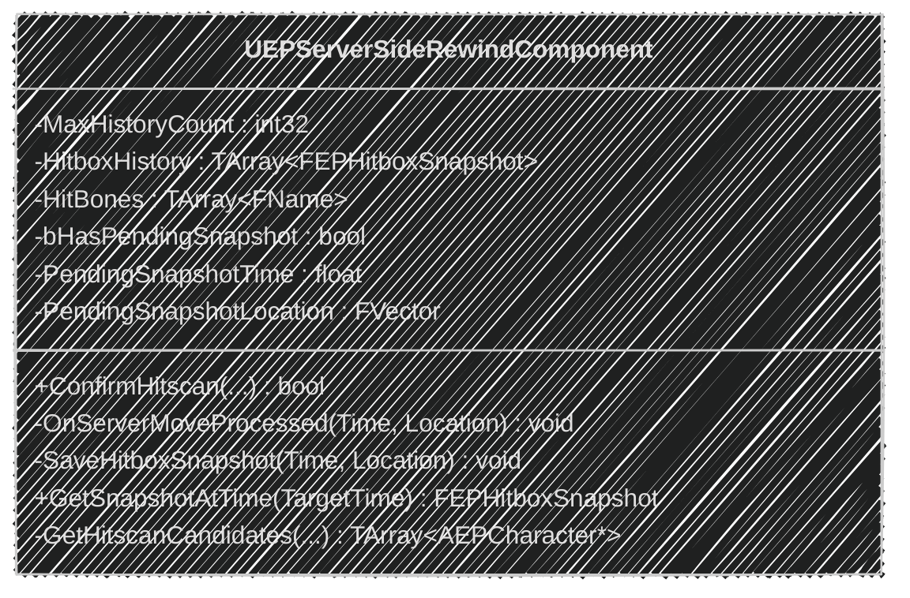
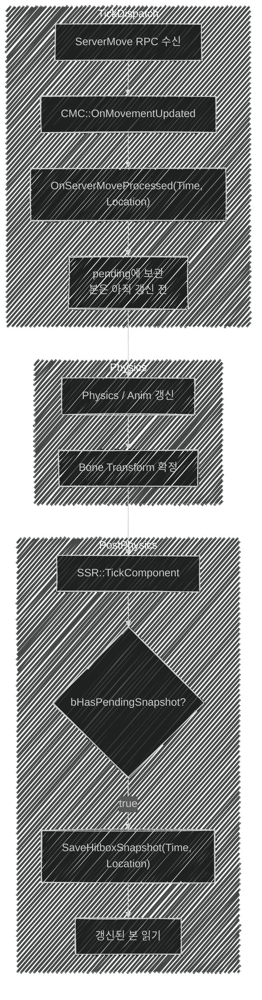
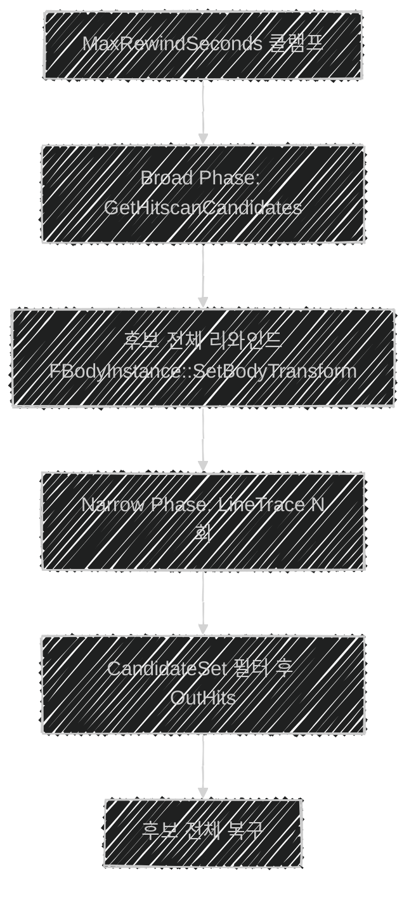

📌 **EmploymentProj 3단계 지연 보상** 두 번째 글입니다.
[👾 깃허브](https://github.com/SoftHamzzi/UE5-EmploymentProj) ·
[📚 시리즈 목차](/devlog/EP_Main) ·
[← 3-1. 본 단위 히트박스](/devlog/EP_NetPrediction-1)
{: .notice--info}

[](https://www.youtube.com/watch?v=bh4ao6mvxRY)

## 문제

2단계까지의 사격은 이랬다.

```cpp
// Server_Fire: 서버가 RPC를 받은 '지금' 위치로 판정
GetWorld()->LineTraceSingleByChannel(Hit, Origin, End, ...);
```

```
[클라] 적이 X=0에 보인다 → 발사
         ↓ RTT
[서버] 적은 이미 X=100에 있다 → 빗나감
```

**조준한 곳에 맞지 않다.** 핑이 높을수록 심해진다.

해법은 알려져 있다. **서버가 과거로 되돌아가서 판정한다.**
문제는 그 "과거"를 정확히 재현하는 것이었고, 여기서 일주일을 썼다.

---

## 구조: 왜 별도 컴포넌트인가



```cpp
UEPServerSideRewindComponent::UEPServerSideRewindComponent()
{
    PrimaryComponentTick.bCanEverTick = true;
    PrimaryComponentTick.TickGroup = TG_PostPhysics;   // ★ 이 줄이 핵심. 아래에서 설명
    SetIsReplicatedByDefault(false);                   // 히스토리는 서버만 필요. 복제 비용 0
}
```

`AEPCharacter`나 `UEPCombatComponent`에 넣지 않은 이유:

- 두 클래스 모두 이미 할 일이 많다 ([2-4편](/devlog/EP_Replication-4))
- **GAS로 넘어가도 `ConfirmHitscan`은 그대로 재사용**된다.
  어빌리티가 발사를 맡아도 "과거로 되돌려 판정한다"는 서비스는 안 바뀐다

역할 분리는 이렇다.

```
UEPCombatComponent::HandleHitscanFire
  ├ SSR->ConfirmHitscan(..., OutHits)     ← 판정은 위임
  └ Damage Block                          ← 대미지 계산만 여기서
```

---

## 무엇을 저장하는가

[3-1편](/devlog/EP_NetPrediction-1)에서 만든 구조체를 매 이동마다 쌓는다.

```cpp
struct FEPHitboxSnapshot
{
    float   ServerTime;     // 이 포즈가 유효했던 서버 시각
    FVector Location;       // Broad Phase용 루트 위치
    TArray<FEPBoneSnapshot> Bones;   // Narrow Phase 리와인드용
};
```

**여기서 절대 어겨지면 안 되는 규칙이 하나 있다.**

> `ServerTime`, `Location`, `Bones`: **셋이 같은 순간을 가리켜야 한다.**

이 규칙을 어긴 것이 이 글에서 잡은 버그이다.

---

## 처음 구현: 그리고 왜 틀렸는가

처음에는 단순한 고정 간격 타이머였다.

```cpp
// 수정 전
void UEPServerSideRewindComponent::TickComponent(float DeltaTime, ...)
{
    SnapshotAccumulator += DeltaTime;
    if (SnapshotAccumulator < CombatSettings->SnapshotIntervalSeconds) return;   // 30ms

    SnapshotAccumulator = 0.f;
    SaveHitboxSnapshot();
}

void UEPServerSideRewindComponent::SaveHitboxSnapshot()
{
    const AGameStateBase* GS = GetWorld()->GetGameState<AGameStateBase>();
    const float ServerNow = GS ? GS->GetServerWorldTimeSeconds() : GetWorld()->GetTimeSeconds();

    Snapshot.ServerTime = ServerNow;
    Snapshot.Location   = OwnerChar->GetActorLocation();
    // 본 트랜스폼...
}
```

30ms마다 "지금 시각"과 "지금 위치"를 같이 찍는다. 문제없어 보인다.

**그런데 서버에서 캐릭터가 움직이는 방식이 그렇지 않다.**

### 서버의 이동은 연속적이지 않다

클라이언트는 이동 정보를 묶어서 보낸다.
`FCharacterNetworkMoveDataContainer`(`FCharacterNetworkMoveData`의 묶음)이다.
그리고 서버는 **그 패킷이 도착한 틱에 묶음 전체를 한 번에 처리**한다.

```
[서버 틱]  1     2     3     4     5     6
패킷 도착   ●                 ●
캐릭터 위치 ▲───(정지)───────▲───(정지)──
스냅샷     ①    ②    ③    ④    ⑤    ⑥   ← 30ms 타이머는 계속 찍는다
```

②③은 **시각만 다르고 위치는 ①과 똑같은** 스냅샷이다.
그리고 ④에서 위치가 갑자기 점프한다.

그 히스토리를 보간하면 **실제 궤적과 전혀 다른 선**이 나온다.
캐릭터는 등속으로 달렸는데, 히스토리는 "멈췄다가 순간이동"으로 기록돼 있다.

**그래서 시각은 CMC가 이동을 확정한 순간의 것을 써야 한다.**

---

## 그런데 고쳐도 한 틱이 남았다

CMC에 델리게이트를 달아서 "이동을 처리한 시각"을 받아왔다.

```cpp
// EPCharacterMovement.h
DECLARE_MULTICAST_DELEGATE_TwoParams(FEPOnServerMoveProcessed, float /*Time*/, FVector /*Location*/);
```

```cpp
// EPCharacterMovement.cpp: OnMovementUpdated
void UEPCharacterMovement::OnMovementUpdated(float DeltaSeconds, const FVector& OldLocation, const FVector& OldVelocity)
{
    Super::OnMovementUpdated(DeltaSeconds, OldLocation, OldVelocity);
    if (!GetOwner()->HasAuthority()) return;

    const FCharacterNetworkMoveData* MoveData = GetCurrentNetworkMoveData();
    if (!MoveData || MoveData->NetworkMoveType != FCharacterNetworkMoveData::ENetworkMoveType::NewMove) return;

    const AGameStateBase* GS = GetWorld()->GetGameState<AGameStateBase>();
    const float T = GS ? GS->GetServerWorldTimeSeconds() : GetWorld()->GetTimeSeconds();

    OnServerMoveProcessed.Broadcast(T, GetActorLocation());
}
```

그런데도 **여전히 한 틱만큼 어긋났다.**
디버그 드로우를 켜면 리와인드된 히트박스가 **항상 진행 방향 뒤쪽**에 그려졌다.
보이는 것보다 이전 위치를 조준해야 맞았다.

### 계측

이 로그 두 줄로 잡았다.

```cpp
// SaveHitboxSnapshot 안: 델리게이트가 준 시각과 '지금' 시각을 비교
const float ServerNow = GS ? GS->GetServerWorldTimeSeconds() : GetWorld()->GetTimeSeconds();
UE_LOG(LogTemp, Warning, TEXT("[SHS] Now=%.4f Param=%.4f Diff=%.4f"),
       ServerNow, Time, ServerNow - Time);
```

```cpp
// ConfirmHitscan 안: 서버가 아는 현재 위치와 리와인드된 위치를 비교
UE_LOG(LogTemp, Log, TEXT("[SERVER_REWIND_POS] ClientFireTime=%.3f Actor=%s ServerPos=%s RewindPos=%s"),
       ClientFireTime, *GetNameSafe(Target), *ServerPos.ToString(), *RewindPos.ToString());
```

`Diff`가 **항상 정확히 한 프레임 시간**이었다. 상황과 무관하게요.
*"어떤 상황에서도 정확히 한 틱"*이라면 원인은 게임 로직이 아니라 **틱 구조** 안에 있다.

### 원인: 두 함수가 다른 프레임의 시계를 읽고 있었다

`UWorld::Tick`을 열었다.

```cpp
// LevelTick.cpp:1545
BroadcastTickDispatch(DeltaSeconds);      // ← ServerMove RPC 수신·처리
BroadcastPostTickDispatch();              //   CMC::OnMovementUpdated가 여기서 돈다
...
// LevelTick.cpp:1577-1581
UnpausedTimeSeconds += DeltaSeconds;
if ( !bIsPaused )
{
    TimeSeconds += DeltaSeconds;          // ← 월드 시간은 '그 뒤'에 증가한다
}
...
// LevelTick.cpp:1721
RunTickGroup(TG_PrePhysics);
...
// LevelTick.cpp:1749
RunTickGroup(TG_PostPhysics);             // ← SSR::TickComponent가 여기서 돈다
```

그리고 서버 시계의 정체:

```cpp
// GameStateBase.cpp:144-149
double AGameStateBase::GetServerWorldTimeSeconds() const
{
    ...
    return World->GetTimeSeconds() + ServerWorldTimeSecondsDelta;
}
```

**`TimeSeconds`를 그대로 쓴다.**

> **`TickDispatch`에서 읽은 시각은 "직전 프레임의 `TimeSeconds`"이고,
> `PostPhysics`에서 읽은 시각은 "이번 프레임의 `TimeSeconds`"이다.
> 차이는 정확히 `DeltaSeconds`: 60fps면 약 16.7ms.**

이게 "항상 정확히 한 틱"의 정체였다.

**`GetServerWorldTimeSeconds()`는 한 프레임 안에서도 어디서 부르느냐에 따라 다른 값을 준다.**
같은 틱 안이니 같은 값일 거라고 믿은 게 틀렸다.

600cm/s로 달리는 캐릭터면 한 프레임에 **10cm**이다.
그런데 실제 측정 오차는 훨씬 컸다.
어긋난 두 스냅샷 사이를 보간이 메우면서 오차가 증폭되고,
패킷 간격이 벌어지는 나쁜 네트워크에서는 그 간격이 그대로 곱해진다.

---

## 해결: 세 값을 한 순간에 묶는다

```cpp
// TickDispatch 시점: 본 Transform은 아직 갱신 전. 값만 보관한다.
void UEPServerSideRewindComponent::OnServerMoveProcessed(float Time, FVector Location)
{
    bHasPendingSnapshot     = true;
    PendingSnapshotTime     = Time;
    PendingSnapshotLocation = Location;
}

// PostPhysics: 본 Transform 갱신 완료. 여기서 커밋한다.
void UEPServerSideRewindComponent::TickComponent(float DeltaTime, ...)
{
    if (!OwnerChar || !OwnerChar->HasAuthority()) return;

    if (bHasPendingSnapshot)
    {
        SaveHitboxSnapshot(PendingSnapshotTime, PendingSnapshotLocation);
        bHasPendingSnapshot = false;
    }
}

void UEPServerSideRewindComponent::SaveHitboxSnapshot(float Time, const FVector& Location)
{
    FEPHitboxSnapshot Snapshot;
    Snapshot.ServerTime = Time;        // ← CMC가 준 것
    Snapshot.Location   = Location;    // ← CMC가 준 것 (GetActorLocation()을 다시 읽지 않는다)

    for (const FName& BoneName : HitBones)
    {
        const int32 BoneIndex = OwnerChar->GetMesh()->GetBoneIndex(BoneName);
        if (BoneIndex == INDEX_NONE) continue;

        FEPBoneSnapshot Bone;
        Bone.BoneName       = BoneName;
        Bone.WorldTransform = OwnerChar->GetMesh()->GetBoneTransform(BoneIndex);  // ← 여기서만 읽는다
        Snapshot.Bones.Add(Bone);
    }

    if (HitboxHistory.Num() >= MaxHistoryCount) HitboxHistory.RemoveAt(0);
    HitboxHistory.Add(Snapshot);
}
```



**핵심은 "위치와 시각을 다시 읽지 않는다"이다.**

`Location`을 PostPhysics에서 `GetActorLocation()`으로 다시 읽으면
그건 **이번 프레임의 위치**이고 `ServerTime`은 **직전 프레임의 시각**이다.
같은 버그가 그대로 남는다.

**본 Transform만 PostPhysics에서 읽는다.** 그건 시각의 문제가 아니라
"물리·애니메이션 갱신이 끝나야 유효하다"는 순서의 문제이기 때문이다.

그리고 이 줄이 없으면 전부 무의미하다.

```cpp
PrimaryComponentTick.TickGroup = TG_PostPhysics;
```

기본값은 `TG_PrePhysics`이다. 본 갱신 **전**에 읽게 된다.

---

## 결과

| | 수정 전 | 수정 후 |
|---|---|---|
| `RewindPos` 오차 | **242cm** | **2.3cm** |
| 조건 | - | Bad 네트워크 프로파일에서도 유지 |

**100배이다.** 그리고 체감은 훨씬 크다.
242cm는 캐릭터 하나를 통째로 빗나가는 거리이고, 2.3cm는 히트박스 안이다.

디버그 드로우로 보면 리와인드된 빨간 히트박스가
클라이언트가 조준했던 그 자리에 정확히 겹친다.

### 이 문제를 좁혀간 순서

| 단계 | 한 일 | 결과 |
|---|---|---|
| 가설 1 | 보간 알고리즘이 틀렸다 | 두 스냅샷을 직접 찍어보니 보간은 정상 |
| 가설 2 | 스냅샷 주기가 성기다 | 주기를 줄여도 **오차 비율이 그대로** → 주기 문제 아님 |
| 관찰 | 오차가 **항상 정확히 한 틱** | 게임 로직이 아니라 틱 구조의 문제 |
| 계측 | `[SHS] Diff` 로그 추가 | `Diff`가 항상 한 프레임 시간 |
| 원인 | `UWorld::Tick` 직독 | `TimeSeconds` 증가가 `TickDispatch` **뒤**에 있음 |

**"일주일 걸렸다"보다 이 표가 더 많은 걸 말한다고 생각한다.**
가장 중요했던 건 *"항상 정확히 한 틱"*이라는 관찰이었다.
값이 들쭉날쭉했다면 로직 버그를 계속 팠을 텐데, 일정했기에 구조를 의심할 수 있었다.

---

## 히스토리 크기

```cpp
void UEPServerSideRewindComponent::BeginPlay()
{
    const float RewindWindow = FMath::Max(0.05f, CombatSettings->MaxRewindSeconds);

    float MoveDeltaTime = 1.f / 60.f;
    GConfig->GetFloat(TEXT("/Script/Engine.GameNetworkManager"),
                      TEXT("ClientNetSendMoveDeltaTime"), MoveDeltaTime, GGameIni);
    if (MoveDeltaTime <= 0.f) MoveDeltaTime = 1.f / 60.f;      // 0 나눗셈 방어

    MaxHistoryCount = FMath::CeilToInt(RewindWindow / MoveDeltaTime) + 4;

    if (AEPCharacter* OwnerChar = Cast<AEPCharacter>(GetOwner()))
        if (UEPCharacterMovement* CMC = Cast<UEPCharacterMovement>(OwnerChar->GetCharacterMovement()))
            CMC->OnServerMoveProcessed.AddUObject(this, &ThisClass::OnServerMoveProcessed);
}
```

**이 식이 성립하는 건 위의 수정 덕분이다.**
스냅샷이 `ServerMove` 수신마다 정확히 하나씩 쌓이므로,
*필요한 개수 = 리와인드 창 ÷ 이동 전송 주기*가 된다.
고정 타이머 방식이었다면 두 값이 무관해서 이 계산 자체가 성립하지 않는다.

`+ 4`는 여유분이다. 패킷이 몰려 오면 한 틱에 여러 Move가 처리될 수 있고,
경계에서 보간할 두 점이 항상 남아 있어야 한다.

```ini
; DefaultGame.ini: Project Settings UI에는 노출되지 않는다
[/Script/Engine.GameNetworkManager]
ClientNetSendMoveDeltaTime = 0.0166
```

**ini를 바꾸면 버퍼 크기가 자동으로 따라온다.** 상수를 두 곳에 적지 않다.

---

## 보간: 회전은 Lerp하면 안 된다

```cpp
FEPHitboxSnapshot UEPServerSideRewindComponent::GetSnapshotAtTime(float TargetTime) const
{
    if (TargetTime <= HitboxHistory[0].ServerTime)     return HitboxHistory[0];
    if (TargetTime >= HitboxHistory.Last().ServerTime) return HitboxHistory.Last();

    // 시간 오름차순 배열: Before/After 탐색
    const FEPHitboxSnapshot* Before = nullptr;
    const FEPHitboxSnapshot* After  = nullptr;
    for (int32 i = 0; i < HitboxHistory.Num() - 1; ++i)
    {
        if (HitboxHistory[i].ServerTime <= TargetTime && HitboxHistory[i+1].ServerTime >= TargetTime)
        {
            Before = &HitboxHistory[i];
            After  = &HitboxHistory[i+1];
            break;
        }
    }

    const float Denom = After->ServerTime - Before->ServerTime;
    const float Alpha = (Denom > KINDA_SMALL_NUMBER)
        ? FMath::Clamp((TargetTime - Before->ServerTime) / Denom, 0.f, 1.f) : 0.f;

    FEPHitboxSnapshot Result;
    Result.ServerTime = TargetTime;
    Result.Location   = FMath::Lerp(Before->Location, After->Location, Alpha);

    for (int32 i = 0; i < FMath::Min(Before->Bones.Num(), After->Bones.Num()); ++i)
    {
        FEPBoneSnapshot BoneResult;
        BoneResult.BoneName       = Before->Bones[i].BoneName;
        BoneResult.WorldTransform = Before->Bones[i].WorldTransform;
        BoneResult.WorldTransform.BlendWith(After->Bones[i].WorldTransform, Alpha);  // ★
        Result.Bones.Add(BoneResult);
    }
    return Result;
}
```

**`FTransform::BlendWith`를 쓴 이유:**
`FMath::Lerp(FRotator, FRotator)`는 각도 랩어라운드를 처리하지 못한다.
-179°에서 181°로 가는 걸 **360도 반대로 돌아가는 것**으로 계산한다.
`BlendWith`는 내부적으로 쿼터니언 Slerp이라 최단 경로로 돈다.

**히스토리를 링버퍼가 아니라 단순 배열로 둔 이유:**
이 탐색이 "시간 오름차순"을 전제한다. 링버퍼는 인덱스가 감기면서
순서 판단이 복잡해진다. 배열 길이가 20 남짓이라 `RemoveAt(0)` 비용도 무시할 수준이다.
**정확성을 우선하고, 필요해지면 그때 바꾼다.**

---

## ConfirmHitscan: 되돌리고, 쏘고, 되돌려놓는다



### `SetBoneTransformByName`이 아니라 `FBodyInstance`인 이유

처음에는 본 트랜스폼을 직접 옮겼다. **트레이스가 안 맞았다.**

```
Game Thread Tick
  └ TickDispatch (CMC)
  └ Animation Update → AnimGraph Evaluate     ← 여기서 본 값이 덮어써진다
  └ Physics Sync (UpdateKinematicBonesToAnim)
  └ PostPhysics (SSR)
```

`SetBoneTransformByName`은 **스켈레탈 메시의 본 배열**을 건드린다.
트레이스가 실제로 검사하는 건 **물리 바디**이고, 그건 별개이다.

```cpp
FBodyInstance* Body = Mesh->GetBodyInstance(BoneName);
Body->SetBodyTransform(SnapshotTransform, ETeleportType::TeleportPhysics);
```

`ETeleportType::TeleportPhysics`: 순간이동으로 처리해서 속도를 만들어내지 않는다.
그냥 옮기면 물리 엔진이 "엄청난 속도로 이동했다"고 해석한다.

### 후보가 아닌 캐릭터는 걸러야 한다

리와인드된 월드에서 트레이스를 쏘면 **Broad Phase 후보가 아닌 캐릭터**에게도 맞을 수 있다.
그 캐릭터는 여전히 현재 위치에 있으니, 판정 기준이 섞인다.

```cpp
if (!CandidateSet.Contains(HitChar)) continue;
```

### 복구는 즉시

Narrow Phase가 끝나면 **같은 프레임 안에서** 원래 트랜스폼으로 되돌린다.
한 프레임이라도 남으면 그 사이의 다른 트레이스·오버랩이 과거 위치를 보게 된다.

---

## 정직하게: 남아 있는 두 가지

### ① 클라이언트가 보낸 시각을 그대로 믿는다

```cpp
if (ServerNow - ClientFireTime > CombatSettings->MaxRewindSeconds)
{
    ClientFireTime = ServerNow;     // 너무 과거면 리와인드 없이 현재로
}
```

**너무 과거인 경우만 막는다.** 0.5초 창 안이라면 클라이언트 값을 그대로 쓴다.

조작된 클라이언트는 **최근 0.5초 중 가장 유리한 순간**을 골라 보낼 수 있다.
적이 엄폐물 뒤로 들어가기 직전 시각을 지정하면, 서버가 되돌려서 맞혀준다.

정석은 **클라이언트 값 대신 서버가 잰 왕복 시간을 쓰는 것**이다.

```cpp
const float RTTHalf    = Shooter->GetPlayerState()->GetPingInMilliseconds() * 0.001f * 0.5f;
const float RewindTime = ServerNow - FMath::Clamp(RTTHalf, 0.f, MaxRewindSeconds);
```

혹은 클라이언트 값을 받되 RTT 기대치에서 벗어나면 기각한다.

> 미래 시각(`ClientFireTime > ServerNow`)은 따로 검사하지 않는데,
> `GetSnapshotAtTime`의 경계 처리가 `HitboxHistory.Last()`를 반환해서
> **결과적으로 무해**한다. 리와인드가 안 될 뿐이다.

[2-4편](/devlog/EP_Replication-4)에서 `Origin`을 검증하지 않는다고 적었는데,
`ClientFireTime`도 같은 종류의 신뢰이다.
지연 보상은 본질적으로 **클라이언트의 과거 주장을 서버가 받아들이는 기능**이라
이 문제를 완전히 없앨 수는 없고, **경계를 좁히는 것**이 전부이다.

### ② 한 발에 히스토리를 두 번 뒤진다

```cpp
// Broad Phase 안
const FEPHitboxSnapshot Snap = TargetSSR->GetSnapshotAtTime(ClientFireTime);   // Location만 쓴다
// Narrow Phase 안
const FEPHitboxSnapshot Snap = TargetSSR->GetSnapshotAtTime(ClientFireTime);   // 전체를 쓴다
```

같은 시각으로 두 번 호출하고, `GetSnapshotAtTime`은 매번
**선형 탐색 + 본 20개 보간 + 배열 할당**을 한다.

Broad Phase는 `Location` 하나만 필요한데 본을 전부 보간한다.
[3-1편](/devlog/EP_NetPrediction-1)에서 `Location`을 따로 저장한 이유가
그 비용을 피하려던 것인데 여기서 도로 냈다.
`GetLocationAtTime(float)` 같은 가벼운 경로가 있으면 된다.

*(후보 탐색이 O(N)이라 Spatial Hash로 바꿀 수 있다는 이야기도 있지만,
8인 규모에서는 이쪽이 먼저 손볼 곳이다.)*

---

## 그리고: 지연 보상은 공정성을 만들지 않는다

이게 이 기능에 대해 가장 중요한 이야기라고 생각한다.

| | 지연 보상 없음 | 지연 보상 있음 |
|---|---|---|
| 쏘는 사람 | **조준한 곳에 맞지 않음** | 조준한 곳에 맞음 |
| 맞는 사람 | 안 맞음 | **엄폐물 뒤에서 죽음** |

SSR은 불공정을 없애지 않는다. **쏘는 쪽에서 맞는 쪽으로 옮긴다.**
그러니 `MaxRewindSeconds = 0.5`는 기술 상수가 아니라 **게임 디자인 결정**이다.

- 크게 잡으면 → 고핑 플레이어가 유리해지고, "엄폐 뒤에서 죽었다"가 늘어남
- 작게 잡으면 → 고핑 플레이어는 계속 빗나감

발로란트가 창을 짧게 잡고 서버 틱을 128Hz로 올린 것,
CS 계열이 창을 넉넉히 잡는 것, 전부 이 저울의 어디에 설 것인가이다.

이 프로젝트는 **추출 슈터**이다. 한 번의 죽음으로 가져온 장비를 전부 잃는다.
*"쏜 사람의 답답함"보다 **"맞은 사람의 억울함"**이 훨씬 비싼다.*
그래서 0.5초는 상한이고, 실제로는 대부분 훨씬 짧은 구간만 되돌린다.
그리고 위 ①의 RTT 기반 검증을 넣으면 이 상한을 더 줄일 수 있다.

---

## 디버그 시각화

원인을 찾는 데 가장 크게 기여한 게 이것이다.

```cpp
// UEPCombatDeveloperSettings: DefaultGame.ini에 저장
UPROPERTY(Config, EditAnywhere, Category = "Debug|SSR") bool  bEnableSSRDebugDraw = false;
UPROPERTY(Config, EditAnywhere, Category = "Debug|SSR") float SSRDebugDrawDuration = 2.f;
UPROPERTY(Config, EditAnywhere, Category = "Debug|SSR") float SSRDebugLineThickness = 1.5f;
UPROPERTY(Config, EditAnywhere, Category = "Debug|SSR") bool  bEnableSSRDebugLog  = false;
```

| 색 | 의미 |
|---|---|
| 파랑 | 리와인드 **전**: 서버가 아는 현재 물리 프리미티브 |
| 빨강 | 리와인드 **후**: 과거 위치의 물리 프리미티브 |
| 흰색 | 트레이스 선 (Origin → End) |
| 노랑 | 확정 히트 지점 |

**파랑과 빨강의 간격이 곧 지연 보상의 크기**이다.
버그가 있을 때는 빨강이 항상 진행 방향 뒤로 한 칸씩 밀려 있었고,
고친 뒤에는 클라이언트가 조준했던 그 자리에 정확히 놓인다.

```cpp
#if (UE_BUILD_SHIPPING || UE_BUILD_TEST)
    bDebugDraw = false;
    bDebugLog  = false;
#endif
```

---

## 배운 것

**1. "같은 틱 안이니까 같은 시각"은 틀렸다.**
`GetServerWorldTimeSeconds()`는 프레임 안에서 부르는 위치에 따라 다른 값을 준다.
시각을 다루는 코드에서는 **"언제 읽었는가"가 값의 일부**이다.

**2. 값이 일정하게 틀리면 로직이 아니라 구조를 의심한다.**
오차가 들쭉날쭉했다면 보간 알고리즘을 계속 팠을 거다.
*"항상 정확히 한 틱"*이라는 관찰이 방향을 바꿨다.

**3. 엔진 소스를 여는 것이 가장 빠른 길일 때가 있다.**
문서·레딧·스택오버플로를 뒤진 시간보다 `LevelTick.cpp`를 읽은 30분이 결정적이었다.

---

## 참고

- [Understanding Networked Movement in the CMC](https://dev.epicgames.com/documentation/ko-kr/unreal-engine/understanding-networked-movement-in-the-character-movement-component-for-unreal-engine)
- [Everything you need to know about tick rate (r/Overwatch)](https://www.reddit.com/r/Overwatch/comments/3u5kfg/everything_you_need_to_know_about_tick_rate/)
- 엔진 소스: `LevelTick.cpp:1545, 1581, 1749` / `GameStateBase.cpp:144`

---

## 다음 편
판정은 정확해졌다. 이제 **맞았다는 느낌**을 만들 차례이다.

→ [3-3. 부위별 대미지와 예측 이펙트](/devlog/EP_NetPrediction-3)
