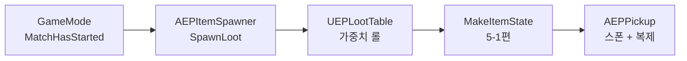

📌 **EmploymentProj 5단계 루팅·인벤토리** 두 번째 글입니다.
[👾 깃허브](https://github.com/SoftHamzzi/UE5-EmploymentProj) ·
[📚 시리즈 목차](/devlog/EP_Main) ·
[← 5-1. 데드코드였던 아이템 계층 되살리기](/devlog/EP_Loot-1)
{: .notice--info}

---

## 이 편에서 만드는 것



기획서의 등급 확률은 일반 50 / 고급 30 / 희귀 15 / 전설 5다. 이 숫자를 **데이터로** 표현하고, 매치 시작 시 맵에 뿌린다.

---

## 1. 루트 테이블: 가중치 + 중첩

```cpp
USTRUCT(BlueprintType)
struct FEPLootEntry
{
    GENERATED_BODY()

    UPROPERTY(EditAnywhere, meta = (ClampMin = "0.0"))
    float Weight = 1.f;

    // ItemId와 SubTable 중 하나만 채운다. SubTable이 유효하면 재귀 롤
    UPROPERTY(EditAnywhere)
    FName ItemId;

    UPROPERTY(EditAnywhere)
    TObjectPtr<UEPLootTable> SubTable;
};
```

```
LT_Floor_Common          (루트. EmptyWeight 있음)
├─ SubTable: LT_Rarity_Common      Weight 50
├─ SubTable: LT_Rarity_Uncommon    Weight 30
├─ SubTable: LT_Rarity_Rare        Weight 15
└─ SubTable: LT_Rarity_Legendary   Weight  5
```

**수량 필드가 없다.** 스택이 없으므로 롤 결과는 아이템 하나다. "탄약 20~60발"은 수량이 아니라 **탄약상자 하나의 `Charges`**이고, 그 초기값은 5-1편의 `InitState()`가 정한다. 루트 테이블이 아이템 타입별 상태를 알게 하지 않는다.

### `EmptyWeight`는 루트에서만

"아무것도 안 나올" 가중치다. 하위 등급 테이블에도 먹히면 **"일반 등급 50%"를 뽑고 그 안에서 또 빈 결과가 나와 실제 일반 확률이 50% 미만**이 된다. 기획표가 조용히 침식되고 원인을 찾기 어렵다.

등급별로 빈 확률을 다르게 주고 싶으면 하위 테이블에 "아무것도 아님" 엔트리를 명시적으로 넣는다. 의도가 데이터에 드러난다.

### `Depth`를 공개 API에 두지 않았다

```cpp
// 헤더. Depth가 없어서 잘못 부를 방법이 없다
EMPLOYMENTPROJ_API bool RollLootTable(const UEPLootTable* Table, FName& OutItemId);

// .cpp의 static. 번역 단위 밖에서는 이름 자체가 안 보인다
static bool RollInternal(const UEPLootTable* Table, FName& OutItemId, int32 Depth);
```

한 함수에 `int32 Depth = 0` 기본 인자를 두면 호출자가 `RollLootTable(Table, Out, 3)`을 쓸 수 있고, 그러면 `EmptyWeight`가 조용히 무시된다. **컴파일되고, 크래시도 안 나고, 확률만 틀린다.** 제일 찾기 어려운 종류다.

멤버 함수로 두지 않은 이유는 따로 있다. `Table->Roll()`이면 "테이블이 스스로를 굴린다"가 되는데, 실제로는 **여러 테이블을 가로지르며 굴린다.** 주체가 테이블이 아니라 롤 자체다.

### 반환 규약이 두 겹이다

| 반환 | `OutItemId` | 뜻 | 호출부 |
|---|---|---|---|
| `false` | `None` | **데이터 오류.** 널, 깊이 초과, 총 가중치 0, 미기입 엔트리 | 에러 로그 |
| `true` | `None` | **정상.** 루트 `EmptyWeight`가 뽑혔다 | 조용히 스폰 생략 |
| `true` | 유효 | 정상 | 스폰 |

**규약을 호출자 쪽 문장으로만 두면 아무도 안 걸린다.** 빈 `ItemId`를 `true + None`으로 내보내면 스포너가 그걸 "정상적인 빈 결과"로 읽고, 증상은 *"가끔 아이템이 안 나온다"*가 되어 `EmptyWeight`를 의심하며 엉뚱한 데를 판다. 그래서 함수가 직접 걸러 `false`를 반환한다.

### fall-through를 없앤 이유

가중치 롤의 전형적인 형태는 이렇다.

```cpp
for (const FEPLootEntry& E : Table->Entries)
{
    if ((Pick -= E.Weight) < 0.f) return E.ItemId;
}
// 여기 도달하면? "데이터 오류"로 처리하고 싶어진다
```

**도달할 수 있다.** 그것도 흔히.

`FMath::FRand()`는 **`[0, 1]` 닫힌 구간**이다. `GenericPlatformMath.h:635`의 주석이 *"Returns a random float between 0 and 1, **inclusive**"*라고 적혀 있다. `Pick == TotalWeight`면 루프가 끝까지 음수가 안 된다.

**그런데 그건 두 원인 중 하나일 뿐이다.** `TotalWeight`는 **더하면서** 만들고 `Pick`은 **빼면서** 소모한다. float에서 `((T - w₁) - w₂) - … - wₙ`은 `T = Σwᵢ`였어도 정확히 0이 되지 않고 양의 잔차가 남을 수 있다. 즉 `Pick`이 `TotalWeight`와 **정확히 같지 않아도** fall-through한다. 상대 오차(float은 약 1e-7)에 비례하므로 **2⁻²⁴(약 6e-8)보다 오히려 흔하다.**

빈도가 문제가 아니다. 도달하면 **데이터가 정상인데 "테이블이 잘못됐다"는 에러 로그가 뜬다.** 그 로그는 위 반환 규약이 걸고 있는 신뢰의 근거이고, **거짓 양성이 한 번 나오면 그 다음부터 아무도 그 로그를 안 믿는다.**

포인터 하나로 셋이 동시에 닫힌다.

```cpp
const FEPLootEntry* Chosen = nullptr;

for (const FEPLootEntry& E : Table->Entries)
{
    if (E.Weight <= 0.f) continue;          // 가중치 0은 명시적으로 건너뛴다
    Chosen = &E;                            // 마지막 유효 엔트리를 항상 들고 있다
    if ((Pick -= E.Weight) < 0.f) break;
}

if (!Chosen) return false;                  // 유효 엔트리가 하나도 없다 = 진짜 데이터 오류
```

| | |
|---|---|
| 닫힌 구간 + 부동소수 잔차 | 마지막 유효 엔트리를 이미 들고 있어 fall-through가 없다 |
| `Weight <= 0` 엔트리 | 명시적으로 건너뛴다. 원래는 `Pick -= 0 >= 0`으로 **우연히** 건너뛰고 있었다 |
| 빈 `ItemId` | 규약 위반을 `false`로 정직하게 반환 |

### 순환 참조는 저장할 때 잡는다

깊이 상한 8을 걸어뒀지만, 그건 **못 막는 게 아니라 뒤늦게** 막는다. 에러 로그는 **그 테이블이 실제로 뽑힐 때까지** 안 뜬다. 5%짜리 등급 테이블이면 며칠 뒤에 뜰 수도 있다.

그래서 `IsDataValid()`로 앞당겼다.

```cpp
if (bHasId == bHasSub)      // 둘 다 비었거나 둘 다 채워졌다
{
    Context.AddError(/* "ItemId와 SubTable 중 정확히 하나만 채워야 합니다" */);
    Result = EDataValidationResult::Invalid;
}

if (E.SubTable == this)     // 깊이 1 자기 참조
{
    Context.AddError(/* "SubTable이 자기 자신입니다" */);
    Result = EDataValidationResult::Invalid;
}
```

**에디터에서 `LT_A → LT_B → LT_A`로 엮는 실수는 반드시 나오고, 방어가 없으면 스택 오버플로로 에디터가 통째로 죽는다.**

그리고 5-1편의 사고를 반복하지 않으려고 `GetPrimaryAssetId()`에 `final`을 붙였다.

```cpp
virtual FPrimaryAssetId GetPrimaryAssetId() const override final
{ return FPrimaryAssetId(TEXT("LootTable"), GetFName()); }
```

> **`final`과 "코드 먼저, 에셋 나중" 순서는 서로 다른 실패를 막는다.**
>
> | | 막는 것 |
> |---|---|
> | `final` | 하위 클래스가 **다른 타입 문자열**을 반환하는 것 |
> | 순서 | 타입이 등록되기 **전에 저장된** 에셋에 엉뚱한 태그가 구워지는 것 |
>
> `final`을 붙여도 컴파일 전에 `LT_` 에셋을 만들면 그대로 당한다.

---

## 2. 스포너: 빌보드를 루트로 삼으면 안 된다

레벨에 배치하는 마커 액터라 아무것도 안 보여도 된다. 그런데 에디터에서 위치를 잡으려면 빌보드가 필요하다.

**처음에 빌보드를 `RootComponent`로 삼으려 했다. 그러면 PIE에서만 멀쩡하다.**

```cpp
// UObjectGlobals.cpp:6036-6050
UObject* FObjectInitializer::CreateEditorOnlyDefaultSubobject(...) const
{
#if WITH_EDITOR
    if (GIsEditor) { ... return EditorSubobject; }
#endif
    return nullptr;                 // ★
}
```

**`WITH_EDITOR`가 아니라 `GIsEditor`까지 본다.** 루트가 null이 되면,

```cpp
// Actor.h:4461  AActor::TemplateGetActorLocation
return (RootComponent != nullptr) ? RootComponent->GetComponentLocation() : FVector::ZeroVector;
```

**`GetSpawnPoint()`가 조용히 원점을 반환한다.** 전 맵의 루트가 월드 원점 한 곳에 쌓인다.

| 실행 방식 | `GIsEditor` | 빌보드 |
|---|---|---|
| PIE | `true` | 있다. **버그가 안 보인다** |
| **Standalone Game** | **`false`** | **없다. 루트 null** |
| 쿡한 패키지 | `false` | 없다. 루트 null |

엔진의 같은 종류 액터가 정확히 이래서 두 겹이다.

```cpp
// TargetPoint.cpp:15-21
USceneComponent* SceneComponent = CreateDefaultSubobject<USceneComponent>(TEXT("SceneComp"));
RootComponent = SceneComponent;                          // 항상 있다
#if WITH_EDITORONLY_DATA
    SpriteComponent = CreateEditorOnlyDefaultSubobject<UBillboardComponent>(TEXT("Sprite"));
    SpriteComponent->SetupAttachment(SceneComponent);    // 붙일 뿐, 루트가 아니다
#endif
```

같은 형태로 맞췄다.

### 뿌린 것만 지운다

```cpp
TArray<TWeakObjectPtr<AEPPickup>> SpawnedPickups;
```

`ClearLoot()`이 월드의 모든 `AEPPickup`을 순회해 지우면 **플레이어가 버린 아이템까지 사라진다.** 버리기는 다음 단계에 들어오지만, 그때 고치려면 이 구조를 다시 본다.

약참조인 이유는 하나 더 있다. 이미 주워진 픽업은 파괴됐으므로 강참조로 들면 GC를 막는다.

### 스폰 시점은 GameMode가 정한다

```cpp
void AEPGameMode::HandleMatchHasStarted()
{
    for (TActorIterator<AEPItemSpawner> It(GetWorld()); It; ++It)
        It->SpawnLoot();

    Super::HandleMatchHasStarted();   // ← 여기서 RestartPlayer + NotifyBeginPlay
    ...
}
```

**루프가 `Super::` 앞이라는 게 핵심이다.** `AGameMode::HandleMatchHasStarted`(`GameMode.cpp:203-221`)가 그 안에서 대기 중인 플레이어를 리스타트시킨다. 뒤에 두면 플레이어가 이미 서 있는 자리에 아이템이 스폰되어 겹칠 수 있고, "시작 직후 잠깐 맵이 비어 있는" 창이 생긴다.

**스포너 `BeginPlay`에서 굴리지 않는 이유:** 매치 시작 전에 이미 아이템이 깔려 있게 되고, 라운드 재시작 시 재스폰 경로가 없다. 스포너는 `SpawnLoot()` / `ClearLoot()` 둘만 노출하고 호출 시점은 GameMode가 정한다. 테스트용 재굴림(`EP.Loot.Respawn`)이 공짜로 따라온다.

---

## 3. 픽업: 무엇을 복제하고 무엇을 숨기는가

```cpp
UPROPERTY(ReplicatedUsing = OnRep_ItemId)
FName ItemId;

// ★ 서버 전용. 복제하지 않는다
UPROPERTY()
FEPItemState State;
```

**`State`를 복제하지 않는 이유는 대역폭이 아니라 정보 은폐다.**

바닥 무기의 잔탄이 복제되면 치트 클라이언트가 릴러번시 범위 내 모든 픽업을 읽어 "어디서 얼마 전에 교전이 있었는지"를 추론한다. **`12/30`짜리 라이플이 바닥에 있다 = 여기서 누가 죽었다.** 기획서가 두 번 명시한 정보 은폐 기둥을 사고로 뒤집는다.

근거를 대역폭에 두지 않은 건 의도적이다. 다음 단계에서 이 필드가 배열(배낭 내용물)로 바뀌면 "작으니까 상관없다"는 논리가 그대로 뒤집힌다. **정보 은폐는 배열이 되어도 그대로다.**

### 그런데 `ItemId`는 반드시 등록해야 한다

```cpp
void AEPPickup::GetLifetimeReplicatedProps(TArray<FLifetimeProperty>& OutLifetimeProps) const
{
    Super::GetLifetimeReplicatedProps(OutLifetimeProps);

    DOREPLIFETIME(AEPPickup, ItemId);
    // State는 여기 없다. 없는 것이 의도다
}
```

**`ReplicatedUsing = OnRep_ItemId`만 붙이는 것으로는 복제되지 않는다.** 그 지정자는 *"복제되면 이 함수를 불러라"*를 정할 뿐이고, 복제 여부를 정하는 건 이 등록이다.

### 메시 적용을 `OnRep_`에만 두면 서버 창에서 안 보인다

**`OnRep_`은 복제를 받는 쪽에서만 불린다.** 서버에서는 값을 직접 대입하므로 호출되지 않는다.

PIE 기본 넷 모드가 Play As Listen Server이므로 **서버 창에서만 픽업이 안 보인다.** 증상이 "클라에서는 보이는데 서버에서는 안 보인다"라 방향을 잡기 어렵다.

적용 함수를 빼고 두 경로에서 부른다.

```cpp
void AEPPickup::InitPickup(FName InItemId, const FEPItemState& InState)
{
    ItemId = InItemId;
    State  = InState;
    ApplyVisual();      // 서버 경로. 리슨서버/스탠드얼론의 로컬 화면
}

void AEPPickup::OnRep_ItemId()
{
    ApplyVisual();      // 클라이언트 경로
}
```

> **두 증상을 가르는 질문은 하나다.** *"서버 창에는 보이는가?"* 보이면 `DOREPLIFETIME` 누락, 안 보이면 `ApplyVisual` 누락이다. 증상이 정반대라 헷갈린다.

`ApplyVisual()` 안에서는 플레이스홀더를 먼저 깔고 실제 메시를 비동기로 로드한다. 로드 지연 중에 투명한 픽업이 뜨지 않게 하기 위해서다. 그리고 데디케이티드 서버는 조기 반환한다.

```cpp
if (IsNetMode(NM_DedicatedServer)) return;
```

**이 가드는 "서버냐"가 아니라 "화면이 있느냐"를 판정한다.**

비동기 콜백은 `CreateWeakLambda`로 만든다. 로드가 도착하기 전에 다른 플레이어가 먼저 주워 픽업이 파괴되면 일반 람다는 죽은 객체를 건드린다.

### 콜리전을 지금 정하지 않으면 이 단계 안에서 바로 보인다

C++로 만든 `UPrimitiveComponent`의 기본 프로파일은 **`BlockAll`**이다.

```cpp
// PrimitiveComponent.cpp:356 (생성자)
SetCollisionProfileName(UCollisionProfile::BlockAll_ProfileName);
```

`SetCollisionEnabled(QueryOnly)` **한 줄만으로는 아무것도 안 풀린다.** 그건 물리 시뮬레이션만 끄고 **쿼리는 그대로 막는다.** 캐릭터 이동 스윕이 바로 그 쿼리다.

| 채널 | 손대지 않은 픽업 | 결과 |
|---|---|---|
| `Pawn` | **Block** | **플레이어가 바닥 아이템에 걸리고 올라탄다** |
| `Visibility` | **Block** | 접지 트레이스가 **먼저 뿌린 픽업**에 걸려 다음 픽업이 그 위에 얹힌다 |
| `WeaponTrace` | Ignore | 총알은 안 막힌다. 그 채널의 `DefaultResponse`가 `Ignore`라서 |

그래서 전 채널을 닫았다.

```cpp
Mesh->SetCollisionEnabled(ECollisionEnabled::QueryOnly);
Mesh->SetCollisionObjectType(ECC_WorldDynamic);        // 런타임 스폰물. 기본값은 WorldStatic이다
Mesh->SetCollisionResponseToAllChannels(ECR_Ignore);   // 아무것도 막지 않는다
```

**다음 편에서 상호작용 채널이 생기면 정확히 한 줄만 연다.** 이 단계는 전부 닫아두는 게 맞다. 그리고 이 단계가 검증 가능한 완료 조건을 하나 얻는다. *"쏴도 안 막히고 밟아도 안 걸린다."*

---

## 4. Dormancy: 왜 멀어져도 안 사라지는가

바닥 아이템이 수백 개인 게임이다. 매 프레임 복제 후보에 오르면 안 된다.

```cpp
NetDormancy = DORM_Initial;
SetNetCullDistanceSquared(25000000.f);   // 5000cm의 제곱
SetNetUpdateFrequency(1.f);
```

> **단위 함정.** `NetCullDistanceSquared`의 기본값은 `225000000`(= 15000cm의 제곱)이다. 여기에 `5000`을 그대로 넣으면 컬링 거리가 √5000 ≈ **70cm**가 되어 픽업이 코앞에서만 보인다.

### `DORM_Initial`인데 "초기 휴면"이 아니다

문서를 쓰면서 확인해 보니 **결론은 맞는데 이유가 틀려 있었다.**

```cpp
// NetDriver.cpp:8347
bool UNetDriver::IsDormInitialStartupActor(AActor* Actor)
{
    return Actor && Actor->IsNetStartupActor() && (Actor->NetDormancy == DORM_Initial);
}
// EngineTypes.h:3370. "This actor is initially dormant for all connection if it was placed in map."
```

**`DORM_Initial`의 특별 취급은 맵에 배치된 액터에만 적용된다.** 스폰된 픽업은 `IsNetStartupActor()`가 false라 여기 안 걸린다. 정상 네트워크 액터 리스트에 들어가고, `ShouldActorGoDormant`가 `!Channel`이면 false를 반환하므로 **채널이 열려 한 번 복제된 뒤에야** 휴면이 시작된다.

즉 "초기 1회 복제 후 휴면"은 결과적으로 맞지만, **`DORM_Initial`이라서가 아니라 동적 스폰이라 `DORM_Initial`이 적용되지 않기 때문**이다. 여기서는 `DORM_DormantAll`을 써도 동작이 같다.

### 한 번 본 픽업은 멀어져도 클라에 남는다

처음엔 버그로 의심했다. **정상이다.** 그리고 이게 이 설정의 목적이다.

**결정하는 건 "채널이 닫혔는가"가 아니라 "왜 닫혔는가"다.**

```cpp
// DataChannel.cpp:2691-2698  UActorChannel::CleanUp
else if (Dormant && (CloseReason == EChannelCloseReason::Dormancy) && !Actor->GetTearOff())
{
    Connection->Driver->ClientSetActorDormant(Actor);   // ★ 액터를 살려둔다
    bWasDormant = true;
}
else if (...)
{
    // Destroy the actor                                 ← 그 외의 이유면 클라에서 파괴
```

| 닫힌 이유 | 클라 결과 |
|---|---|
| `Relevancy` (멀어져서) | **액터 파괴.** 다시 가까이 가면 채널 재생성 + 초기 번들 재전송 |
| `Dormancy` (다 보내서) | **액터 유지.** 채널만 닫히고 화면엔 그대로 |

픽업은 **릴러번시로 닫히기 전에 휴면으로 먼저 닫힌다.** 설정이 없으면 이 액터는 릴러번시 경로로 가고, 멀어질 때마다 사라졌다 나타나며 그때마다 초기 번들을 다시 받는다. **팝핑과 대역폭 둘 다 여기서 갈린다.**

정리하면 이렇다.

- **아직 못 본 픽업** → 컬링이 작동한다. 채널이 없으니 릴러번시 검사를 받고, 5000cm 밖이면 클라에 존재하지 않는다
- **한 번 본 픽업** → 채널은 닫혔지만 액터는 살아 있고 **대역폭은 0이다**

> 서버 루프 위치로 설명하려 들면 틀린다. 휴면으로 채널이 닫히면 다음 패스에서 `if (!Channel)` 분기에 다시 들어가므로 **릴러번시 검사에는 도달한다.** 클라에서 안 사라지는 이유는 서버가 검사를 건너뛰어서가 아니라 **클라가 이미 `ClientSetActorDormant`로 유지 판정을 받았기 때문**이다.

### 파괴는 별도 경로로 나간다

휴면 중이면 채널이 없는데 어떻게 "주워졌다"가 전달되는가. 엔진이 그 경우를 따로 처리한다.

> *"Make a new destruction info if necessary. It is necessary if the actor is dormant or recently dormant because **even though the client knew about the actor at some point, it doesn't have a channel to handle destruction.**"* (`NetDriver.cpp:4336-4356`)

채널이 **한 번도 열린 적 없는** 클라에는 아무것도 안 보낸다. 클라가 애초에 모르므로 무해하다.

### 이 설계가 없앤 함정 하나

스택이 있던 설계에서는 부분 획득 시 `Quantity`를 낮추고 `FlushNetDormancy()`를 불러야 했다. 빠뜨리면 "서버는 정상인데 클라 화면의 개수만 옛날 값"이라는 재현 까다로운 버그가 났다.

**복제되는 값이 `ItemId` 하나뿐이고 그건 스폰 시점에 정해져 바뀌지 않는다.** 그 호출도 그 함정도 이제 없다.

---

## 5. `InitPickup`은 `SpawnActor`와 같은 프레임에서

**이 단계에서 지켜야 할 유일한 순서 계약이다.**

```cpp
AEPPickup* Pickup = GetWorld()->SpawnActor<AEPPickup>(PickupCls, GetSpawnPoint(), ...);
if (!Pickup) { continue; }

Pickup->InitPickup(RolledId, NewState);   // 같은 프레임
```

프로퍼티 복제는 "값이 바뀔 때 이벤트를 보내는" 게 아니라 **채널을 채우는 시점의 현재 값을 보내는** 것이고, 그 시점은 액터 틱이 전부 끝난 뒤다(`LevelTick.cpp:1900`). 그래서 `SpawnActor`와 `InitPickup` 사이에 **복제가 끼어들 지점이 물리적으로 없다.** 우연히 되는 게 아니라 복제 모델이 그렇게 정의돼 있다.

프레임을 넘기면(타이머, 다음 틱, 비동기 콜백) 클라가 `ItemId = None`을 먼저 받고, 픽업은 휴면에 들어가 **영원히 안 고쳐진다.**

`SpawnActorDeferred`는 필요 없다. 지켜야 할 게 "같은 프레임"뿐이다.

> **위치는 어떻게 맞는가.** `SetReplicateMovement(false)`인데 두 창에서 같은 자리에 보이는 게 모순처럼 읽힌다. **스폰 위치는 프로퍼티 복제가 아니라 액터 채널의 최초 번들에 실려 간다**(`PackageMapClient.cpp:612`, `bReplicateMovement`를 보지 않는다). `SetReplicateMovement(false)`가 끄는 건 이후의 갱신이고, 픽업은 스폰 뒤 안 움직인다.
>
> 다만 위치는 0.1cm 단위로 양자화된다. 두 창의 좌표가 소수점에서 갈리는 건 정상이다.

---

## 6. 픽업 클래스를 설정에 둔 이유

```
스포너 SpawnLoot()      (이번 단계)  ─┐
플레이어 버리기          (다음 단계)  ─┴─→ 같은 클래스를 써야 한다
```

**버리기 경로에는 물어볼 스포너가 없다.** 스포너 단위 `UPROPERTY`로 두면 두 경로가 갈리고, "바닥에 깔린 픽업과 내가 버린 픽업이 다르게 보인다"가 된다.

그래서 `UDeveloperSettings`로 뺐다. 그런데 **타입 선택에서 걸릴 뻔했다.**

### `UPROPERTY(Config)` + `TSubclassOf`는 BP 경로에서 위험하다

```cpp
// UObjectGlobals.cpp:4379-4381. CDO가 만들어지는 순간
if (bIsCDO || Class->HasAnyClassFlags(CLASS_PerObjectConfig))
{
    Obj->LoadConfig(...);
}

// PropertyBaseObject.cpp:593-596. 그 안에서 FClassProperty가 타는 경로
const uint32 LoadFlags = LOAD_NoWarn | LOAD_FindIfFail;
Result = StaticLoadObject(ObjectClass, nullptr, Text, nullptr, LoadFlags, nullptr, true);
```

**지연 로드를 없앤 게 아니라 엔진 초기화 중으로 옮긴 것이다.** BP를 로드하면 그 CDO가 만들어지고, CDO가 하드 참조하는 메시, 머티리얼, 나이아가라가 전부 딸려온다.

**그리고 실패가 조용하다.** `LOAD_NoWarn | LOAD_FindIfFail`이라 경고가 안 뜨고 값은 null이 된다. *"초기화가 너무 이름"*, *"경로 오타"*, *"`.ini`에 안 적음"*이 **전부 같은 증상으로 수렴**하고, 그 증상은 첫 스폰에서야 나타난다.

`TSoftClassPtr`는 경로만 만들고 로드하지 않는다.

```cpp
// PropertySoftObjectPtr.cpp:150-165
FSoftObjectPath SoftObjectPath;
bImportTextSuccess = SoftObjectPath.ImportTextItem(...);    // StaticLoadObject 없음
```

Lyra도 이 자리에서 **쌍**을 쓴다(`LyraUIMessaging.h:32-43`). 런타임 해석본은 `TSubclassOf`, config에 노출되는 쪽은 `TSoftClassPtr`다.

### 폴백을 소비 지점으로 옮겼다

소프트 포인터로 바꾸면 헤더의 `= AEPPickup::StaticClass()` 기본값이 없어진다. 소프트 포인터의 기본값은 빈 경로이고, `.ini`의 빈 값도 값이라 C++ 기본값이 이기지 못한다.

```cpp
UClass* PickupCls = Settings->PickupClass.IsNull()
    ? AEPPickup::StaticClass()                 // .ini 미설정 = 정상
    : Settings->PickupClass.LoadSynchronous();

if (!PickupCls)                                // 설정은 됐는데 로드 실패 = 진짜 오류
{
    UE_LOG(LogTemp, Error, TEXT("[Loot] PickupClass 로드 실패: %s"), *Settings->PickupClass.ToString());
    return;
}
```

| 상태 | 의미 | 처리 |
|---|---|---|
| `IsNull()` | `.ini` 미설정. **정상** | C++ 기본 클래스 |
| `!IsNull()` + 로드 실패 | 경로 오타, 에셋 삭제. **오류** | 에러 로그 후 중단 |
| 로드 성공 | 정상 | 사용 |

**롤 함수의 반환 규약 두 겹과 같은 형태다.** 조용히 한 곳으로 수렴하던 상태들을 갈라 놓는다.

### `BP_Pickup`에 넣을 것과 넣지 말아야 할 것

액터를 BP로 한 겹 감싸는 건 관례다. 다만 **아이템마다 달라지는 걸 여기 넣으면 안 된다.**

| | 어디에 |
|---|---|
| 둥둥 떠서 회전하는 연출 | **`BP_Pickup`.** 액터 수준 |
| 프롬프트 위젯, 오디오 컴포넌트 | **`BP_Pickup`** |
| 월드 메시 | ❌ Definition |
| **획득 사운드 / VFX** | ❌ **Definition.** 총 줍는 소리와 붕대 줍는 소리가 같으면 안 된다 |
| 등급별 이펙트 | ❌ DT의 `Rarity`로 분기 |

Lyra가 이 경계를 명확히 보여준다. `ULyraPickupDefinition`이 `DisplayMesh` / `PickedUpSound` / `PickedUpEffect`를 **DataAsset에** 들고 있고, **액터 클래스 필드는 없다.**

이 표가 없으면 나중에 누가 `BP_Pickup`에 획득 사운드를 넣고, 그러면 **아이템마다 BP를 만들게 된다.**

---

## 함정 정리

| 함정 | 증상 |
|---|---|
| **빌보드를 `RootComponent`로** | PIE는 멀쩡, **Standalone과 패키지에서만** 전 스포너가 월드 원점에 쌓인다 |
| **가중치 롤 fall-through** | 데이터가 정상인데 에러 로그가 뜬다. 그러면 그 로그를 아무도 안 믿게 된다 |
| `Depth`를 공개 인자로 | `EmptyWeight`가 조용히 무시된다. 확률만 틀린다 |
| `EmptyWeight`를 하위 테이블에 | 기획표의 등급 확률이 침식된다 |
| `DOREPLIFETIME` 누락 | **클라 창에서만** 빈 픽업. `ReplicatedUsing`만으로는 복제 안 된다 |
| 메시 적용을 `OnRep_`에만 | **서버 창에서만** 안 보인다. 위와 증상이 정반대 |
| 콜리전 기본값 `BlockAll` 방치 | 플레이어가 바닥 아이템에 걸린다. 접지 트레이스도 서로 얹힌다 |
| `NetCullDistanceSquared`에 비제곱값 | 컬링 거리가 70cm가 된다 |
| `InitPickup`을 다음 프레임으로 | 클라가 `None`을 받고 휴면. **영원히 안 고쳐진다** |
| `UPROPERTY(Config)` + `TSubclassOf`에 BP 경로 | CDO 생성 시점 동기 로드. **실패가 조용하다** |
| 5.5 deprecated 필드 직접 대입 | `NetCullDistanceSquared` / `NetUpdateFrequency`는 세터를 쓴다 |

---

## 결과

PIE 2인에서 확인한 것.

- 서버와 클라가 **같은 아이템을 같은 위치에서** 본다
- `EP.Loot.Respawn` → 기존 픽업이 정리되고 새로 굴려진다
- `WorldMesh`가 없는 아이템도 플레이스홀더로 보인다
- 픽업을 향해 쏴도 총알이 안 막히고, 위를 걸어도 안 걸린다
- 어떤 스포너도 참조하지 않는 테이블도 이름으로 찾아진다

### 검증하지 못한 것 하나

**`EP.Loot.RollTable`이 아무것도 안 찍는다.**

```cpp
// EPLootDebugCommands.cpp:51-68
int32 Empty = 0, Failed = 0;
TMap<FName, int32> PerItem;
TArray<int32> PerRarity;
for (int32 i = 0; i < Count; i++) { ... 집계 ... }
}          // ← 69행. 람다가 여기서 끝난다. 출력이 한 줄도 없다
```

**변수가 전부 대입되므로 미사용 경고도 안 뜬다.** 커맨드는 정상 실행되고 아무것도 안 찍는다.

그래서 **등급 비율 50/30/15/5가 실제로 나오는지 아직 모른다.** 중첩 롤과 `EmptyWeight` 규칙이 확률적으로 맞는지 확인하지 못했다.

> 침묵이 증명하는 것도 있다. "LootTable을 찾을 수 없습니다" 에러가 안 떴으므로 **Asset Manager 등록, 에디터 재시작, 에셋 생성이 전부 성공했다.** 실패했다면 그 에러가 떴다.

출력 블록 한 덩어리면 되고, **분모가 `Count`가 아니라 `Count - Empty - Failed`**여야 한다. 빈 결과를 분모에 넣으면 모든 등급 비율이 `EmptyWeight`만큼 눌려 보인다.

**1번을 하기 전에는 "완료"라고 쓰지 않는 편이 낫다.** 확률은 눈으로 못 믿는다.

---

## 다음

F키로 줍는다. 상호작용 인터페이스, 어빌리티로 갈 것인가 서버 RPC로 갈 것인가, 그리고 **F가 딱 한 번만 먹히는 버그**가 5-3편이다.

---

## 참고

- `DOCS/Notes/05/05_Loot_01_Spawner.md`. 구현 전체와 함정표
- `DOCS/Mine/Dormancy.md`. 휴면 메커니즘 전체
- 엔진 `NetDriver.cpp:8347`, `:5386-5440`, `:4336-4356`. 휴면 진입과 파괴 전달
- 엔진 `DataChannel.cpp:2691-2698`. 클라가 액터를 살릴지 죽일지 가르는 지점
- 엔진 `UObjectGlobals.cpp:6036-6050`. 에디터 전용 서브오브젝트
- 엔진 `PrimitiveComponent.cpp:356`. 기본 콜리전 프로파일
