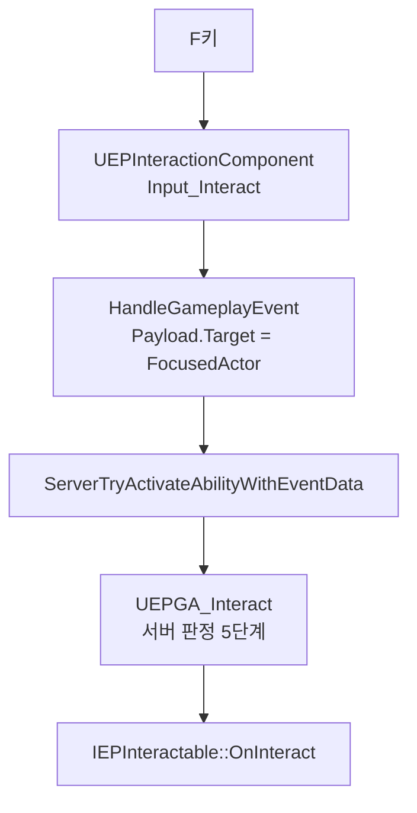

📌 **EmploymentProj 5단계 루팅·인벤토리** 세 번째 글입니다.
[👾 깃허브](https://github.com/SoftHamzzi/UE5-EmploymentProj) ·
[📚 시리즈 목차](/devlog/EP_Main) ·
[← 5-2. 바닥에 아이템 뿌리기](/devlog/EP_Loot-2)
{: .notice--info}

---

## 이 편의 범위

바닥의 픽업을 **F로 줍는다.** 아직 인벤토리가 없으므로 픽업은 파괴되고 로그만 남는다.

기능은 작은데 **이번 단계에서 만드는 것 중 가장 오래 쓰이는 자산이다.** 픽업, 컨테이너, 자판기, 탈출 지점이 전부 같은 진입점을 쓰게 된다.



---

## 1. 인터페이스를 처음부터 4함수로

```cpp
class EMPLOYMENTPROJ_API IEPInteractable
{
    GENERATED_BODY()
public:
    virtual FText GetInteractText() const = 0;

    // 가능 여부 + 불가 사유. 프롬프트 표시와 서버 판정 양쪽에서 쓴다
    virtual bool CanInteract(AEPCharacter* Interactor, FText& OutReason) const = 0;

    // 채널링 시간(초). 0이면 즉시
    virtual float GetInteractDuration() const { return 0.f; }

    // ★ 서버에서만 호출된다. 성공 여부를 돌려준다
    virtual bool OnInteract(AEPCharacter* Interactor, FText& OutReason) = 0;
};
```

지금 구현체는 픽업 하나다. 그런데 셋을 미리 넣었다.

| 함수 | 픽업(이번) | 컨테이너 | 자판기 | 탈출 |
|---|---|---|---|---|
| `GetInteractText` | "줍기 — 붕대" | "검색" | "1000원 투입" | "탈출" |
| `CanInteract` | 재획득 쿨다운 / 인벤 여유 | 이미 검색됨 | 돈 부족 | 조건 미달 |
| `GetInteractDuration` | `0` | 검색 N초 | `5` | 대기 시간 |
| `OnInteract` | 인벤 삽입 후 파괴 | 내용물 UI 개방 | 돈 차감 + 배출 | 탈출 처리 |

**기획서에 이름이 이미 적혀 있는 확장점이라 지금 만든다.** 나중에 인터페이스를 넓히면 이미 구현한 모든 클래스를 건드려야 한다.

### `OnInteract`을 `void`로 두면 안 되는 이유

다음 단계에서 인벤토리가 붙으면 **`OnInteract`은 실패할 수 있다.**

- 픽업: 가방에 자리가 없다
- 컨테이너: 다른 플레이어가 방금 열었다
- 자판기: 차감 직전에 돈이 빠졌다

`void`를 반환하면 호출자는 실패를 알 수 없고, 실패 회신을 보낼 근거가 없다.

**지금 `bool`로 바꾸는 비용은 0이고, 구현체가 넷으로 늘어난 뒤 바꾸는 비용은 전부 재작업이다.** 위 표가 이미 네 구현체를 예고하고 있다.

같은 이유로 `GetInteractDuration()`도 선언만 해뒀다. **읽는 코드가 0곳이다.** 컨테이너 검색 시간이 들어올 때 처음 소비된다. 지금 지우면 그때 인터페이스를 다시 뜯는다.

> **인자 이름을 `Instigator`로 쓰지 않았다.** `AActor::Instigator`(`APawn*`)가 이미 있어서 액터 멤버 함수 안에서 **멤버를 가린다.** 컴파일은 되지만 읽는 사람이 매번 확인해야 한다. `Interactor`로 쓴다.

인터페이스를 `BlueprintNativeEvent`로 열지 않은 것도 의도다. 판정은 **서버 권한 로직**인데, BP에서 오버라이드할 수 있게 열면 판정을 BP로 옮기고 싶은 유혹이 생기고, 그러면 서버 검증이 그래프로 흩어진다.

---

## 2. 서버 RPC를 새로 만들지 않았다

처음에는 `Server_Interact` 직접 RPC로 갈 생각이었다. 단순하니까.

**그러면 아래를 손으로 다시 만든다.**

| GAS가 이미 주는 것 | 직접 RPC에서 다시 만들 것 |
|---|---|
| `ActivationBlockedTags`에 `State.Dead`. **이미 어빌리티 세 곳에 있다** | 죽은 상태 확인 |
| `ActivationBlockedTags` / `ActivationRequiredTags` | 사격 중, 재장전 중 상호작용 금지 |
| GE 쿨다운 | 다음 단계의 재획득 쿨다운을 손으로 만든 타임스탬프 맵으로 |
| `CastTime` + `State.Casting` + 시전 게이지 | 채널링. 4-5편에서 이미 만들어 뒀다 |
| `NetSecurityPolicy` 검사 | 조작 클라 차단 |

**그리고 "즉시는 RPC, 채널링은 GAS"는 절충이 아니라 모순이다.** 경계가 `GetInteractDuration()`이라는 **데이터 값**에 달려 있어서, 자판기의 duration을 5에서 0으로 바꾸면 그 대상의 네트워크 경로가 통째로 바뀐다. 컨테이너가 들어오면 두 경로가 **동시에** 살아 있게 되고, 그때 "실패 회신은 어느 쪽으로?", "선점은 예측 실행에서도 도는가?"를 두 번 답해야 한다.

**순증 비용은 어빌리티 클래스 하나다.** 그 자리에는 이미 형제가 셋 있다.

> 참고로 이 판단을 다음 단계에서 한 번 좁혔다. 처음엔 *"게임플레이 입력의 진입점은 어빌리티 하나다"*라고 일반화했는데, **버리기(`int32 EntryId`)에 적용하면 `FGameplayEventData`에 정수 자리가 없어 인코딩 규약을 사게 된다.** 지금 문장은 이렇다.
>
> ① **월드 상호작용**, 그리고 **시간·비용·애님이 붙는 행동** → 어빌리티
> ② **서버가 이미 소유한 상태의 변경 요청** → 소유 컴포넌트의 서버 RPC
>
> **상호작용은 ①이다.** 이 절의 판정은 그대로 유효하다.

### 대상은 `FGameplayEventData::Target`으로 간다

`FGameplayAbilityTargetData`를 만들 필요도, 어빌리티가 서버에서 다시 트레이스할 필요도 **없다.**

```cpp
// GameplayAbilityTypes.h:256
TObjectPtr<const AActor> Target;

// AbilitySystemComponent.h:1726. Payload 구조체 전체가 서버로 간다
void ServerTryActivateAbilityWithEventData(
    FGameplayAbilitySpecHandle AbilityToActivate, bool InputPressed,
    FPredictionKey PredictionKey, FGameplayEventData TriggerEventData);
```

```cpp
void UEPInteractionComponent::Input_Interact()
{
    if (!FocusedActor) return;
    // ...
    FGameplayEventData Payload;
    Payload.EventTag   = EmpGameplayTags::TAG_Ability_Interact;
    Payload.Instigator = Owner;
    Payload.Target     = FocusedActor;   // ★ 대상 전달의 전부

    ASC->HandleGameplayEvent(EmpGameplayTags::TAG_Ability_Interact, &Payload);
}
```

**대상은 클라가 정하고 서버는 그 대상을 받는다.** 이 프로젝트가 세운 *"클라는 요청, 서버가 결정"* 원칙이 그대로다. 서버가 재트레이스해서 대상이 갈리는 갈래는 아예 생기지 않는다.

> Lyra는 이 길을 쓰지 않고 **서버도 자기 라인 트레이스를 돌린다**(`AbilityTask_WaitForInteractableTargets_SingleLineTrace.cpp:47-74`, 서버에서도 도는 근거는 `AbilityTask_WaitForInteractableTargets.cpp:38`의 *"Server and launching client only"*). 이유는 Lyra의 F키가 어빌리티 *활성화*가 아니라 이미 떠 있는 어빌리티의 *트리거*이기 때문이다. `LyraGameplayAbility_Interact.cpp:24`가 `ActivationPolicy = OnSpawn`이라 스폰 순간 켜져서 계속 스캔하고, F가 부르는 `TriggerInteraction()`(`:78-122`)은 **대상을 인자로 받지 않고** 스캐너가 채워둔 `CurrentOptions[0]`을 꺼내 쓴다. **우리는 F키가 곧 활성화라 파라미터가 자연스럽게 실린다.**

### `LocalPredicted`는 예측이 아니라 라우팅 스위치다

```cpp
NetExecutionPolicy = EGameplayAbilityNetExecutionPolicy::LocalPredicted;
```

**이 어빌리티는 아무것도 예측하지 않는다.** 클라 인스턴스는 첫 줄에서 즉시 종료한다.

```cpp
if (!ActorInfo->IsNetAuthority())
{
    EndAbility(Handle, ActorInfo, ActivationInfo, false, false);
    return;
}
```

예측을 안 하는 이유는 명확하다. 선점 경쟁이 있어서 **예측이 틀리면 픽업이 사라졌다 다시 나타난다.** 그리고 이 단계에는 예측으로 가릴 지연이 없다. 애님도 이펙트도 없다.

**그런데도 `LocalPredicted`가 아니면 동작하지 않는다.** `ServerOnly`나 `ServerInitiated`면 클라에서 `AbilitySystemComponent_Abilities.cpp:1755`가 **RPC를 보내기도 전에** `return false`한다. 정책이 곧 "서버로 갈 것인가"의 스위치다.

> 순서는 안전하다. 서버 RPC(`:1923`)가 로컬 `CallActivateAbility`(`:1951`)보다 **먼저** 나간다. 클라 인스턴스가 즉시 종료해도 요청은 이미 떠난 뒤다.

### `AbilityTriggers`이지 `AbilityTags`가 아니다

```cpp
FAbilityTriggerData Trigger;
Trigger.TriggerTag    = EmpGameplayTags::TAG_Ability_Interact;
Trigger.TriggerSource = EGameplayAbilityTriggerSource::GameplayEvent;
AbilityTriggers.Add(Trigger);
```

`HandleGameplayEvent`가 읽는 건 `GameplayEventTriggeredAbilities`이고, 그 맵을 채우는 건 `AbilityTriggers`다(`AbilitySystemComponent_Abilities.cpp:560`). **두 레지스트리는 별개다.** `AbilityTags`에 넣으면 F키가 아무 반응도 없다.

---

## 겪은 문제 1: F가 딱 한 번 먹히고 그 뒤로 영영 안 먹힌다

첫 픽업은 정상적으로 주워진다. 두 번째부터 아무 반응이 없다. 로그는 이랬다.

```
LogTemp: [Pickup] Backpack_Small 획득
LogAbilitySystem: Display: InternalServerTryActivateAbility: Rejecting ClientActivation of
    Default__BP_GA_Interact_C with PredictionKey [321/0]. InternalTryActivateAbility failed:
                                                                                    ↑ 비어 있다
```

**실패 태그가 비어 있는 게 이 경로의 지문이었다.**

`ActivationBlockedTags`, 코스트, 쿨다운 거부는 전부 `InternalTryActivateAbilityFailureTags`를 채운다. 안 채우는 경로가 따로 있다는 뜻이다.

### 원인: `Super::ActivateAbility`

```cpp
// 초기 구현 (버그)
Super::ActivateAbility(Handle, ActorInfo, ActivationInfo, TriggerEventData);   // EndAbility 대신
```

부모를 부르면 알아서 정리되겠거니 했다. **아니었다.**

`UGameplayAbility::ActivateAbility`의 네이티브 분기(`GameplayAbility.cpp:904-934`)는 **주석뿐이고 실행문이 하나도 없다.** 그래서 서버 인스턴스가 영영 종료되지 않는다.

그 다음이 조합의 문제다.

```
InstancingPolicy = InstancedPerActor
bRetriggerInstancedAbility == false     // 선언만 있고 모듈 전체에서 대입되는 곳이 없다
```

`bRetriggerInstancedAbility`는 제로 초기화라 `false`다. 그래서 아직 끝나지 않은 인스턴스에 대해 `:1821`에서 재활성화가 거부된다. **첫 발동이 인스턴스를 영구 점유한 것이다.**

수정은 한 줄이었다.

```cpp
EndAbility(Handle, ActorInfo, ActivationInfo, /*bReplicateEndAbility*/ true, /*bWasCancelled*/ false);
```

> **교훈은 "부모를 부르지 마라"가 아니다.** `Super::`가 무엇을 하는지 확인하지 않고 부른 것이다. 이 경우 부모 구현은 주석 블록이었다.

---

## 겪은 문제 2: 느낌표 하나가 빠져 있었다

```cpp
// 버그
if (TryInteract(TriggerEventData) && PC)
{
    PC->Client_OnInteractFailed(Reason);
}
```

**성공했을 때 실패 회신을 보내고 있었다.**

그런데 **증상이 없었다.** 성공 경로에서는 `Reason`이 비어 있고, 수신 쪽이 `IsEmpty()`로 조기 반환하기 때문이다.

```cpp
void AEPPlayerController::Client_OnInteractFailed_Implementation(const FText& Reason)
{
    if (Reason.IsEmpty()) return;   // ← 여기서 조용히 나간다
    ...
}
```

**결과적으로 실패 사유만 영영 안 떴다.** 실패해도 화면에 아무것도 안 나온다.

기능이 안 되는 버그였다면 첫 테스트에서 잡혔을 텐데, 이건 **"안 되는 기능이 원래 없던 것처럼 보이는" 부류**였다. `Client_OnInteractFailed`를 만든 이유 자체가 *"실패를 조용히 삼키지 않는다"*였는데 그게 조용히 삼켜졌다.

가드가 버그를 가린 셈이다. 다만 그 가드 자체는 남긴다. 빈 문자열로 프롬프트를 띄우는 게 더 나쁘다.

---

## 3. 서버 판정 5단계

```
0. IsNetAuthority() 아니면 즉시 EndAbility
1. Target이 유효한가 (IsValid && !IsActorBeingDestroyed)
2. Target이 IEPInteractable을 구현하는가       ← 아무 액터나 보낼 수 있다
3. ★ 거리 재검증
     DistSq <= (InteractRange + ServerRangeTolerance)^2
4. ★ CanInteract(Interactor, OutReason) == true 인가
5. OnInteract(Interactor, OutReason) 이 true를 돌려줬는가

하나라도 실패 → Client_OnInteractFailed(OutReason). 조용히 return 하지 않는다
```

**3과 4를 빠뜨리면 서버 검증이 사실상 없어진다.** 클라이언트가 프롬프트를 안 그릴 뿐 요청은 그대로 통과한다.

특히 다음 단계의 재획득 쿨다운이 `CanInteract()`로 구현되므로, 4단계가 없으면 **클라만 프롬프트를 회색으로 그리고 서버는 그냥 통과시킨다.**

### 원래 8단계였는데 줄었다

처음엔 "선점 확인"과 "선점 마킹"을 판정 절차에 따로 세워 뒀다. **어빌리티가 그 두 줄을 쓸 수 없다.**

```cpp
// EPPickup.h
private:
    bool bClaimed = false;
```

`bClaimed`는 픽업의 `private`이고, 애초에 인터페이스에는 그 개념이 없다. **자판기에는 `bClaimed`가 아예 없다.**

**호출자가 알아야 하는 건 "선점됐는가"가 아니라 "된다 / 안 된다"뿐이다.**

- 확인은 이미 `CanInteract()`가 한다. 4단계에 흡수되므로 중복이었다
- 마킹은 `OnInteract()`의 첫 줄에서 한다. **대상만이 자기 선점 규칙을 안다**
- 되돌리기도 같은 함수 안이다. **되돌릴 값을 세운 함수가 되돌린다**

같은 이유로 `OnInteract` 안에 `HasAuthority()` 가드를 또 넣지 않았다. 그러면 방어가 두 곳으로 흩어지고, 구현체가 넷이 되면 넷 다 넣어야 한다. **인터페이스 주석의 `// ★ 서버에서만 호출된다`가 계약이고, 그 계약을 지키는 곳은 호출자 하나다.**

### 같은 프레임에 두 요청이 들어와도 안전한 이유

수신 RPC는 `UNetDriver::TickDispatch` → `UActorChannel::ProcessBunch` → `ProcessEvent` 경로로 **게임 스레드에서 차례로** 실행되고, `CanInteract` → `OnInteract` 사이에 양보 지점이 없다.

**단계를 쪼개서 안전했던 게 아니라 원래 이것 때문이었다.**

> **다만 이 보장은 `OnInteract`이 동기적으로 끝날 때만이다.** 컨테이너가 *"내용물 UI를 연다"*로 구현되면 `OnInteract`은 즉시 반환하고 실제 트랜잭션은 여러 프레임 뒤에 끝난다. 그때는 `bClaimed`가 아니라 **"누가 열어 두었는가"**라는 다른 상태가 필요하다. 지금 만들지는 않고, 같은 함정을 두 번 파지 않으려고 적어둔다.

### 사거리 값은 컴포넌트에 남긴다

```cpp
const UEPInteractionComponent* IC = Interactor->GetInteractionComponent();
const float MaxDistSq = FMath::Square(IC->GetInteractRange() + IC->GetServerRangeTolerance());
```

**어빌리티 CDO에 값을 복제해 두지 않는다.** 한 값을 두 경로가 봐야 하면 둘 다 볼 수 있는 곳에 둔다. 두 곳에 두면 반드시 갈린다.

### 실패 회신은 PlayerController에 있다

**GAS는 실패 *사유*를 주지 않는다.** `ClientActivateAbilityFailed(Handle, PredictionKey)`에는 사유 파라미터가 없고, 실패 태그는 서버 로컬 변수다.

그래서 `AEPPlayerController`에 뒀다. 4-6편의 `Client_OnKill`과 같은 줄이고, 실패 문구를 띄울 `HUDWidget`이 거기 `private`이라 **다른 선택지가 없다.**

**원칙: 요청은 값이 있는 곳에, 회신은 표시가 있는 곳에.**

> **`FText`를 RPC로 보내는 비용을 알고 쓴다.** `FTextProperty`에는 `NetSerializeItem` 오버라이드가 없어서 **네임스페이스 + 키 + 소스 문자열이 통째로** 나간다. 실패 회신은 실패 1회당 1번이라 허용 가능하다. **다만 이걸 모르고 "프롬프트 텍스트도 서버에서 보내자"로 번지면 그때는 비싸다.** 프롬프트는 0.1초마다 갱신된다.

---

## 4. 틱을 언제 켜는가

탐지는 로컬 클라이언트만 한다. 8인 매치에서 서버가 8개 캐릭터의 트레이스를 매 프레임 도는 건 낭비다.

```cpp
PrimaryComponentTick.TickInterval          = 0.1f;    // 프롬프트는 100ms 지연이 안 느껴진다
PrimaryComponentTick.bStartWithTickEnabled = false;   // 빙의 전에는 안 돈다
SetIsReplicatedByDefault(false);                      // 복제할 프로퍼티가 0개
```

문제는 **켜는 시점**이다.

`IsLocallyControlled()`는 `Controller`를 보고, `Controller`는 `PossessedBy`에서만 채워진다. 그래서 `BeginPlay`와 `PossessedBy`의 **순서**가 문제인데, **그 순서가 상황마다 다르다.**

```cpp
// Actor.cpp:4482
bool bRunBeginPlay = !bDeferBeginPlayAndUpdateOverlaps && (BeginPlayCallDepth > 0 || World->HasBegunPlay());
```

| 경우 | 순서 | `BeginPlay`의 `IsLocallyControlled()` |
|---|---|---|
| **PIE 리슨서버 호스트, 첫 스폰** | `PossessedBy` → `BeginPlay` | ✅ **true. 통과한다** |
| 서버가 보는 원격 클라 폰 | `BeginPlay` → `PossessedBy` | false (어차피 로컬 아님) |
| 소유 클라의 복제 폰 | 보통 `OnRep_Controller` → `BeginPlay` | 보통 true. **보장 아님** |
| **리스폰 (호스트 포함)** | `BeginPlay` → `PossessedBy` | ❌ **false. 여기서 깨진다** |

첫 스폰이 통과하는 건 `AGameMode`의 매치 상태 기계 때문이다.

```
GameMode.cpp:157-160   HandleMatchIsWaitingToStart: if (!ReadyToStartMatch()) NotifyBeginPlay();
                         혼자 시작하면 ready == true → NotifyBeginPlay를 건너뛴다
                         World->HasBegunPlay()는 아직 false
GameMode.cpp:208-215   RestartPlayer(호스트) → 폰 스폰(BeginPlay 지연) → Possess ★
GameMode.cpp:221       NotifyBeginPlay() → 이제서야 폰의 BeginPlay. Controller는 이미 있다
```

엔진 주석이 이 순서를 그대로 말한다. `// First fire BeginPlay, if we haven't already in waiting to start match`(`GameMode.cpp:220`).

리스폰은 반대다. 그때는 `World->HasBegunPlay()`가 이미 true라 스폰 안에서 `BeginPlay`가 즉시 돌고 `Possess`는 나중에 온다.

**즉 "첫 테스트에서 바로 걸린다"가 아니라, 첫 테스트는 통과하고 리스폰에서 깨진다.** 이게 더 나쁘다. **완료 조건이 통과해서 함정이 없다고 판단하고 대응을 지우게 된다.**

### 훅 하나면 된다

엔진에 서버 빙의 / 소유 클라 복제 / **언빙의** 셋을 묶는 가상 함수가 있다.

```cpp
// Pawn.h:382
/** Call to notify about a change in controller, on both the server and owning client. */
ENGINE_API virtual void NotifyControllerChanged();
```

호출 지점이 셋이다. `PossessedBy`(`Pawn.cpp:688`), `OnRep_Controller`(`:622`), `UnPossessed`(`:714`).

```cpp
void AEPCharacter::NotifyControllerChanged()
{
    Super::NotifyControllerChanged();
    if (InteractionComponent) { InteractionComponent->RefreshTickEnabled(); }
}
```

| | `PossessedBy` + `OnRep_Controller` 둘 | `NotifyControllerChanged` 하나 |
|---|---|---|
| 서버 빙의 | ✅ | ✅ |
| 소유 클라 | ✅ | ✅ |
| **언빙의** | ❌ 틱이 켜진 채 남는다 | ✅ |
| 오버라이드 수 | 2 | 1 |
| 기존 오버라이드 건드림 | 두 함수에 한 줄씩 | 안 건드림 |

> **현재 이 프로젝트에는 리스폰 경로가 없다.** `RestartPlayer` 호출이 0건이다. 그래서 지금은 어느 방식으로 짜도 테스트가 통과한다. 대응을 넣는 건 옳지만, **"지금은 안 걸린다"를 알고 넣어야** 나중에 테스트 결과와 문서가 안 싸운다.

---

## 5. 시점을 어디서 가져오는가

```cpp
const FVector Start = Cam->GetComponentLocation();
const FVector Dir   = Owner->GetControlRotation().Vector();
```

`Cam->GetForwardVector()`가 아닌 이유가 둘이다.

1. **한 프레임 stale이다.** 카메라의 `bUsePawnControlRotation` 보정은 `UCameraComponent::GetCameraView()` 안에서만 적용되고(`CameraComponent.cpp:425-436`), 그건 컴포넌트 틱(`TG_PrePhysics`)보다 뒤다
2. **축이 틀어져 있다.** 카메라가 `head` 본에 부착되고 `FRotator(0, 90, -90)` 보정이 박혀 있어서, 부모 본 트랜스폼이 그 상대 회전을 다시 적용한다

`GetActorEyesViewPoint()`도 쓸 수 없다. `APawn::GetPawnViewLocation()`이 `ActorLocation + BaseEyeHeight`라 **본 부착을 무시한다.**

결과적으로 사격 경로(`EPGA_Item_PrimaryUse`)와 **같은 조합**이 됐다. 사격과 상호작용이 같은 광선을 본다.

---

## 6. 채널을 만드는 것만으로는 안 풀린다

`ECC_Visibility`를 재사용하면 벽과 소품이 전부 걸려서 픽업 앞의 잡동사니가 상호작용을 막는다. 그래서 전용 채널을 만든다.

**그런데 새 채널을 `DefaultResponse = ECR_Block`으로 만들면 결과가 똑같다.**

```cpp
// CollisionProfile.cpp:470
FCollisionResponseContainer::DefaultResponseContainer.SetResponse(
    (ECollisionChannel)EnumIndex, CustomChannel.DefaultResponse);
```

**반응을 따로 지정하지 않은 모든 프리미티브가 새 채널도 막는다.** 함정을 피했다고 생각하며 그대로 밟는다.

그러니 새 채널을 만들되 **기본 응답은 뒤집지 않는다.** 번호를 새로 따는 게 해결이 아니라, `DefaultResponse = ECR_Ignore`로 두고 **상호작용 대상만 `Block`으로 여는 것**이 해결이다.

```ini
+DefaultChannelResponses=(Channel=ECC_GameTraceChannel3,DefaultResponse=ECR_Ignore,bTraceType=True,bStaticObject=False,Name="Interact")
```

```cpp
// 5-2편에서 전 채널을 닫아뒀으므로 여기서 정확히 한 줄만 연다
Mesh->SetCollisionResponseToChannel(EP_TraceChannel_Interact, ECR_Block);
```

Lyra도 같은 문안을 쓴다. `LyraStarterGame/Config/DefaultEngine.ini:216`의 커스텀 채널 5개가 **전부 `ECR_Ignore`**다.

### 채널 번호를 소스에서 세면 틀린다

처음에 `GameTraceChannel2`로 적어놨다. **그 번호는 `Projectile`이 이미 쓰고 있었다.**

`EPTypes.h`에는 `Weapon`(Channel1) 상수 하나뿐이라 **소스만 보면 2번이 비어 보인다.** 채널 번호는 `EPTypes.h`가 아니라 `DefaultEngine.ini`에서 센다.

중복시키면 증상이 고약하다. **에디터가 거부하지도, 나중 줄이 이기지도, 둘 다 남지도 않는다.**

```cpp
// CollisionProfile.cpp:401-408. 중복을 보고 RemoveAt + continue
```

`:470`의 `SetResponse`에 **도달하지도 못한다.** 경고는 뜨지만(`LogCollisionProfile`) 엔진 초기화 로그에 묻힌다. 그리고 버려진 쪽의 `bTraceType`이 안 먹으므로 `Channel2`가 오브젝트 타입으로 남는데, `LineTraceSingleByChannel`은 컴파일도 되고 실행도 된다. **트레이스는 채널 번호만 보지 메타데이터를 안 본다.**

증상은 *"상호작용 트레이스가 `Projectile`이 막는 것들을 같이 맞힌다"*로 나온다. 채널 번호를 의심하기 전에 픽업 콜리전부터 파게 된다.

### 알고 남긴 제약

`DefaultResponse = ECR_Ignore`라 **월드 지오메트리가 이 채널을 통과시킨다.** 얇은 벽 너머의 픽업을 주울 수 있다.

- 반대로 `ECR_Block`으로 만들면 벽만 막는 게 아니다. 앞에 선 팀원의 캡슐, 풀숲, 난간, 날아가는 총알까지 전부 막는다. 그때부터는 **막지 *말아야* 할 것을 프로파일마다 빼는 일**이 되고, 그 목록은 에셋이 늘 때마다 같이 자란다
- 사거리가 250cm라 실질 피해가 작고, **Lyra도 같은 방식이다**
- "벽이 막는다"는 채널이 아니라 **가시선 판정**으로 풀 문제다. 막아야 할 때가 오면 `ECC_WorldStatic`으로 한 번 더 트레이스해 가리는 게 맞다. 그래야 **무엇이 시야를 가리는지 명시적으로 고를 수 있다.** 채널의 `DefaultResponse`를 뒤집으면 그 답이 "월드 전체"로 고정된다

---

## 겪은 문제 3: 탄약상자만 안 주워진다

붕대도 배낭도 이력서도 전부 되는데 탄약상자 하나만 F가 안 먹혔다.

**Megascans 계열 메시는 콜리전 없이 배포된다.** `DA_AmmoBox_545`가 Megascans 에셋을 가리키고 있었고, `QueryOnly` 라인 트레이스가 그냥 통과했다.

**해결은 해당 스태틱 메시에 Box Simplified Collision을 추가하는 것이었다.** 다른 아이템은 전부 콜리전이 있는 플레이스홀더 큐브를 그리고 있어서 증상이 하나만 났다.

`AEPPickup`에 전용 `UBoxComponent`를 두는 대안도 있는데, 그건 5-2편의 콜리전 설계를 바꾸는 일이라 문서를 먼저 고쳐야 한다.

---

## 7. 프롬프트

```cpp
UPROPERTY(meta = (BindWidgetOptional))
TObjectPtr<UTextBlock> InteractPrompt;
```

컴포넌트가 HUD를 직접 참조하지 않고 PlayerController를 거친다. **`HUDWidget`이 실제로 `private`이라 이건 취향이 아니라 유일한 경로다.**

포커스가 풀릴 때(`NewFocus == nullptr`)도 반드시 다시 부른다. 안 부르면 다른 곳을 봐도 "줍기 — 붕대"가 화면에 남는다.

### 회색 갈래는 현재 도달 불가능한 코드다

```cpp
const bool bCan = Interactable->CanInteract(Owner, Reason);
PC->SetInteractPrompt(bCan ? Interactable->GetInteractText() : Reason, bCan);
```

`UpdateFocus()`는 **클라이언트에서** 돌고, `CanInteract`가 보는 유일한 값 `bClaimed`는 **복제되지 않는다.** 클라는 항상 `false`를 보므로 `bCan`이 항상 true다.

**다음 단계의 재획득 쿨다운이 이 갈래의 첫 실제 소비자다.** 지금 "안 쓰이니 지우자"로 판단하면 그때 다시 만든다.

### 그리고 프롬프트는 포커스가 바뀔 때만 갱신된다

```cpp
if (NewFocus == FocusedActor) return;
```

**같은 대상을 계속 보고 있는 동안에는 프롬프트가 절대 갱신되지 않는다.**

다음 단계의 재획득 쿨다운(0.5초)이 들어오면 문제가 된다. 버린 픽업을 계속 보고 있으면 **쿨다운이 끝나도 회색 프롬프트가 그대로 남는다.** 대응은 그때 정한다.

---

## 함정 정리

| 함정 | 증상 |
|---|---|
| **`Super::ActivateAbility` 호출** | 부모 구현이 주석뿐이라 인스턴스가 안 끝난다. **F가 한 번만 먹힌다** |
| **실패 조건에서 `!` 누락** | 성공 시 실패 회신. 빈 `FText` 가드에 걸려 **증상이 아예 없다** |
| `AbilityTags`에 트리거 태그 | F키가 아무 반응 없음. `AbilityTriggers`가 별개 레지스트리 |
| `ServerOnly` 정책 | 클라에서 RPC를 보내기도 전에 거부된다 |
| **틱 판정을 `BeginPlay`에** | 첫 스폰은 통과하고 **리스폰에서** 프롬프트가 영영 안 뜬다 |
| 그 대응을 훅 둘로 나눔 | 언빙의가 빠져 틱이 영구히 돈다 |
| 전용 채널을 `ECR_Block`으로 | `ECC_Visibility` 재사용과 결과가 같다 |
| 채널 번호를 소스에서 셈 | `Projectile`과 충돌. 나중 줄이 **조용히 버려진다** |
| 5-2편의 전 채널 `Ignore`를 "정리" | 이 채널도 닫혀 트레이스가 아무것도 못 맞힌다 |
| 서버에서 거리 재검증 누락 | 맵 반대편 아이템을 요청으로 획득 |
| 서버에서 `CanInteract` 미호출 | 클라만 회색으로 그리고 서버는 통과시킨다 |
| `OnInteract`을 `void`로 | 실패 회신 경로가 없어 인터페이스를 다시 뜯는다 |
| 선점 마킹을 삽입 뒤에 | 같은 프레임 2요청이 둘 다 성공. **아이템 복사** |
| Megascans 메시 | 콜리전이 없어 트레이스가 통과한다 |
| `BindWidgetOptional` 이름 오타 | 컴파일과 실행이 통과하고 프롬프트만 조용히 안 뜬다 |

---

## 결과

PIE 2인에서 확인한 것.

- 조준선에 픽업을 담으면 프롬프트가 뜬다
- F → 픽업 파괴 + 서버 로그
- 리슨서버 호스트 창에서도 정상
- 로컬 컨트롤러가 아닌 캐릭터에서는 트레이스 틱이 안 돈다
- 이 프로젝트의 **직접 서버 RPC는 여전히 0개**다

### 검증하지 못한 것 셋

정직하게 적어둔다. **셋 다 성격이 다르다.**

**① 사거리 밖 요청 거부. 치트 시뮬레이션 수단이 없다.**
직접 RPC를 폐기하면서 **손으로 부를 RPC가 사라졌다.** 사거리 검사는 코드에 있고 정상 경로에서 도달하지만, *"클라가 250cm 밖에서 이벤트를 쏘면 거부되는가"*는 `Input_Interact`가 트레이스 결과만 넘기므로 **정상 플레이로는 재현 자체가 안 된다.** 디버그 커맨드가 필요하다.

**② 동시 F 경쟁. 두 창에서 같은 프레임에 누를 수단이 없다.**
선점 코드는 들어가 있다. 다만 지금은 `bClaimed`가 실질적으로 무의미하다. `OnInteract`이 항상 성공하고 즉시 파괴하므로, 두 번째 요청은 선점 검사가 아니라 **유효성 검사에서 걸린다.** `bClaimed`가 값어치를 내는 건 다음 단계에서 삽입 실패 갈래가 생긴 뒤다.

**③ 언빙의 후 틱 종료. 리스폰 경로가 프로젝트에 없다.**
위에서 적은 그대로다. **"테스트가 통과했으니 이 줄은 필요 없다"로 읽지 않는다.**

①은 다음 단계의 재획득 쿨다운과 선점 되돌리기가 **정확히 같은 경로**를 쓴다. 그때 함께 검증하는 게 자연스럽다.

---

## 5단계 여기까지

세 편에서 만든 것을 정리하면 이렇다.

| | |
|---|---|
| 5-1 | `ItemId → Definition → 상태` 경로. 게임플레이 기능 0 |
| 5-2 | 루트 테이블, 스포너, 바닥 픽업. **첫 게임플레이 소비자** |
| 5-3 | F로 줍는다. 인벤토리는 아직 없다 |

각 단계가 다음 단계에 정확히 하나씩 넘긴다. 5-1이 `MakeItemState()`를, 5-2가 픽업의 콜리전 한 줄과 `bClaimed`를, 5-3이 `OnInteract()`의 로그 한 덩어리를 넘긴다.

**`OnInteract()`이 다음 단계에서 바뀌는 유일한 지점이다.** 임시 처리를 여기저기 흩뿌리지 않은 이유가 그것이다.

다음은 인벤토리다. 완료 조건이 13개라 다른 단계 두 개 분량이고, 칸 수 합산과 중첩 컨테이너(배낭)가 거기서 들어온다.

---

## 참고

- `DOCS/Notes/05/05_Loot_02_Interaction.md`. 구현 전체와 함정표
- 엔진 `GameplayAbility.cpp:904-934`. 네이티브 `ActivateAbility`가 비어 있는 지점
- 엔진 `AbilitySystemComponent_Abilities.cpp:560`, `:1755`, `:1821`, `:1899-1928`
- 엔진 `Pawn.cpp:622`, `:688`, `:714`. `NotifyControllerChanged` 호출 지점 셋
- 엔진 `GameMode.cpp:157-221`. 첫 스폰이 통과하는 이유
- 엔진 `CollisionProfile.cpp:401-470`. 채널 중복과 기본 응답
