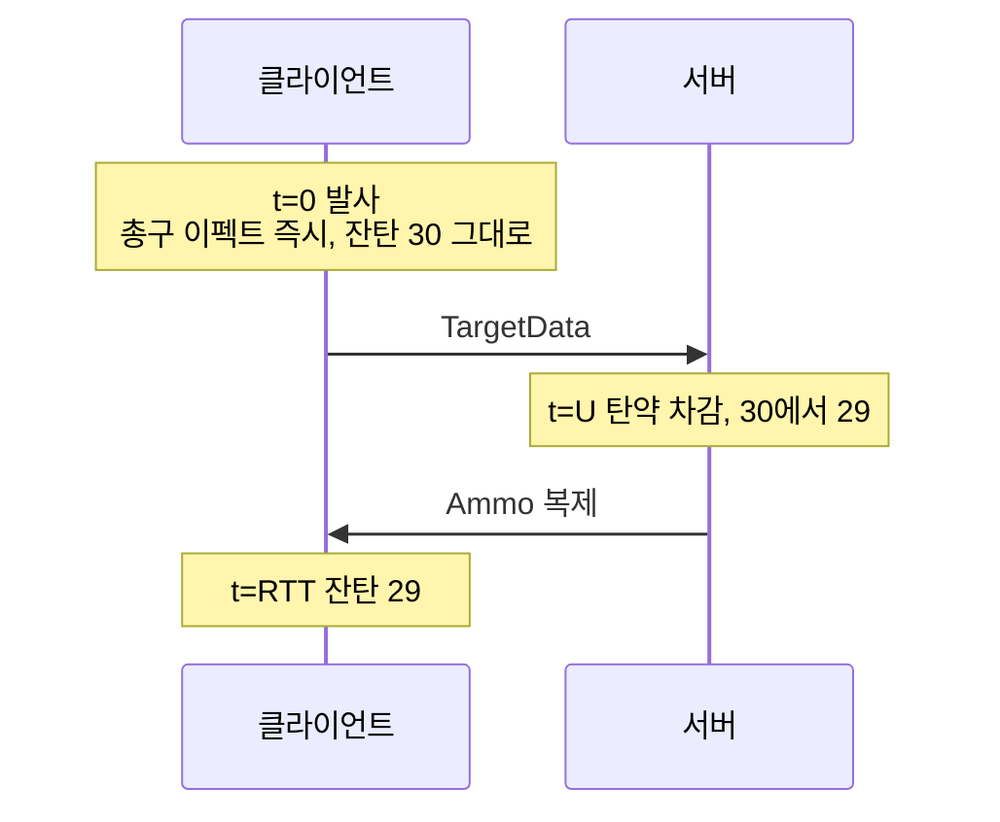
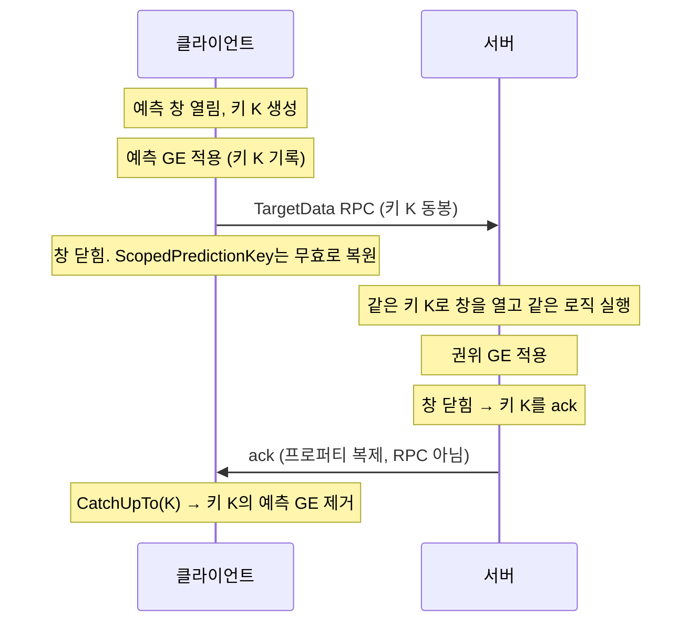
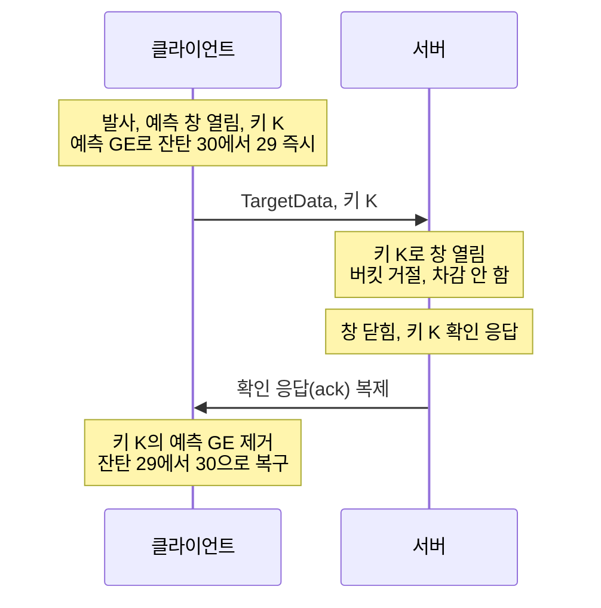

📌 [발사 원점을 클라이언트에게 받지 않기로 한 글](/devlog/EP_GAS-FireTargetData)에서 예고한
마지막 두 가지입니다. 탄약 표시를 예측으로 당기는 것과, 역할별로 갈라져 있던 처리 경로를
합치는 것입니다.
[👾 깃허브](https://github.com/SoftHamzzi/UE5-EmploymentProj)
{: .notice--info}

## 탄약이 핑만큼 늦게 줄었다

발사는 즉시 나가는데 잔탄 숫자만 늦게 바뀌었다. 탄약이 `Ammo` 어트리뷰트이고, 차감이
서버에서만 일어나 복제로 내려오기 때문이다.

Lyra는 이걸 예측하지 않는다. `ULyraAbilityCost_ItemTagStack::ApplyCost`가 권위(최종 판정을 내리는 쪽, 보통 서버)에서만 돈다.
쏘는 감각에 직접 닿는 값은 아니니 그 선택도 이해가 된다.

이 프로젝트에서는 넣기로 했다. 30발 탄창을 쓰는 게임에서 잔탄은 계속 보는 숫자이고, 핑
200ms에서 한 발 쏠 때마다 숫자가 뒤늦게 따라오는 것이 눈에 걸렸다.



발사는 0에 일어나는데 숫자는 RTT 뒤에 바뀐다. 핑 200ms면 쏠 때마다 0.2초씩 늦게 따라온다.

## 예측 키는 미리 한 일에 붙는 꼬리표다

GAS의 예측은 "클라이언트가 서버 허락 없이 미리 한 일"에 번호표를 붙여 두고, 나중에 서버
응답이 오면 그 번호표가 달린 것을 정리하는 방식이다.



여기서 두 가지가 처음 생각과 달랐다.

첫째, 창의 범위는 어빌리티 수명이 아니라 **C++ 블록 스코프**다.
`FScopedPredictionWindow`는 생성자에서 `ASC->ScopedPredictionKey`를 세우고 소멸자에서
되돌리는 지역 변수다. 엔진 주석이 못박아두고 있다.

> You can think of this prediction window as being the initial callstack of ActivateAbility.
> Once ActivateAbility ends, your prediction window is no longer valid. ...
> we do not predict over multiple frames.

연사는 정의상 여러 프레임에 걸쳐 있다. 그래서 어빌리티가 살아 있는 것과 창이 열려 있는
것은 별개이고, 타이머로 오는 두 번째 발부터는 창을 새로 열어야 한다.

둘째, 확인 응답(ack)은 RPC가 아니라 프로퍼티 복제다. 서버가 "이 키 처리했다"를 따로 보내는 것이
아니라, `ReplicatedPredictionKeyMap`이라는 배열이 복제되면서 알려진다.

## 즉발 효과를 예측하려면 즉발이 아니게 만들어야 한다

탄약 −1은 Instant GE(GameplayEffect)다. 이미 깎은 값을 어떻게 되돌릴지가 문제인데, GAS는 이걸 정면으로
해결하지 않고 표현을 바꾼다.

```cpp
// AbilitySystemComponent.cpp:988
bool bTreatAsInfiniteDuration =
    GetOwnerRole() != ROLE_Authority
    && PredictionKey.IsLocalClientKey()
    && Spec.Def->DurationPolicy == EGameplayEffectDurationType::Instant;
```

클라이언트에서만 Instant를 **무한 지속 GE**로 바꿔 적용한다. 그래서 클라이언트가 예측하는
것은 "탄약이 29발"이 아니라 "서버 값에서 −1"이다.

이 구조가 성립하려면 어트리뷰트가 `REPNOTIFY_Always`여야 한다. 서버 값이 같아도 OnRep이
불려야 재합산이 돌기 때문이다. 이 프로젝트는 `Ammo`가 이미 그렇게 등록돼 있었다.

<details markdown="1">
<summary>EPAttributeSet의 등록 (접기/펼치기)</summary>

```cpp
// EPAttributeSet.cpp:104
DOREPLIFETIME_CONDITION_NOTIFY(UEPAttributeSet, Ammo, COND_OwnerOnly, REPNOTIFY_Always);

// EPAttributeSet.cpp:121
void UEPAttributeSet::OnRep_Ammo(const FGameplayAttributeData& OldValue)
{
    GAMEPLAYATTRIBUTE_REPNOTIFY(UEPAttributeSet, Ammo, OldValue);
}
```

</details>

## 롤백 코드를 쓰지 않은 이유

서버가 발을 버리는 경우가 있다. 토큰 버킷이 거절하면 서버는 탄약을 깎지 않는다. 그러면
클라이언트가 미리 깎은 −1을 되돌려야 하는데, 그 코드를 한 줄도 쓰지 않았다.

GE를 적용하는 시점에 엔진이 되돌리기 콜백을 자동으로 걸어두기 때문이다.

```cpp
// GameplayEffect.cpp:4449
InPredictionKey.NewCaughtUpDelegate().BindUObject(Owner,
    &UAbilitySystemComponent::OnCaughtUpActiveGameplayEffect, AppliedActiveGE->Handle, RemoveAllStacks);
```

그리고 서버는 발을 버려도 ack을 보낸다. 창이 닫히면 소멸자가 무조건 보낸다. 서버가 "이
키의 행동을 안 했다"고 알리는 통로는 애초에 없다. 거절은 활성화가 막혔을 때 한 곳뿐이다.

| | 서버 base 값 | 예측 모디파이어 | 클라이언트 최종 |
|---|---|---|---|
| 정상 발사 | 29 (차감됨) | ack으로 제거 | 29 |
| 버킷 거절 | 30 (차감 안 됨) | ack으로 제거 | 30 |

두 경우가 **같은 코드 경로**다. 차이는 서버가 base를 바꿨는지 하나뿐이다. 되돌리기와
정산이 분리돼 있지 않으니 롤백 코드를 쓸 자리가 없다.



서버 쪽에 되돌리기 코드가 없다. 서버는 아무것도 안 했고 창이 닫히면서 ack만 나갔다.
클라이언트에서 29가 30으로 돌아오는 것은 엔진이 GE를 적용할 때 걸어둔 콜백이 한 일이다.

## 첫 발만 활성화 키를 다시 쓴다

발마다 새 키를 만들면 될 것으로 봤다. 첫 발만 예외였다.

RPC 배칭을 켜면 활성화와 TargetData가 한 묶음으로 간다. 그런데 배치는 키를 하나만 싣는다.
`CallServerSetReplicatedTargetData`의 배치 분기가 넘겨받은 키를 버리고 TargetData만
저장한다(`ASC_Abilities.cpp:4235`). 서버는 묶음을 풀 때 두 호출 모두에 활성화 키를
넣는다(`:4130-4131`).

첫 발은 `ActivateAbility` 안에서 일어나니 그 배치 구간에 들어간다. 여기서 새 키를 만들면
그 키가 서버에 도달하지 않는다. 그래서 조건부로 만든다.

```cpp
FScopedPredictionWindow ScopedPrediction(ASC, !ASC->ScopedPredictionKey.IsValidForMorePrediction());
```

활성화 창 안이면 활성화 키가 유효하니 새로 만들지 않고, 타이머 발은 창 밖이라 새로 만든다.
한 줄로 두 경우가 갈린다.

여기서 한 번 잘못 정리했다. 처음엔 "종속 키를 만들면 그 키가 영영 ack되지 않아 잔탄 표시가
−1에 고정된다"고 적었다. 엔진 소스를 다시 읽어보니 기본 설정에서는 그렇지 않았다.

```cpp
// GameplayPrediction.cpp:351-357
// This is the case with FScopedServerAbilityRPCBatcher.
// It sends only the BaseKey but needs to notify dependents.
if ((CVarDependentChainBehaviorValue & 2) == 0)
{
    NewCaughtUpDelegate(DependsOn).BindStatic(&FPredictionKeyDelegates::CatchUpTo, ThisKey);
}
```

배치가 베이스 키만 보내는 경우를 위해 베이스 ack이 종속 키까지 전파되는 경로가 있고, CVar
기본값에서 켜져 있다. 다만 같은 주석이 그 동작을 "논리적으로 옳지 않다"고 적고 목표값을
3으로 잡아 뒀다. 3이 되면 전파가 끊긴다.

결론은 그대로 두고 이유만 고쳤다. 활성화 키 재사용은 두 설정 모두에서 안전하고, 종속 키
방식은 언젠가 꺼질 레거시 동작에 기대는 것이다.

## 호스트가 탄약을 두 배로 쓰고 있었다

처음 구조는 역할별로 경로를 갈랐다.

```cpp
if (CurrentActorInfo->IsNetAuthority())
{
    ServerConfirmOneShot(...);   // 호스트는 왕복 없이 직접
    return;                      // ← 이 줄
}
// 원격 클라이언트: 예측 창 → 탄약 차감 → 코스메틱 → 전송
```

리슨 서버 호스트는 로컬 컨트롤이면서 권위다. 저 `return`을 빠뜨리면 아래로 흘러내려
`CommitAbilityCost`가 두 번 불린다. 실제로 빠뜨렸고, 그대로 돌렸다면 호스트에서만 탄약이
두 배로 닳았을 것이다. 코드 리뷰에서 잡았다.

한 줄만 채우면 되는 문제였지만, 구조 자체를 바꾸는 쪽으로 갔다. Lyra가 같은 상황을 분기
없이 처리하고 있었다.

```cpp
// LyraGameplayAbility_RangedWeapon.cpp:596 - 로컬 타겟팅의 마지막 줄
OnTargetDataReadyCallback(TargetData, FGameplayTag());

// :489 - 전송 여부만 가른다
const bool bShouldNotifyServer = CurrentActorInfo->IsLocallyControlled() && !CurrentActorInfo->IsNetAuthority();
```

역할별 경로를 만들지 않고, 모두가 같은 함수로 들어온 뒤 단계별로 켜고 끈다.

| 단계 | 오너 클라이언트 | 호스트 | 서버 인스턴스 |
|---|:---:|:---:|:---:|
| 복제 캐시 소비 | | | 있음 |
| 버킷 검증 | | 있음 | 있음 |
| 탄약 차감 | 있음 (예측) | 있음 | 있음 |
| 서버로 전송 | 있음 | | |
| 코스메틱 | 있음 | 있음 | |
| 히트 판정 | | 있음 | 있음 |

탄약 차감이 세 열 모두에 있지만 **한 인스턴스당 한 번**이다. 역할 조건 밖에 한 번만 두면
호스트가 두 분기에 걸치는 상황이 생기지 않는다. `return`을 빠뜨릴 자리가 사라졌다.

Lyra를 그대로 베끼지는 않았다. 두 군데가 다르다.

1. Lyra는 활성화당 한 발이라 `CommitAbility`를 콜백 안에 그냥 둔다. 이 프로젝트는 발마다
   내므로 역할 조건 밖으로 빼야 한다.
2. 버킷 검증이 탄약 차감보다 위에 와야 한다. 거절된 발이 서버 탄약을 깎으면 안 된다.
   Lyra에는 버킷이 없어서 이 순서 문제가 없다.

예측 창은 역할을 묻지 않고 그냥 연다. 클라이언트용 생성자가 권위에서는 즉시 return하기
때문이다(`GameplayPrediction.cpp:406`). 서버는 `ServerSetReplicatedTargetData`가 이미 클라이언트
키로 창을 열어 둔 상태라 그 안에서 돈다.

## 확인

구현을 마치고 PIE에서 확인했다. 잔탄이 발사와 같은 프레임에 줄고, 리슨 서버 호스트에서도
한 발에 한 번만 깎인다.

예측 키를 파고든 결과는 별도 개념 문서로 정리해 뒀다. 키의 수명, 종속 관계가 생기는 조건,
거절과 정산의 차이를 엔진 소스 줄 번호와 함께 적었다. 같은 것을 두 번 조사하지 않기
위함이다.

## 배운 것

**1. 롤백을 직접 쓰려고 하면 이미 길을 벗어난 것이다.**

처음엔 "서버가 거절하면 어떻게 알고 되돌리나"를 찾고 있었다. 거절 통보라는 것이 없었고,
ack 하나가 정산과 되돌리기를 겸하고 있었다. 프레임워크가 이미 그 자리를 만들어 뒀는지
먼저 확인하는 것이 순서였다.

**2. 소스를 읽고 정리한 것도 다시 읽어야 한다.**

종속 키가 ack되지 않는다고 적었던 것은 관련 함수를 끝까지 읽지 않아서였다. 결론은
같았지만 이유가 틀렸고, 이유가 틀리면 조건이 바뀔 때 판단을 못 한다. CVar 하나로 동작이
갈리는 것을 알고 나서야 "왜 안전한 쪽을 고르는지"를 말할 수 있게 됐다.

**3. 한 줄로 고칠 수 있는 버그가 구조 문제일 때가 있다.**

`return` 하나를 채우면 증상은 사라졌다. 그 자리는 호스트가 두 조건에 동시에 걸린다는
사실 때문에 생긴 것이고, 분기가 남아 있으면 다음에 또 밟는다. 한 줄로 고칠지 구조를 바꿀지는
그 자리가 다시 생길 수 있는지로 갈랐다.

## 참고

- `Engine/Plugins/Runtime/GameplayAbilities/Public/GameplayPrediction.h` 의 설계 주석
- `Engine/.../Private/GameplayPrediction.cpp:338-358` 의 종속 키 델리게이트, `:406` 의 생성자 조기 return
- `Engine/.../Private/AbilitySystemComponent.cpp:988` 의 Instant to Infinite 변환
- `Engine/.../Private/GameplayEffect.cpp:4449` 의 되돌리기 델리게이트 등록
- `LyraStarterGame` 소스 `Source/LyraGame/Weapons/LyraGameplayAbility_RangedWeapon.cpp:489`, `:596`
- 프로젝트 문서 `DOCS/Mine/Concepts/PredictionKey.md`
