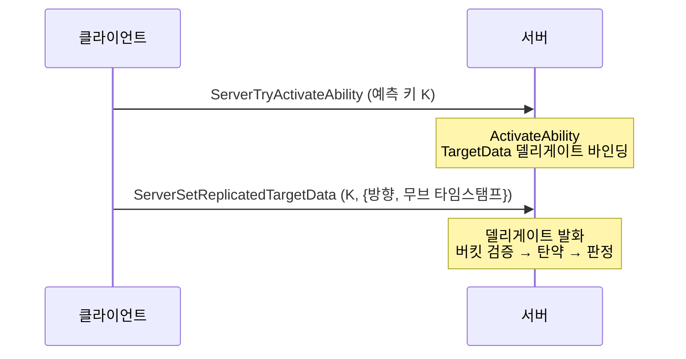
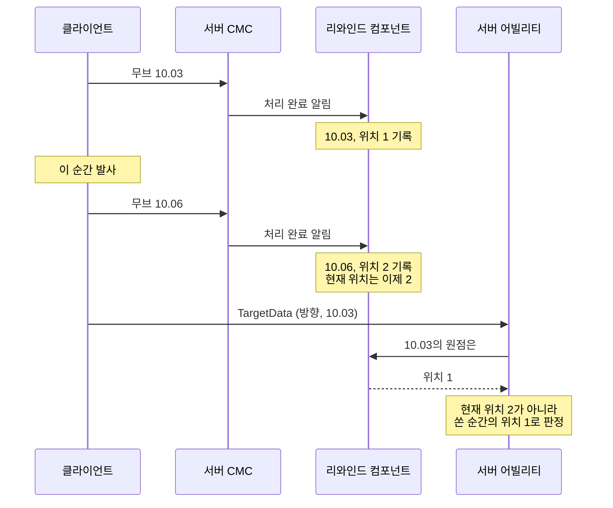

📌 [단발 사격을 막고 있던 것은 쿨다운 GE였다](/devlog/EP_GAS-WeaponFireRate)에서 예고한 나머지
두 가지입니다. 발사 정보를 서버에 보내는 방식과, 발사 원점을 누가 계산하는지 정리했습니다.
[👾 깃허브](https://github.com/SoftHamzzi/UE5-EmploymentProj)
{: .notice--info}

## 서버가 원점을 검증할 방법이 없었다

기존 구조는 클라이언트가 커스텀 RPC로 원점과 방향을 둘 다 보내는 것이었다.

```cpp
UFUNCTION(Server, Reliable)
void Server_ConfirmFire(FVector_NetQuantize Origin, FVector_NetQuantizeNormal Direction,
                        FGameplayAbilitySpecHandle AbilityHandle);
```

서버가 `Origin`을 가지고 하는 검사는 하나였다. 현재 캐릭터 위치에서 200cm 이상 떨어져
있으면 버린다.

이 검사에는 고를 수 있는 값이 없다. 느슨하게 두면 벽 너머나 모퉁이 밖 좌표를 막지 못하고,
빡빡하게 두면 이동 중에 정상 발사가 버려진다. 클라이언트가 보낸 좌표는 주장이고, 서버가
그 주장을 확인할 근거를 가지고 있지 않다.

## 방향은 클라이언트가 보내는 것이 맞다

원점을 빼기로 정하면서 방향도 같이 볼 수밖에 없었다. 둘의 성격이 달랐다.

방향은 서버가 만들 수 없다. 서버에도 컨트롤러 회전이 있지만, 그 값은 `ServerMove`로 올라온
것이고 발사 RPC와 다른 채널이다. 서버 입장에서 두 패킷의 도착 순서에 보장이 없으니 항상
한 프레임 어긋난다. 60fps에서 16ms이고, 초당 100도로 트래킹하면 1.6도, 30m 거리에서 84cm다.

반면 클라이언트가 발사하는 순간 읽은 벡터를 그대로 실어 보내면 오차가 0이다. 조작해도
얻는 것이 에임봇 이상이 아니라 검증할 이유도 없다.

명령과 그때의 시점 각도를 한 패킷에 담는 것은 Source 엔진 계열의 usercmd(입력 한 번과 그 순간의 시점 각도를 같이 담는 명령) 모델이고, 주류 FPS가
쓰는 모양이다. 그래서 방향은 보내고, 원점만 뺀다.

## 전송을 GAS TargetData로 옮겼다

원점을 빼면 페이로드가 바뀌니 전송 방식도 같이 정리했다. 커스텀 RPC를 지우고 GAS가
제공하는 TargetData 경로를 쓴다.



바꾼 이유는 세 가지다.

1. 예측 키로 활성화와 자동으로 짝지어진다. 어빌리티 핸들을 직접 넘겨 인스턴스를 찾던
   코드가 사라진다.
2. TargetData가 활성화보다 먼저 도착해도 GAS가 `AbilityTargetDataMap`에 캐시해 둔다.
3. 앞으로 들어올 스킬 타게팅이 같은 파이프라인을 쓴다. 지금 무기를 위해 만드는 것이
   나중에 두 번째 소비자를 받는다.

페이로드는 두 필드다.

<details markdown="1">
<summary>FEPTargetData_Fire (접기/펼치기)</summary>

```cpp
USTRUCT()
struct EMPLOYMENTPROJ_API FEPTargetData_Fire : public FGameplayAbilityTargetData
{
    GENERATED_BODY()

    UPROPERTY() FVector_NetQuantizeNormal Direction = FVector::ForwardVector;
    UPROPERTY() float ClientMoveTimeStamp = -1.f;

    virtual UScriptStruct* GetScriptStruct() const override { return FEPTargetData_Fire::StaticStruct(); }

    bool NetSerialize(FArchive& Ar, UPackageMap* Map, bool& bOutSuccess)
    {
        Direction.NetSerialize(Ar, Map, bOutSuccess);
        Ar << ClientMoveTimeStamp;
        bOutSuccess = true;
        return true;
    }
};

template<>
struct TStructOpsTypeTraits<FEPTargetData_Fire> : public TStructOpsTypeTraitsBase2<FEPTargetData_Fire>
{
    enum { WithNetSerializer = true };
};
```

</details>

두 군데를 빠뜨리면 조용히 망가진다. `GetScriptStruct()`를 안 넣으면 서버가 베이스 타입으로
역직렬화해서 필드가 사라지고, `TStructOpsTypeTraits` 특수화를 안 넣으면 직렬화 자체가
안 된다. 후자는 엔진 주석이 대문자로 못박아두고 있다.

```cpp
// GameplayAbilityTargetTypes.h:384
WithNetSerializer = true	// For now this is REQUIRED for FGameplayAbilityTargetDataHandle net serialization to work
```

대가는 RPC 개수다. TargetData는 Reliable이라 단발 클릭 하나가 활성화, TargetData, 종료로
세 개가 된다. 어빌리티 RPC 배칭을 켜서 활성화와 TargetData를 한 묶음으로 보내면 두 개가
된다. 종료는 예약 슬롯 때문에 타이머 틱에서 일어나 배치 밖이라 합쳐지지 않는다.

## FHitResult를 통째로 보내는 선택지도 있었다

`FHitResult`에는 `TraceStart`, `TraceEnd`, `ImpactPoint`, 맞은 액터, 본 이름까지 다 있다.
페이로드를 두 필드로 줄이는 대신 그걸 보내면 서버가 트레이스를 다시 할 필요조차 없다.

실제로 Lyra가 그렇게 한다. `FLyraGameplayAbilityTargetData_SingleTargetHit`이 `FHitResult`를
담아 보내고, 서버는 그 결과로 대미지를 적용한다. 서버가 트레이스를 다시 하지 않는다.

그 흔적이 코드에 남아 있다. `bHitReplaced`라는 필드를 Lyra는 읽기만 하고 아무 데서도
설정하지 않는다. 엔진의 `ReplaceHitWith()`가 세팅하는 값인데, 서버가 히트를 갈아끼울 자리는
만들어 뒀지만 구현은 비워 둔 상태다.

GASShooter는 플래그로 두 모드를 다 제공한다. `ShouldProduceTargetDataOnServer`가 `false`면
클라이언트가 `FHitResult`를 보내고, `true`면 확인 신호만 보내고 서버가 트레이스한다.
저자가 GASDocumentation에 트레이드오프를 직접 적어뒀다.

> If you send TargetData to the server, you may want to do validation on the server to make sure
> the TargetData looks reasonable to prevent cheating. Producing the TargetData directly on the
> server avoids this issue entirely, but will potentially lead to mispredictions for the owning client.

이 프로젝트는 지연 보상을 위해 서버 사이드 리와인드를 이미 만들어 뒀다. 히트 판정을
클라이언트에게 맡기면 그 컴포넌트 전체가 쓸 데가 없어진다. 그래서 서버 판정을 유지하고,
인용문이 경고한 "오예측"을 다음 절의 방법으로 줄인다.

## 서버가 쓰는 원점은 현재 위치가 아니라 그 무브의 위치다

원점을 서버가 계산하기로 하면 곧바로 문제가 하나 생긴다. 서버가 "지금 이 캐릭터 위치"를
쓰면, 그 위치는 마지막으로 처리한 이동 패킷의 결과다. 발사 RPC가 이동 패킷 사이에 도착하면
그 간격만큼 원점이 뒤로 밀린다.

기본 설정에서 클라이언트가 이동을 보내는 주기와 이동 속도를 곱하면 한 자리 센티미터급이
된다. 히트박스 기준으로 무시할 수 있는 크기는 아니었다.

언리얼 토너먼트가 같은 문제를 어떻게 풀었는지 봤다. `AUTCharacter`가 `SavedPositions`
배열을 들고, 발사 시점에 `GetDelayedShotPosition()`으로 과거 위치를 꺼낸다. 데디케이티드
서버에서는 클라이언트의 세이브드 무브에 실린 발사 플래그가 도착할 때까지 최대
`MaxShotSynchDelay` 0.2초를 기다린다(`UTCharacter.cpp:168`, `:365`).

기다리는 부분은 가져오지 않았다. 발사 시각이 밀리면 서버 사이드 리와인드가 되감을 기준
시각과 어긋나기 때문이다. 대신 클라이언트가 **어느 무브였는지**를 알려주게 했다.

```cpp
// 페이로드를 채울 때
Data->ClientMoveTimeStamp = CMC->GetPredictionData_Client_Character()->CurrentTimeStamp;
```

`FSavedMove_Character::TimeStamp`는 이미 `ServerMove`에 실려 서버로 가는 값이다. 서버는 무브를
처리할 때마다 `{그 타임스탬프, 처리 직후 카메라 위치}`를 기록해 두고, 발사가 오면 페이로드의
타임스탬프로 찾는다. 찾으면 오차가 0이다. 채널 도착 순서와 무관해진다.



이동 패킷과 발사 패킷은 서로 다른 채널이라 도착 순서가 보장되지 않는다. 위 그림은 발사
뒤에 보낸 이동이 먼저 도착한 경우다. 서버가 현재 위치를 썼다면 위치 2에서 쐈을 것이다.

## 타임스탬프는 검증할 필요가 없다

좌표를 받지 않고 타임스탬프를 받는 것이 왜 나은지가 이 설계의 핵심이다.

| 받는 값 | 서버가 하는 일 | 조작하면 |
|---|---|---|
| 좌표 | 믿는다. 검증 근거가 없다 | 있었던 적 없는 위치에서 쏜다 |
| 무브 타임스탬프 | 자기 히스토리에서 찾는다 | 서버가 직접 기록한 자기 과거 위치 중 하나가 나온다 |

타임스탬프는 좌표가 아니라 서버 자기 기록의 인덱스다. 클라이언트가 값을 바꿔도 서버가
기록해 둔 위치 중 하나를 고르는 것뿐이라, 실제로 있었던 적 없는 곳에서 쏘는 경로가 없다.
검증을 생략한 것이 아니라 검증이 필요 없는 표현으로 바꾼 것이다.

히스토리에 없는 타임스탬프가 오면 현재 카메라 위치로 돌아간다. 무브가 아직 안 온 경우와
4분마다 일어나는 타임스탬프 리셋 직후가 그렇다. 이 경우의 오차는 원래 구조와 같다.

## 히스토리는 리와인드 컴포넌트가 들기로 했다

기록할 자리를 정하는 데 한 번 생각을 고쳤다. 처음엔 캐릭터 무브먼트 컴포넌트(CMC)가 배열을 들게 하려고 했다. UT도
`AUTCharacter`가 들고 있으니 캐릭터나 무브먼트가 자연스러워 보였다.

이 프로젝트에는 이미 "이 캐릭터의 과거 위치"를 아는 컴포넌트가 있다. 지연 보상용
`UEPServerSideRewindComponent`가 본 스냅샷을 시간순으로 들고 있다. 같은 종류의 데이터를 두
곳에서 관리할 이유가 없어서 그쪽으로 옮겼다.

배열은 둘로 나뉘어 있다. 성격이 다르다.

| | 본 스냅샷 (기존) | 발사 원점 (신규) |
|---|---|---|
| 언제 찍나 | 묶음의 마지막 무브만 | 모든 무브 |
| 어느 시점에 | `TG_PostPhysics` (애니 평가 뒤라야 본 Transform이 맞다) | 무브 처리 직후 즉시 |
| 무엇을 | 히트 본 전체의 월드 Transform | 카메라 위치 하나 |

CMC는 기록하지 않고 알리기만 한다. `OnMovementUpdated`에서 무브 하나를 처리할 때마다
`{서버 시각, 위치, 클라이언트 타임스탬프, 마지막 무브인지}`를 브로드캐스트하고, 리와인드
컴포넌트가 받아서 자기 배열 둘을 각자 규칙대로 채운다.

원점을 `TG_PostPhysics`까지 미루지 않은 이유는 미룰 필요가 없기 때문이다. 카메라는 캡슐에
붙어 있어 캡슐이 움직인 직후면 이미 갱신돼 있다. 본 Transform만 애니메이션 평가를
기다려야 한다.

## 같은 작업에서 한 나머지

구현을 마치고 PIE에서 확인했다.

같은 작업에서 두 가지를 더 바꿨다. 탄약을 클라이언트가 예측해서 미리 깎는 것, 그리고
역할별로 갈라져 있던 처리 경로를 하나로 합친 것이다. 둘 다 예측 키를 다루는 이야기라
다음 편에서 같이 쓴다.

## 배운 것

**1. 검증할 수 없는 값은 받지 않는 쪽으로 표현을 바꾼다.**

200cm 드리프트 검사를 붙잡고 임계값을 조정하는 방향으로 계속 생각하고 있었다. 임계값으로
풀리는 문제가 아니었다. 받는 값을 좌표에서 인덱스로 바꾸니 검증할 대상 자체가 없어졌다.

**2. 레퍼런스를 볼 때 안 가져올 부분을 정하는 것도 읽기의 일부다.**

UT에서 "무브 타임스탬프로 과거 위치를 찾는다"는 가져왔고 "무브가 올 때까지 기다린다"는
안 가져왔다. UT에는 서버 사이드 리와인드가 없어서 기다려도 잃는 것이 없지만, 이 프로젝트는
발사 시각이 되감기 기준이라 기다리면 다른 것이 틀어진다. 같은 문제라도 주변 구조가 다르면
해법의 절반만 맞는다.

**3. 같은 종류의 데이터는 한 곳에 둔다.**

"이 캐릭터의 과거 위치"를 CMC와 리와인드 컴포넌트가 각자 들면, 나중에 둘 중 어느 쪽을
봐야 하는지 매번 판단해야 한다. 배열이 둘로 나뉘는 것은 찍는 시점이 달라서 어쩔 수 없지만,
주인은 하나로 뒀다.

## 참고

- `unrealTournament` 소스 `UnrealTournament/Source/UnrealTournament/Private/UTCharacter.cpp:167-168`, `:365` 의 `SavedPositions`, `GetDelayedShotPosition`
- `LyraStarterGame` 소스 `Source/LyraGame/AbilitySystem/LyraGameplayAbilityTargetData_SingleTargetHit.h`
- [GASDocumentation](https://github.com/tranek/GASDocumentation) 의 `TargetActor` 절, `ShouldProduceTargetDataOnServer` 설명
- `Engine/Plugins/Runtime/GameplayAbilities/Public/Abilities/GameplayAbilityTargetTypes.h:384` 의 `WithNetSerializer` 주석
