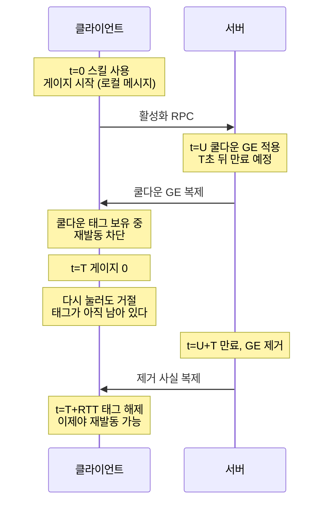
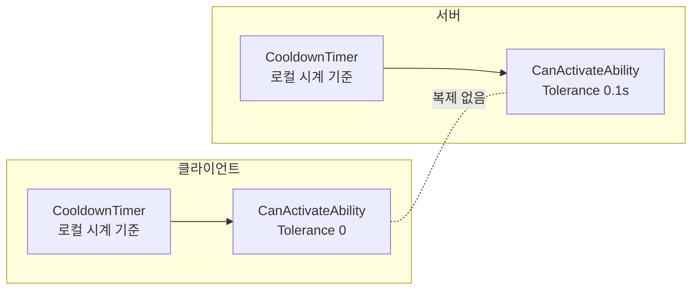
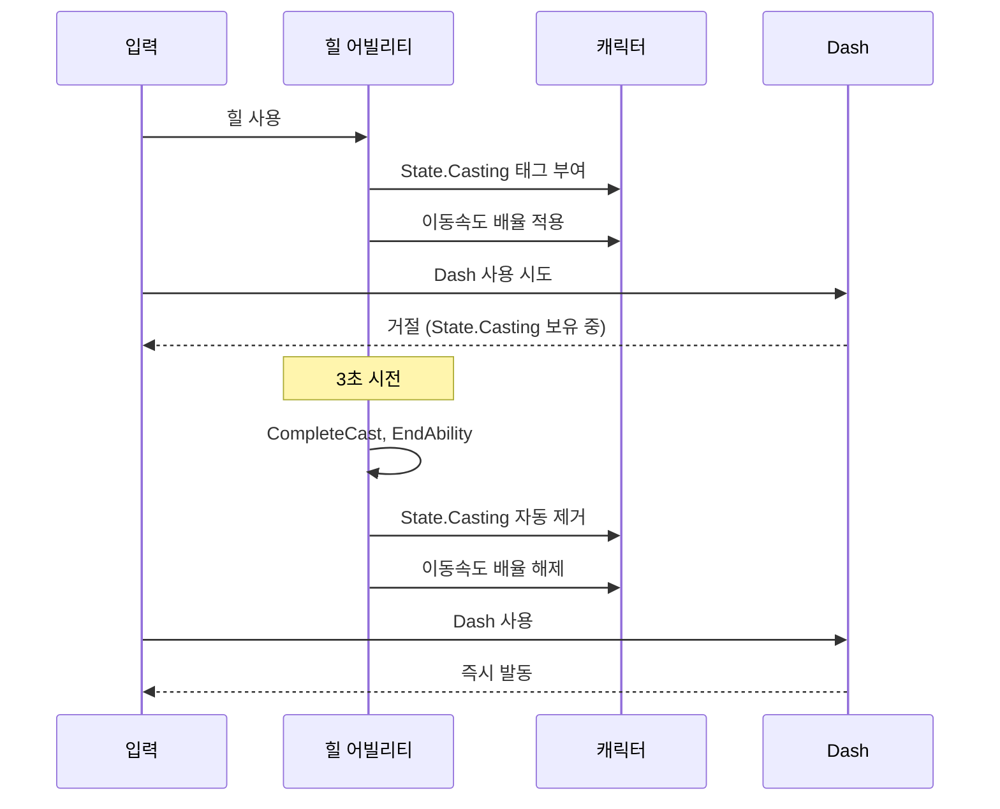
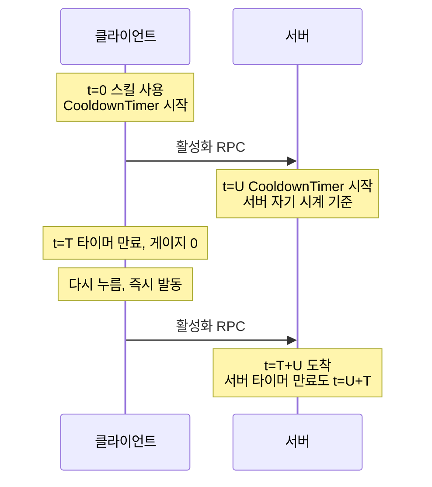

📌 [쿨다운 GE는 왜 시간을 못 맞추는지](/devlog/EP_GAS-CooldownReplication) 다룬 글의 후속입니다.
그때 표시는 고쳤지만 재발동 차단은 남겨뒀습니다. 그 남은 절반을 정리한 기록입니다.
[👾 깃허브](https://github.com/SoftHamzzi/UE5-EmploymentProj)
{: .notice--info}

## 전편에서 남은 것은 재발동 차단이었다

쿨다운 게이지가 5에서 4.5까지 내려가다 5로 되돌아가는 문제는 표시를 GE(GameplayEffect)에서 떼어내
해결했다. 어빌리티가 쿨다운을 적용하는 자리에서 지속시간을 메시지로 발행하고, 위젯은
받은 순간의 로컬 시계를 시작점으로 잡는다.

그런데 실제 게이트(재발동을 막는 관문)는 그대로였다. 게이지가 0에 닿아도 다시 누르면 아무 일도 안 일어나는
구간이 있었고, 핑이 높을수록 그 구간이 길었다.



T는 쿨다운 길이, U는 올라가는 지연, RTT는 왕복 지연이다. 게이지가 0이 되는 T부터 태그가
풀리는 T+RTT까지, 화면은 끝났다고 말하는데 입력은 거절되는 구간이 생긴다. 핑이 높을수록 그 구간이 길어진다.

원인은 GAS가 GE **적용**은 예측하지만 **제거**는 예측하지 않는다는 것이다. 재발동 차단은
쿨다운 GE가 사라져야 풀리므로, 클라이언트는 서버가 제거한 사실이 복제될 때까지 기다린다.
표시는 GE를 안 보게 만들어서 우회할 수 있었지만, 차단은 GE 자체가 게이트라 우회할 자리가
없었다.

## 판단 기준은 하나, 클라이언트가 그 상태로 결정을 내리는지

전편 마지막에 "GE를 빼고 타임스탬프로"라고 방향만 적어뒀다. 이번에 정리한 기준은 이렇다.

> 내가 시작한 시간 상태는 어빌리티가 들고, 남이 나에게 건 상태는 GE가 든다.

여기서 시간 상태는 쿨다운이나 버프처럼 시간이 지나면 끝나는 상태를 말한다.

| | 누가 시작 | 무엇으로 표현 |
|---|---|---|
| 시전, 쿨다운, 자기 버프(실드) | 나 | 어빌리티 + 로컬 타이머 |
| 적이 건 슬로우, 독, 화상 | 남(서버) | Duration GE 그대로 |

근거는 "클라이언트가 그 값을 읽고 스스로 무언가를 막거나 허용하는지"다. 읽고 결정한다면
GE로 두면 안 된다. 왕복 지연(RTT)만큼 늦게 꺼지는 값으로 게이트를 만들면 그 시간 동안 입력이
거절되기 때문이다.

반대로 적이 건 슬로우는 클라이언트가 시작 시점 자체를 서버에게 들어야 한다. 어차피 늦게
알게 되므로 로컬 타이머로 관리해도 얻는 것이 없다. 그래서 GE를 그대로 쓴다.

이 구분을 하지 않고 무조건 빼면, 서버만 아는 상태를 클라이언트가 영원히 모르는 상황이
생긴다.

## 클라이언트와 서버가 각자 자기 값끼리만 비교한다

핑 추정을 아예 쓰지 않는 구조로 갔다.



두 타이머 사이에 복제가 없다. 클라이언트는 자기 시계로 시작하고 자기 시계로 끝내며,
서버도 마찬가지다. "GE 제거를 기다린다"는 문제가 성립하지 않는다.

시계는 `World->GetTimeSeconds()`를 쓴다. 값을 네트워크로 보내지 않으니 서버 시각을 추정할
이유가 없다. Lyra도 같은 이유로 `ULyraWeaponInstance::TimeLastFired`에 로컬 시계를 쓴다
(`LyraWeaponInstance.cpp:58`). `GetServerWorldTimeSeconds()`가 필요한 곳은 지연 보상처럼
타임스탬프를 RPC로 다른 컴퓨터에 보낼 때다.

## 타임스탬프가 아니라 남은 시간을 든다

처음엔 `LastActivationTime` 하나면 될 것으로 봤다. 쿨다운 감소(이하 쿨감)가 들어오면서 바뀌었다.

이 프로젝트의 쿨감은 세 갈래다. 어트리뷰트 두 개(고정값 감소, 퍼센트 감소)는
시작 시점에 지속시간을 깎으면 된다. 문제는 세 번째인 "쿨다운이 도는 속도" 배율이다.
쿨다운이 이미 돌고 있는 중에 배율이 바뀌면, 타임스탬프 방식은 시작 시각을 소급해서
옮겨야 한다.

그래서 남은 시간 모델로 만들었다. 조회할 때 경과를 배율만큼 깎는다.

<details markdown="1">
<summary>FEPLocalTimer 핵심 (접기/펼치기)</summary>

```cpp
// GAS/EPLocalTimer.h - UObject 아님, 복제 안 함, 틱 없음
struct FEPLocalTimer
{
    void Start(double Now, float Duration)
    {
        PrevRemaining = Remaining;      // 거절 롤백용
        PrevLastUpdate = LastUpdate;
        bPrevStarted = bStarted;

        Remaining = FMath::Max(0.f, Duration);
        LastUpdate = Now;
        bStarted = true;
        ++Generation;
    }

    void Bank(double Now, float RateSoFar)   // 배율이 바뀌기 직전에 적립
    {
        if (!bStarted) return;
        Remaining = GetRemaining(Now, RateSoFar);
        LastUpdate = Now;
    }

    float GetRemaining(double Now, float Rate) const
    {
        if (!bStarted) return 0.f;
        return FMath::Max(0.f, Remaining - static_cast<float>(Now - LastUpdate) * FMath::Max(0.f, Rate));
    }

    bool IsElapsed(double Now, float Rate, float Tolerance) const
    {
        return GetRemaining(Now, Rate) <= Tolerance;
    }
};
```

</details>

틱이 없다. 조회 시점에 계산한다. `Rate`를 타이머가 저장하지 않고 호출하는 쪽이 넘기는 것은,
타이머가 배율 저장소를 몰라도 되게 하기 위함이다. `Rate`가 1이면 타임스탬프 방식과 계산
결과가 같다.

배율 저장소는 `FEPLocalModifiers`라는 `TMap<FGameplayTag, float>` 하나다. 태그 계층으로
카테고리를 묶고, 조회할 때 곱한다. `Modifier.CooldownRate` 아래에 여러 출처가 들어와도
호출자는 곱 하나만 받는다.

<details markdown="1">
<summary>FEPLocalModifiers (접기/펼치기)</summary>

```cpp
// Core/EPLocalModifiers.h - AEPCharacter 멤버
float Product(FGameplayTag Category) const
{
    float P = 1.f;
    for (const TPair<FGameplayTag, float>& It : Values)
    {
        if (It.Key.MatchesTag(Category))
            P *= FMath::Max(0.f, It.Value);
    }
    return P;
}
```

</details>

이 저장소는 쿨감뿐 아니라 시전 중 이동속도, 무기 연사 속도까지 같이 쓴다. 한 값을 두
경로가 봐야 하는 상황이 계속 나와서 캐릭터에 두었다.

## 게이트를 CanActivateAbility로 옮겼다

쿨다운 GE가 사라지면 GAS의 기본 차단 경로도 사라진다. 그 자리를 베이스 클래스의
`CanActivateAbility` 오버라이드가 대신한다.

<details markdown="1">
<summary>EPGA_Skill_Base::CanActivateAbility (접기/펼치기)</summary>

```cpp
if (!Super::CanActivateAbility(Handle, ActorInfo, SourceTags, TargetTags, OptionalRelevantTags))
    return false;

if (UAbilitySystemGlobals::Get().ShouldIgnoreCooldowns()) return true;   // 치트 커맨드 존중

const float Now  = World->GetTimeSeconds();
const float Rate = Char->GetLocalModifiers().Product(EmpGameplayTags::TAG_Modifier_CooldownRate);
const float Tolerance = ActorInfo->IsNetAuthority()
    ? GetDefault<UEPCombatDeveloperSettings>()->ServerCooldownToleranceSeconds
    : 0.f;

if (CooldownTimer.IsElapsed(Now, Rate, Tolerance)) return true;

const FGameplayTag& FailTag = UAbilitySystemGlobals::Get().ActivateFailCooldownTag;
if (OptionalRelevantTags && FailTag.IsValid()) OptionalRelevantTags->AddTag(FailTag);
return false;
```

</details>

두 가지를 의도적으로 남겼다. `ShouldIgnoreCooldowns()`는 엔진 치트 커맨드가 계속 통하게
하려고, `ActivateFailCooldownTag`는 실패 이유를 GAS 표준 방식으로 보고하려고 붙였다. GE를
버려도 GAS 쪽 관례는 지켜둔 셈이다.

`Tolerance`는 서버만 0.1초를 받는다(`EPCombatDeveloperSettings.h:46`). 클라이언트가 자기
시계로 "쿨다운 끝"이라고 판단해 활성화를 보냈는데, 서버 타이머가 아주 조금 남아 있어
거절하는 경우를 막기 위한 여유다. 두 타이머는 각자 시작 시각이 다르니(서버는 활성화 RPC가
도착한 시점) 이 정도 어긋남이 정상 범위다.

## 예측한 쿨다운은 거절되면 되돌린다

로컬 타이머는 클라이언트가 먼저 돌린다. 서버가 그 활성화를 거절하면 쿨다운이 걸린 채로
남는다.

GAS의 예측 키에 거절 콜백을 달아 처리했다. `FScopedPredictionWindow` 없이도 활성화 키는
`CurrentActivationInfo`에 들어 있다.

<details markdown="1">
<summary>CompleteCast의 롤백 등록 (접기/펼치기)</summary>

```cpp
void UEPGA_Skill_Base::CompleteCast()
{
    OnCastComplete();                      // 서브클래스의 실제 효과

    const float Duration = GetEffectiveCooldown();
    CooldownTimer.Start(GetWorld()->GetTimeSeconds(), Duration);

    if (IsPredictingClient())
    {
        FPredictionKey Key = CurrentActivationInfo.GetActivationPredictionKey();
        Key.NewRejectedDelegate()
           .BindUObject(this, &UEPGA_Skill_Base::OnActivationRejected, CooldownTimer.GetGeneration());
    }

    BroadcastDurationMessage(CooldownChannelTag, Duration);
    EndAbility(CurrentSpecHandle, CurrentActorInfo, CurrentActivationInfo, true, false);
}

void UEPGA_Skill_Base::OnActivationRejected(uint32 StartedGeneration)
{
    CooldownTimer.Revert(StartedGeneration);   // 세대가 다르면 no-op
}
```

</details>

세대 번호를 같이 넘긴다. 거절 콜백이 늦게 도착했고 그 사이 쿨다운이 새로 시작됐다면,
되돌려야 할 대상이 이미 아니다. `Start`가 세대를 올리므로 `Revert`는 자기 세대가 아니면
아무것도 하지 않는다.

`IsPredictingClient()`로 감싼 이유는 서버와 리슨 서버 호스트에는 거절이라는 개념이 없기
때문이다. 서버처럼 권위(최종 판정을 내리는 권한)를 가진 쪽은 자기가 판단하는 주체다.

## 시전 잠금은 태그와 배율로 나눠 담았다

`GE_Casting`은 두 가지를 동시에 하고 있었다. 다른 스킬을 막는 태그, 그리고 이동속도 감소.
GE를 버리면서 둘을 분리했다.

| 하던 일 | 옮긴 곳 |
|---|---|
| 다른 스킬 차단 | `ActivationOwnedTags`에 `State.Casting` |
| 이동속도 감소 | `LocalModifiers.Set(Modifier.MoveSpeed.Casting)` |

`ActivationOwnedTags`는 어빌리티가 살아 있는 동안 자동으로 붙고 끝나면 자동으로 떨어진다.
GE 제거를 기다릴 일이 없다. 이동속도는 `UEPCharacterMovement::GetMaxSpeed()`가 어트리뷰트
배율과 로컬 배율을 둘 다 곱하도록 해서 캐릭터 무브먼트 컴포넌트(CMC)가 바로 읽는다.



`GE_Casting`을 쓸 때는 마지막 두 줄이 서버가 GE를 제거한 사실이 복제될 때까지 밀렸다.
지금은 어빌리티가 끝나는 그 자리에서 클라이언트가 스스로 푼다.

3초 시전이 끝나는 시점을 클라이언트와 서버가 맞추는 일은 `UAbilityTask_NetworkSyncPoint`에
맡겼다. `OnlyServerWait`로 걸면 클라이언트는 기다리지 않고 바로 다음으로 가고, 서버는
클라이언트 신호를 기다린다. 이 태스크가 예측 창(서버 확인 없이 미리 실행해도 되는 구간)까지 열어주므로 힐 GE가
클라이언트에서 예측 적용된다.


고친 뒤의 힐. 시전하는 동안 이동이 느려지고 다른 스킬이 잠기며, 시전이 끝나는 순간 둘 다 풀린다.

## 결과

세 스킬(Dash, Heal, ShieldOn)이 같은 베이스 위에서 돌고, 서브클래스는 `OnCastComplete()`
하나만 오버라이드한다. 쿨다운 GE와 시전 GE 에셋은 지웠다.

재발동 차단이 클라이언트 로컬 판정이 되면서, 게이지가 0에 닿은 순간 실제로 다시 누를 수
있게 됐다. 서버가 0.1초 여유를 두고 같은 판정을 하므로 정상 플레이에서 거절이 나지 않는다.



글 앞쪽 다이어그램과 같은 조건이다. 클라이언트는 T에 바로 다시 발동하고, "다시 눌러도
거절" 구간이 없다.

서버 쪽 마지막 줄이 0.1초 여유가 필요한 이유다. 두 번째 활성화는 서버 타이머가 끝나는
순간과 거의 같은 때 도착하는데, 올라가는 지연이 조금만 줄어도 먼저 도착한다.


대시를 쿨다운이 끝나는 대로 이어서 쓴 장면. 게이지가 0에 닿는 순간 바로 다시 나간다.

PIE에서 확인했다. 쿨다운 게이지가 되돌아가지 않고, 0에 닿는 순간 다시 발동되며, 시전 중
이동속도가 클라이언트와 서버에서 같게 움직인다.

## 남은 것

코드를 다시 훑다가 두 가지를 찾았다.

1. `EndAbility` 오버라이드가 이동속도 배율을 지우는 코드를 `Super` 호출보다 앞에 두고
   있다. 가드(`IsEndAbilityValid`)는 `Super` 안에 있으니, 늦게 도착한 `EndAbility`가 그
   사이 시작된 새 시전의 배율을 지울 수 있다. 함수 첫 줄에 가드를 넣으면 닫힌다.
2. Dash가 방향을 `CMC->GetCurrentAcceleration()`으로 양쪽에서 각자 읽는다. 클라이언트는
   발동 순간의 가속도, 서버는 마지막으로 처리한 이동 패킷의 가속도라 RTT 동안 방향을
   틀면 서로 다른 방향으로 대시한다. 발동 시점 방향을 페이로드로 실어 보내야 한다.

둘 다 지금 당장 증상이 크지는 않다. 1번은 한 줄이고, 2번은 방향 전환 중 대시할 때만
드러난다.

## 배운 것

**1. 우회와 해결은 다른 작업이다.**

표시를 GE에서 떼어낸 것은 우회였다. 증상이 사라졌지만 GE는 그대로 게이트였다. 이번에
표현 방식을 바꾼 것이 원인 쪽 작업이다. 전편에서 "증상이 사라졌다를 원인이 없어졌다로
착각하지 않는 게 중요했다"고 적었는데, 그 말을 실제로 지키는 데 시간이 걸렸다.

**2. 무엇을 GE로 표현할지는 데이터가 아니라 결정 주체로 가른다.**

처음엔 "지속시간이 있으면 GE"라는 기준으로 만들었다. 그러면 어떤 GE가 문제를 일으키는지
매번 표를 봐야 한다. "누가 시작했는지" 한 가지로 가르면 판단할 일이 없어진다.

**3. 타임스탬프 하나로 충분하다고 단정하지 말 것.**

전편 마지막에 "복제되지 않는 float 하나면 충분하다"고 적었다. 쿨감 배율이 도는 중에
바뀌는 경우를 넣으니 남은 시간 모델이 필요했다. 방향은 맞았지만 자료구조는 틀렸던 셈이다.

## 참고

- `Engine/Plugins/Runtime/GameplayAbilities/Public/GameplayPrediction.h` 엔진 주석의 예측 대상/비대상 목록
- `LyraStarterGame` 소스 `Source/LyraGame/Weapons/LyraWeaponInstance.cpp:58` 로컬 시계 사용례
- 프로젝트 소스 `EPGA_Skill_Base.cpp`, `EPLocalTimer.h`, `EPLocalModifiers.h`
