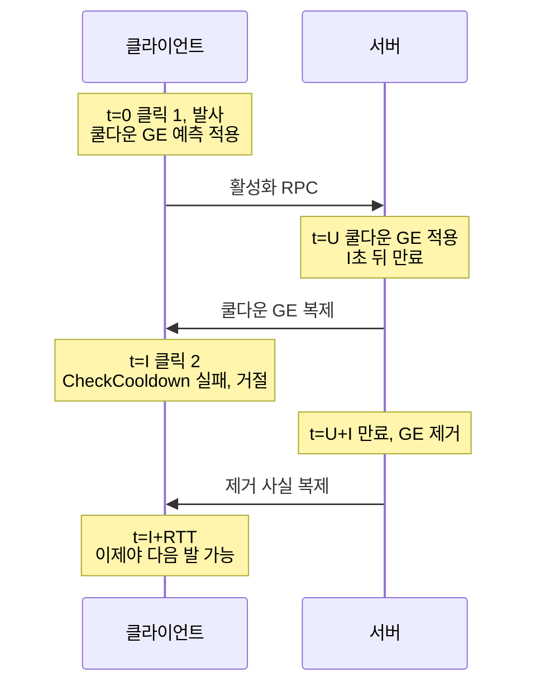
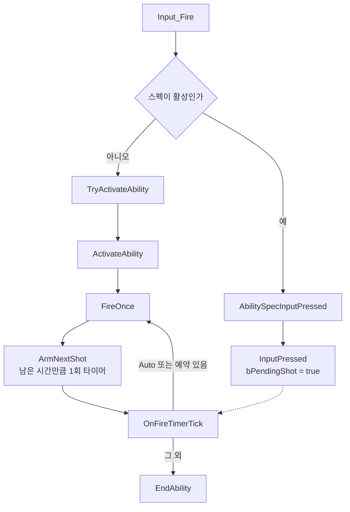
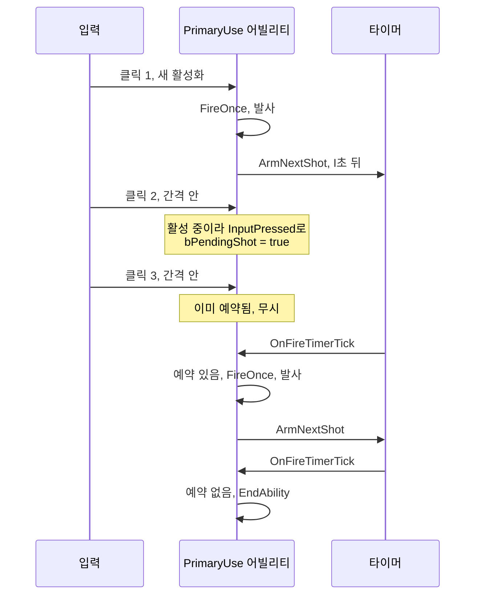

📌 [쿨다운을 GE에서 빼고 로컬 타이머로 옮긴 글](/devlog/EP_GAS-SkillLocalTimer)에서 스킬을 정리했습니다.
같은 문제가 무기에도 있었고, 무기 쪽은 단발 사격이라는 다른 증상으로 나타났습니다.
[👾 깃허브](https://github.com/SoftHamzzi/UE5-EmploymentProj)
{: .notice--info}

## 연사는 고쳤는데 단발이 안 나갔다

이전에 완전자동 연사가 핑에 비례해 느려지는 문제를 고쳤다. 원인은 한 발마다 어빌리티를
새로 켜고 끄는 구조였고, 어빌리티 하나가 연사 내내 살아 있으면서 타이머로 반복하게
바꿨다. GAS가 자체적으로 보내는 Reliable RPC가 총알 수 × 2에서 연사 1회당 2개로 줄었다.

그런데 단발은 그대로였다. 트리거를 뗐다 다시 누르면 재발동까지 지연이 걸렸고, 핑이
높을수록 길었다.



I는 발사 간격(`1/FireRate`), U는 올라가는 지연, RTT는 왕복 지연이다. 스킬 쿨다운과 같은
구조이고, 간격이 0.1초대라 RTT가 간격보다 커지는 순간 단발 속도가 핑에 끌려간다.

## 원인은 Auto가 검사를 건너뛰고 있었다는 것

연사가 고쳐진 이유부터 보면 답이 나온다.

| | 두 번째 발이 나가는 경로 | `CanActivateAbility` |
|---|---|---|
| Auto | 타이머가 `FireOnce`를 직접 호출 | 안 거친다 |
| Single | 클릭할 때마다 새 활성화 | 매번 거친다 |

Auto는 어빌리티가 살아 있는 동안 타이머가 함수를 부르는 것이라 활성화 검사 자체가 없다.
쿨다운 GE(GameplayEffect)가 걸려 있어도 상관이 없었다. 반면 Single은 발마다 새 활성화라
`CheckCooldown()`을 매번 통과해야 하고, 직전 발이 건 쿨다운 GE가 아직 살아 있으면 막힌다.

`CommitAbilityCooldown(ForceCooldown=true)`으로 적용은 강제하고 있었는데, 그건 **적용**만
강제한다. 다음 활성화의 검사를 건너뛰게 하지는 않는다.

여기에 지난 글에서 다룬 문제가 얹힌다. 서버본 쿨다운 GE가 도착하면 `StartWorldTime`을
다시 계산하고, 클라이언트가 아는 서버 시각이 다운링크만큼 뒤처져 있어 서버본이 방금
시작한 것처럼 된다. 실질 차단 시간이 `1/FireRate + RTT`가 됐다. RTT는 왕복 지연이다.

## 스킬과 같은 원칙을 적용했다

> 내가 시작한 시간 상태는 어빌리티가 들고, 남이 나에게 건 상태는 GE가 든다.

발사 간격은 내가 시작하는 상태다. 클라이언트가 시작 시점과 끝나는 시점을 스스로 알고,
그 값을 읽어 다음 발을 쏠지 말지 스스로 결정한다. GE로 표현할 자리가 아니다.

`GE_FireCooldown` 에셋, `CooldownGameplayEffectClass` 지정, `ApplyCooldown` 오버라이드,
`CommitAbilityCooldown` 호출을 전부 뺐다. 대신 무기가 `FEPLocalTimer`를 하나 든다. 스킬
쿨다운에 쓰던 그 타입을 그대로 재사용한다.

## Auto와 Single을 한 수명 경로로 합쳤다

두 모드가 다른 경로를 타던 것이 애초의 원인이었으니, 경로를 하나로 만들었다.



`Single`도 발사 후 즉시 끝나지 않고 한 간격 동안 살아 있는다. 그 사이 들어온 클릭은
거절되지 않고 **예약 한 칸**을 채운다. 타이머가 돌면 예약된 발을 쏘고, 예약이 없으면
그때 끝난다.

간격 안의 연타를 버리지 않고 한 칸 기억하는 것은 언리얼 토너먼트의
`PendingFireSequence`와 같은 방식이다. 한 칸뿐이라 3연타는 2발이 된다.

<details markdown="1">
<summary>타이머 틱의 분기 (접기/펼치기)</summary>

```cpp
void UEPGA_Item_PrimaryUse::OnFireTimerTick()
{
    if (IsAutoFire(GetWeapon()) || bPendingShot)
    {
        bPendingShot = false;
        FireOnce();
        ArmNextShot();      // 배율이 바뀌었으면 여기서부터 새 간격
        return;
    }
    EndAbility(CurrentSpecHandle, CurrentActorInfo, CurrentActivationInfo, true, false);
}
```

</details>

이 구조 때문에 입력 바인딩도 한 군데 바꿔야 했다. 트리거를 떼는 입력이
`CancelAbilities`를 부르고 있었는데, 그러면 단발 클릭의 "뗌"이 어빌리티를 죽여서 예약이
절대 안 찬다. `AbilitySpecInputReleased`로 바꿔서 어빌리티가 모드별로 뗌의 의미를
정하게 했다. Auto는 떼면 끝내고, Single은 무시한다.



3연타가 2발이 되는 경로다. 이 루프 어디에도 네트워크 왕복이 없다. 다음 발을 언제 쏠지
정하는 것이 클라이언트 타이머뿐이라, 핑이 달라져도 단발 속도가 바뀌지 않는다.


박자를 일부러 흔들어 누른 장면. 누르는 간격이 불규칙해도 실제 발사는 데이터의 간격을 지킨다.

## 반복 타이머를 쓰지 않는 이유는 발사 속도 버프다

`SetTimer`에 `bLoop = true`를 주면 한 줄로 끝난다. 그렇게 하지 않고 발마다 다시 예약한다.

발사 속도를 올리는 버프를 지원하기로 했기 때문이다. 고정 반복 타이머는 중간에 간격을
바꾸려면 타이머를 지우고 다시 걸어야 한다. 매번 다시 예약하면 다음 발을 걸 때 그 시점의
배율을 읽으면 된다.

배율이 도는 중에 바뀌면 진행 중이던 간격은 옛 배율로 끝난다. 최대 한 간격 한 번
어긋나는 것인데, 이걸 맞추려고 경과를 적립하고 재예약하는 코드를 넣지는 않았다. 버프가
걸리는 순간 한 발이 늦거나 빠른 것이 체감될 만한 크기가 아니라고 봤다. 이 판단은 나중에
바뀔 수 있다.

## 배율은 무기가 아니라 캐릭터가 든다

발사 속도 버프를 어디에 얹을지는 선택지가 둘이었다.

| 방식 | 문제 |
|---|---|
| `WeaponDef->FireRate`를 올린다 | `WeaponDef`는 DataAsset이라 같은 무기를 든 모든 플레이어가 공유한다 |
| 캐릭터의 로컬 배율에 넣는다 | 없음 |

버프는 무기가 아니라 플레이어에게 걸리는 것이고, 무기를 바꿔도 따라가야 한다. 그래서
스킬 쿨다운 감소에 쓰던 `FEPLocalModifiers`에 `Modifier.FireRate` 카테고리를 하나 더 만들었다.

```
유효 발사 속도 = WeaponDef->FireRate × LocalModifiers.Product(Modifier.FireRate)
```

클라이언트의 발사 간격 조절과 서버의 검증이 **같은 식**을 쓴다는 점이 중요하다. 두 곳이 다른
식으로 계산하면 버프가 걸릴 때마다 서버가 정상 발사를 거절한다.

## 서버 검증은 타이머가 아니라 토큰 버킷으로

클라이언트가 발사 시각을 정하는 구조이므로 서버는 속도를 검증해야 한다. 처음에는 서버도
같은 타이머를 두고 허용오차를 주려고 했다.

간격 0.1초짜리 무기를 놓고 보니 그 방식이 성립하지 않았다.

| | 허용오차 타이머 | 토큰 버킷 |
|---|---|---|
| 허용오차를 작게 | 패킷이 몰려 도착하면 정상 발사가 버려진다 | |
| 허용오차를 크게 | 지속적인 속도 초과를 허용한다 | |
| 동작 | | 순간 몰림은 상한까지 허용, 지속 속도는 정확히 상한 |

버킷은 시간이 흐른 만큼 토큰을 채우고, 한 발마다 하나를 쓴다. 토큰이 없으면 그 발만
버린다. 상한을 2로 두면 두 발이 한꺼번에 도착하는 것까지는 통과하고, 그 이상 몰리는
만큼만 잘린다.

<details markdown="1">
<summary>FEPRateLimiter (접기/펼치기)</summary>

```cpp
// Combat/EPRateLimiter.h - 복제하지 않는다. 서버 시계 값끼리만 뺀다
bool TryTake(double Now, float RefillPerSecond)
{
    const float Elapsed = static_cast<float>(Now - LastUpdate);
    Tokens     = FMath::Min(MaxTokens, Tokens + Elapsed * FMath::Max(0.f, RefillPerSecond));
    LastUpdate = Now;
    if (Tokens < 1.f) return false;
    Tokens -= 1.f;
    return true;
}
```

</details>

리필 속도를 저장하지 않고 호출자가 매번 넘긴다. 발사 속도 버프로 유효 속도가 바뀌기
때문이다.

버킷이 발을 버려도 어빌리티를 끝내지는 않는다. 몰려 도착하는 것은 정직한 클라이언트에게도
일어나는 일이라, 그걸로 연사 전체를 끊으면 네트워크가 잠깐 출렁일 때마다 사격이 멈춘다.
버린 발 하나만 사라지고 나머지는 그대로 이어진다.

절대 시각은 `double`로 뒀다. 세션이 길어지면 `float`의 정밀도가 떨어지는데, 버킷은 두 시각을
빼는 연산이라 그 영향을 직접 받는다.

## 같은 작업에서 한 나머지

구현을 마치고 PIE에서 확인했다. 단발을 박자 없이 눌러도 데이터의 간격대로 나가고, 핑을
바꿔도 단발 속도가 달라지지 않는다.

같은 작업에서 두 가지를 더 바꿨다.

1. 발사 전송을 커스텀 RPC에서 GAS TargetData로 옮겼다. 무기와 앞으로 들어올 스킬
   타게팅이 같은 파이프라인을 쓰게 된다.
2. 발사 원점을 서버가 계산하게 했다. 원래는 클라이언트가 좌표를 보내고 서버가 200cm
   드리프트만 검사했는데, 이 검사는 느슨하면 벽 너머 사격을 못 막고 빡빡하면 이동 중
   정상 발사를 버렸다.

둘 다 다음 편에서 다룬다.

## 배운 것

**1. 한쪽만 고쳐졌으면 왜 그쪽만 고쳐졌는지 봐야 한다.**

연사가 고쳐졌을 때 "타이머로 바꿔서 해결됐다"로 정리했다. 실제로는 타이머 경로가
활성화 검사를 건너뛰고 있어서 쿨다운 GE 문제가 가려진 것이었다. 단발이 안 나가는 증상이
그 사실을 드러냈다.

**2. 거절과 예약은 다른 선택지다.**

간격 안의 클릭을 어떻게 할지 정할 때 처음엔 거절만 생각했다. 한 칸 기억하는 방식은
이미 상용 FPS가 쓰고 있었고, 입력을 버리지 않으니 조작감이 다르다.

**3. 검증 방식은 검증 대상의 주기에 맞춰 고른다.**

허용오차 타이머는 쿨다운처럼 수 초 단위인 것에는 맞는다. 0.1초 간격에는 허용오차를 어떻게
잡아도 한쪽이 무너진다. 같은 "속도 검증"이라도 주기가 한 자리 달라지면 자료구조가 달라진다.

## 참고

- `unrealTournament` 소스 `UnrealTournament/Source/UnrealTournament/Private/UTWeaponStateFiring.cpp` 의 `PendingFireSequence`
- `LyraStarterGame` 소스 `Source/LyraGame/Weapons/LyraGameplayAbility_RangedWeapon.cpp`
- 프로젝트 소스 `EPGA_Item_PrimaryUse.cpp`, `EPRateLimiter.h`, `EPLocalTimer.h`
