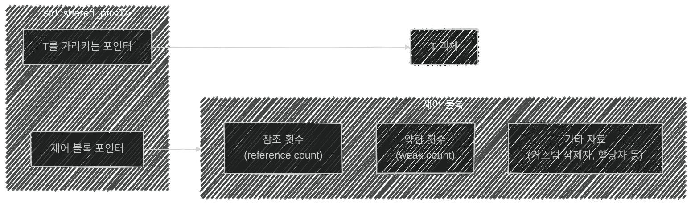

이 글은 아래의 책을 정리하였습니다.
이펙티브 모던 C++, 스콧 마이어스 저자, 류광 번역
{: .notice--warning}

가독성이 떨어지는 직역들을 수정하며 정리하였습니다.
e.g. 연역 → 추론, 중복적재 → 오버로딩
{: .notice--info}

# 📦 4. 똑똑한 포인터
## 👉🏻 항목 19: 소유권 공유 자원의 관리에는 std::shared_ptr를 사용하라

### 🔍 std::shared_ptr란?

- `std::shared_ptr`를 통해서 접근되는 객체의 수명은 **공유된 소유권(shared ownership)** 개념을 통해서 관리된다.
- 특정 하나의 `std::shared_ptr`가 객체를 소유하는 것이 아니다. 모든 `std::shared_ptr`는 객체가 더 이상 필요하지 않게 된 시점에서 객체가 파괴됨을 보장하기 위해 협동한다.
- 객체를 가리키던 마지막 `std::shared_ptr`가 객체를 더 이상 가리키지 않게 되면, 그 `std::shared_ptr`는 자신이 가리키는 객체를 파괴한다.
- 쓰레기 수거처럼 클라이언트는 공유 포인터가 가리키는 객체의 수명에 신경 쓸 필요가 없다. 그러나 소멸자처럼, 객체의 파괴 시점은 결정론적이다.

---

### 📊 참조 횟수(Reference Count)

`std::shared_ptr`는 **참조 횟수(reference count)**를 통해 자신이 가리키는 마지막 공유 포인터임을 안다.

- `std::shared_ptr`의 생성자는 참조 횟수를 증가시키고(항상 그런 것은 아님), 소멸자는 감소시킨다.
- 복사 대입 연산자는 증가와 감소를 모두 수행한다.
- 어떤 `std::shared_ptr`가 자원의 참조 횟수를 감소한 후 그 횟수가 0이 되었다면, 그 자원을 가리키는 `std::shared_ptr`가 더 이상 없다는 뜻이므로 자원을 파괴한다.

**참조 횟수 관리가 성능에 미치는 영향:**

- **`std::shared_ptr`의 크기는 생 포인터의 두 배다.** 내부적으로 자원을 가리키는 생 포인터뿐만 아니라 자원의 참조 횟수를 가리키는 생 포인터도 저장해야 하기 때문이다.
- **참조 횟수를 담을 메모리를 반드시 동적으로 할당해야 한다.** 개념적으로 참조 횟수는 공유 포인터가 가리키는 객체에 연관된 것이지만, 그 객체 자체는 참조 횟수를 전혀 알지 못한다. 따라서 객체는 참조 횟수를 담을 장소를 따로 마련하지 않는다.
- **참조 횟수의 증가와 감소가 반드시 원자적 연산이어야 한다.** 여러 스레드가 참조 횟수를 동시에 읽고 쓸 수 있기 때문이다. 원자적 연산은 비원자적 연산보다 느리므로, 참조 횟수가 워드 하나 크기라고 해도 그것을 읽고 쓰는 연산이 비교적 느릴 것이라고 가정해야 마땅하다.

**이동 생성 시 참조 횟수가 증가하지 않는 이유:**

- 기존의 `std::shared_ptr`를 이동해서 새 `std::shared_ptr`를 생성하면, 원본은 널이 된다. 따라서 복사 시에는 참조 횟수를 증가해야 하지만 이동 시에는 증가할 필요가 없다.
- 이동 생성이 복사 생성보다 빠르고, 이동 대입이 복사 대입보다 빠른 이유가 바로 이것이다.

---

### 🗑️ 커스텀 삭제자

`std::unique_ptr`처럼 `std::shared_ptr`도 `delete`를 기본적인 자원 파괴 메커니즘으로 사용하며, 커스텀 삭제자도 지원한다. 그러나 **삭제자를 지원하는 구체적인 방식이 다르다.**

```cpp
auto loggingDel = [](Widget *pw)   // 커스텀 삭제자
                  {                // (항목 18의 것과 같음)
                      makeLogEntry(pw);
                      delete pw;
                  };

std::unique_ptr<                   // 삭제자의 타입이
    Widget, decltype(loggingDel)   // 포인터 타입의 일부임
    > upw(new Widget, loggingDel);

std::shared_ptr<Widget>            // 삭제자의 타입이
    spw(new Widget, loggingDel);   // 포인터 타입의 일부가 아님
```

- **`std::unique_ptr`에서는** 삭제자의 타입이 똑똑한 포인터 타입의 일부다.
- **`std::shared_ptr`에서는** 삭제자의 타입이 포인터 타입의 일부가 아니다. → 더 유연하다.

```cpp
auto customDeleter1 = [](Widget *pw) { … };  // 커스텀 삭제자들,
auto customDeleter2 = [](Widget *pw) { … };  // 타입은 서로 다름

std::shared_ptr<Widget> pw1(new Widget, customDeleter1);
std::shared_ptr<Widget> pw2(new Widget, customDeleter2);

// pw1과 pw2는 같은 타입이므로 같은 컨테이너에 넣을 수 있다
std::vector<std::shared_ptr<Widget>> vpw{ pw1, pw2 };
```

- 커스텀 삭제자를 지정해도 `std::shared_ptr` 객체의 크기가 변하지 않는다. 삭제자와 무관하게 `std::shared_ptr` 객체의 크기는 항상 포인터 두 개 분량이다.

---

### 🏗️ 제어 블록(Control Block)

참조 횟수는 사실 **제어 블록(control block)**이라고 부르는 더 큰 자료구조의 일부다.



- `std::shared_ptr`가 관리하는 객체당 하나의 제어 블록이 존재한다.
- `std::shared_ptr` 생성 시 커스텀 삭제자를 지정했다면, 참조 횟수와 함께 그 커스텀 삭제자의 복사본이 제어 블록에 담긴다.

**제어 블록이 생성되는 시점에 관한 규칙:**

- **`std::make_shared`(항목 21 참고)는 항상 제어 블록을 생성한다.** 새로운 객체에 대한 제어 블록이 이미 존재할 가능성은 전혀 없다.
- **고유 소유권 포인터(`std::unique_ptr`, `std::auto_ptr`)로부터 `std::shared_ptr` 객체를 생성하면 제어 블록이 생성된다.** 고유 소유권 포인터는 제어 블록을 사용하지 않으므로, 가리키는 객체에 대한 제어 블록이 이미 존재할 가능성은 전혀 없다.
- **생 포인터로 `std::shared_ptr` 생성자를 호출하면 제어 블록이 생성된다.** 이미 제어 블록이 있는 객체로부터 `std::shared_ptr`를 생성하고 싶다면, 생 포인터가 아니라 `std::shared_ptr`나 `std::weak_ptr`를 생성자의 인수로 지정하면 된다.

**⚠️ 하나의 생 포인터로 여러 개의 `std::shared_ptr`를 생성하면:**

```cpp
auto pw = new Widget;                              // pw는 생 포인터

std::shared_ptr<Widget> spw1(pw, loggingDel);     // *pw에 대한 제어 블록이 생성됨
std::shared_ptr<Widget> spw2(pw, loggingDel);     // *pw에 대한 두 번째 제어 블록이 생성됨!
```

- `pw`에는 두 개의 참조 횟수가 있게 된다. 두 참조 횟수 모두 결국에는 0이 될 것이며, 그러면 `pw`의 파괴가 두 번 시도된다. → **미정의 행동**
- **생 포인터 변수를 `std::shared_ptr` 생성자의 인수로 사용하지 말 것.** 대신 `new`의 결과를 직접 전달하라.

```cpp
std::shared_ptr<Widget> spw1(new Widget, loggingDel); // new를 직접 사용
std::shared_ptr<Widget> spw2(spw1);                   // spw2는 spw1과 동일한 제어 블록을 사용
```

---

### 🔗 std::enable_shared_from_this

`this` 포인터를 이용해서 `std::shared_ptr`를 안전하게 생성하려면 `std::enable_shared_from_this`를 사용한다.

```cpp
class Widget : public std::enable_shared_from_this<Widget> {
public:
    // 팩터리 함수; 인수들을 전용 생성자에 완벽하게 전달한다
    template<typename... Ts>
    static std::shared_ptr<Widget> create(Ts&&... params);

    void process();
    …

private:
    …  // 생성자들
};
```

```cpp
void Widget::process()
{
    // 이전과 마찬가지로 Widget을 처리
    …

    // 현재 객체를 가리키는 std::shared_ptr를 processedWidgets에 추가
    processedWidgets.emplace_back(shared_from_this());
}
```

- `std::enable_shared_from_this`는 현재 객체를 가리키는 `std::shared_ptr`를 생성하되 제어 블록을 복제하지 않는 멤버 함수 `shared_from_this()`를 정의한다.
- `shared_from_this()`는 현재 객체에 대한 제어 블록을 조회하고, 그 제어 블록을 가리키는 새 `std::shared_ptr`를 생성한다. 따라서 이 함수를 호출하는 시점에서 현재 객체를 가리키는 기존의 `std::shared_ptr`가 반드시 존재해야 한다.
- 이를 보장하기 위해 `std::enable_shared_from_this`를 상속받은 클래스는 자신의 생성자들을 `private`으로 선언하고, 클라이언트가 객체를 생성할 수 있도록 `std::shared_ptr`를 돌려주는 팩터리 함수를 제공한다.

---

### 💡 비용 vs 이점

제어 블록이 동적으로 할당되고, 삭제자와 할당자가 얼마든지 클 수 있고, 가상 함수 메커니즘이 쓰이고, 참조 횟수를 원자적으로 조작해야 한다는 사실이 부담스럽게 느껴질 수 있다.

그러나 **전형적인 경우, 즉 기본 삭제자와 기본 할당자가 쓰이며 `std::make_shared`로 생성하는 경우:**

- 제어 블록의 크기는 워드 세 개 정도
- 할당은 본질적으로 무료 (가리키는 객체를 위한 메모리와 함께 할당)
- `std::shared_ptr`의 역참조 비용은 생 포인터의 역참조 비용보다 크지 않음
- 참조 횟수 조작을 요구하는 연산(복사 생성, 복사 대입, 객체 파괴)에는 원자적 연산 한두 개가 더 소비되나, 각각 하나의 기계어 명령에 대응

이러한 비용을 치르는 대신, 동적 할당 자원의 수명이 자동으로 관리된다는 이득이 생긴다.

---

### 🧐 정리

- **`std::shared_ptr`는 임의의 공유 자원의 수명을 편리하게 관리할 수 있는 수단을 제공한다.**
- 대체로 `std::shared_ptr` 객체는 그 크기가 `std::unique_ptr` 객체의 두 배이며, 제어 블록에 관련된 추가 부담을 유발하며, 원자적 참조 횟수 조작을 요구한다.
- 자원은 기본적으로 `delete`를 통해 파괴되나, **커스텀 삭제자**도 지원된다. 삭제자의 타입은 `std::shared_ptr`의 타입에 아무런 영향도 미치지 않는다.
- **생 포인터 타입의 변수로부터 `std::shared_ptr`를 생성하는 일은 피해야 한다.**
