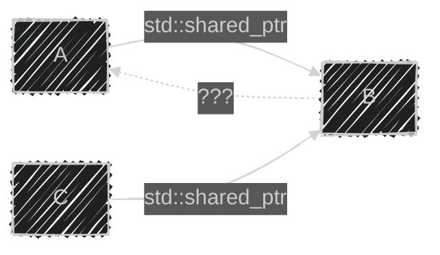

이 글은 아래의 책을 정리하였습니다.
이펙티브 모던 C++, 스콧 마이어스 저자, 류광 번역
{: .notice--warning}

가독성이 떨어지는 직역들을 수정하며 정리하였습니다.
e.g. 연역 → 추론, 중복적재 → 오버로딩
{: .notice--info}

# 📦 4. 스마트 포인터
## 👉🏻 항목 20: std::shared_ptr처럼 작동하되 대상을 잃을 수도 있는 포인터가 필요하면 std::weak_ptr를 사용하라

### 🔍 std::weak_ptr란?

- `std::shared_ptr`처럼 행동하되 **가리키는 대상의 소유권 공유에는 참여하지 않는** 포인터가 필요한 경우가 있다.
- `std::weak_ptr`는 `std::shared_ptr`를 보강하는 포인터로, 가리키는 객체의 **참조 횟수에 영향을 주지 않는다.**
- `std::weak_ptr` 자체로는 역참조할 수 없으며, 널인지 확인할 수도 없다. 독립적인 스마트 포인터가 아니기 때문이다.
- `std::weak_ptr`는 가리키는 대상이 이미 파괴되었을 수도 있다는 문제, 즉 **대상을 잃은(expired) 상황을 감지**할 수 있어야 한다.

---

### 🏗️ std::weak_ptr 생성

대체로 `std::weak_ptr`는 `std::shared_ptr`를 이용해서 생성한다.

```cpp
auto spw =
    std::make_shared<Widget>();  // spw가 생성된 후, 가리키는 Widget의
                                 // 참조 횟수는 1이다

std::weak_ptr<Widget> wpw(spw); // wpw는 spw와 같은 Widget을 가리킨다;
                                 // 참조 횟수는 여전히 1이다

spw = nullptr;                   // 참조 횟수가 0이 되고 Widget이 파괴된다;
                                 // 이제 wpw는 대상을 잃은 상태다
```

- 만료 여부를 직접 확인할 수 있다.

```cpp
if (wpw.expired()) …  // wpw가 객체를 가리키지 않으면...
```

---

### 🔒 std::weak_ptr에서 std::shared_ptr 생성

만료 여부 점검과 가리키는 객체에 대한 접근을 **하나의 원자적 연산**으로 수행해야 한다. 만료 점검과 역참조를 분리하면 경쟁 조건이 발생할 수 있기 때문이다.

**방법 1: `lock()` 멤버 함수 사용**

```cpp
std::shared_ptr<Widget> spw1 = wpw.lock(); // wpw가 만료이면 spw1은 널

auto spw2 = wpw.lock();                    // 위와 동일하나 auto를 사용했음
```

**방법 2: `std::weak_ptr`를 인수로 받는 `std::shared_ptr` 생성자 사용**

```cpp
std::shared_ptr<Widget> spw3(wpw); // wpw가 만료이면 std::bad_weak_ptr가 발생
```

---

### ✅ std::weak_ptr의 활용 사례

**사례 1: 캐싱(Caching)**

팩터리 함수가 돌려준 객체를 클라이언트가 다 사용하고 나면 파괴되는데, 해당 캐시 항목은 대상을 잃게 된다. 따라서 캐시에 저장할 포인터는 자신이 대상을 잃었음을 감지할 수 있는 포인터, 즉 `std::weak_ptr`이어야 한다.

```cpp
std::shared_ptr<const Widget> fastLoadWidget(WidgetID id)
{
    static std::unordered_map<WidgetID,
                              std::weak_ptr<const Widget>> cache;

    auto objPtr = cache[id].lock(); // 캐시에 있는 객체를 가리키는
                                    // std::shared_ptr (캐시에 없으면 널)

    if (!objPtr) {                  // 캐시에 없으면
        objPtr = loadWidget(id);    // 적재하고
        cache[id] = objPtr;         // 캐시에 저장
    }
    return objPtr;
}
```

**사례 2: 관찰자(Observer) 패턴**

관찰자 패턴의 주된 구성 요소는 관찰 대상(subject; 상태가 변할 수 있는 객체)과 관찰자(observer; 상태 변화를 통지받는 객체)이다. 관찰 대상에 합당한 설계 하나는, 관찰자들을 가리키는 `std::weak_ptr`들의 컨테이너를 자료 멤버로 두는 것이다. 그러면 먼저 만료 여부를 보고 관찰자가 유효한지 점검한 후에 관찰자에 접근할 수 있다.

**사례 3: std::shared_ptr 순환 고리 방지**

객체 A, B, C로 이루어진 자료구조에서 A와 C가 B의 소유권을 공유하고, B에서 다시 A를 가리키는 포인터가 필요한 상황을 생각해 보자.



B에서 A를 가리키는 포인터의 선택지:

- **raw 포인터:** A가 파괴되면 B가 가진 포인터는 대상을 잃게 되나, B는 그 사실을 알지 못한다. 미정의 행동 발생 가능.
- **`std::shared_ptr`:** A와 B가 서로를 가리키는 순환 고리가 생겨 A와 B 둘 다 파괴되지 못한다. → 누수 발생.
- **`std::weak_ptr`:** A가 파괴되면 A를 가리키는 B의 포인터가 대상을 잃지만, B는 그 사실을 알 수 있다. 더 나아가 B의 포인터는 A의 참조 횟수에 영향을 미치지 않으며, `std::shared_ptr`들이 더 이상 A를 가리키지 않게 되면 A가 정상적으로 파괴된다. → **`std::weak_ptr`가 제일 나은 선택.**

> 트리처럼 엄격히 계층적인 자료구조에서는 일반적으로 자식 노드들을 오직 그 부모만 소유한다. 부모에서 자식으로의 링크는 일반적으로 `std::unique_ptr`로 표현하는 것이 최선이다. 자식에서 부모로의 역링크(backlink)는 raw 포인터로 구현해도 안전하다. 자식 노드의 수명이 부모의 수명보다 길 수는 없기 때문이다.
> 

---

### 📊 성능 특성

- `std::weak_ptr` 객체는 그 크기가 `std::shared_ptr` 객체와 같다.
- `std::shared_ptr`가 사용하는 것과 같은 제어 블록(항목 19 참고)을 사용한다.
- 생성, 파괴, 대입 같은 연산에 원자적 참조 횟수 조작이 관여한다.
- 단, `std::weak_ptr`는 객체의 소유권 공유에 참여하지 않으며, **가리키는 객체의 참조 횟수에 영향을 미치지 않는다.** 제어 블록에는 '두 번째' 참조 횟수가 있으며, 그것이 바로 `std::weak_ptr`가 조작하는 참조 횟수다. (항목 21 참고)

---

### 🧐 정리

- **`std::shared_ptr`처럼 작동하되 대상을 잃을 수도 있는 포인터가 필요하면 `std::weak_ptr`를 사용**하라.
- `std::weak_ptr`의 잠재적인 용도로는 **캐싱, 관찰자 목록, 그리고 `std::shared_ptr` 순환 고리 방지**가 있다.
