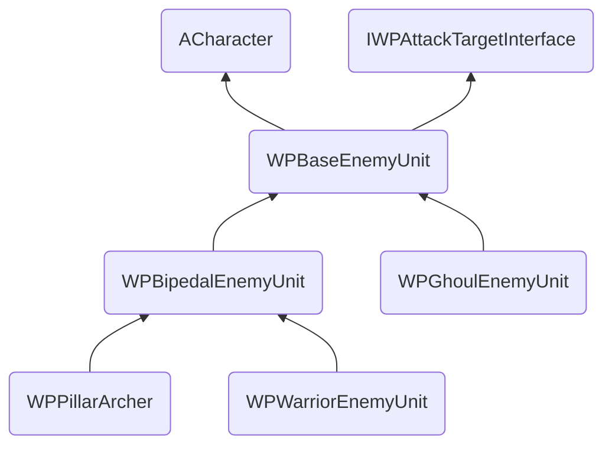

# **1. 클래스 구조 🏗️**

- 유지보수성과 확장성을 위해 상속 기반으로 클래스 계층 구조를 만들었다.

## **1.1. 몬스터 C++ 상속 구조**

### ✅ 일반 몬스터



**📌 상속 구조**

| 클래스 | 상속 | 설명 |
| --- | --- | --- |
| WPBaseEnemyUnit | ACharacter  
IWPAttackTargetInterface | 최상위 기반 추상 클래스 |
| WPBipedalEnemyUnit | WPBaseEnemyUnit | 이족보행 추상 클래스 |
| WPGhoulEnemyUnit | WPBaseEnemyUnit | 구울을 구현하기 위한 클래스 |
| WPWarriorEnemyUnit | WPBipedalEnemyUnit | 좀비, 오크 등을 구현하기 위한 클래스 |
| WPPillarArcher | WPBipedalEnemyUnit | 후드 아처을 구현하기 위한 클래스 |

> IWPAttackTargetInterface
> 
- 각종 스텟, 공격/피격 처리, 생존 여부, 치명타 부위 등을 인터페이스로 명세한다.

**📌 블루프린트를 통한 확장**

| 클래스 | 블루프린트 | 설명 |
| --- | --- | --- |
| WPWarriorEnemyUnit | BP_WPOrcShieldWarrior
BP_WPOrcArcher  
BP_WPOrcSorcerer
BP_WPZombie | WPShieldComponent를 부착, 애니메이션, 스탯(e.g. 공격력, 방어력)  설정 |
| WPGhoulEnemyUnit | BP_WPArmorGhoul | 구울 전용 애니메이션, 스탯 설정 |
| WPPillarArcher | BP_HoodOrcArcher | 엄폐물 탐색 BT Task 연동, 스탯 설정 |

---

### ✅ 보스 몬스터

<div class="mermaid">
---
config:
  layout: elk
---
flowchart BT
		A("ACharacter")
		B("IWPAttackTargetInterface")
		C("IWPBossInterface")
    
	  B1("WPSwordMasterBoss") --> A
	  B1 --> B
	  B1 --> C
</div>

**📌 상속 구조**

| 클래스 | 상속 | 설명 |
| --- | --- | --- |
| WPSwordMasterBoss | ACharacter  
IWPAttackTagetInterface  
IWPBossInterface | 보스의 공격/피격시 행동, 패턴등을 구현한다. |

> IWPBossInterface
> 
- 보스 스폰 여부를 인터페이스로 선언한다.

**📌 블루프린트를 통한 확장**

| 클래스 | 블루프린트 | 설명 |
| --- | --- | --- |
| WPSwordMasterBoss | BP_WPSwordMaster | 애니메이션, 스탯 등을 설정한다. |

## **1.2. 컴포넌트 기반 기능 분리 및 재사용**

- WPShieldComponent
    - 방패 스탯과 내구도 관리 등 SRP에 따라 기능을 컴포넌트로 분리하였다.
    - 다양한 유닛의 블루프린트에 컴포넌트만 추가하여 재사용할 수 있다.
    - 예로 BP_WPOrcShieldWarrior가 있다.

# **2. AI 로직 🤖**

## 2.1. 비헤이비어 트리: 경계도(Alertness) 기반


<div class="mermaid">
---
config:
  layout: dagre
---
flowchart TB
    root(["root"]) --> levelCheck["경계도 체크"]
    levelCheck --> high["경계도 높음"] & mid["경계도 중간"] & low["경계도 낮음"]
    high --> outRange["공격 사거리 밖"] & inRange["공격 사거리 안"]
    inRange --> canAttack["공격 가능"] & cantAttack["공격 불가능"]
    canAttack --> canAttackAction["공격"]
    cantAttack --> cantAttackAction["적유닛 enum 값에 따른<br>공격 불가능 처리"]
    outRange --> moveAction["적유닛 bool 값에 따른<br>예상 위치로 이동 또는 경계"]
    mid --> midAction["적유닛 enum 값에 따른<br>경계 임무 수행"]
    low --> lowAction["적유닛 enum 값에 따른<br>방심 임무 수행"]
</div>

- 데코레이터, 서비스, 태스크를 직접 만들어, 비헤이비어 트리를 구성하였다.

### ✅ 동작 원리

- 몬스터의 청각/시각을 통해 주변을 감지한다.
- 플레이어의 소리를 듣거나, 발견하면 경계도가 올라간다.
- 경계도 범위
    - 높음(300~500)
    - 중간(200~300)
    - 낮음(0~200)
- 각 경계도에는 행동 종류가 있다.
- 시간이 지날수록, 경계도는 점점 떨어진다.

### ✅ 경계도에 따른 행동 수행

- 낮음
    - 대기: 제자리에 서있는다.
    - 회전: 제자리에서 주위를 둘러본다.
    - 랜덤 이동: 주위를 랜덤하게 이동한다.
    - 패트롤: 지정된 경로를 따라 움직인다.
- 중간
    - 경계: 플레이어 예상 위치 주시
    - 추적: 플레이어 예상 위치로 이동하고, 도착 시 경계도를 대폭 완화한다.
    - 사람 추적: 플레이어 예상 위치로 자신의 사거리까지 이동하고, 주위를 배회한다.
- 높음
    - 사거리 안이며 레이캐스트 시 플레이어가 최초로 맞는다면, 공격
    - 사거리 밖이라면, 공격 불가능 처리
    - 공격 불가능 처리
        - 돌격: 플레이어의 예상 위치로 이동한다.
        - 무조건 공격:  타격이 불가능한 상황이라도, 일단 공격한다.
        - 제자리 경계: 제자리에서 주위를 둘러본다.
        - 랜덤 이동: 주위를 랜덤하게 이동한다.
    

> 개체 별로 각 경계도마다 하나의 행동이 지정되어 있다.
> 

## 2.2. 청각/시각 감지

```cpp
void AWPBaseEnemyUnitAIController::OnTargetPerceptionUpdated(AActor* Actor, FAIStimulus Stimulus)
{
	if (Actor == nullptr)
	{
		// 로그 출력
		UE_LOG(LogTemp, Warning, TEXT("AIController: Actor is nullptr"));
		return;
	}

	// 시각 감지
	if (Stimulus.Type == UAISense::GetSenseID(UAISense_Sight::StaticClass()))
	{
		// 만약 Actor가 Player 태그를 가지고 있다면
		if (Actor->ActorHasTag("Player") && !bIsPlayerInSight)
		{
			// BrainComponent가 멈춰있는 상태라면,
			if (!BrainComponent->IsRunning()) {
				StopMovement();
			}

			StopMovement();

			bIsPlayerInSight = true;
			// 로그 출력
			UE_LOG(LogTemp, Warning, TEXT("I See Player"));
			GetWorld()->GetTimerManager().ClearTimer(SightTimerHandle);
			GetBlackboardComponent()->SetValueAsObject(FName(TEXT("Player")), Actor);
			EnemyPawn->TimeSinceLastSighted = 0.0f;
			EnemyPawn->AlertnessLevel = 400.0f;
			GetWorld()->GetTimerManager().ClearTimer(DecreaseAlertTimerHandle);
			
		}
		else if (Actor->ActorHasTag("Player") && bIsPlayerInSight) {
			UE_LOG(LogTemp, Warning, TEXT("DecreaseAlert"));
			// 타이머를 사용하여 LastPredictedPlayerLocationTime을 1초마다 1씩 증가시킨다.
			GetWorld()->GetTimerManager().SetTimer(SightTimerHandle, this, &AWPBaseEnemyUnitAIController::SightLostTrack, 1.f, true);
			bIsPlayerInSight = false;
		}

	}

	// 소리 감지
	if (Stimulus.Type == UAISense::GetSenseID(UAISense_Hearing::StaticClass()))
	{
		if (Actor->ActorHasTag("Player")) {
			if (!BrainComponent->IsRunning()) {
				StopMovement();
			}

			// 로그 출력
			UE_LOG(LogTemp, Warning, TEXT("I Hear Player Sound"));
			EnemyPawn->AlertnessLevel = 400.0f;

			GetBlackboardComponent()->SetValueAsVector(FName(TEXT("PredictedPlayerLocation")), Stimulus.StimulusLocation);
		}
	}
}

void AWPBaseEnemyUnitAIController::SightLostTrack() {
	// TimeSinceLastSighted와 SightLostTrackDuration을 출력
	UE_LOG(LogTemp, Warning, TEXT("TimeSinceLastSighted: %f"), EnemyPawn->TimeSinceLastSighted);
	UE_LOG(LogTemp, Warning, TEXT("SightLostTrackDuration: %f"), EnemyPawn->SightLostTrackDuration);
	if (EnemyPawn->TimeSinceLastSighted >= EnemyPawn->SightLostTrackDuration) {
		// 로그 출력
		UE_LOG(LogTemp, Warning, TEXT("Clear Player"));
		GetBlackboardComponent()->SetValueAsBool(FName(TEXT("IsPredictedPlayerLocationValid")), false);
		GetBlackboardComponent()->ClearValue(FName(TEXT("Player")));
		
		GetWorld()->GetTimerManager().SetTimer(DecreaseAlertTimerHandle, this, &AWPBaseEnemyUnitAIController::DecreaseAlert, 0.2f, true);
	}
	EnemyPawn->TimeSinceLastSighted++;
}
```

- WPBaseEnemyUnitAIController 코드의 일부이다.

### ✅ 구현

- 언리얼의 **감각 시스템**인 `Perception`을 사용하여 구현하였다.
- `!BrainComponent→IsRunning()` 코드가 있는 이유
    - 플레이어와 몬스터가 멀리 떨어져 있다면, BT를 수행하지 않도록 하였기 때문이다.

1. 청각/시각을 통해 플레이어를 감지하는 경우
    - 시각을 통해 플레이어를 감지하면, 플레이어를 블랙보드에 저장한다.
    - 청각을 통해 플레이어를 감지하면, 해당 위치를 플레이어의 예상 위치로 잡는다.
2. 플레이어가 벽 뒤로 숨더라도, 지정된 시간동안은 절대 시각을 가진다.
    - 마법사의 벽 너머 범위 공격를 구현하기 위함
3. 지정된 시간이 지나면 몬스터는 플레이어의 위치를 잃는다.

## 2.3. 후드 아처(PillarArcher) - 중단

<div class="mermaid">
---
config:
  layout: dagre
---
flowchart TB
    root(["root"]) --> sel["select"]
    sel --> outSelect@{ label: "select<br><span style=\"color:red\">사거리 밖</span>" } & seq["sequence"]
    outSelect --> block["기둥 반대편 엄폐"]
    seq --> simpleP["simplePareller"] & moveNext["다음 기둥으로 이동"]
    simpleP --> attack["공격"] & moveToShot["사격 위치로 이동"]
    outSelect@{ shape: rect}
</div>

- 기둥 구조물로 엄폐하며 싸우는 후드 아처가 다음 개발에 예정되어 있었다.
    - 일부 구현되어있었다.
    - 하지만, 텀블벅에 올린 펀딩 금액 부족으로 중단되었다.
    

# 3. 애니메이션 ▶️

## 3.1. 애님 그래프


- 하체는 플레이어의 블렌드 스페이스를 활용한다.
    - 탑다운뷰 게임이기에, 하체는 크게 필요없기 때문
- 상체는 몬스터의 경계도에 따라, 애니메이션이 달라진다.
    - 상체 결과 값은  ‘AnimState’라고 이름붙여진 State Machine에서 받는다.
- 상체와 하체를 블렌드하여, 전체 애니메이션을 만든다.
- 몬스터가 죽은 경우, ‘죽음’ 애니메이션을 실행하도록 한다.
    - 원래는 애니메이션 몽타주를 활용하려 하였으나, bool값에 따른 포즈를 출력하도록 만들었다.

## 3.2. 애님 스테이트


```cpp
void UWPBipedalAnimInstance::NativeBeginPlay() {
	...
	AIController = Cast<AAIController>(EnemyUnit->GetController());
	BlackboardComponent = AIController->GetBlackboardComponent();

	// BaseEnemyUnit -> BipedalAnimInstance로 클립 전달
	// 이를 통해 하나의 AnimInstance로 여러 유닛의 애니메이션을 처리할 수 있다.
	IdleUpperBodyAnimClip = EnemyUnit->IdleUpperBodyAnimClip;
	AlertUpperBodyAnimClip = EnemyUnit->AlertUpperBodyAnimClip;
	AttackAnimClips = EnemyUnit->AttackAnimClips;
}
```

- 몬스터의 경계도에 따른 상체 애니메이션 전환을 구현했다.
    - 블랙보드의 값에 따라, 애니메이션이 전환된다.
    - 유닛에 맞는 애니메이션 클립이 실행된다.

## 3.3. 애니메이션 노티파이


```cpp
...
void UWPBipedalAnimInstance::AnimNotify_OnDealDamageShapecast() {
	// BlackboardComponent에 IsAttackStart를 true로 설정한다.
	BlackboardComponent->SetValueAsBool(TEXT("IsAttackStart"), true);
	FVector PredictedPlayerLocation = BlackboardComponent->GetValueAsVector(TEXT("PredictedPlayerLocation"));

	if (EnemyUnit->AttackSound) {
		UGameplayStatics::PlaySoundAtLocation(GetWorld(), EnemyUnit->AttackSound, EnemyUnit->GetActorLocation());
	}

	TArray<IWPAttackTargetInterface*> Targets;

	AWPPlayerActor* Player = Cast<AWPPlayerActor>(UGameplayStatics::GetPlayerCharacter(GetWorld(), 0));
	Targets.Add(Player);

	float Damage = EnemyUnit->AttackDamageAndPierce[EnemyUnit->AttackToPerform].Damage;
	float Pierce = EnemyUnit->AttackDamageAndPierce[EnemyUnit->AttackToPerform].Pierce;

	// 본인의 위치에서 전방으로 100.f만큼의 거리에 대해 공격한다.
	EnemyUnit->ShapecastAttack(EnemyUnit, FCollisionShape::MakeSphere(100.f), EnemyUnit->GetActorLocation() + EnemyUnit->GetActorForwardVector() * 100.f, Damage, Pierce, Targets, TArray<IWPAttackTargetInterface*>(), { TEXT("bleeding"),TEXT("poison") }, {Damage*EnemyUnit->BleedingAmount,EnemyUnit->PoisonAmount});
}

void UWPBipedalAnimInstance::AnimNotify_OnAttackEnd() {
	bIsAttacking = false;

	EnemyUnit->AttackEnd();
}
```

- WPBipedalAnimInstance 코드의 일부이다.
- 공격 애니메이션에는 실제로 공격을 시도하는 타이밍이 필요하다.
- 예를 들어, 칼을 휘두르고 있는 애니메이션 시작되자 말자 대미지가 들어오면 부자연스럽다.
- 그러므로, 애니메이션 노티파이를 사용하여 실제 공격 타이밍을 지정해주었다.

# 4. 사운드 🔊


- 여러 사이트를 돌아다니며, 각 몬스터에 맞는 소리를 찾았다.
    - 피격, 공격, 사망, 숨소리, 방패 파괴, 스펠 등등..
    - 원하는 소리가 없거나, 찾기 힘들었다.
    - 언리얼의 사운드 큐를 활용하여, 소리에 변형을 주거나 랜덤으로 출력하였다.

### ✅ 구현


<audio controls>
  <source src="{{ '/assets/audio/game_dev/portfolio/JAD_EnemyUnit/jad_zombie_die.mp3' | relative_url }}" type="audio/mp3">
</audio>

- 모듈레이터를 통해 피치, 볼륨을 랜덤하게 낼 수 있도록 했다.
- 소리 클립을 랜덤하게 가져온다.

# 5. 어려웠던 점 🤔

## 📌 에디터 뷰 한정 문제


- 문제
    - 적 유닛의 블루프린트 뷰포트에서 기본 Idle 애니메이션이 재생되지 않는 문제가 있다.

- 이유
    - 이는 애니메이션 블루프린트와 적 유닛 블루프린트가 1:N으로 연결되어 있기 때문이다.
    
    
    
    - 1:1로 애니메이션 블루프린트를 대응해준다면 충분히 해결 가능한 문제이다.