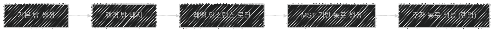

# 1. 맵 생성 🌍


## 📌 특징

- 5x5 그리드 기반
- 1x1, 1x2, 2x1, 2x2 방을 조합하여, 그리드에 배치
- 모든 방이 연결되어, 단일 그래프 보장(MST)
- 필요 시, 추가 통로를 생성한다.

# 2. 맵 생성 프로세스 🏃🏻‍♂️‍➡️



```cpp
// Called when the game starts or when spawned
void AWPArenaMapGenerator::BeginPlay()
{
	Super::BeginPlay();

	UWPPlayerSaveGame* PlayerSaveGame = Cast<UWPPlayerSaveGame>(UGameplayStatics::LoadGameFromSlot(Cast<UWPGameInstance>(GetGameInstance())->PlayerSlot, 0));
	Floor = PlayerSaveGame->CurrentFloor;

	ArenaPlacementInit();
	GenerateArenas();

	ConnectArenasMST();
	// ConnectAdditionalPaths()는 MST만으로도 충분하여, 호출X
	GeneratePaths();
}
```

## 🛠️ 데이터 구조 & C++ 설계

| 구조체/클래스 | 역할 | 핵심 필드 | 설명 |
| --- | --- | --- | --- |
| WPArena | - 방 정보 저장 | - 방 ID<br>- 방 타입<br>- 방 위치<br>- 연결통로[]<br>- 포함 아이콘 | 방 정보를 저장하는 역할만 한다. |
| WPArenaMapGenerator | - 전체 맵 생성 | - ArenaPlacement[][]<br>- Arenas[]<br>- 통로 위치[]<br>- 현재 층 | 블루프린트로 만들어, 레벨에 포함시킨다.<br>현재 층에 따라, 테마와 보스가 바뀐다. |
| WPPath | - 방 사이 통로 | - 통로 ID | 생성 시, `Path`와 겹쳐있으며 통로벽 변수가 true인 `WallActor` 제거 |
| WPWallActor | - 일반 벽/통로 벽 | - 통로벽 여부 | 일반적으로 벽이지만, 통로벽 여부 변수에 따라 통로가 될 수 있다. |

## 2.1. 기본 방 생성

- 다음 과정을 수월하게 하기 위해, 더미 방을 5x5 그리드의 바깥에 생성한다.
    - ArenaPlacement[7][7] 변수에 저장한다.
    - OutOfBoundsException을 피하기 위함
    

## 2.2. 랜덤 방 배치

### A. 일반 방


- 1, 2, 4칸짜리 방은 각각 **생성 확률**이 정해져 있다.
- 현재 층에 따라, 생성되는 방의 테마가 다르다.
- Room Types에는 `1Arena`, `2HorizontalArena`, `2VerticalArena`, `4Arena` 가 있다.
- 방들 중에 랜덤한 방을 선택한다.

**✅ 예시**

- 1층
- 1x2 형태의 방

→ `Game/Levels/1Floor/2HorizontalArena/` 폴더에서 랜덤한 레벨을 골라 생성한다.

### B. 보스 방

- 랜덤한 보스가 생성된다.
- `/Game/Levels/%dFloor/BossArena/` 폴더에서 랜덤한 레벨을 골라 생성한다.
- 보스 방은 사전에 지정한 위치에 생성된다.

## 2.3. 레벨 인스턴스 로딩

- 맵 생성 클래스에는 `OnLevelShown/OnAllLevelShown` 함수가 있다.
- 레벨을 생성할 때, 레벨 인스턴스로 저장해둔다.
- 레벨이 로드되면, 델리게이트에 의해 `OnLevelShown`을 호출한다.
- 모든 레벨이 로드되면, `OnAllLevelShown` 함수를 호출한다.

**📌 활용**

- 후드 아처(PillarArcher)가 사용할 기둥 배정
- 방에 어떤 몬스터가 있는지 알려주기 위한 아이콘 배정

## 2.4. MST 기반 통로 생성

```cpp
1. 모든 방을 아직 연결되지 않은 집합(NotConn)에 넣는다.
2. NotConn에서 무작위로 방 하나를 뽑아, 연결된 집합(Conn)으로 옮긴다.
   -> 이 방이 시작점이 된다.
3. NotConn이 비어있을 때까지:
	- Conn에서 랜덤으로 방 하나를 뽑는다.
	- 그 방의 상하좌우 인접한 방을 확인한다.
	- 인접한 방 중, NotConn에 있는 방이 있다면:
		-> 무작위로 하나를 고르고, 해당 방향에 통로를 뚫는다.
		-> 그리고 그 방을, NotConn에서 Conn으로 이동시킨다.
	- 인접한 방 중, NotConn에 있는 방이 없다면:
		-> Conn에서 뽑은 방을 Conn에서 제거한다.
```

> 이 과정을 통해, 전체 맵이 최소 간선 트리를 만족한다.
> 

## 2.5. 추가 통로 생성

- MST만으로 충분하여 구현하지는 않았다.

**📌 구현 방향**

1. 랜덤하게 생성
2. 연결된 이웃 수에 비례한 편향 랜덤

# 3. Fog of War(전장의 안개) ☁️


- 최적화를 위해 포스트 프로세스, Stencil, 쉐이더를 미사용하였다.
- 벽, 문과 같은 구조물의 상단에, 아주 높은 검은 벽을 배치하였다.
- 카메라 시점에서 **자연스러운 시야 차단**이 연출된다.

# 4. 어려웠던 점

## 📌 방 종류 개수 지정

- 원래는 방 종류마다 몇 개가 나올지 정해두는 방식으로 구현할 생각이었다.
- 하지만 문제가 있었다.

### **🚨 문제**

1. 1칸 1개, 2칸 0개, 4칸 6개와 같이 배치할 수 없는 경우가 발생한다.
    - 어떤 식으로든 배치할 수 없는 경우, 예외로 던져줘야 한다.
    - 예외 상황 파악을 최적화하기가 쉽지 않다!
2. 항상 방의 개수가 동일하게 되어, 경우의 수가 줄어든다.
    - 즉, 변형성이 줄어든다.
    - 전략이 될 수도 있기에 문제점이라고 하기 힘들수도 있다.

### 💡 해결

- 방 종류마다 확률을 정해두는 식으로 해결하였다.
- 5x5 그리드를 돌면서, 확률적으로 1/2/4칸 방 중에서 생성하도록 했다.

## 📌 몬스터 방 이동 제한

### 🚨 문제

- 지도를 보면 각 방마다 어떤 몬스터가 출현하는지, 아이콘으로 그려져 있다.
- 그런데, 몬스터는 문을 열 수 있다.
- 즉, 몬스터가 방을 옮겨다니는 상황이 생길 수 있다.
- 몬스터 AI가 자신의 방을 기억하고, 방 바깥으로 나가지 않도록 구현하는 것이 쉽지 않았다.

### 💡 해결

- 레벨마다 LevelBounds를 배치하였다.
- LevelBounds 바깥으로 나가는지 검사하도록 하였다.

## 📌 후드 아처 기둥 배정

### 🚨 문제

- 각 몬스터는 방에 사전 배치한다.
- 후드 아처는 기둥을 끼고, 옮겨가며 지능적으로 싸운다.
- **다른 방이 아닌, 현재 방에 있는 기둥**들을 후드 아처에게 배정하는 방법이 쉽지 않았다.

### 💡 해결

- 현재 맵에 있는 모든 기둥과 후드 아처들을 가져왔다.
- 두 객체가 같은 레벨(방)에 존재한다면, 기둥을 아처에게 배정하도록 구현하였다.
    - 이때는 더 좋은 방법을 생각하지 못했다.

### 🤔 더 나은 방안

- 위의 해결 방법은 GetAllActorsOfClass 함수, 이중포문을 사용하여 최적화에 좋지 않다!
- 레벨 인스턴스를 활용하면, 기둥과 후드 아처들을 쉽게 가져올 수 있다.