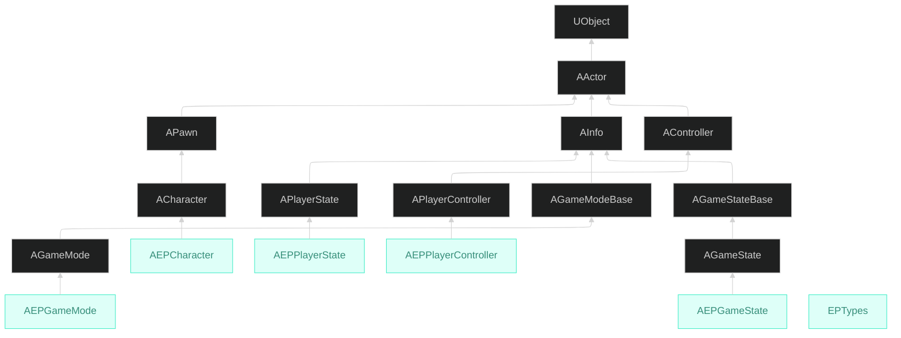

📌 EmploymentProj의 GameplayFramework에 대해 알아보는 포스트  
🚨 완성된 포스트가 아니므로, 지속적으로 수정됩니다!  
[👾 깃허브](https://github.com/SoftHamzzi/UE5-EmploymentProj)  
[📋 기획](https://github.com/SoftHamzzi/UE5-EmploymentProj/blob/main/DOCS/GAME.md)
{: .notice--warning}


## 개요

이번 포스트에서는 게임 플레이를 위한 아키텍처를 설계하는 것이 목표이다.

구조를 왜, 어떻게 짰는지 설명할 것이다.

## 클래스 구조


> AEPCharacter
- 플레이어가 조종하는 존재

> AEPGameMode
- 서버에만 존재하며, 게임의 규칙을 담당한다.

> AEPPlayerState
- 서버 → 클라이언트에게 플레이어 상태를 전달하여 클라이언트가 확인할 수 있다.

> AGameState
- `AEPGameMode`에서의 `MatchState` 변수와 남은 게임 시간을 클라이언트에게 보여주기 위함

> APlayerController
- 입력/UI를 처리하고, 서버에게 RPC 명령을 보내며, 소유 클라이언트에게만 의미있다.

> EPTypes
- 매치 상태/아이템 희귀도/발사 모드와 같은 열거형들을 관리한다.

## 설계 결정

- `AGameMode vs AGameModeBase` 선택 이유
  - `AGameModeBase`에는 게임 재시작, 리스폰, 기본 기능이 있다.
  - `AGameMode`는 매치 상태에 대한 정보 등이 추가로 있다.
  - 즉, 매치 상태를 사용하는 것이 적절하여 `AGameMode`를 상속하였다.

- 복제 경계 (서버 전용 vs 복제)
  - `AEPGameMode`의 `AlivePlayerCount`가 대표적으로, 이는 클라이언트에서 가지고 있으면 안된다.
  - 그러나, 매치 상태에 대한 정보는 플레이어도 알고 있어야 하므로,  
  `AGameMode`에서 `AEPGameState`로 매치 상태를 전달해야한다.

- 타르코프 스타일 (돈, 플레이어 수 은폐)
  - 플레이어의 인벤토리에 있는 돈으로 결정한다.
  - 클라이언트들은 게임 내에 남아있는 플레이어의 수를 알면 안되므로,  
  서버만 소유하는 AEPGameMode에 저장한다.

## 폴더 구조

- Public/Private 분리 이유
  - 현재는 단일 모듈이긴 하지만, 멀티 모듈으로 가는 확장성을 생각하여 연습한다.

## 코드 하이라이트

- EPTypes.h 열거형 3개
  - EEPMatchPhase
  - EEPItemRarity
  - EEPFireMode

- 서버 → 클라이언트 본인에게 킬 수 복제
```cpp
// COND_OwnerOnly: 본인에게만 복제
DOREPLIFETIME_CONDITION(AEPPlayerState, KillCount, COND_OwnerOnly);
```

- GameState 복제
```cpp
// GameMode는 서버 전용이라 클라이언트가 접근 불가하므로, 복제
GameState->SetMatchPhase(EEPMatchPhase::Playing);
```

## 다음 편 예고
→ 캐릭터 이동 & Enhanced Input