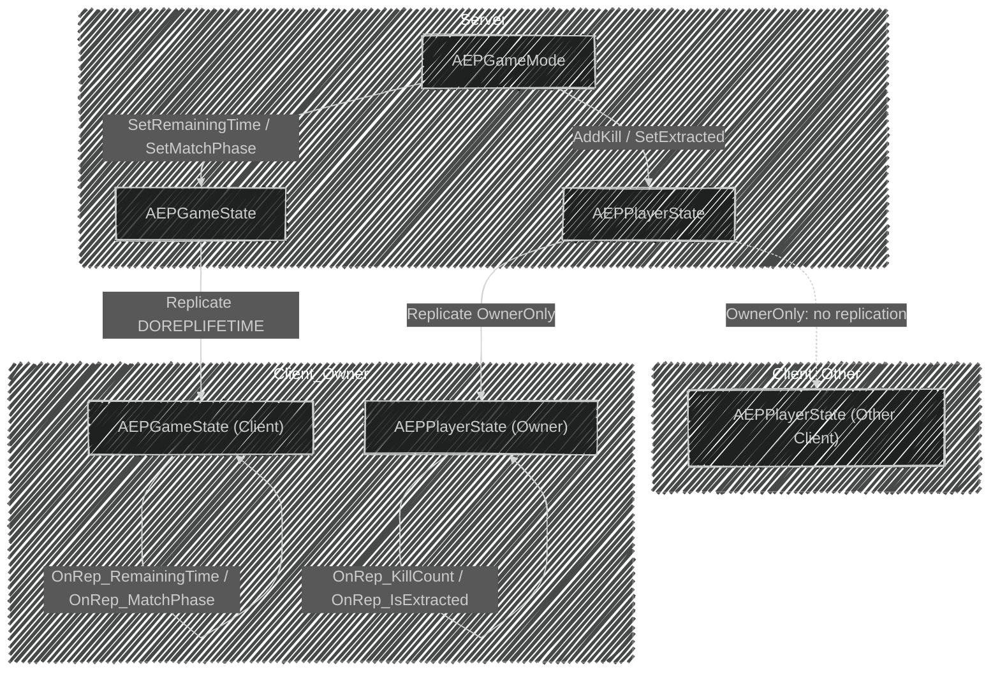

📌 EmploymentProj의 GameplayFramework에 대해 알아보는 포스트  
🚨 완성된 포스트가 아니므로, 지속적으로 수정됩니다!  
[👾 깃허브](https://github.com/SoftHamzzi/UE5-EmploymentProj)  
[📋 기획](https://github.com/SoftHamzzi/UE5-EmploymentProj/blob/main/DOCS/GAME.md)
{: .notice--warning}

## 개요
> 서버 권한형 모델
- 클라이언트가 서버에게 요청하고, 서버는 데이터를 검증한 뒤, 클라이언트에게 전달하므로 안정적이다.

> 복제가 필요한 이유
- GameMode 액터는 서버만 가지고 있으므로, 필요한 값은 클라이언트가 볼 수 있도록 복제해주어야 한다.
- 클라이언트끼리 동일한 상황을 볼 수 있도록 값을 동기화시켜주어야 한다.

## GameMode 매치 흐름 (Step 3)
- MatchState 상태 머신
  - `EPGameState`에 있는 상태는 `Waiting`, `Playing`, `Ended`로 이루어져 있다.
  - `AGameMode`에 내장되어 있는 스테이트 머신을 통해, `EPGameState`의 상태를 변환해준다.
  - 이렇게 하는 이유는, 클라이언트들이 매치 상태를 알수 있도록 하기 위함이다.

### AGameMode의 기본 MatchState
1. `EnteringMap` (맵 진입)
  - 액터 틱은 이루어지지 않으며, 월드 초기화도 안되어있다.
  - 완전히 로드되면, 다음 상태로 전환된다.

2. `WaitingToStart` (시작 대기중)
  - 들어갈 때, `HandleMatchIsWaitingToStart` (경기 시작 대기 중 처리)가 호출된다.
  - 이때, 플레이어는 스폰되어 있지 않다.
  - `ReadyToStartMatch`가 true를 반환하거나, `StartMatch`가 호출되면, 다음 상태로 전환된다.

3. `InProgress` (진행중)
  - 들어갈 때, `HandleMatchHasStarted` (경기 시작 처리)가 호출된다.
  - 이후, 모든 액터에서 `BeginPlay`가 호출된다.
  - `ReadyToEndMatch` (경기 종료 준비)가 true를 반환하거나,  
  `EndMatch` (경기 종료)가 호출되면 다음 상태로 전환된다.

4. `WaitingPostMatch` (경기 후 대기)
  - 들어갈 때, `HandleMatchHasEnded` (경기 종료 처리)가 호출된다.
  - 여전히 액터 틱은 일어나지만, 새로운 플레이어는 참가할 수 없다.
  - 맵 이동이 시작되면 다음 상태로 전환된다.

5. `LeavingMap` (맵 떠나기)
  - 들어갈 때, `HandleLeavingMap` (맵 떠나기 처리)가 호출된다.
  - 맵 전환이 일어나면, `EnteringMap` (맵 진입) 상태로 돌아간다.

 

- `Aborted` (중단됨)
  - `AbortedMatch` (경기 중단)을 호출하면 들어간다.
  - 복구할 수 없는 오류 발생 시, 설정된다.

### EPGameState 설정

1. `EPGameState::Waiting`
  - `AGameMode`의 `HandleMatchIsWaitingToStart`가 호출되었을 때, 할당된다.

2. `EPGameState::Playing`
  - `AGameMode`의 `HandleMatchHasStarted`가 호출되었을 때, 할당된다.
  - `ReadyToStartMatch_Implementation`를 오버라이드하여, 매치 시작 가능 여부를 반환하였다.
    - 이를 통해, `HandleMatchHasStarted`가 호출될수 있게 된다.
  - 이후, 매치 타이머를 활성화시킨다.
    - `EPGameState.RemainingTime`을 갱신시킨다.

3. `EPGameState::Ended`
  - `AGameMode`의 `HandleMatchHasEnded`가 호출되었을 때, 할당된다.
  - 매치 타이머가 0 이하가 되면, `EndMatch`를 호출하도록 하였다.
    - 이를 통해, `HandleMatchHasEnded`가 호출될수 있게 된다.
  - 추가로 생존 플레이어를 확인하여, `EndMatch()`를 호출할지 결정하게도 한다.
  - 이후, 매치 타이머를 정리한다.

## GameState 복제 (Step 4)

- `RemainingTime`, `MatchPhase`
  - 위 변수는 모든 클라이언트가 공유받아야 하기에, 동기화 할 수 있도록 한다.

- `ReplicatedUsing + OnRep` 패턴
  - `RemainingTime`, `MatchPhase`에 콜백 함수를 연결하여,  
  추후 UI에 반영하도록 할 생각이다.
  - 현재는 `UE_LOG`를 통해 로그를 찍어주기만 했다.

- `DOREPLIFETIME` 매크로
  - `GetLifetimeReplicatedProps`를 오버라이드하여, Replication을 등록한다.
  - 서버 + 모든 클라이언트가 공유받도록 하였다.
  - 이를 통해, 클라이언트-서버 간 EPMatchState가 동기화 된다.

## PlayerState 복제 (Step 5)
- `KillCount`, `bIsExtracted`
  - 위 변수는 소유 클라이언트만 공유받아야 한다!
  - 그렇기에, `DOREPLIFETIME_CONDITION`에  `COND_OwnerOnly`를 사용하여 본인만 알 수 있도록 하였다.
  - 또한 이전과 같은 이유로, 변경되었을 때 콜백 함수를 지정하였다.

- 서버 전용 함수
  - `KillCount`, `bIsExtracted`는 서버에서 확인 후, 변경시켜주어야 한다.
  - 그렇기에 `AddKill`, `SetExtracted` 함수를 두고, `HasAuthority`를 통해, 서버 권한을 확인하고 변경시켜주도록 하였다.
  - RPC로도 할 수 있다.

- 죽었는지에 대한 변수는 따로 두지 않았다.
  - 시체 액터를 따로 둘 예정이기 때문이다.

- 왜 돈(Money)은 제외했는가
  - 타르코프와 동일하게, 인벤토리에 돈 아이템이 얼마나 있는지에 따라,  
  자판기 상호작용 가능 여부를 판단할 수 있도록 하려 하였다.

## 복제 흐름도
- 서버 → 클라이언트 데이터 흐름

## 다음 편 예고
→ 스폰 시스템 & DataAsset