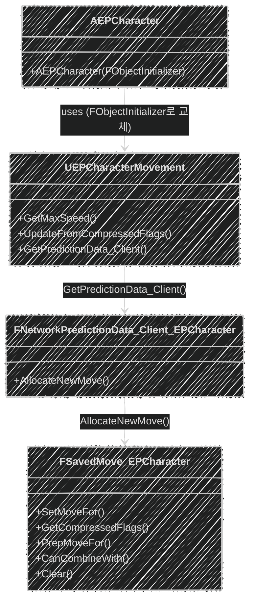

📌 EmploymentProj의 GameplayFramework에 대해 알아보는 포스트  
🚨 완성된 포스트가 아니므로, 지속적으로 수정됩니다!  
[👾 깃허브](https://github.com/SoftHamzzi/UE5-EmploymentProj)  
[📋 기획](https://github.com/SoftHamzzi/UE5-EmploymentProj/blob/main/DOCS/GAME.md)
{: .notice--warning}

## 1. 이번 글에서 다루는 것

- 기존 Server RPC Sprint를 CMC 확장(SavedMove)으로 리팩토링한 이유와 과정
- UEPCharacterMovement: 커스텀 CMC 클래스 구현
- FSavedMove_EPCharacter: 이동 입력 저장/복원/압축
- FNetworkPredictionData_Client_EPCharacter: 커스텀 SavedMove 할당
- FObjectInitializer로 기본 CMC 교체
- Sprint / ADS / Crouch 입력 처리
- 네트워크 흐름 (클라 예측 → 서버 검증 → 보정 리플레이)

---

## 2. 왜 Server RPC가 아닌 CMC 확장인가

### Server RPC 방식 (기존)

```cpp
// EPCharacter.h
UPROPERTY(ReplicatedUsing=OnRep_IsSprinting)
bool bIsSprinting;

UFUNCTION()
void OnRep_IsSprinting();
	
UFUNCTION(Server, Reliable)
void Server_SetSprinting(bool bNewSprinting);
```
```cpp
// EPCharacter.cpp
void AEPCharacter::Input_StartSprint(const FInputActionValue& Value)
{
	Server_SetSprinting(true);
}
void AEPCharacter::Input_StopSprint(const FInputActionValue& Value)
{
	Server_SetSprinting(false);
}

void AEPCharacter::OnRep_IsSprinting()
{
	GetCharacterMovement()->MaxWalkSpeed = bIsSprinting ? SprintSpeed : WalkSpeed;
}

void AEPCharacter::Server_SetSprinting_Implementation(bool bNewSprinting)
{
	bIsSprinting = bNewSprinting;
	
	GetCharacterMovement()->MaxWalkSpeed = bIsSprinting ? SprintSpeed : WalkSpeed;
}
```

> 실행 순서

1. 클라이언트 측: 달리기 시작 → Input_StartSprint(...) 호출
2. 클라이언트 측: Server_SetSprinting(true); RPC 호출
3. 서버 측: 클라이언트의 달리기 상태와 속도를 변경
  - 이때, bIsSprinting 변수는 ReplicatedUsing이므로 복제 진행
4. 클라이언트 측: bIsSprinting 변수가 변화하며, 콜백 함수 OnRep_IsSprinting 호출
  - 이제서야, 클라이언트 측의 달리기 속도 변경

> 문제

- RPC 도착 전까지 클라는 달리지 않음
- 서버 지연 시간으로 인해 불쾌함 유발

### CMC 확장 방식 (변경)


```
클라: Sprint 입력
→ CMC.bWantsToSprint=true
→ 이동 패킷에 FLAG_Custom_0 포함
→ 서버 즉시 반영
서버 재시뮬레이션 시에도 같은 플래그 사용
→ 예측-검증 일치
→ 스냅 없음
```

### 비교표

| | Server RPC 방식 | CMC 확장 방식 |
|--|----------------|--------------|
| 동기화 | 별도 RPC + UPROPERTY 복제 | 이동 패킷에 포함 (자동) |
| 클라 예측 | 불일치 가능 (보정 잦음) | 일치 (SavedMove에 상태 포함) |
| 코드량 | 적음 | 많음 (SavedMove 확장 필요) |
| 대역폭 | RPC + Replicated 변수 | CompressedFlags 비트만 추가 |
| 적합한 상황 | 비이동 상태 (무기 교체 등) | **이동속도에 영향 주는 상태** |

---

## 3. 전체 구조 개요

### 클래스 관계

| 클래스 | 역할 |
|--------|------|
| `UEPCharacterMovement` | CMC 확장. Sprint/ADS 속도 제어, CompressedFlags 수신 |
| `FSavedMove_EPCharacter` | 매 프레임 이동 입력 저장/복원. 플래그를 CompressedFlags로 압축 |
| `FNetworkPredictionData_Client_EPCharacter` | 커스텀 SavedMove 인스턴스 생성 |
| `AEPCharacter` | FObjectInitializer로 기본 CMC 교체. 입력 → CMC 플래그 설정 |

### 호출 관계도



- 여기까지가 커스텀 CMC가 어떻게 생성되고, 할당되는지에 대한 과정이다.
  - 직접 코드를 하나하나 까보며 살펴보았다.
- 클라이언트-서버가 어떻게 동기화하는지는 지금부터 살펴보자.

---

## 4. UEPCharacterMovement — 커스텀 CMC

### 4-0. CompressedFlags (UCharacterMovementComponent.h)

```cpp
// Bit masks used by GetCompressedFlags() to encode movement information.
  enum CompressedFlags
  {
    FLAG_JumpPressed  = 0x01, // Jump pressed
    FLAG_WantsToCrouch  = 0x02, // Wants to crouch
    FLAG_Reserved_1 = 0x04, // Reserved for future use
    FLAG_Reserved_2 = 0x08, // Reserved for future use
    // Remaining bit masks are available for custom flags.
    FLAG_Custom_0 = 0x10,
    FLAG_Custom_1 = 0x20,
    FLAG_Custom_2 = 0x40,
    FLAG_Custom_3 = 0x80,
  };
};
```

- 언리얼 엔진 코드에 포함된 `CompressedFlags` 열거형이다.
  - 점프, 웅크리기와 같은 플래그가 기본으로 포함된 것을 알 수 있으며,  
실제로도 기본 지원하고 있다.
  - 마치, MCU 혹은 아두이노의 코드 일부같이 생겼다.
- 우리는 `FLAG_Custom_X`를 사용하여 커스텀 기능을 탑재할 수 있다.
- 게임 서버 프로그래밍 책을 보면 알 수 있듯, 이렇게까지 하는 이유는 다음과 같다.
  - 송수신 데이터의 양이 줄어든다.
  - 네트워크 프로토콜을 최적화하여, 레이턴시가 줄어든다.

### 4-1. 헤더 (EPCharacterMovement.h)

```cpp
UCLASS()
class EMPLOYMENTPROJ_API UEPCharacterMovement : public UCharacterMovementComponent
{
    GENERATED_BODY()

public:
    // CompressedFlags로 전송 (UPROPERTY 복제 아님)
    uint8 bWantsToSprint : 1;
    uint8 bWantsToAim : 1;

    UPROPERTY(EditDefaultsOnly, Category = "Movement")
    float SprintSpeed = 650.f;

    UPROPERTY(EditDefaultsOnly, Category = "Movement")
    float AimSpeed = 200.f;

    virtual float GetMaxSpeed() const override;
    virtual void UpdateFromCompressedFlags(uint8 Flags) override;
    virtual class FNetworkPredictionData_Client* GetPredictionData_Client() const override;
};
```

- `bWantsToSprint/bWantsToAim`은 `UPROPERTY`가 아니므로, 복제되지 않는다.
- 뒤에서 바로 설명하겠지만, 가상함수로 이루어진 세 함수들은 모두 오버라이드해야 한다.
  - **GetMaxSpeed()**: `SetMoveFor()` 함수 내에서 호출되며, 내야할 속도를 계산하는 역할을 한다.
  - **UpdateFromCompressedFlags()**: 클라이언트에게 받은 `CompressedFlags`를 통해, 상태를 복원하는 역할을 한다.
  - **GetPredictionData_Client()**: 이후에 `FSavedMove_EPCharacter`라는 것(예측한 움직임 저장용)이 나오는데,  
  이를 통해 커스텀 플래그를 적용시킬 수 있게된다.  
  직역해보면 **클라이언트 예측 데이터 얻기** 정도인데, 얼추 맞는걸 알 수 있다.

### 4-2. GetMaxSpeed()

```cpp
float UEPCharacterMovement::GetMaxSpeed() const
{
    if (bWantsToSprint && IsMovingOnGround()) return SprintSpeed;
    if (bWantsToAim) return AimSpeed;
    return Super::GetMaxSpeed();
}
```

- **GetMaxSpeed()**: `SetMoveFor()` 함수 내에서 호출되며, 내야할 속도를 계산하는 역할을 한다.
- `SetMoveFor()`가 나중에 나오겠지만 이는 매 프레임 이동을 계산할 수 있게 해주는 함수이다.
- ADS가 Sprint보다 이후에 나온다.
  - 즉, ADS는 Sprint보다 후순위이다.
- 클라이언트와 서버 양쪽에서 동일하게 호출된다.

### 4-3. UpdateFromCompressedFlags()

```cpp
void UEPCharacterMovement::UpdateFromCompressedFlags(uint8 Flags)
{
    Super::UpdateFromCompressedFlags(Flags);
    bWantsToSprint = (Flags & FSavedMove_Character::FLAG_Custom_0) != 0;
    bWantsToAim   = (Flags & FSavedMove_Character::FLAG_Custom_1) != 0;
}
```

- **UpdateFromCompressedFlags()**: 클라이언트에게 받은 `CompressedFlags`를 통해, CMC 플래그 상태를 복원하는 역할을 한다.
- Super 호출로 기본 플래그(Jump, Crouch 등)도 빼먹지 않고 처리한다.
- 이후 GetMaxSpeed()를 통해 올바른 속도로 서버에서 재시뮬레이션을 한다.

### 4-4. GetPredictionData_Client()

```cpp
FNetworkPredictionData_Client* UEPCharacterMovement::GetPredictionData_Client() const
{
    if (!ClientPredictionData)
    {
        UEPCharacterMovement* MutableThis = const_cast<UEPCharacterMovement*>(this);
        MutableThis->ClientPredictionData = new FNetworkPredictionData_Client_EPCharacter(*this);
    }
    return ClientPredictionData;
}
```

- 기본으로 존재하는 `FSavedMove_Character` 대신, 커스텀으로 만든 `FSavedMove_EPCharacter`를 생성하도록 연결한다.
- `FNetworkPredictionData_Client_EPCharacter` 변수 자체를 값으로 넘겨줄 수 없기에,  
`GetPredictionData_Client` 함수를 오버라이드해주는 형태로 구현하여야 한다.
- `ClientPredictionData`는 싱글턴 패턴으로 되어있다.
- 최초 1회 할당을 위해, `const_cast`를 통해 `const`를 제거해준다.
  - 이게 왜 필요한지 모르겠다면, [여기](https://softhamzzi.github.io/cpp/cpp_1_3)를 살펴보자.

---

## 5. FSavedMove_EPCharacter — 이동 입력 저장

### 5-1. 클래스 선언

```cpp
class FSavedMove_EPCharacter : public FSavedMove_Character
{
public:
    uint8 bSavedWantsToSprint : 1;
    uint8 bSavedWantsToAim : 1;

    virtual void Clear() override;
    virtual uint8 GetCompressedFlags() const override;
    virtual bool CanCombineWith(const FSavedMovePtr& NewMove, ACharacter* Character,
                                float MaxDelta) const override;
    virtual void SetMoveFor(ACharacter* C, float InDeltaTime, FVector const& NewAccel,
                            FNetworkPredictionData_Client_Character& ClientData) override;
    virtual void PrepMoveFor(ACharacter* C) override;
};
```

> SavedMove란?
- 클라이언트가 매 프레임 생성하는 이동 '스냅샷'이다.
- 서버 보정 시 이 스냅샷들을 리플레이하여 위치를 재계산한다.
- 이 클래스가 없었다면 커스텀 플래그가 없어서 Sprint 상태가 누락된다.
  - 즉, 걷기 속도로 이동한다.

> 특징
- UCLASS가 아닌, 일반 C++ 클래스이다.
- Super 사용이 불가능하여, 명시적으로 부모 클래스를 지정해주었다.


### 5-2. Clear()

```cpp
void FSavedMove_EPCharacter::Clear()
{
    FSavedMove_Character::Clear();
    bSavedWantsToSprint = false;
    bSavedWantsToAim = false;
}
```

- 호출 시점: SavedMove가 풀(pool)에서 재사용될때 호출된다.
- 역할: 이전 프레임 데이터를 초기화해주는 역할을 한다.
  - 안했더라면, 이전 프레임 Sprint 상태가 다음 프레임에 남는다.

### 5-3. GetCompressedFlags()

```cpp
uint8 FSavedMove_EPCharacter::GetCompressedFlags() const
{
    uint8 Result = FSavedMove_Character::GetCompressedFlags();
    if (bSavedWantsToSprint) Result |= FSavedMove_Character::FLAG_Custom_0;
    if (bSavedWantsToAim)    Result |= FSavedMove_Character::FLAG_Custom_1;
    return Result;
}
```

- 호출 시점: 클라이언트가 이동 패킷을 서버에 전송할 때
- 역할: SavedMove 플래그를 1바이트 비트필드로 압축하는 역할을 한다.

### 5-4. SetMoveFor()

```cpp
void FSavedMove_EPCharacter::SetMoveFor(
    ACharacter* C, float InDeltaTime, FVector const& NewAccel,
    FNetworkPredictionData_Client_Character& ClientData)
{
    FSavedMove_Character::SetMoveFor(C, InDeltaTime, NewAccel, ClientData);
    UEPCharacterMovement* CMC = Cast<UEPCharacterMovement>(C->GetCharacterMovement());
    bSavedWantsToSprint = CMC->bWantsToSprint;
    bSavedWantsToAim = CMC->bWantsToAim;
}
```

- 호출 시점: 이동 시뮬레이션 직전
- 역할: CMC 현재 플래그가 SavedMove에 스냅샷 저장된다.
  - 이 데이터가 GetCompressedFlags()로 서버 전송된다.
  - 보정 시, PrepMoveFor()로 CMC에 복원된다.

### 5-5. PrepMoveFor()

```cpp
void FSavedMove_EPCharacter::PrepMoveFor(ACharacter* C)
{
    FSavedMove_Character::PrepMoveFor(C);
    UEPCharacterMovement* CMC = Cast<UEPCharacterMovement>(C->GetCharacterMovement());
    CMC->bWantsToSprint = bSavedWantsToSprint;
    CMC->bWantsToAim = bSavedWantsToAim;
}
```

- 호출 시점: 서버 보정 후 클라이언트가 미확인 이동을 리플레이할 때
- 역할: `SavedMove`에 저장된 플래그를 CMC에 복원한다.
  - 리플레이 중, `GetMaxSpeed()`가 올바른 속도를 반환할 수 있게 된다.

### 5-6. CanCombineWith()

```cpp
bool FSavedMove_EPCharacter::CanCombineWith(
    const FSavedMovePtr& NewMove, ACharacter* Character, float MaxDelta) const
{
    FSavedMove_EPCharacter* Other = static_cast<FSavedMove_EPCharacter*>(NewMove.Get());
    if (bSavedWantsToSprint != Other->bSavedWantsToSprint) return false;
    if (bSavedWantsToAim != Other->bSavedWantsToAim) return false;
    return FSavedMove_Character::CanCombineWith(NewMove, Character, MaxDelta);
}
```

- 역할: 연속된 동일 입력을 하나로 합쳐 대역폭을 절약할 수 있다.
- 예시: 10프레임 Sprint 유지 → 1개로 합침
  - 플래그가 다르면(Sprint→Walk) 합칠 수 없음 → false

---

## 6. FNetworkPredictionData_Client_EPCharacter

```cpp
class FNetworkPredictionData_Client_EPCharacter : public FNetworkPredictionData_Client_Character
{
public:
    explicit FNetworkPredictionData_Client_EPCharacter(
        const UCharacterMovementComponent& ClientMovement)
        : FNetworkPredictionData_Client_Character(ClientMovement) {}

    virtual FSavedMovePtr AllocateNewMove() override
    {
        return FSavedMovePtr(new FSavedMove_EPCharacter());
    }
};
```

- 역할: CMC가 새 `SavedMove`를 요청 시 `FSavedMove_EPCharacter` 생성 및 반환
  - 이게 없으면, 기본 `FSavedMove_Character`가 생성된다.
  - 즉, 커스텀 플래그가 저장되지 않는다.
- `AllocateNewMove()`를 오버라이드하여 커스텀 `SavedMove`를 반환한다.

---

## 7. AEPCharacter — FObjectInitializer로 CMC 교체

### 7-1. FObjectInitializer란



- UE5의 서브오브젝트 생성 커스터마이즈 메커니즘
- 실제 C++ 생성자가 호출된 후 UObject 생성(속성 초기화)을 최종 확정하는 내부 클래스
  - CDO를 만들기 직전, `FObjectInitializer`를 통해, 수정/변경이 가능하다 함.
- ACharacter가 기본으로 만드는 `UCharacterMovementComponent`를 교체
- `CreateDefaultSubobject`로는 이미 부모가 생성한 CMC를 교체 불가
- 반드시 생성자 시그니처가 `(const FObjectInitializer&)`이어야 함

```cpp
/**
  * 기본 클래스에서 정의된 서브오브젝트에 대해 사용할 클래스를 설정한다.
  이때 설정하는 클래스는 기본 클래스에서 사용한 클래스의 하위 클래스(Subclass) 여야 한다.
  * @param  SubobjectName 새로 생성되는 컴포넌트 또는 서브오브젝트의 이름
*/
template<class T>
const FObjectInitializer& SetDefaultSubobjectClass(FName SubobjectName) const
{
  return SetDefaultSubobjectClass(SubobjectName, T::StaticClass());
}
```

- 위 코드는 `FObjectInitializer.SetDefaultSubobjectClass` 함수이다.
- 바로 아래에서 사용하는 함수의 전문이다.

### 7-2. 생성자

```cpp
AEPCharacter::AEPCharacter(const FObjectInitializer& ObjectInitializer)
    : Super(ObjectInitializer.SetDefaultSubobjectClass<UEPCharacterMovement>(
        ACharacter::CharacterMovementComponentName))
{
    // 카메라, 메시 설정 ...

    UEPCharacterMovement* Movement = Cast<UEPCharacterMovement>(GetCharacterMovement());
    Movement->NavAgentProps.bCanCrouch = true;  // Crouch 활성화
}
```

- CMC를 커스텀 CMC로 지정해주었다.
- Movement->NavAgentProps.bCanCrouch가 도대체 어디서 찾을수 있는건가 했다.
  - UCharacterMovementComponent
  - UPawnMovementComponent
  - UNavMovementComponent
  - FMovementProperties 타입의 NavAgentProps
  - 드디어 여기서 찾을 수 있었다.
- 기존 Sprint 코드에 있던 WalkSpeed/SprintSpeed를 커스텀 CMC로 이관했다.

---

## 8. 입력 처리

### 8-1. Sprint

```cpp
void AEPCharacter::Input_StartSprint(const FInputActionValue& Value)
{
    if (UEPCharacterMovement* CMC = Cast<UEPCharacterMovement>(GetCharacterMovement()))
        CMC->bWantsToSprint = true;
}

void AEPCharacter::Input_StopSprint(const FInputActionValue& Value)
{
    if (UEPCharacterMovement* CMC = Cast<UEPCharacterMovement>(GetCharacterMovement()))
        CMC->bWantsToSprint = false;
}
```

1. Server RPC 호출 따로 없이, CMC 플래그만 설정한다.
2. 다음 프레임 GetMaxSpeed()에서 SprintSpeed를 반영받고,
3. `SetMoveFor()` → `GetCompressedFlags()` → `FLAG_Custom_0` 를 통해 들어간다.

### 8-2. ADS

```cpp
void AEPCharacter::Input_StartADS(const FInputActionValue& Value)
{
    if (UEPCharacterMovement* CMC = Cast<UEPCharacterMovement>(GetCharacterMovement()))
    {
        CMC->bWantsToAim = true;
        CMC->bWantsToSprint = false;  // ADS 중 Sprint 해제
    }
    if (IsLocallyControlled() && FirstPersonCamera)
        FirstPersonCamera->SetFieldOfView(60.f);
}

void AEPCharacter::Input_StopADS(const FInputActionValue& Value)
{
    if (UEPCharacterMovement* CMC = Cast<UEPCharacterMovement>(GetCharacterMovement()))
        CMC->bWantsToAim = false;
    if (IsLocallyControlled() && FirstPersonCamera)
        FirstPersonCamera->SetFieldOfView(90.f);
}
```

- ADS 시작 시, Sprint를 강제 해제한다.
- ADS는 시각 효과이므로, 복제할 필요가 없다.
  - IsLocallyControlled()를 검사하였다.

### 8-3. Crouch

```cpp
void AEPCharacter::Input_Crouch(const FInputActionValue& Value)  { Crouch(); }
void AEPCharacter::Input_UnCrouch(const FInputActionValue& Value) { UnCrouch(); }
```

- 웅크리기는 CMC가 기본 지원한다.
- 별도로 SavedMove를 확장하거나, RPC가 필요하지 않다.

---

## 9. 네트워크 흐름 정리

### Sprint 입력 → 서버 반영 → 보정 흐름

> [클라이언트]
1. `Input_StartSprint()` → `CMC.bWantsToSprint = true`
2. `GetMaxSpeed()` → `SprintSpeed` 반환 → 로컬 예측 이동
3. `SetMoveFor()` → `bSavedWantsToSprint = true` 저장
4. `GetCompressedFlags()` → `FLAG_Custom_0` ON → 서버 전송

> [서버]
5. `UpdateFromCompressedFlags()` → `bWantsToSprint = true` 복원
6. `GetMaxSpeed()` → `SprintSpeed` → 서버 위치 계산
7. 클라이언트 결과와 비교
   → 일치: ACK
   → 불일치: 보정 전송

> [클라이언트 - 보정 시]
8. 서버 위치로 리셋
9. 미확인 SavedMove 리플레이:
   `PrepMoveFor()` → `bWantsToSprint` 복원 → `GetMaxSpeed()` → `SprintSpeed`로 재시뮬레이션

---

## 10. 배운 점 / 삽질 기록

1. IDE 전환 이슈
- 이전까지 Visual Studio를 사용하다, Rider를 사용해봤다.
- Peek Definition이 없기도 하고, 단축키가 익숙하지도 않아서 많이 헤맸다..
- 코드 분석하는데 많은 시간이 소요되었다.

2. 복잡한 CMC
- CMC 내부 구조가 상당히 복잡해서, 어떻게 짜여져있는건지 분석하느라 많이 고생했다.

```
1. 클라 TickComponent → ControlledCharacterMove 호출
2. 네트워크 환경이면 ReplicateMoveToServer 호출
3. GetPredictionData_Client()로 FNetworkPredictionData_Client 확보
  - 오버라이드해서 FNetworkPredictionData_Client_EPCharacter 사용
  - 여기서 AllocateNewMove()로 FSavedMove_EPCharacter 생성
4. SetMoveFor로 현재 입력/상태 저장
5. GetCompressedFlags로 상태 압축
6. 클라 → 서버로 이동 패킷 전송
7. 서버는 UpdateFromCompressedFlags로 상태 복원 후 서버 이동 시뮬레이션
8. 결과가 다르면 보정 패킷 전송
9. 클라는 서버 위치로 스냅
10. 저장된 SavedMove 리플레이 (이때 PrepMoveFor가 호출)
```

- 코드를 뜯고, 과정을 직접 써나가며 이해해나갔다.

---

## 11. 다음 단계

→ Step3, 4: 무기 장착 + 사격