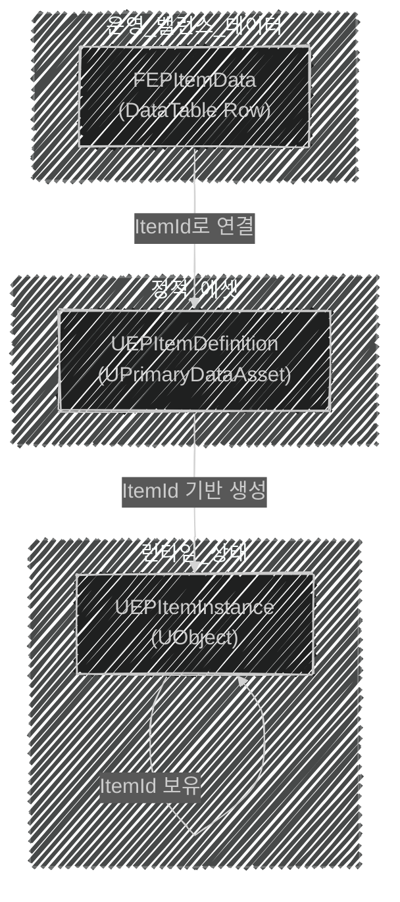

📌 EmploymentProj의 GameplayFramework에 대해 알아보는 포스트  
🚨 완성된 포스트가 아니므로, 지속적으로 수정됩니다!  
[👾 깃허브](https://github.com/SoftHamzzi/UE5-EmploymentProj)  
[📋 기획](https://github.com/SoftHamzzi/UE5-EmploymentProj/blob/main/DOCS/GAME.md)
{: .notice--warning}

## 개요

**이 포스팅에서 다루는 것:**
- 단순 WeaponData UObject에서 3계층 구조(Row + Definition + Instance)로 리팩터링한 이유와 방법
- 각 계층의 역할 분리와 `ItemId`로 연결하는 방식

**왜 이렇게 구현했는가 (설계 의도):**
- 타르코프처럼 동일 아이템이 각자 다른 상태(탄약 수, 내구도)를 가져야 함
- 운영 수치(밸런스)는 CSV로 관리하고 싶음 → DataTable Row
- 에셋 참조는 별도 DataAsset으로 분리해 메모리 관리
- Epic 공식 Coder-05 학습 경로의 패턴을 참조

---

## 구현 전 상태 (Before)

실제로 존재했던 코드:

```cpp
// UEPItemData — 아이템 공통 데이터 (UPrimaryDataAsset)
class UEPItemData : public UPrimaryDataAsset
{
  FName ItemName;
  FText Description;
  EEPItemRarity Rarity;
  int32 SellPrice = 100;
  bool bIsQuestItem = false;
  int32 SlotSize = 1;
  // 에셋 참조(메시, 아이콘) 없음
};

// UEPWeaponData — 무기 스탯 (UPrimaryDataAsset, UEPItemData와 무관)
class UEPWeaponData : public UPrimaryDataAsset  // UEPItemData 상속 아님
{
  FName WeaponName;
  EEPFireMode FireMode;
  float Damage = 20.f;
  float FireRate = 5.f;
  uint8 MaxAmmo = 30;
  float ReloadTime = 2.0f;
  float BaseSpread, SpreadPerShot, MaxSpread ...
  float RecoilPitch, RecoilYaw ...
  TArray<FVector2D> RecoilPattern;
  // 메시/아이콘 에셋 참조 없음
};

// FItemData — 미연결 구조체 잔재
struct FItemData
{
  FName ItemName;
  int32 Value;
  // UEPItemData와 아무 연결 없음
};

// AEPWeapon — 런타임 상태를 Actor에 직접 보유
class AEPWeapon : public AActor
{
  TObjectPtr<UEPWeaponData> WeaponData;  // 스탯 참조
  TObjectPtr<USkeletalMeshComponent> WeaponMesh;  // 표현체

  UPROPERTY(ReplicatedUsing = OnRep_CurrentAmmo)
  uint8 CurrentAmmo = 0;  // 런타임 상태가 Actor에 직접

  UPROPERTY(Replicated)
  uint8 MaxAmmo = 30;
};
```

**문제점:**

1. **`UEPWeaponData`와 `UEPItemData`가 완전히 단절**
- 무기는 아이템인데 상속 관계가 없어서 "아이템 슬롯에 무기 넣기" 같은 공통 처리가 불가능.

2. **`FItemData` 구조체가 미사용 잔재**
- `UEPItemData`와 아무 연결 없이 떠있음.

3. **런타임 상태(`CurrentAmmo`)가 Actor에 직접 존재**
- `AEPWeapon`이 상태 원본
- 장착 해제 시 해당 액터를 지우게 되면 런타임 상태가 삭제됨
- 가지고 있는 무기들이 고정이 아니며, 다양한 무기들이 존재해야하는 상황에서 이 방법은 추후 문제가 발생함

---

## 구현 내용

### 1. 3계층 아키텍처 설명


**각 계층의 책임:**

| 계층 | 클래스 | 담당 | 변경 주체 |
|------|--------|------|-----------|
| Row | `FEPItemData` | 가격/스택/슬롯/등급 | 기획자 (CSV 패치) |
| Definition | `UEPItemDefinition` | 메시/아이콘/FX/애니레이어 | 개발자 |
| Instance | `UEPItemInstance` | 탄약/내구도/수량 | 게임 런타임 |

### 2. FEPItemData (DataTable Row)

```cpp
USTRUCT(BlueprintType)
struct FEPItemData : public FTableRowBase
{
  GENERATED_BODY()

  FName ItemId;
  EEPItemType ItemType = EEPItemType::Misc;
  FText DisplayName;
  FText Description;
  EEPItemRarity Rarity = EEPItemRarity::Common;
  int32 MaxStack = 1;
  int32 SlotSize = 1;
  int32 SellPrice = 100;
  bool bIsQuestItem = false;
  TSoftObjectPtr<UEPItemDefinition> ItemDefinition;
};
```

**DataTable의 장점**:
- 에디터에서 표 형태로 편집이 가능하다.
- CSV 익스포트 → 기획 패치가 용이하다


- 데이터 기반 구조로, 쉽게 아이템을 추가할 수 있다.

### 3. UEPItemDefinition + UEPWeaponDefinition

```cpp
// 베이스 — 모든 아이템 공통
UCLASS(BlueprintType, Blueprintable)
class UEPItemDefinition : public UPrimaryDataAsset
{
  FName ItemId;
  FDataTableRowHandle ItemDataRow;
  TSoftObjectPtr<UStaticMesh> WorldMesh;  // 맵에 떨어진 아이템 모습
  TSoftObjectPtr<UTexture2D> Icon;
  virtual FPrimaryAssetId GetPrimaryAssetId() const override;
};

// 무기 전용 — Definition 상속
UCLASS(BlueprintType, Blueprintable)
class UEPWeaponDefinition : public UEPItemDefinition
{
  FName WeaponName;
  EEPFireMode FireMode = EEPFireMode::Auto;
  float Damage = 20.f;
  float FireRate = 5.f;
  uint8 MaxAmmo = 30;
  float ReloadTime = 2.0f;
  float BaseSpread = 0.5f;
  float SpreadPerShot = 0.1f;
  float MaxSpread = 5.0f;
  float SpreadRecoveryRate = 3.0f;
  float ADSSpreadMultiplier = 0.5f;
  float MovingSpreadMultiplier = 1.5f;
  float RecoilPitch = 0.3f;
  float RecoilYaw = 0.1f;
  float RecoilRecoveryRate = 5.0f;
  TSubclassOf<UAnimInstance> WeaponAnimLayer;
  TSoftObjectPtr<USkeletalMesh> WeaponMesh;
  virtual FPrimaryAssetId GetPrimaryAssetId() const override;
};
```

**UPrimaryDataAsset를 쓰는 이유**: Asset Manager의 비동기 로드, 메모리 관리 지원

- 전투 수치를 DataTable Row로 분리하는 것도 가능하다.
  - 그러나, 현재는 접근 편의성을 위해 WeaponDefinition에 둔다.

### 4. UEPItemInstance + UEPWeaponInstance

```cpp
// 런타임 상태 — 플레이어별, 아이템별 고유
UCLASS(BlueprintType)
class UEPItemInstance : public UObject
{
  FGuid InstanceId;
  FName ItemId;
  int32 Quantity = 1;
  int32 SchemaVersion = 1;
  TObjectPtr<UEPItemDefinition> CachedDefinition;

  // 팩토리 함수
  static UEPItemInstance* CreateInstance(UObject* Outer, FName InItemId, ...);
  // 서브오브젝트 복제 지원
  virtual bool IsSupportedForNetworking() const override { return true; }
};

// 무기 전용 런타임 상태
UCLASS(BlueprintType)
class UEPWeaponInstance : public UEPItemInstance
{
  int32 CurrentAmmo = 0;
  float Durability = 100.f;
  // 팩토리 함수
  static UEPWeaponInstance* CreateWeaponInstance(
  UObject* Outer, FName InItemId,
  int32 InMaxAmmo, UEPItemDefinition* InDefinition = nullptr);
};
```

**핵심 설명**: 동일한 `ItemId("Weapon_AK74")`지만 각 Instance는 다른 `CurrentAmmo`를 가질 수 있음  
→ 타르코프 스타일 인벤토리 가능

### 5. 연결 구조 — 데이터 흐름

```
DT_Items["Weapon_AK74"] (DataTable)
  └─ ItemDefinition → DA_AK74 (WeaponDefinition DataAsset)
    ├─ Damage: 20
    ├─ WeaponAnimLayer: ABP_RifleAnimLayers
    └─ WeaponMesh: SK_KA47
              ↓
  UEPWeaponInstance (런타임, 플레이어 인벤토리)
    ├─ InstanceId: FGuid("6f5d...")
    ├─ ItemId: "Weapon_AK74"
    ├─ CurrentAmmo: 17
    └─ Durability: 92
```

---

## 6. 결과

**확인 항목:**
- DT_Items DataTable 에디터에서 행 추가/수정 가능
- DA_AK74 에셋에서 Damage, FireRate 등 수치 입력 가능
- 빌드 후 기존 사격/탄약 동작 이상 없음

**한계 및 향후 개선:**
- 현재는 WeaponInstance가 Weapon Actor에 완전히 연동되지 않음 (Pre-GAS 과도기)
- GAS 4단계에서 InventoryComponent + `GA_Item_PrimaryUse` 경로로 완전 이관 예정
- DB 저장 설계: `ItemId + InstanceId + CurrentAmmo + SchemaVersion` 포맷

---

## 7. 다음 편 예고
→ CombatComponent & 무기 시스템

## 참고

