📌 EmploymentProj의 GameplayFramework에 대해 알아보는 포스트  
🚨 완성된 포스트가 아니므로, 지속적으로 수정됩니다!  
[👾 깃허브](https://github.com/SoftHamzzi/UE5-EmploymentProj)  
[📋 기획](https://github.com/SoftHamzzi/UE5-EmploymentProj/blob/main/DOCS/GAME.md)
{: .notice--warning}

## 개요

**이 포스팅에서 다루는 것:**
- 비대해진 ACharacter에서 전투 로직을 UEPCombatComponent로 분리하는 과정
- AEPWeapon 액터 설계 (월드 표현체 역할)
- 서버 권한 사격 흐름 전체

**왜 이렇게 구현했는가 (설계 의도):**
- Character SRP(단일 책임 원칙) 위반 해소: 이동/시점/전투가 한 클래스에 몰리면 유지보수 불가
- GAS 4단계 이관 전 경로 정리: CombatComponent를 진입점으로 단일화해두면 나중에 GA 교체만 하면 됨
- Weapon Actor는 "표현체"일 뿐, 상태 원본은 ItemInstance

---

## 구현 전 상태 (Before)

```cpp
// 기존: AEPCharacter가 전투까지 모두 담당
class AEPCharacter : public ACharacter
{
    AEPWeapon* EquippedWeapon;

    UFUNCTION(Server, Reliable)
    void Server_Fire(FVector Origin, FVector Direction);

    UFUNCTION(NetMulticast, Unreliable)
    void Multicast_PlayFireEffect(FVector MuzzleLocation);

    virtual float TakeDamage(...) override;
    // + 이동, 입력, HP, 사망 코드가 모두 있음
};
```

**문제점:**
- EPCharacter.cpp가 수천 줄 → 수정 시 충돌, 디버깅 어려움
- 발사/탄착 이펙트 좌표 버그가 Character 내부에서 반복 발생
- 향후 GAS 이관 시 전체 Character를 뒤져야 함

---

## 구현 내용

### 1. ACharacter 역할 분리 원칙

포스팅에서 표로 정리:

| 역할 | 담당 |
|------|------|
| 이동/시점/점프/Sprint/ADS | AEPCharacter 유지 |
| 입력 → 전투 위임 | `Input_Fire() → CombatComponent->HandleFire()` |
| 발사/재장전/RPC/이펙트 | **UEPCombatComponent**로 이동 |
| 장착 표현체 | AEPWeapon (월드 위치/메시/소켓) |
| 아이템 런타임 상태 | UEPWeaponInstance (탄약, 내구도) |

### 2. UEPCombatComponent 핵심 구조

```cpp
UCLASS(ClassGroup=(Custom), meta=(BlueprintSpawnableComponent))
class UEPCombatComponent : public UActorComponent
{
public:
  void EquipWeapon(AEPWeapon* NewWeapon);
  void UnequipWeapon();
  void RequestFire(const FVector& Origin, const FVector& Direction);  // Input_Fire에서 호출

  UPROPERTY(ReplicatedUsing = OnRep_EquippedWeapon, BlueprintReadOnly)
  TObjectPtr<AEPWeapon> EquippedWeapon;

protected:
  float LocalLastFireTime = 0.f;

  // VFX/SFX — 임시 배치 (향후 WeaponDefinition으로 이관 예정)
  UPROPERTY(EditDefaultsOnly, Category = "VFX|Fire") TObjectPtr<UNiagaraSystem> MuzzleFX;
  UPROPERTY(EditDefaultsOnly, Category = "VFX|Fire") TObjectPtr<UNiagaraSystem> ImpactFX;
  UPROPERTY(EditDefaultsOnly, Category = "SFX|Fire") TObjectPtr<USoundBase> FireSFX;
  UPROPERTY(EditDefaultsOnly, Category = "SFX|Fire") TObjectPtr<USoundBase> ImpactSFX;

  UFUNCTION(Server, Reliable)
  void Server_Fire(const FVector& Origin, const FVector& Direction);
  UFUNCTION(Server, Reliable)
  void Server_Reload();

  // 이펙트를 총구와 탄착으로 분리 (좌표가 다름)
  UFUNCTION(NetMulticast, Unreliable)
  void Multicast_PlayMuzzleEffect(
    const FVector_NetQuantize& MuzzleLocation);
  UFUNCTION(NetMulticast, Unreliable)
  void Multicast_PlayImpactEffect(
    const FVector_NetQuantize& ImpactPoint,
    const FVector_NetQuantize& ImpactNormal);
};
```

**VFX/SFX가 CombatComponent에 임시 배치된 이유:**
- 원칙상 MuzzleFX, ImpactFX는 `UEPWeaponDefinition`에 있어야 함
- 현재는 빠른 구현을 위해 Component에 직접 배치
- GAS 이관 시 Definition → Fragment → Gameplay Cue 경로로 교체 예정

### 3. 서버 권한 사격 흐름

```mermaid
sequenceDiagram
  participant C as 클라이언트
  participant S as 서버
  participant W as AEPWeapon
  participant All as 모든 클라이언트

  C->>C: 마우스 클릭 → Input_Fire()
  C->>C: CombatComponent->RequestFire(카메라 위치, 카메라 방향)
  C->>S: Server_Fire RPC

  S->>W: CanFire() 검증
  Note over W: 탄약 / 연사속도 / WeaponState 확인

  alt 발사 가능
    S->>W: Fire(OutDirection)
    Note over W: Spread 적용, 탄약 차감
    S->>S: LineTraceSingleByChannel

    alt 히트
      S->>S: ApplyDamage
    end

    S->>All: Multicast_PlayMuzzleEffect(총구 위치)
    S-->>All: Multicast_PlayImpactEffect(탄착 위치, 노말)
  end
```



1. 클라이언트는 Server_Fire RPC를 호출한다.
2. 히트 시, UGameplayStatics::ApplyDamage가 호출된다.
3. 엔진에 의해 AEPCharacter::TakeDamage 이벤트가 발생하고, 체력을 감소시킨다.
4. 체력 변수는 Replicated로, 모든 클라이언트에 동기화된다.

**총구와 탄착을 별도 Multicast로 분리한 이유:**
- 총구 이펙트: WeaponMesh MuzzleSocket 위치 (항상 발생)
- 탄착 이펙트: Hit.ImpactPoint 위치 (히트 시에만, 노말 방향 필요)
→ 좌표와 발생 조건이 달라 하나로 합치면 불필요한 데이터 전송 발생

### 4. AEPWeapon 설계 — 게임 로직이 Actor에 있는 현재 구조

```cpp
UCLASS()
class AEPWeapon : public AActor
{
public:
    UPROPERTY(EditDefaultsOnly, BlueprintReadOnly)
    TObjectPtr<UEPWeaponDefinition> WeaponDef;   // 정적 스탯

    UPROPERTY(VisibleAnywhere, BlueprintReadOnly)
    TObjectPtr<USkeletalMeshComponent> WeaponMesh;

    // 런타임 상태 (복제)
    UPROPERTY(ReplicatedUsing = OnRep_CurrentAmmo)
    uint8 CurrentAmmo = 0;
    UPROPERTY(Replicated)
    uint8 MaxAmmo = 30;

    // 발사 인터페이스
    bool CanFire() const;       // 탄약/연사속도/WeaponState 검증
    void Fire(FVector& OutDirection);  // Spread 적용 후 방향 반환
    FVector ApplySpread(const FVector& Direction) const;

    void StartReload();
    void FinishReload();

protected:
    // 서버 런타임 상태 (복제 X — 서버만 알면 됨)
    EEPWeaponState WeaponState = EEPWeaponState::Idle;
    float LastFireTime = 0.f;
    float CurrentSpread = 0.f;    // 연사 시 누적 퍼짐
    uint8 ConsecutiveShots = 0;
};
```

**현재 AEPWeapon의 역할이 많다:**
- 시각 표현 (WeaponMesh, 소켓)
- 발사 가능 여부 판단 (CanFire)
- Spread 계산 및 적용 (ApplySpread)
- WeaponState 머신 (Idle/Firing/Reloading)
- 탄약 상태 복제 (CurrentAmmo)

→ "표현체"라고 했지만 실제로는 게임 로직도 상당수 담당. GAS 이관 시 로직은 Ability로, 상태는 Instance로 단계적으로 이동 예정.

### 5. 무기 장착 — WeaponSocket + LinkAnimClassLayers

```cpp
void UEPCombatComponent::EquipWeapon(AEPWeapon* NewWeapon)
{
    EquippedWeapon = NewWeapon;
    AEPCharacter* Owner = GetOwnerCharacter();

    // 손에 부착
    NewWeapon->AttachToComponent(Owner->GetMesh(),
        FAttachmentTransformRules::SnapToTargetNotIncludingScale,
        TEXT("WeaponSocket"));  // hand_r 본에 추가한 소켓

    // 무기별 애니메이션 레이어 교체
    if (NewWeapon->WeaponDef && NewWeapon->WeaponDef->WeaponAnimLayer)
        Owner->GetMesh()->LinkAnimClassLayers(NewWeapon->WeaponDef->WeaponAnimLayer);
}

// 클라이언트 OnRep에서도 동일하게
void UEPCombatComponent::OnRep_EquippedWeapon()
{
    // 서버에서 한 것과 동일하게 attach + LinkAnimClassLayers
}
```

- 메타휴먼의 스켈레톤에 WeaponSocket을 추가해, 손에 붙도록 하였다.

## 결과

**확인 항목:**
- 사격 시 서버에서 레이캐스트, 2인 접속에서 HP 감소 확인
- 총구 이펙트가 WeaponMesh MuzzleSocket 위치에 생성
- 무기가 hand_r WeaponSocket에 부착되어 손에 들려보임
- OnRep_EquippedWeapon으로 클라이언트에도 무기 보임

**한계 및 향후 개선:**
- HandleFire → Server_Fire 사이에 Lag Compensation 삽입 예정 (3단계)

### CombatComponent의 구조적 한계

현재 CombatComponent가 하는 일:

```
UEPCombatComponent
├── 장착 무기 관리    ← Equipment 역할
├── 발사 실행 (RPC)  ← Ability 역할
└── 이펙트 재생      ← Effect 역할
→ 하나가 너무 많은 책임
```

**Lyra/실무 기준 이상적 구조:**

```
AEPCharacter
├── UEPInventoryComponent "무엇을 갖고 있나"
│   TArray<UEPItemInstance*>
│
├── UEPEquipmentComponent "무엇을 장착했나"  ← CombatComponent 대체
│   PrimarySlot: UEPItemInstance*
│   SecondarySlot: UEPItemInstance*
│   GetActiveWeaponDef()
│
└── UAbilitySystemComponent (GAS)
    ├── GA_Fire     "어떻게 쏘나"  ← Server_Fire 대체
    ├── GA_Reload   "어떻게 재장전하나"
    └── GA_ADS      "어떻게 조준하나"
```

**발사 흐름 비교:**

```
[현재]
Input → CombatComponent->HandleFire() → Server_Fire RPC → LineTrace → ApplyDamage

[이상적 (GAS 이후)]
Input → GA_Fire 활성화
  → EquipmentComponent->GetActiveInstance() 조회
  → Instance->GetDefinition()->Damage
  → LineTrace (서버)
  → GameplayEffect_Damage 적용
  → GameplayEffect_ConsumeAmmo 적용
```

**현재 → 이상적 매핑:**

| 현재 | 이상적 | 역할 |
|------|--------|------|
| CombatComponent::EquippedWeapon | EquipmentComponent::PrimarySlot | 장착 상태 |
| CombatComponent::Server_Fire | GA_Fire (GAS Ability) | 발사 실행 |
| CombatComponent::Multicast_PlayFireEffect | GA_Fire 내부 Cue | 이펙트 |
| AEPWeapon::CurrentAmmo | UEPWeaponInstance::CurrentAmmo | 탄약 상태 |
| (없음) | InventoryComponent | 인벤토리 |

**단계별 전환 계획:**

```
Stage 2 (현재): CombatComponent 유지
  → 구조 이해 + 동작 확인이 목표

Stage 3 (Lag Compensation): HandleFire에 보정 삽입
  → CombatComponent 구조는 그대로

Stage 4 (GAS): GA_Fire, GA_Reload로 발사 이관
  → CombatComponent → EquipmentComponent로 리팩터링
  → 진입점은 같고 내부만 GA 호출로 교체

Stage 5+ (인벤토리): InventoryComponent 추가
  → 슬롯 시스템 완성, 루팅 가능
```

> 포스팅에서: "CombatComponent는 GAS 전환을 위한 과도기 구조다. 발사 진입점을 단일화해두면 나중에 내부를 GA 호출로 교체하는 것만으로 충분하다."
