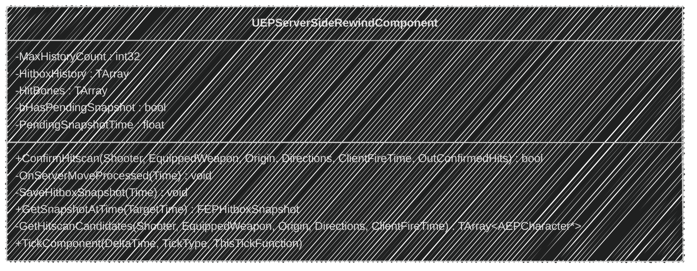
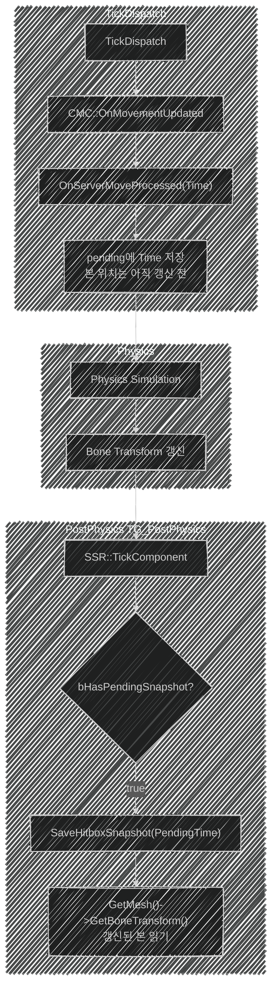
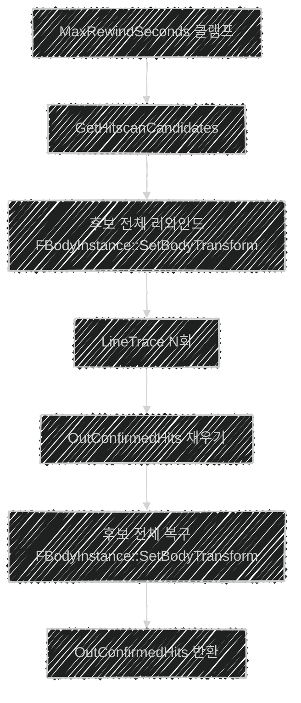
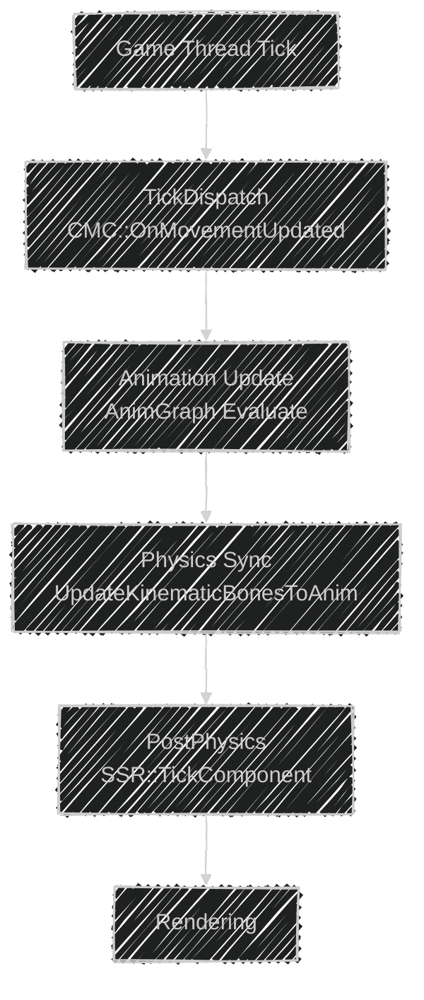

🚨 완성된 포스트가 아니므로, 지속적으로 수정됩니다!  
[👾 깃허브](https://github.com/SoftHamzzi/UE5-EmploymentProj)  
[📋 기획](https://github.com/SoftHamzzi/UE5-EmploymentProj/blob/main/DOCS/GAME.md)
{: .notice--warning}

---

## 개요

**이 포스팅에서 다루는 것:**
- `UEPServerSideRewindComponent` 설계와 책임 범위
- 매 Tick 본 Transform 히스토리 기록 구조
- `GetSnapshotAtTime` per-bone 보간
- `ConfirmHitscan` 전체 흐름 (Broad Phase → 리와인드 → Narrow Trace → 복구)
- 디버그 시각화 시스템

**왜 이렇게 구현했는가 (설계 의도):**
- Lag Compensation 로직을 AEPCharacter나 CombatComponent에 두면 두 클래스가 모두 비대해짐
- SSR 컴포넌트로 격리하면 GAS 어빌리티에서도 `ConfirmHitscan`을 재사용 가능
- `SetIsReplicatedByDefault(false)` — 히스토리는 서버만 필요, 복제 비용 0

---

## 구현 전 상태

챕터2 Replication까지는 Lag Compensation이 없었다:

```cpp
// 2단계 Server_Fire — 현재 위치 기준 즉시 판정
void UEPCombatComponent::Server_Fire_Implementation(...)
{
    // 서버 RPC 수신 시점의 적 위치로 판정
    // → 클라가 쏠 때 적이 위치 A에 있었어도
    //   RTT 후 서버에서는 이미 위치 B → 빗나감
    GetWorld()->LineTraceSingleByChannel(Hit, Origin, End, ECC_Visibility, Params);
}
```

1. 서버 RPC 수신 시점의 적 위치로 판정한다.
2. 클라이언트 시점에서 X=0 위치의 적에게 발사했다.
3. RTT 후 서버는 적의 위치는 X=1 위치에 있다.  
→ 빗나감

- 또한, 서버가 불안정한 상황에서 발사 소리와 이펙트가 늦게 나타난다.  
→ 불쾌한 경험을 초래한다.

---

## 구현 내용

### 1. SSR 컴포넌트 책임 범위



- UEPServerSideRewindComponent(SSR)는 서버 전용이다.

**변수:**

| 이름 | 역할 |
|---|---|
| MaxHistoryCount | 저장할 수 있는 최대 스냅샷 길이 |
| HitboxHistory | 히트박스 스냅샷 배열을 오름차순 저장한다. |
| HitBones | 피격될 수 있는 본 |
| bHasPendingSnapshot | PostPhysics에서 커밋할 pending이 있는지 여부 |
| PendingSnapshotTime | CMC에서 받은 서버 시간 임시 보관 |

**PendingSnapshotTime:**
- 서버 측 CMC에서는 클라이언트에게서 이동 정보 묶음을 받는다.
- 해당 자료형은 `FCharacterNetworkMoveDataContainer`이며, `FCharacterNetworkMoveData`로 구성되어 있다.
- 서버는 이동 정보 묶음을 한 틱에 모두 처리하며, 다시 받을때까지 이동 변화가 없다.
  - 즉, 뚝뚝 끊겨있음
- 그렇기에, 마지막으로 이동 정보 묶음을 처리한 시간을 표시하기 위한 변수이다.

**함수:**

| 이름 | 역할 |
|---|---|
| ConfirmHitscan | Broad Phase, 리와인드, Narrow Trace, 복구를 수행한다. |
| OnServerMoveProcessed | 서버 측 CMC에서 클라이언트에 대한 이동을 모두 처리한 후, 호출되는 콜백 함수 |
| SaveHitboxSnapshot | FHitboxSnapshot 구조체를 저장한다. |
| GetSnapshotAtTime | 발사 시간과 가장 인접한 두 스냅샷을 보간하여 반환한다. |
| GetHitscanCandidates | BroadPhase에서 후보 캐릭터들을 가져온다. |
| TickComponent | bHasPendingSnapshot이 true가 되면, SaveHitboxSnapshot 함수를 호출한다. |

**CombatComponent와의 역할 분리:**
```
UEPCombatComponent::HandleHitscanFire {
  ConfirmHitscan(Owner, Weapon, Origin, Directions, ClientFireTime, OutHits)  // SSR에 위임
  Damage Block (BoneMultiplier × MaterialMultiplier × BaseDamage)             // 여기서 처리
}
```

- FHitResult 배열 OutHits를 참조로 SSR->ConfirmHitscan에 넘겨주어 받아온다.
- 나머지 대미지 계산을 진행한다.

### 2. SaveHitboxSnapshot: 히스토리 기록

스냅샷 저장은 두 단계로 분리되어 있다.

**분리한 이유:**
- `OnMovementUpdated`(TickDispatch 시점)에서 바로 본 Transform을 읽으면, 물리 시뮬레이션이 아직 완료되지 않아 이전 프레임의 본 상태가 찍힌다.
- `Time`은 `CMC`가 이동을 확정한 순간의 값을 써야 하고, `본 Transform`은 물리 갱신이 끝난 `PostPhysics`에서 읽어야 두 값이 같은 순간을 가리킨다.
- 같은 틱이더라도, `TickDispath`와 `PostPhysics`에서의 서버 시간이 0.025ms 가량 다르게 찍히기에 생긴 일이다.



- 이렇게 구현을 해두었지만, 마지막으로 OnMovementUpdate가 일어난 시간을 얻는 더 좋은 방법이 있을 수도 있다.

```cpp
void UEPServerSideRewindComponent::BeginPlay()
{
    // MaxHistoryCount — ClientNetSendMoveDeltaTime 기반 계산
    float MoveDeltaTime = 1.f / 60.f;
    GConfig->GetFloat(TEXT("/Script/Engine.GameNetworkManager"),
        TEXT("ClientNetSendMoveDeltaTime"), MoveDeltaTime, GGameIni);
    MaxHistoryCount = FMath::CeilToInt(RewindWindow / MoveDeltaTime) + 4;

    // CMC 델리게이트 구독
    if (UEPCharacterMovement* CMC = ...)
        CMC->OnServerMoveProcessed.AddUObject(this, &ThisClass::OnServerMoveProcessed);
}
```

- SSR 컴포넌트의 BeginPlay에서 CMC에 있는 델리게이트를 등록한다.
- 이로써, CMC의 액터 이동이 처리되었을 때의 시간을 받을 수 있다.

**SaveHitboxSnapshot:**

```cpp
void UEPServerSideRewindComponent::SaveHitboxSnapshot(float Time)
{
    FEPHitboxSnapshot Snapshot;
    Snapshot.ServerTime = Time;                         // CMC에서 받은 이동 확정 시간
    Snapshot.Location   = OwnerChar->GetActorLocation(); // PostPhysics 시점의 실제 위치

    for (const FName& BoneName : HitBones)
    {
        const int32 BoneIndex = OwnerChar->GetMesh()->GetBoneIndex(BoneName);
        if (BoneIndex == INDEX_NONE) continue;

        FEPBoneSnapshot Bone;
        Bone.BoneName        = BoneName;
        Bone.WorldTransform  = OwnerChar->GetMesh()->GetBoneTransform(BoneIndex); // PostPhysics 시점
        Snapshot.Bones.Add(Bone);
    }

    // MaxHistoryCount 초과 시 가장 오래된 항목 제거 후 추가
    if (HitboxHistory.Num() >= MaxHistoryCount)
        HitboxHistory.RemoveAt(0);
    HitboxHistory.Add(Snapshot);
}
```

- 현재는 링버퍼 대신 단순 배열을 사용한다.
  - 링버퍼는 인덱스 관리가 필요해, 직관적으로 이해하기 위함이다.
  - 가득 차면 앞에서 제거하여, 뒤에 추가한다.

**MaxHistoryCount 결정:**

```cpp
// UEPCombatDeveloperSettings.h
// 리와인드 허용 범위를 결정한다.
MaxRewindSeconds = 0.5

// DefaultGame.ini
// 클라이언트가 서버에게 이동 정보 묶음을 보내는 주기를 정할 수 있다.
// 기본 값은 0.0166(60Hz), 오버라이드할 수 있다.
[/Script/Engine.GameNetworkManager]
ClientNetSendMoveDeltaTime = 0.0166

// UEPServerSideRewindComponent.cpp
// 서버가 가질 수 있는 최대 히스토리 길이
MaxHistoryCount = ceil(MaxRewindWindowSeconds / ClientNetSendMoveDeltaTime) + 4
```

- 스냅샷 저장 주기는 `ClientNetSendMoveDeltaTime`과 완전히 동기화된다.
  - ServerMove RPC 수신 → CMC 처리 → 스냅샷 1회 저장
  - ini 값을 바꾸면 버퍼 크기도 자동으로 맞춰진다.
- `ClientNetSendMoveDeltaTime`은 Project Settings UI에 노출되지 않으므로 `DefaultGame.ini` 직접 편집이 필요하다.

### 3. GetSnapshotAtTime: 보간

```cpp
FEPHitboxSnapshot UEPServerSideRewindComponent::GetSnapshotAtTime(float TargetTime) const
{
    // 경계 처리 — 히스토리 범위 밖이면 끝값 반환
    if (TargetTime <= HitboxHistory[0].ServerTime)      return HitboxHistory[0];
    if (TargetTime >= HitboxHistory.Last().ServerTime)  return HitboxHistory.Last();

    // HitboxHistory는 시간 오름차순 — Before/After 탐색
    const FEPHitboxSnapshot* Before = nullptr;
    const FEPHitboxSnapshot* After  = nullptr;

    for (int32 i = 0; i < HitboxHistory.Num() - 1; ++i)
    {
        if (HitboxHistory[i].ServerTime     <= TargetTime &&
            HitboxHistory[i + 1].ServerTime >= TargetTime)
        {
            Before = &HitboxHistory[i];
            After  = &HitboxHistory[i + 1];
            break;
        }
    }

    const float Denom = After->ServerTime - Before->ServerTime;
    const float Alpha = (Denom > KINDA_SMALL_NUMBER)
        ? FMath::Clamp((TargetTime - Before->ServerTime) / Denom, 0.f, 1.f)
        : 0.f;

    FEPHitboxSnapshot Result;
    Result.ServerTime = TargetTime;
    Result.Location   = FMath::Lerp(Before->Location, After->Location, Alpha);

    // per-bone 보간
    for (int32 i = 0; i < FMath::Min(Before->Bones.Num(), After->Bones.Num()); ++i)
    {
        FEPBoneSnapshot BoneResult;
        BoneResult.BoneName       = Before->Bones[i].BoneName;
        BoneResult.WorldTransform = Before->Bones[i].WorldTransform;
        BoneResult.WorldTransform.BlendWith(After->Bones[i].WorldTransform, Alpha);
        Result.Bones.Add(BoneResult);
    }

    return Result;
}
```

**FTransform::BlendWith를 쓰는 이유:**
- `FMath::Lerp(FRotator, FRotator)` — 각도 랩어라운드(-179° ↔ 181°) 문제가 발생한다.
- `BlendWith`는 내부적으로 쿼터니언 Slerp을 사용한다.
  - 올바른 회전 보간 보장

---

### 4. ConfirmHitscan 전체 흐름



1. **MaxRewindSeconds 클램프**
  - `ServerNow - ClientFireTime > MaxRewindSeconds`면 ClientTime을 ServerTime으로 덮어쓴다.

2. **Broad Phase: GetHitscanCandidates()**
  - 캡슐 반경 + `BroadPhasePaddingCm` 기준으로 후보 캐릭터를 추린다.

3. **후보 전체 리와인드**
  - `FBodyInstance::SetBodyTransform`으로 물리 바디만 과거 위치로 이동시킨다.

4. **Narrow Phase**
  - `LineTrace` N회 진행한다.
  - `CandidateSet.Contains()` 필터로 후보 외 히트를 차단한다.

5. **후보 전체 복구**
  - 동일한 API로 원래 Transform으로 복원한다. Narrow Phase 직후 즉시 수행한다.

6. **OutConfirmedHits 반환**

**FBodyInstance를 쓰는 이유:**



- `SetBoneTransformByName` — 본 Transform을 변형시키지만 Physics Body는 즉시 반영되지 않는다. AnimGraph Evaluate에서 덮어씌워지므로 Trace가 맞지 않는다.
- `SetBodyTransform` — Physics Body를 직접 변형시키므로 Trace가 정상 동작한다.

```cpp
FBodyInstance* Body = Mesh->GetBodyInstance(BoneName);
Body->SetBodyTransform(SnapshotTransform, ETeleportType::TeleportPhysics);
// → ETeleportType::TeleportPhysics: 속도 초기화, 물리 재시작 없음
```

**후보 외 히트 차단이 필요한 이유:**
- 리와인드 후 Trace를 쏘면 후보가 아닌 캐릭터에게도 맞을 수 있다.
- `CandidateSet.Contains(HitChar)` 필터로 이를 차단한다.

> 💭 **내 생각:**
> (여기에 직접 경험하거나 느낀 점 적기)

---

### 5. 디버그 시각화 시스템

`UEPCombatDeveloperSettings`에서 설정하며, `Config/DefaultGame.ini`에 저장된다.

```cpp
UPROPERTY(Config, EditAnywhere, Category = "Debug|SSR")
bool bEnableSSRDebugDraw = false;

UPROPERTY(Config, EditAnywhere, Category = "Debug|SSR")
float SSRDebugDrawDuration = 2.f;

UPROPERTY(Config, EditAnywhere, Category = "Debug|SSR")
float SSRDebugLineThickness = 1.5f;

UPROPERTY(Config, EditAnywhere, Category = "Debug|SSR")
bool bEnableSSRDebugLog = false;
```

**디버그 색상 코드:**

| 색상 | 의미 |
|------|------|
| Blue | 리와인드 전 현재 물리 프리미티브 |
| Red  | 리와인드 후 과거 위치의 물리 프리미티브 |
| White | 트레이스 선 (Origin → End) |
| Yellow | 확정 히트 지점 |

```cpp
// Shipping/Test 빌드에서 자동 제거
#if (UE_BUILD_SHIPPING || UE_BUILD_TEST)
    bDebugDraw = false;
    bDebugLog  = false;
#endif
```

---

## 결과

[](https://www.youtube.com/watch?v=bh4ao6mvxRY)

- CMC와 SSR이 동기화되지 않아서, 보이는 것보다 이전 위치를 때려야 히트 판정이 났었다.
  - 원인을 찾기 위해, CMC 코드, 언리얼 공식 문서, 레딧, 디버그 모든 수단을 동원했다.
  - 어떠한 상황이든 한 틱 차이로 나기에, 틱 내에서 생기는 문제라는 것을 알게 되었던 점이 포인트였다.
- 일주일동안 정말 삽질했다.
  - 하지만, 그만큼 많이 성장하였다.

**한계 및 향후 개선:**
- O(N) Broad Phase — 플레이어 수 증가 시 Spatial Hash로 교체 가능 (GetHitscanCandidates 함수만 교체)

---

## 참고



