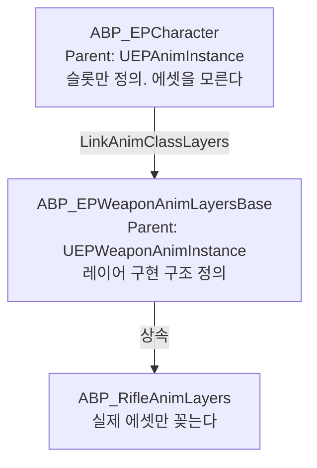

📌 이 문서는 **현재 구조**를 정리한 것이며, 완성본이 아닙니다.  
만들어 가는 과정은 [개발 기록](/categories/devlog)에 있습니다.
{: .notice--warning}

<!-- gif: 이동 → 조준 → 무기 교체 시 애니메이션 전환 -->

## 목표

**무기를 추가할 때 캐릭터 AnimBP를 열지 않는 구조**를 만드는 것이었다.
무기가 늘 때마다 메인 AnimBP에 상태와 분기가 붙으면 금방 손댈 수 없게 된다.

Lyra의 Linked Anim Layer 방식을 따랐다.

## 캐릭터 메시 구성

MetaHuman은 Body, Face, Outfit이 각각 별도 스켈레탈 메시다.
셋이 각자 AnimInstance를 돌리면 낭비다. 그래서 Body 하나만 구동한다.

```cpp
FaceMesh->SetupAttachment(GetMesh());
FaceMesh->SetLeaderPoseComponent(GetMesh());     // Body 포즈를 따라간다

OutfitMesh->SetupAttachment(GetMesh());
OutfitMesh->SetLeaderPoseComponent(GetMesh());
```

Face와 Outfit은 자체 AnimInstance를 실행하지 않고 Body의 본 포즈를 그대로 받는다.
AnimBP 하나가 전체를 구동한다.

1인칭 시점에서 자기 얼굴이 카메라를 가리는 문제는 `bOwnerNoSee = true`로 처리했다.
소유자에게만 안 보이고 다른 클라이언트에게는 정상으로 보인다.

> 자세한 구현: [MetaHuman을 AEPCharacter에 통합]()

## Linked Anim Layer 3계층

핵심은 **슬롯을 정의하는 곳과 에셋을 꽂는 곳을 분리한 것**이다.



| 계층 | 역할 |
|---|---|
| `ABP_EPCharacter` | Locomotion 상태 머신 + **빈 레이어 슬롯**. 어떤 애니메이션이 올지 모른다 |
| `ABP_EPWeaponAnimLayersBase` | 레이어 함수 구조를 정의. 시퀀스 플레이어 노드 배치 |
| `ABP_RifleAnimLayers` | `AnimGraphOverrides`로 실제 에셋만 지정 |

**새 무기를 추가할 때 만드는 파일은 세 번째 계층 하나뿐이다.**
`ABP_RifleAnimLayers`를 복제해서 에셋 참조만 바꾸면 된다.

교체는 런타임에 한 줄로 일어난다.

```cpp
// OnRep_EquippedWeapon
Owner->GetMesh()->LinkAnimClassLayers(NewWeapon->WeaponDef->WeaponAnimLayer);
```

`WeaponAnimLayer`가 `UEPWeaponDefinition` 안에 있다는 게 중요하다.
**애니메이션 레이어도 무기 데이터의 일부다.** 코드에 무기별 분기가 없다.

## Locomotion 상태 머신


| State | 호출 레이어 | 전환 조건 |
|---|---|---|
| `IdleWalkJog` | `FullBody_IdleWalkRun` | 기본 |
| `Crouch` | `FullBody_Crouch` | `bIsCrouching` |
| `JumpSources` | - | 점프 입력 |
| `Jump` | `FullBody_Jump` | 공중 |

상태 머신은 **어떤 레이어를 호출할지만 정한다.** Idle에서 Walk, Jog로 이어지는 블렌딩은 레이어 안쪽 BlendSpace가 담당한다.
그래서 무기가 바뀌어도 상태 머신은 그대로다.

상체는 별도로 처리한다. AimOffset으로 상하 시야를 반영하고, 피격 반응은 Additive 슬롯으로 얹는다.

## Thread-Safe Property Access

레이어 AnimBP가 메인 AnimBP의 값을 가져와야 한다. 속도와 방향이 그렇다.

여기서 변수를 레이어 쪽에도 선언해서 복사하면 이중 관리가 된다.
`Get Main Anim Blueprint Thread Safe` 노드를 쓰면 워커 스레드에서 안전하게 직접 읽는다.

```
ABP_RifleAnimLayers AnimGraph
  Get Main Anim Blueprint Thread Safe
    → ABP_EPCharacter로 캐스트
    → .Speed      → BlendSpace X축
    → .Direction  → BlendSpace Y축
```

애니메이션 평가는 게임 스레드가 아니라 워커 스레드에서 돈다.
거기서 게임 오브젝트를 직접 만지면 경합이 난다. Thread-Safe 노드를 쓰는 이유다.

## 왼손 IK

무기를 들었을 때 왼손이 총열 위치에 정확히 붙어야 한다.
무기마다 그립 위치가 달라서 애니메이션만으로는 맞출 수 없다.

무기 메시의 `LeftHandIK` 소켓 위치를 오른손 본 기준 상대 좌표로 바꿔서 FABRIK에 넘긴다.

```cpp
// NativeUpdateAnimation
FTransform WorldLeftHandIK = WeaponMesh->GetSocketTransform(FName("LeftHandIK"));
FTransform HandR_World     = Character->GetMesh()->GetBoneTransform(FName("hand_r"));

LeftHandIKTransform = WorldLeftHandIK.GetRelativeTransform(HandR_World);
```

오른손 기준 상대 좌표로 두는 이유는 **총이 오른손에 붙어 있기 때문**이다.
월드 좌표로 두면 캐릭터가 움직일 때마다 한 프레임씩 밀린다.


## 사망 처리

셀프 래그돌로 처리한다. 별도 시체 액터를 스폰하지 않고 캐릭터 메시를 그대로 물리로 전환한다.

여기에 알려진 한계가 하나 있다. **MetaHuman의 Groom(머리카락)이 래그돌을 따라가지 않는다.**
Groom 바인딩이 스켈레탈 메시의 애니메이션 포즈를 기준으로 동작하기 때문이다.

제대로 고치려면 시체를 별도 액터로 스폰해야 한다. 지금은 우선순위에서 밀려 있다.

## 서버에서의 전제

지연 보상이 본 단위로 판정하기 때문에 **서버도 애니메이션 포즈를 갱신해야 한다.**

```cpp
GetMesh()->VisibilityBasedAnimTickOption =
    EVisibilityBasedAnimTickOption::AlwaysTickPoseAndRefreshBones;
```

서버는 렌더링이 없어서 기본 설정으로는 포즈를 갱신하지 않는다.
이걸 안 켜면 히트박스 스냅샷이 정적 포즈로 고정된다.
애니메이션 설정 하나가 히트 판정 정확도를 좌우한다.

> 관련 문서: [네트워크 동기화와 지연 보상]()

## 남은 것

- **Groom 래그돌 미지원.** 시체 액터 분리로 해결해야 한다
- 재장전과 스킬 시전 애니메이션이 없다. `PlayMontageAndWait`로 붙일 자리는 만들어뒀다
- FABRIK 팁 본 설정이 임시다. 폴리싱 단계에서 손봐야 한다
- 무기 레이어가 현재 라이플 하나뿐이다. 두 번째 무기를 넣어야 3계층 구조가 실제로 검증된다

> 자세한 구현: [애니메이션 시스템]()
