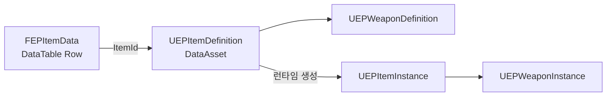
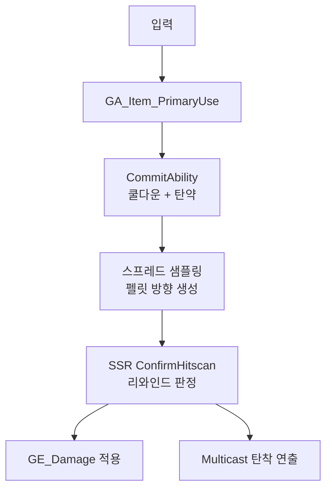

📌 이 문서는 **현재 구조**를 정리한 것이며, 완성본이 아닙니다.  
만들어 가는 과정은 [개발 기록](/categories/devlog)에 있습니다.
{: .notice--warning}

<!-- gif: 사격 → 탄착군 → 헤드샷 데미지 로그 -->

## 아이템 3계층

무기와 아이템을 세 계층으로 나눴다. `ItemId`(FName)로 연결된다.



| 계층 | 성격 | 담는 것 |
|---|---|---|
| `FEPItemData` | DataTable Row | 이름, 아이콘, 스택 가능 여부. **표로 훑어야 하는 값** |
| `UEPItemDefinition` | DataAsset | 메시, 애니메이션 레이어, 스폰 클래스. **에셋 참조** |
| `UEPItemInstance` | 런타임 오브젝트 | 현재 탄약, 내구도. **인스턴스마다 다른 값** |

나눈 기준은 **누가 언제 바꾸는가**다.
DataTable은 기획자가 엑셀로 한꺼번에 본다. DataAsset은 에셋 참조라 표에 넣기 어렵다.
Instance는 게임 중에만 존재한다.

무기 스폰 클래스, 애니메이션 레이어, 탄퍼짐 커브가 전부 `UEPWeaponDefinition` 안에 있다.
**새 무기를 넣을 때 C++을 건드리지 않는다.** DataAsset 하나를 복제해서 값을 바꾼다.

> 자세한 구현: [아이템 시스템 설계]() · [스폰 시스템과 DataAsset]()

## 사격 흐름

발사 판단은 GAS가, 히트 판정은 SSR이, 연출은 CombatComponent가 맡는다.



`UEPCombatComponent`는 원래 장착 관리, 발사 실행, 이펙트 재생을 전부 하고 있었다.
GAS 이관에서 발사 실행이 GA로 빠지면서 **장착 관리와 코스메틱만 남았다.**

> 자세한 구현: [CombatComponent 분리와 무기 액터 설계]()

## 탄퍼짐: 균일 난수는 도넛이 된다

### 문제

원 안에 균등하게 뿌리려고 반경비율을 `FRand()`로 뽑았다. 결과는 **바깥에 몰렸다.**

```
반경 r인 원에서 고리 하나의 넓이는 r에 비례해 커진다.
  r=0.1 근처 고리 : 좁다
  r=0.9 근처 고리 : 9배 넓다

FRand()는 0.1도 0.9도 같은 확률로 뽑는다.
→ 넓은 바깥 고리와 좁은 중심 고리에 같은 수의 탄이 떨어진다
→ 눈에는 "바깥에 몰린다"로 보인다
```

**반경 균등은 면적 균등이 아니다.**

### 해결: √r 보정이 아니라 커브를 데이터로

`√r` 한 줄로 면적 균등을 만들 수는 있다. 그런데 면적 균등도 정답이 아니다.
소총은 중심 집중, 산탄총은 약간 퍼짐, 특수 무기는 도넛형일 수도 있다.
**분포 자체가 무기별 데이터여야 한다.**

디자이너가 "X축은 반경비율, Y축은 상대 확률"인 커브를 그린다.
그 커브를 적분해서 룩업 테이블을 만들고, 역변환 샘플링으로 뽑는다.

```
[BeginPlay]  커브(PDF) → 사다리꼴 적분 → 누적합(CDF) → 정규화 → 256칸 테이블
[Fire()]     균등 난수 → 테이블 이진 탐색 → 반경비율 반환
```

```cpp
static constexpr int32 CDFTableSize = 256;
TArray<float> SpreadCDFTable;
void  BuildSpreadCDFTable();   // BeginPlay에서 1회
float SampleSpread() const;    // 매 펠릿
```

Y값의 절댓값은 상관없다. 정규화하므로 Y=2와 Y=200이 같은 결과를 낸다.
**디자이너가 스케일을 신경 쓰지 않아도 된다.**

여기에 층화 샘플링을 더했다. 각도를 완전 난수로 뽑으면 펠릿이 한쪽에 뭉치는 판이 나온다.
원을 펠릿 수만큼 등분하고 각 구간 안에서 뽑으면 뭉침이 사라진다.

<!-- 스크린샷: 벽 탄착군 3종 비교 (균등 난수 / CDF 중심집중 / CDF + 층화) -->

## 부위 데미지: 본 이름에서 태그로

처음에는 무기 DataAsset에 `TMap<FName, float>`으로 본 이름과 배율을 넣었다.
무기가 늘 때마다 본 이름 목록을 복사해야 했고, 오타가 나면 조용히 배율 1.0이 됐다.

지금은 책임을 두 에셋으로 나눈다.

| 에셋 | 답하는 질문 |
|---|---|
| `UEPPhysicalMaterial` | **이 부위는 무엇인가** (`Hit.Zone.Head`) |
| `UEPWeaponDefinition` | **이 무기는 그 부위에 몇 배인가** (`TagDamageMultiplierMap`) |

부위 정의는 캐릭터가, 배율은 무기가 갖는다.
저격총이 헤드샷 배율 3배, 산탄총이 1.5배인 걸 무기 쪽에서만 바꾸면 된다.
새 부위(손, 발)를 추가해도 무기 에셋을 전부 열 필요가 없다.

```
Bone=head,       Final=70.0    (BaseDamage 35 × 2.0)
Bone=upperarm_l, Final=26.25   (BaseDamage 35 × 0.75)
```

## 겪은 문제: 샷건 10발을 쐈는데 탄흔이 2개

증상은 하나인데 **원인이 셋이었다.** 하나씩 고칠 때마다 조금씩 나아져서 다 찾는 데 오래 걸렸다.

### 원인 1. Unreliable Multicast 드롭

히트마다 `Multicast_PlayImpactEffect`를 호출하고 있었다. 10발이면 한 프레임에 10회다.
Multicast는 Unreliable이라 몰리면 **조용히 버려진다.**

시그니처를 배열로 바꿔 1회 호출로 합쳤다.

```cpp
// Before
void Multicast_PlayImpactEffect(FVector Point, FVector Normal);           // 10회

// After
void Multicast_PlayImpactEffect(const TArray<FVector_NetQuantize>& Points,
                                const TArray<FVector_NetQuantize>& Normals);  // 1회
```

코스메틱을 Unreliable로 보내는 것 자체는 맞다. 그런데 **호출 횟수를 줄이는 건 별개 문제다.**
"몇 개 빠져도 된다"와 "10개 중 8개가 빠진다"는 다르다.

### 원인 2. 수집이 캐릭터 블록 안에 있었다

```cpp
if (HitChar)
{
    /* 데미지 적용 */
    ImpactPoints.Add(Hit.ImpactPoint);   // 벽 히트는 수집되지 않는다
}
```

벽에 맞은 히트가 배열에 안 들어갔다. 블록 밖으로 옮겼다.

### 원인 3. SSR이 환경 히트를 버리고 있었다

제일 근본적인 원인이다. SSR은 **캐릭터 판정 전용**으로 설계해서 벽 히트를 반환하지 않았다.

```cpp
AEPCharacter* HitChar = Cast<AEPCharacter>(Hit.GetActor());
if (HitChar && CandidateSet.Contains(HitChar))
{
    OutConfirmedHits.Add(Hit);
}
else if (!HitChar)          // 추가. 환경 히트, 연출 목적
{
    OutConfirmedHits.Add(Hit);
}
```

`else if (!HitChar)` 조건이 중요하다.
그냥 `else`로 뭉뚱그리면 **후보군에 없는 캐릭터까지 통과**해서, 리와인드하지 않은 대상에 맞는 걸 막던 안전장치가 무력화된다.

**한 시스템의 출력 계약을 넓힐 때는 원래 계약이 왜 좁았는지부터 확인해야 한다.**
이 문제에서 배운 게 제일 많았다.

> 자세한 구현: [탄퍼짐 CDF와 부위 데미지 태그]()

## 남은 것

- **인벤토리가 작업 중이다.** 스포너와 상호작용은 됐고, 슬롯 관리를 `FastArraySerializer`로 붙이고 있다
- `case Hitscan: default:` 로 묶여 있다. 근접 무기를 넣기 전에 갈라야 한다
- 발사와 착탄 연출이 GameplayCue가 아니라 Multicast RPC다. FX 에셋이 `CombatComponent`에 있어서 무기별로 갈리지 않는다
