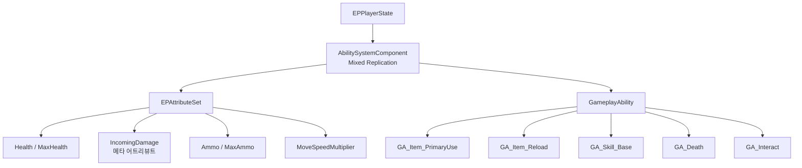
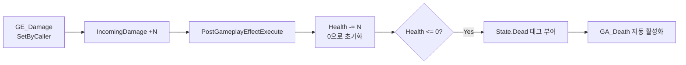

📌 이 문서는 **현재 구조**를 AI로 정리한 것이며, 완성본이 아닙니다.  
만들어 가는 과정은 [개발 기록](/categories/devlog)에 있습니다.
{: .notice--warning}

<!-- gif: 스킬 3종 시전 + 쿨타임 UI -->

## 왜 옮겼나

GAS 이전에는 **같은 규칙이 세 군데에 흩어져 있었다.**

연사 속도 하나를 예로 들면, 클라이언트 입력 단계에서 한 번 막고, 서버 RPC에서 또 막고, 무기 액터가 세 번째로 막았다.
세 곳이 각자 다른 변수를 봤고, 그중 하나는 복제되지 않는 값이었다.

```
[이전]
Input → RequestFire()          ← 클라 로컬 타이머로 1차 차단
      → Server_Fire RPC        ← 서버 변수로 2차 차단
      → Weapon::CanFire()      ← 무기 상태로 3차 차단
      → Weapon::Fire()

[현재]
Input → GA_Item_PrimaryUse 활성화
      → CommitAbility()        ← 쿨다운 GE + 탄약 Cost 를 한 번에
      → SSR ConfirmHitscan
      → GE_Damage 적용
```

문제는 규칙이 세 벌인 것 자체가 아니라 **어느 것이 진짜인지 코드만 봐서는 알 수 없다는 점**이었다.
GAS로 옮긴 실질적 이득은 기능이 아니라 **상태가 사는 자리를 하나로 정한 것**이다.

## 현재 구조



### ASC를 PlayerState에 둔 이유

캐릭터가 아니라 PlayerState에 붙였다.
익스트랙션 슈터라 **캐릭터는 죽고 다시 스폰되지만 플레이어 데이터는 매치 내내 살아 있어야 한다.**
ASC가 캐릭터에 붙어 있으면 죽을 때마다 어트리뷰트와 어빌리티가 같이 사라진다.

`InitAbilityActorInfo`는 **서버와 클라 양쪽에서** 불러야 한다.
서버는 `PossessedBy`, 클라는 `OnRep_PlayerState`다. 한쪽만 하면 조용히 반쪽만 동작한다.

Replication Mode는 `Mixed`다. 멀티플레이어에서 GE는 소유 클라에만 보내고 GameplayCue는 전체에 보낸다.

## 데미지 파이프라인

**Health를 직접 깎는 GE는 하나도 없다.** 전부 `IncomingDamage`라는 메타 어트리뷰트를 거친다.



이렇게 한 이유는 세 가지다.

- **데미지 계산을 한 곳에 모을 수 있다.** 방어력, 부위 배율, 무적 판정이 전부 `PostGameplayEffectExecute` 한 자리에 들어간다
- **Health는 서버에서만 바뀐다.** 메타 어트리뷰트는 복제되지 않는다. 클라가 볼 일도 없다
- **사망 판정이 한 번만 일어난다.** 여러 발이 동시에 도착해도 진입점이 하나다

`State.Dead`는 Infinite GE로 부여한다. 태그를 직접 `AddLooseGameplayTag`로 붙이면 **복제되지 않는다.**
GE로 붙여야 다른 클라이언트도 저 캐릭터가 죽었다는 걸 안다.

`GA_Death`는 아무도 직접 호출하지 않는다. `State.Dead` 태그가 붙으면 트리거로 켜진다.
덕분에 죽는 경로가 늘어나도(낙사, 지형 데미지) 호출부를 추가할 필요가 없다.

> 자세한 구현: [데미지와 HP 파이프라인]()

## 어빌리티

| 어빌리티 | 실행 정책 | 하는 일 |
|---|---|---|
| `GA_Item_PrimaryUse` | LocalPredicted | 발사. 쿨다운 GE로 연사 제한, 탄약 Cost |
| `GA_Item_Reload` | LocalPredicted | 재장전. `State.Reloading` 태그 + `WaitDelay` |
| `GA_Skill_Dash` | LocalPredicted | 대시 |
| `GA_Skill_Heal` | LocalPredicted | 시전 후 회복 |
| `GA_Skill_ShieldOn` | LocalPredicted | 지속형 방어 |
| `GA_Death` | ServerOnly | 사망 연출, 입력 차단 |
| `GA_Interact` | LocalPredicted | 상호작용, 루팅 |

### 예측하는 것과 예측하지 않는 것

기준은 하나다. **틀렸을 때 되돌릴 수 있는가.**

| 예측한다 | 예측하지 않는다 |
|---|---|
| 총구 화염, 발사음 | 데미지 적용 |
| 애니메이션 재생 | 사망 |
| 쿨다운 시작 | 히트 판정 |
| 탄약 감소 | 아이템 소비 확정 |

되돌릴 수 없는 것을 예측하면 롤백할 때 화면이 튄다.
반대로 연출은 예측하지 않으면 RTT만큼 늦게 나와서 총이 무겁게 느껴진다.

### 스킬 베이스 클래스

스킬 3종을 각자 구현했더니 시전, 취소, 이동속도 감소가 세 번씩 복사됐다.
스킬이 늘어날수록 곱하기로 커지는 구조였다.

`UEPGA_Skill_Base`로 공통 흐름을 올리고 서브클래스는 `OnCastComplete()` 하나만 채우게 했다.

<details markdown="1">
<summary>스킬 베이스 클래스 필드 (접기/펼치기)</summary>

```cpp
UPROPERTY(EditDefaultsOnly, Category = "Cast")
float CastTime = 0.f;

UPROPERTY(EditDefaultsOnly, Category = "Cast")
bool bInterruptibleOnDamage = false;

virtual void OnCastComplete() PURE_VIRTUAL(...);
```

</details>

`ActivateAbility`는 `final`이다. 서브클래스가 실수로 덮어써서 공통 흐름을 건너뛰는 걸 컴파일 단계에서 막는다.

> 자세한 구현: [발사와 재장전 이관](), [스킬 3종과 베이스 클래스]()

## 겪은 문제: 쿨타임이 5에서 4.5로, 다시 5로 되돌아간다

가장 오래 붙잡은 문제다. 지금도 절반만 풀렸다. 표시는 고쳤고, 근본 원인은 아직 남아 있다.

<!-- 스크린샷: 쿨타임 숫자가 되돌아가는 장면 (수정 전) -->

### 클라에는 같은 GE가 두 개 생긴다

`CommitAbility`는 예측 창 안에서 쿨다운 GE를 적용한다.
그래서 클라이언트는 **예측본을 하나 만든다.** 그리고 잠시 뒤 서버가 만든 진짜 GE가 복제돼서 내려온다.

쿨다운 GE는 보통 스택 정책이 없어서 둘이 합쳐지지 않는다.
그 겹치는 구간 동안 `GetActiveEffectsTimeRemainingAndDuration`이 **항목 두 개를 돌려준다.**

### 왜 하필 정확히 원래 값으로 돌아오나

이게 진단의 실마리였다. 4.7이나 4.9가 아니라 **항상 정확히 원래 값**이었다.

두 GE의 시작 시각이 왕복 지연만큼 벌어져 있기 때문이다.

| | 누가 찍었나 | 시작 시각 |
|---|---|---|
| 예측본 | 클라가 자기 추정 서버 시각으로 | `S0 - D` |
| 서버본 | 서버가 진짜 서버 시각으로 | `S0 + U` |

`U`는 입력이 올라가는 지연, `D`는 결과가 내려오는 지연이다.
차이가 `U + D`, 곧 왕복 지연이 된다.

그리고 클라이언트가 아는 서버 시각은 **`D`만큼 낮다.**
`ReplicatedWorldTimeSecondsDouble`과 자기 시각을 그냥 빼기 때문이다. 비행 시간을 되더해주는 항이 없다.

<details markdown="1">
<summary>서버 시각 추정치 계산 (접기/펼치기)</summary>

```cpp
// GameStateBase.cpp:169
const double ServerWorldTimeDelta = ReplicatedWorldTimeSecondsDouble - World->GetTimeSeconds();
// 지연 보정 항이 없다
```

</details>

서버 GE가 도착했을 때 경과 시간을 다시 계산하면:

<details markdown="1">
<summary>경과 시간 재계산 (접기/펼치기)</summary>

```cpp
// GameplayEffect.cpp:2950 (괄호 안이 "얼마나 살았나")
StartWorldTime = WorldTime - (ServerWorldTime - StartServerWorldTime);
```

</details>

`ServerWorldTime`이 `D`만큼 낮게 잡혀 있으니, 서버본이 실제로 살아 있던 시간(`D`)이 그대로
상쇄되어 경과가 0이 된다. **방금 시작한 것으로 읽혀서 남은 시간이 전체 지속시간으로
되돌아간다.**

### 예측을 아예 못 하는 게 아니다

흔히 "GAS는 쿨다운을 예측하지 못한다"고 하는데, 정확히는 **적용은 예측하고 시간 정합만
못 맞춘다.** 엔진 문서가 예측 대상으로 GameplayEffect 적용을 직접 명시한다. 없는 건
지연 보정이다.

### 표시는 GE에서 떼어냈다

처음엔 표시값이 이전보다 커지지 못하게 막는 단조 감소 클램프로 우회했다. 되돌아가는
대신 왕복 지연 동안 숫자가 멈추는 방식이었다. **지금은 다르다.** GE를 아예 안 보게
바꿨다.

<details markdown="1">
<summary>메시지로 발행하는 쿨다운 (접기/펼치기)</summary>

```cpp
// EPGA_Skill_Base.cpp:85 (GE 적용과 Broadcast가 한 함수 안에 있다)
ApplyGameplayEffectSpecToOwner(CurrentSpecHandle, CurrentActorInfo, CurrentActivationInfo, CDSpec);
BroadcastDurationMessage(CooldownChannelTag, Cooldown);   // Lyra의 GameplayMessageRouter 플러그인

// EPSkillSlotWidget.cpp:113 (받은 시점이 곧 시작 시점)
CooldownStartTime = World->GetTimeSeconds();
CooldownDuration  = Message.Duration;
```

</details>

`GameplayMessageRouter`는 복제가 아니라 프로세스 로컬 pub/sub이라 서버 시각을 안 거친다.
`GetServerWorldTimeSeconds()`의 편향이 낄 자리가 아예 없다. 채널이 `FGameplayTag`라
어빌리티와 위젯이 서로를 몰라도 값 하나로 약속된다. 예측본/서버본 스왑이 표시에 닿을
경로 자체가 없어졌다.

<details markdown="1">
<summary>SetCooldownTag (접기/펼치기)</summary>

```cpp
// EPGA_Skill_Base.cpp:79
void UEPGA_Skill_Base::SetCooldownTag(FGameplayTag Tag)
{
    ActivationBlockedTags.AddTag(Tag);   // 재발동 차단
    CooldownChannelTag = Tag;            // 표시 채널
}
```

</details>

차단 태그와 표시 채널을 한 함수로 묶어 어긋날 수 없게 했다.

### 남은 문제: 재발동은 여전히 막힌다

표시는 고쳤지만 원인은 안 고쳤다. **GE *적용*은 예측되지만 GE *제거*는 예측되지
않는다.** 재사용 차단 태그(`ActivationBlockedTags`)는 서버가 실제로 GE를 지울 때까지
안 풀린다. 클라 쪽 쿨다운이 끝나도, 서버 GE가 살아 있는 동안은 재발동이 왕복 지연만큼
계속 막힌다.

Epic도 같은 문제를 "GE reconciliation"이라는 이름으로 시도했다가(GE Duration을 핑만큼
깎아 두 시계를 맞추는 안) 모든 엣지 케이스를 못 막아서 접었다는 기록이
[GASDocumentation](https://github.com/tranek/GASDocumentation)에 있다. 같은 벽에
다시 부딪힐 이유가 없어서, 다음 방향은 **쿨다운을 GE에서 완전히 빼고 복제되지 않는
타임스탬프로 옮기는 것**으로 잡았다. 무기 연사 쪽(아래 절)에서 이미 검증한 패턴과 같은
계열이다.

> 조사 전체 기록: [쿨다운 GE는 시간을 못 맞춘다]()

> 자세한 구현: [HUD와 GAS 이관 결산]()

## 겪은 문제: 연사 속도가 핑에 비례했다

AK74를 초당 8발 완전자동으로 구현했는데, 데이터대로 나오지 않았다. **핑이 높을수록
연사가 느려졌다.**

### 원인: 한 발마다 어빌리티를 새로 켜고 껐다

<details markdown="1">
<summary>발마다 오가는 RPC 두 개 (접기/펼치기)</summary>

```cpp
// AbilitySystemComponent.h (둘 다 Server, reliable)
UFUNCTION(Server, reliable, WithValidation) void ServerTryActivateAbility(...);
UFUNCTION(Server, reliable, WithValidation) void ServerEndAbility(...);
```

</details>

입력을 `ETriggerEvent::Triggered`로 받아 **총알 한 발마다 어빌리티를 새로 활성화하고
즉시 종료**하고 있었다. 한 발 = 활성화 1회 + 종료 1회, 초당 8발이면 GAS 자체 Reliable
RPC만 초당 16개. 발사 주기 안에 매번 네트워크 왕복이 끼어 있었다.

### 해결: 어빌리티 하나가 연사 내내 살아 있게

<details markdown="1">
<summary>연사 내내 살아 있는 어빌리티 (접기/펼치기)</summary>

```cpp
// 입력: 매 프레임이 아니라 눌림/뗌
Bind(FireAction, ETriggerEvent::Started,   &Input_Fire);
Bind(FireAction, ETriggerEvent::Completed, &Input_StopFire);

// 어빌리티: 첫 발을 쏘고, Auto면 타이머로 반복하며 살아 있는다
FireOnce();
if (FireMode == EEPFireMode::Auto)
    SetTimer(FireTimerHandle, this, &FireOnce, 1.f / FireRate, true);
else
    EndAbility(...);
```

</details>

| 함정 | 무슨 일이 일어나나 | 해결 |
|---|---|---|
| `CommitAbility()`를 매 발 호출하면 실패 | 쿨다운 지속시간이 타이머 간격과 정확히 같아, 직전 발이 건 쿨다운에 이번 발이 스스로 걸림 | `CommitAbilityCost()` + `CommitAbilityCooldown(ForceCooldown=true)`로 분리 |
| 트리거를 뗐는데 서버가 계속 쏨 | `bServerRespectsRemoteAbilityCancellation`이 `false`면 클라의 취소가 로컬 인스턴스만 멈춤 | 이 어빌리티는 `true` |

자동발사는 이걸로 풀렸다. 다만 **단발 모드는 위 절과 같은 문제를 그대로 물려받는다.**
트리거를 뗐다 다시 누르는 매 순간이 새 `ActivateAbility`라, 서버 쿨다운 GE가 살아 있는
동안은 재발동이 막힌다.

| | 수정 전 | 수정 후 |
|---|---|---|
| GAS 자체 Reliable RPC | 총알 수 × 2 (초당 16개) | 연사 1회당 2개 |
| 실제 연사 속도 | RTT 상한에 눌림 | 핑 의존성 없음 (자동발사 한정) |

## HUD

C++ 베이스 클래스에 로직을 두고 WBP 서브클래스에 레이아웃을 둔다.
디자이너가 위젯을 옮겨도 C++을 건드리지 않는다.

데이터를 받는 방식은 세 계층이다.

| 계층 | 방식 | 쓰는 곳 |
|---|---|---|
| 어트리뷰트 | `GetGameplayAttributeValueChangeDelegate` | HP, 탄약 |
| 태그 | `RegisterGameplayTagEvent` | 재장전 중, 사망 |
| 쿨다운/시전 지속시간 | `GameplayMessageRouter` 구독 | 스킬 쿨타임, 시전 게이지 |

앞의 둘은 이벤트로 받는다. 쿨다운/시전 지속시간도 이제 이벤트다. 예전에는 GE 남은
시간을 매 프레임 폴링했지만, 위 절에서 옮긴 메시지 버스가 값을 직접 밀어준다.

## 이관 결산

### 지운 것

| 제거 대상 | 대체 |
|---|---|
| `AEPCharacter::HP` / `TakeDamage()` / `OnRep_HP()` | `Health` 어트리뷰트 + GE 파이프라인 |
| `Server_Fire` / `Server_Reload` RPC | `GA_Item_PrimaryUse` / `GA_Item_Reload` |
| `LastServerFireTime` 외 연사 변수 3종 | `GE_FireCooldown` |
| `AEPWeapon::CurrentAmmo` / `StartReload` / 타이머 핸들 | `Ammo` 어트리뷰트 + `WaitDelay` |
| `AEPWeapon::WeaponState` enum | `State.Reloading` 태그 |
| `BoneDamageMultiplierMap` | `TagDamageMultiplierMap` |

### 그대로 둔 것

이쪽이 더 중요하다.

| 유지 대상 | 이유 |
|---|---|
| `UEPServerSideRewindComponent` 전체 | 호출 위치만 바뀌었다. 구조는 무변경 |
| Physics Asset 본별 히트박스 | 태그 시스템이 그 위에 얹혔을 뿐 |
| 스프레드 계산 | 개선하며 유지 |

**GAS 이관은 전면 재작성이 아니었다.**
어려운 부분, 그러니까 지연 보상과 본 단위 판정은 그대로 두고 **상태를 관리하던 코드만 걷어냈다.**

가장 크게 달라진 건 기능이 아니라 **기능을 추가할 때 무엇을 열어야 하는가**다.
이전에는 `AEPCharacter`와 `UEPCombatComponent`를 열었다. 지금은 GA 클래스 하나와 DataAsset을 만든다.

## 남은 숙제

- **쿨다운 GE를 걷어내는 작업이 진행 중이다.** 처음엔 GE Duration을 핑만큼 깎는 안을
  생각했지만, Epic이 이미 같은 방향("GE reconciliation")을 시도했다가 접은 기록을
  찾았다. 대신 쿨다운을 GE에서 완전히 빼고 복제되지 않는 타임스탬프로 옮기는 방향으로
  바꿨다. 무기 자동발사 쪽은 이미 이 계열의 패턴(타이머로 인스턴스 유지)을 쓰고 있다
- **발사와 착탄 연출이 아직 Multicast RPC다.** GameplayCue로 옮기는 게 맞다. FX 에셋이 `CombatComponent`에 있어서 무기별로 갈리지 않는 것부터 고쳐야 한다
- 재장전과 시전 애니메이션이 없다. `PlayMontageAndWait`로 바꿔야 한다
- `GA_Death`가 진행 중인 어빌리티를 취소하지 않는다

첫 항목은 경쟁 슈터라면 그냥 넘길 수 없는 문제다. 포트폴리오 범위에서 우선순위를 뒤로 뒀을 뿐이다.

## 참고

- [GASDocumentation](https://github.com/tranek/GASDocumentation)
- `Engine/Plugins/Runtime/GameplayAbilities/Public/GameplayPrediction.h` 상단 주석. 무엇이 예측되고 무엇이 안 되는지 목록이 있다
- `LyraStarterGame` 소스: 연속발사 무기와 단발 캐스트형(수류탄)이 쿨다운을 다루는 방식을 비교할 때 참고했다
