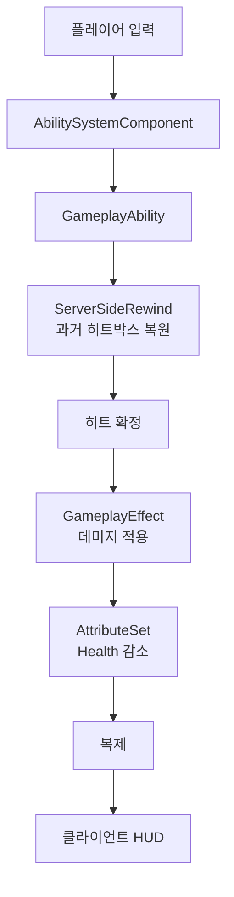

📌 UE5 C++ 멀티플레이어 익스트랙션 슈터  
이 포트폴리오는 완성본이 아닙니다!
[👾 깃허브](https://github.com/SoftHamzzi/UE5-EmploymentProj)  
[📋 기획서](https://github.com/SoftHamzzi/UE5-EmploymentProj/blob/main/DOCS/GAME.md)  
[📝 개발 기록 전체](/categories/devlog)
{: .notice--warning}

## 어떤 게임인가

"취업"을 테마로 한 1인칭 익스트랙션 슈터다. 2~8인 멀티플레이어.

```
매치 시작 → 랜덤 스폰 → 파밍(루팅 + 자판기) → 교전 → 탈출 → 보상
```

퀘스트 아이템(이력서, 자격증)을 모아 탈출하면 "취업 성공"이다.
죽으면 소지품을 전부 잃고, 탈출하면 보존한다.

<!-- 영상: 매치 한 판 전체 흐름 (스폰 → 파밍 → 교전 → 탈출) -->

## 지연 보상 동작 영상

[](https://www.youtube.com/watch?v=bh4ao6mvxRY)

서버가 과거 시점의 히트박스를 복원해서 판정하는 장면이다.
자세한 내용은 아래 [네트워크 동기화와 지연 보상](#시스템-문서) 문서에 있다.

## 이 프로젝트의 전제

**전 게임 로직이 서버 권한이다.**
클라이언트는 입력을 보내고 결과를 받아 그린다. 판정은 하지 않는다.

템플릿과 블루프린트에 의존하지 않고 C++로 설계했다.
블루프린트는 데이터와 에셋 참조를 담는 서브클래스에만 쓴다.

> **검증 범위를 분명히 해둔다.** 설계 목표는 2~8인이지만,
> 실제로 확인한 것은 **PIE 다중 클라이언트 2인 동시 접속**까지다.
> 데디케이티드 서버 타깃(`*Server.Target.cs`)은 아직 분리하지 않았고,
> Listen Server 구성으로 서버 권한 경로를 검증했다.



## 시스템 문서

각 문서는 **현재 구조 + 겪은 문제 + 남은 것**을 담는다.
구현 과정은 문서 안에서 개발 기록으로 연결된다.

| 문서 | 다루는 것 |
|---|---|
| [네트워크 동기화와 지연 보상]() | 서버 권한 구조, CMC 확장, 히트박스 리와인드 |
| [GAS 기반 전투 시스템]() | ASC/AttributeSet, 데미지 파이프라인, 어빌리티, HUD |
| [전투와 아이템]() | 아이템 3계층, 무기 설계, 탄퍼짐 CDF, 부위 데미지 |
| [애니메이션]() | MetaHuman 통합, Linked Anim Layer, IK |

## 세 편만 읽는다면

기술적으로 가장 많이 파고든 순서다.

1. [히트박스 리와인드 구현]()
   보이는 것보다 이전 위치를 때려야 맞던 문제. 원인은 틱 그룹 안에 있었다
2. [쿨타임이 5에서 4.5로, 다시 5로 되돌아간다]()
   예측된 GE와 서버 GE가 클라에 동시에 존재한다. 엔진이 지연 보정을 하지 않는다
3. [CMC 확장으로 이동 상태 동기화]()
   Sprint/ADS/Crouch를 RPC가 아니라 CompressedFlags로 옮긴 이유

## 채용 요건 대응

### 필수요건

| 요구사항 | 구현 | 문서 |
|---|---|---|
| UE Gameplay Framework 이해 | GameMode/GameState/PlayerController/PlayerState/Character 전체 설계 | [개발 기록]() |
| 게임모드 및 기믹 개발 | 매치 상태머신, 자판기, 탈출 판정 | [개발 기록]() |
| Replication 기반 네트워크 개발 | UPROPERTY 복제, OnRep 콜백, Server/Client/Multicast RPC | [네트워크]() |
| 서버-클라이언트 동기화 이해 | 서버 권한 히트 판정, 지연 보상, 클라이언트 예측 | [네트워크]() |
| C++ 심층 이해 | 전체 게임플레이 C++ 구현, UE Reflection 활용 | 전체 |

### 우대요건

| 요구사항 | 구현 | 문서 |
|---|---|---|
| 데디케이티드 서버 게임모드 설계 | 서버 권한 아키텍처, 전 로직 서버 판정 | [네트워크]() |
| GAS 활용 | AttributeSet, GameplayEffect, GameplayAbility, GameplayTag | [GAS]() |
| Data-Driven 설계 | DataAsset 기반 아이템/무기 3계층 | [전투와 아이템]() |
| Git 협업 | feature 브랜치 전략, PR 기반 개발 | - |

## 개발 진행 상황

| 단계 | 상태 |
|---|---|
| 1. Gameplay Framework | 완료 |
| 2. Replication | 완료 |
| 3. Lag Compensation | 완료 |
| 4. GAS 이관 | 완료 |
| 5. 루팅 / 인벤토리 | 진행 중 |
| 6. AI 적 | 예정 |
| 7. 탈출 / 로비 | 예정 |

단계별 구현 과정은 [개발 기록](/categories/devlog)에 시간순으로 남겨두었다.

## 기술 스택

- **엔진** Unreal Engine 5.7
- **언어** C++ (게임플레이 전체)
- **네트워크** 서버 권한 모델, `UCharacterMovementComponent` 예측 확장
- **IDE** JetBrains Rider
- **빌드** MSVC (Visual Studio Build Tools 2022)
