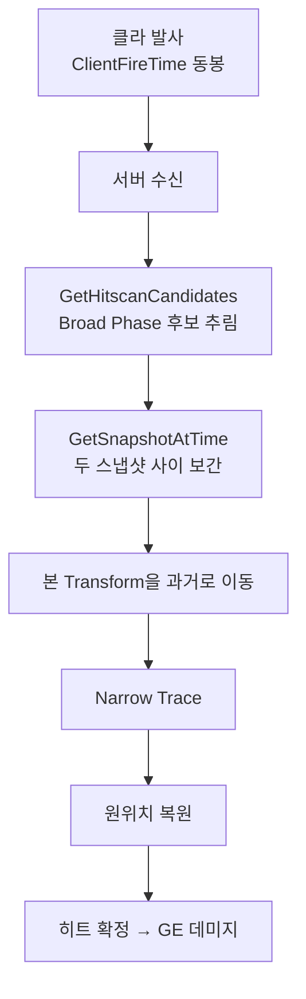

📌 이 문서는 **현재 구조**를 정리한 것이며, 완성본이 아닙니다.  
만들어 가는 과정은 [개발 기록](/categories/devlog)에 있습니다.
{: .notice--warning}

## 동작 영상

[](https://www.youtube.com/watch?v=bh4ao6mvxRY)

파란색이 현재 히트박스, 빨간색이 리와인드로 복원한 과거 히트박스다.
클라이언트가 쏜 시점의 빨간 박스로 판정한다.

## 전제: 서버가 유일한 진실이다

클라이언트는 입력을 보내고 결과를 받아 그린다.
HP, 탄약, 히트 판정, 아이템 소유. 전부 서버가 정한다.

> 검증은 **PIE 다중 클라이언트 2인 + Listen Server** 구성까지 했다.
> 데디케이티드 서버 타깃은 아직 분리하지 않았다.

클라이언트가 하는 일은 두 가지뿐이다.

- **입력 전송** 서버 RPC 또는 CMC 이동 패킷
- **예측 연출** 총구 화염처럼 되돌려도 손해가 없는 것만

되돌릴 수 없는 것은 예측하지 않는다. 데미지, 사망, 아이템 소비가 여기에 해당한다.

## 1. 이동 상태 동기화: RPC가 아니라 CMC 확장

Sprint, ADS, Crouch 같은 이동 상태를 처음에는 Server RPC로 보냈다.
이 방식은 **클라이언트 예측과 어긋난다.**

CMC는 자기가 보낸 이동을 저장해뒀다가, 서버 보정이 오면 그 지점부터 다시 재생한다.
그런데 Sprint 상태를 별도 RPC로 보내면 재생 과정에 그 상태가 없다.
재생할 때마다 속도가 달라져서 위치가 계속 어긋난다.

그래서 이동 상태를 **CMC의 이동 패킷 안에 넣었다.**

```cpp
// FSavedMove_EPCharacter::GetCompressedFlags()
// 이동 입력과 같은 패킷에 상태를 실어 보낸다
if (bSavedWantsToSprint) Result |= FLAG_Custom_0;
if (bSavedWantsToADS)    Result |= FLAG_Custom_1;
```

| | Server RPC 방식 | CMC 확장 방식 |
|---|---|---|
| 이동 재생 시 상태 | 없음 | 있음 |
| 패킷 수 | 이동 + 상태 별도 | 이동 하나 |
| 위치 어긋남 | 발생 | 없음 |

CMC 내부를 이해하는 데 시간이 제일 많이 들었다.
`ReplicateMoveToServer` → `AllocateNewMove` → `GetCompressedFlags` → `UpdateFromCompressedFlags` → `PrepMoveFor` 로 이어지는 흐름을 직접 따라가며 정리했다.

> 자세한 구현: [CMC 확장으로 Sprint/ADS/Crouch 네트워크 동기화]()

## 2. 지연 보상: 본 단위 히트박스 리와인드

### 문제

핑이 있으면 클라이언트가 보는 적의 위치는 **과거**다.
클라이언트 화면에서 정확히 조준해도, 서버의 현재 위치는 이미 옮겨져 있어서 빗나간다.

### 해결

서버가 모든 캐릭터의 본 위치를 시간과 함께 기록해두고,
발사 요청이 오면 **그 클라이언트가 쏜 시점으로 히트박스를 되돌려서** 판정한다.



핵심 설계 결정 몇 가지다.

- **단일 캡슐이 아니라 Physics Asset 본 단위로 판정한다.** 머리와 팔을 구분하려면 캡슐 하나로는 안 된다
- **시간 기준을 `GetServerWorldTimeSeconds()`로 통일했다.** 클라와 서버가 각자 로컬 시계를 쓰면 기준이 갈린다
- **`MaxRewindSeconds = 0.5f` 상한을 뒀다.** 클라가 보낸 시각을 그대로 믿으면 시각 위조로 과거를 무한정 되돌릴 수 있다
- **후보군 밖 히트는 버린다.** Broad Phase에서 추린 집합에 없는 캐릭터가 Narrow Trace에 잡히면 무시한다
- **SSR 컴포넌트는 복제하지 않는다.** `SetIsReplicatedByDefault(false)`. 서버 전용이다

### 겪은 문제: 보이는 것보다 이전 위치를 때려야 맞았다

리와인드를 붙였는데 여전히 어긋났다. 그것도 **항상 정확히 한 틱만큼**이었다.

원인은 계산식이 아니라 **시각을 읽는 위치**였다.

스냅샷의 *시각*은 `CMC::OnMovementUpdated`에서 찍고, *본 Transform*은 같은 틱의 `TG_PostPhysics`에서 읽고 있었다.
같은 틱이니 같은 프레임이라고 믿었는데, `UWorld::Tick`의 순서가 그렇지 않았다.

```cpp
// LevelTick.cpp: UWorld::Tick
BroadcastTickDispatch(DeltaSeconds);   // ServerMove RPC 처리. 여기서 시각을 읽었다
BroadcastPostTickDispatch();           // CMC::OnMovementUpdated가 여기서 돈다
...
TimeSeconds += DeltaSeconds;           // 월드 시간은 '그 뒤'에 전진한다
...
RunTickGroup(TG_PrePhysics);           // 틱 그룹은 '그 다음'
```

`GetServerWorldTimeSeconds()`는 `World->GetTimeSeconds()`를 그대로 쓴다.
그러니 **`TickDispatch`에서 읽은 시각은 직전 프레임 값이고, `PostPhysics`에서 읽은 본은 이번 프레임 값이다.**

> `GetServerWorldTimeSeconds()`는 한 프레임 안에서도 **어디서 부르느냐에 따라 다른 값을 준다.**

이게 "항상 정확히 한 틱"의 정체였다.
600cm/s로 달리는 캐릭터면 한 프레임에 10cm다. 그런데 실제 오차는 훨씬 컸다.
어긋난 두 스냅샷 사이를 보간이 메우면서 오차가 증폭되고, 패킷 간격이 벌어지는 나쁜 네트워크에서는 그 간격이 그대로 곱해진다.

### 해결: 세 값을 한 순간에 묶는다

시각과 위치를 `TickDispatch`에서 **보관만** 하고, 본이 확정된 `TG_PostPhysics`에서 함께 커밋한다.

```cpp
// TickDispatch 시점. 본 Transform은 아직 갱신 전이므로 값만 보관한다
void UEPServerSideRewindComponent::OnServerMoveProcessed(float Time, FVector Location)
{
    bHasPendingSnapshot     = true;
    PendingSnapshotTime     = Time;
    PendingSnapshotLocation = Location;
}

// PostPhysics. 본 Transform 갱신 완료. 여기서 커밋한다
void UEPServerSideRewindComponent::TickComponent(...)
{
    if (bHasPendingSnapshot)
    {
        SaveHitboxSnapshot(PendingSnapshotTime, PendingSnapshotLocation);
        bHasPendingSnapshot = false;
    }
}
```

| | 수정 전 | 수정 후 |
|---|---|---|
| `RewindPos` 오차 | **242cm** | **2.3cm** |

242cm는 캐릭터 하나를 통째로 빗나가는 거리고, 2.3cm는 히트박스 안이다.
Bad 네트워크 프리셋 기준이다.

여기에 서버 쪽 전제가 하나 더 붙는다.

```cpp
GetMesh()->VisibilityBasedAnimTickOption =
    EVisibilityBasedAnimTickOption::AlwaysTickPoseAndRefreshBones;
```

서버는 렌더링이 없어서 기본 설정으로는 포즈를 갱신하지 않는다.
이걸 안 켜면 `TG_PostPhysics`에서 읽어도 스냅샷이 정적 포즈로 고정된다.

원인을 찾는 데 일주일이 걸렸다.
**어떤 상황에서도 오차가 정확히 한 틱이라는 점**이 실마리였다.
값이 랜덤하게 틀렸다면 계산식을 의심했을 텐데, 항상 일정하니 게임 로직이 아니라 틱 구조를 봐야 한다고 판단할 수 있었다.
결국 `UWorld::Tick`을 직접 읽어서 찾았다.

<!-- 스크린샷: 수정 전후 리와인드 위치 비교 (파란/빨간 박스) -->

> 자세한 구현: [히트박스 스냅샷 구조]() · [SSR 컴포넌트 구현]() · [사격 흐름 통합]()

## 3. 복제 설계 원칙

프로퍼티마다 매번 고민하지 않으려고 규칙을 먼저 정했다.

| 상황 | 방식 |
|---|---|
| 값만 필요 | `UPROPERTY(Replicated)` |
| 값이 바뀔 때 클라 반응 필요 | `ReplicatedUsing = OnRep_` |
| 소유자만 알아야 함 | `COND_OwnerOnly` |
| 일회성 연출 | `Multicast RPC (Unreliable)` |
| 되돌릴 수 없는 요청 | `Server RPC (Reliable)` |

연출은 Unreliable이다. 총구 화염 한 발이 유실돼도 게임은 굴러간다.
반대로 상태 변경은 Reliable이어야 한다. 재장전 요청이 유실되면 무기가 영영 잠긴다.

> 자세한 내용: [멀티플레이어 복제 설계]() · [서버 권한형 매치 흐름]()

## 4. 디버그 시각화

네트워크 문제는 눈으로 봐야 잡힌다. 그래서 판정 결과를 그리게 해뒀다.

| 색 | 의미 |
|---|---|
| 파랑 | 현재 물리 히트박스 |
| 빨강 | 리와인드로 복원한 과거 히트박스 |
| 하양 | 트레이스 선 |
| 노랑 | 확정된 히트 |

`UEPCombatDeveloperSettings`에서 켜고 끈다. 셰이핑 빌드에서는 컴파일 자체가 빠진다.

```cpp
#if !(UE_BUILD_SHIPPING || UE_BUILD_TEST)
    // 디버그 드로우
#endif
```

## 남은 것

정직하게 적어둔다.

- **Broad Phase가 O(N)이다.** 플레이어 수가 늘면 Spatial Hash로 바꿔야 한다. `GetHitscanCandidates` 하나만 교체하면 되도록 격리해뒀다
- **Physics Asset 바디 수에 비례해 판정 비용이 오른다.** 손가락, 발가락은 애초에 제외했다
- **쿨다운 지연 보정이 없다.** 핑이 높을수록 실질 연사가 느려진다. [GAS 문서]()에 자세히 적었다
- 발사와 착탄 연출이 아직 Multicast RPC다. GameplayCue로 옮기는 게 맞다

## 참고

- [Understanding Networked Movement in the CMC](https://dev.epicgames.com/documentation/ko-kr/unreal-engine/understanding-networked-movement-in-the-character-movement-component-for-unreal-engine)
- [Everything you need to know about tick rate](https://www.reddit.com/r/Overwatch/comments/3u5kfg/everything_you_need_to_know_about_tick_rate/)
