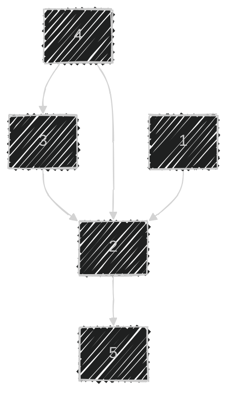

> 체감 난이도 : ⭐⭐⭐  
> 유형 : 그래프  
> 걸린 시간: 1시간  

# 🧐 문제
## 문제 설명

n명의 권투선수가 권투 대회에 참여했고 각각 1번부터 n번까지 번호를 받았습니다. 권투 경기는 1대1 방식으로 진행이 되고, 만약 A 선수가 B 선수보다 실력이 좋다면 A 선수는 B 선수를 항상 이깁니다. 심판은 주어진 경기 결과를 가지고 선수들의 순위를 매기려 합니다. 하지만 몇몇 경기 결과를 분실하여 정확하게 순위를 매길 수 없습니다.

선수의 수 n, 경기 결과를 담은 2차원 배열 results가 매개변수로 주어질 때 정확하게 순위를 매길 수 있는 선수의 수를 return 하도록 solution 함수를 작성해주세요.

## 제한사항

- 선수의 수는 1명 이상 100명 이하입니다.
- 경기 결과는 1개 이상 4,500개 이하입니다.
- results 배열 각 행 [A, B]는 A 선수가 B 선수를 이겼다는 의미입니다.
- 모든 경기 결과에는 모순이 없습니다.

## 입출력 예

|n|results|return|
|---|---|---|
|5|[[4, 3], [4, 2], [3, 2], [1, 2], [2, 5]]|2|

### 입출력 예 설명

2번 선수는 [1, 3, 4] 선수에게 패배했고 5번 선수에게 승리했기 때문에 4위입니다.  
5번 선수는 4위인 2번 선수에게 패배했기 때문에 5위입니다.

---

# ✏️ 풀이 과정

특정 선수의 순위를 매길 수 있는가, 없는가를 판단하는 조건은 무엇일까? 에 대해 고민했다.

고민한 끝에 가장 깔끔한 결론을 내렸다.

`이긴 사람 수 + 진 사람 수 + 나(1명)` 은 `총 사람 수` 라면, 순위를 매길 수 있다.



- 2번 기준으로:
    - 이긴 사람 수: 3
    - 진 사람 수: 1
    - 순위를 매길 수 있음

- 3번 기준으로:
    - 이긴 사람 수: 1
    - 진 사람 수: 2
    - 순위를 매길 수 없음

---

마지막으로, **이긴 사람 수**와 **진 사람 수**는 어떻게 구해야할까?

`승리 → 패배`, `패배 → 승리`로 가는 두 개의 그래프를 만든다.

그 다음 특정 선수 노드에서 BFS로 순회시킨다.
그러면  **이긴 사람 수**와 **진 사람 수**를 각각 구할 수 있다.

---

# ✏️ 나의 풀이


```cpp
#include <bits/stdc++.h>

using namespace std;

map<int, vector<int>> winPath;
map<int, vector<int>> losePath;

// "승리 → 패배"와 "패배 → 승리" 순으로 가는 맵 두개를 초기화한다.
void init(int& n, vector<vector<int>>& results) {
    for(vector<int> result : results) {
        int win = result[0];
        int lose = result[1];
        winPath[win].push_back(lose);
        losePath[lose].push_back(win);
    }
}

// 매개변수로 winPath/losePath 둘 중 하나를 받는다.
// winPath인 경우: 나에게 이긴 사람 수를 반환한다.
// losePath인 경우: 내가 이긴 사람 수를 반환한다.
int traverse(int n, int s, map<int, vector<int>>& path) {
    vector<bool> visited(n, false);
    int cnt = 0;
    
    queue<int> q;
    q.push(s);
    while(!q.empty()) {
        int cur = q.front(); q.pop();
        if(visited[cur]) continue;
        visited[cur] = true;
        cnt++;
        
        for(int next : path[cur])
            q.push(next);
    }
    
    return cnt-1;
}

// 현재 선수의 순위 측정 가능 여부를 반환한다.
// (이긴 사람 수 + 진 사람 수) + 나 == 총 사람 수
// 위 조건이라면, 순위를 측정할 수 있다.
bool CanOrder(int n, int s) {
    
    int cnt = 0;
    cnt += traverse(n, s, winPath);
    cnt += traverse(n, s, losePath);
    
    return cnt==n-1 ? true : false;
}

int solution(int n, vector<vector<int>> results) {
    init(n, results);
    
    int result = 0;
    for(int i=1; i<=n; i++)
        if(CanOrder(n, i)) result++;
    
    return result;
}
```


---

# ✔️ 51176님의 풀이


```cpp
#include <string>
#include <vector>
#include <string.h>
#include <queue>
#include <iostream>

using namespace std;

int solution(int n, vector<vector<int>> results) {
    int answer = 0;
    bool arr[101][101];
    memset(arr, 0, sizeof(arr));
    for(int i = 0; i < results.size(); i++){
        int a = results[i][0];
        int b = results[i][1];
        arr[a][b] = true;
    }

    for(int k = 1; k <= n; k++){
        for(int i = 1; i <= n; i++){
            for(int j = 1; j <= n; j++){
                if(arr[i][k] && arr[k][j]) arr[i][j] = true;
            }
        }
    }
    for(int i = 1; i <= n; i++){
        int cnt = 0;
        for(int j = 1; j <= n; j++)
            cnt += (arr[i][j] + arr[j][i]);
        if(cnt == n-1) answer++;
    }
    return answer;
}
```


## 🧐 분석

- BFS 기반의 그래프 처리 방식을 사용하지 않는다.
- 플로이드 워셜 스타일의 전이 폐쇄를 사용하고 있다.
    1. `i`는 `k`를 이기고, `k`는 `j`를 이기면, `i`는 `j`를 이긴다.
        - 이 상황이면 `arr[i][j]`는 `true`가 된다.
    2. 이 과정을 `(i,k,j)` 모든 조합에 대해 수행한다.
        - 즉, 직접 승패뿐만 아니라 간접 승패도 기록한다.
        - 이를 통해 전체 승패 그래프를 채운다.
    3. 이후, 각 선수에 대해 `arr[i][j]+arr[j][i]` 값을 합산하여,  
    정확히 `n-1`인지 확인한다.
        - 이 조건을 만족하면, 순위를 매길 수 있다.
- 이런 방법이...?

---

# 🪶 후기

어떻게 하면 순위를 매길수 있는 조건이 되는건가 고민을 많이 했다.

고민 30분, 구현 30분으로 총 1시간 걸렸다.

구현보다 생각하는데 시간이 너무 많이 걸리는게 문제다.  
많이 풀어보며, 생각하는 연습을 더 해야겠다.