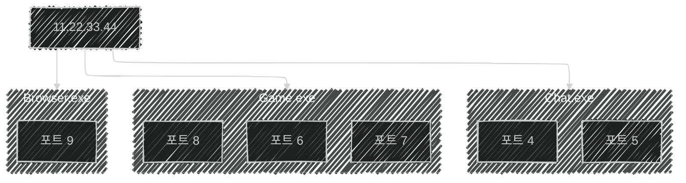
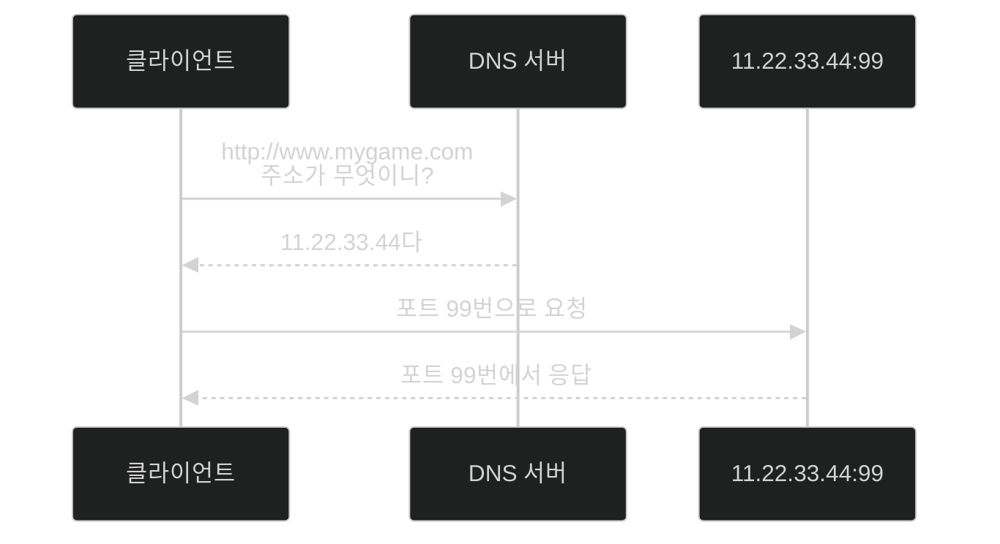

# 📦 2. 컴퓨터 네트워크

## 👉🏻 항목 4: 컴퓨터 네트워크 식별자

# 1. IP 주소 🌐

- IP 주소는 인터넷에서 모두 고유하다.
- 컴퓨터 기기는 IP 주소를 2개 이상 가질 수 있다.
- `ipconfig` 도구를 통해 IP 주소를 확인할 수 있다.

- IP 주소는 크게 IPv4와 IPv6로 나뉜다.

## 1.1. IPv4

| **10진수** | 172 | 16 | 254 | 1 |
| --- | --- | --- | --- | --- |
| **2진수** | 10101100 | 00010000 | 11111110 | 00000001 |
- IPv4 주소 `172.16.254.1` 를 이진수로 나타낸 표이다.
- 8비트씩 4개, 총 32비트로 이루어진다.
- 이론상 최대 $2^{32}$개까지 배정할 수 있다.
- 배정할 수 있는 IPv4 주소의 수가 한계에 다다랐다.
    - 문제를 극복하기 위해 네트워크 주소 변환(NAT) 기술을 사용하기도 한다.

## 1.2. IPv6

$$
2001:0DB8:AC10:FE01:0000:0000:0000:0000
$$

- 16비트씩 8개, 총 128비트로 이루어진다.
- 이론상 최대 $2^{128}$개까지 배정할 수 있다.
- 그러나, IPv4에서 IPv6로 전환되기까지는 시간이 걸릴 것으로 예상된다.

# 2. 포트 🔌

- 한 IP 주소 안에서 누가 주고받는 것인지 식별하는 역할을 한다.
- 2바이트의 정수로, 65535 이하의 값에서 할당하여 쓸 수 있다.
- `11.22.33.44:포트 5` 로 데이터를 송수신 할 수 있다.
    - 주소와 포트를 묶는 방식을 끝점(endpoint)라고 한다.
- CMD에서 `netstat -ano` 로 내 컴퓨터에서 사용중인 포트를 확인할 수 있다.

# 3. 도메인 이름 🏷️

- 숫자로 된 IP 주소를 영문 이름으로 만들 수 있다.
    - e.g. `11.22.33.44 → http://www.mygame.com`
    - 이를 **호스트 이름**이라 하며, 변환하는 과정이 필요하다.
- 위 그림과 같은 과정을 통해, 영문 이름을 IP 주소처럼 사용할 수 있다.
    - 클라이언트는 응답받은 IP 주소를 일정 기간동안 보관하여, 캐시처럼 사용한다.

# 4. 추가 내용 📌

- 호스트 이름
    - 네트워크에 연결된 **개별 컴퓨터나 장치에 할당**되는 고유한 이름이다.
    - `www.[naver.com](http://naver.com)`에서 `www`는 호스트 이름으로, `naver.com` 도메인 내의 특정 컴퓨터를 가리킨다.
- 도메인 이름
    - 인터넷 상의 **그룹**을 나타내는 문자열 주소이다.
    - `www.naver.com`에서 `naver.com`은 도메인 이름에 해당한다.