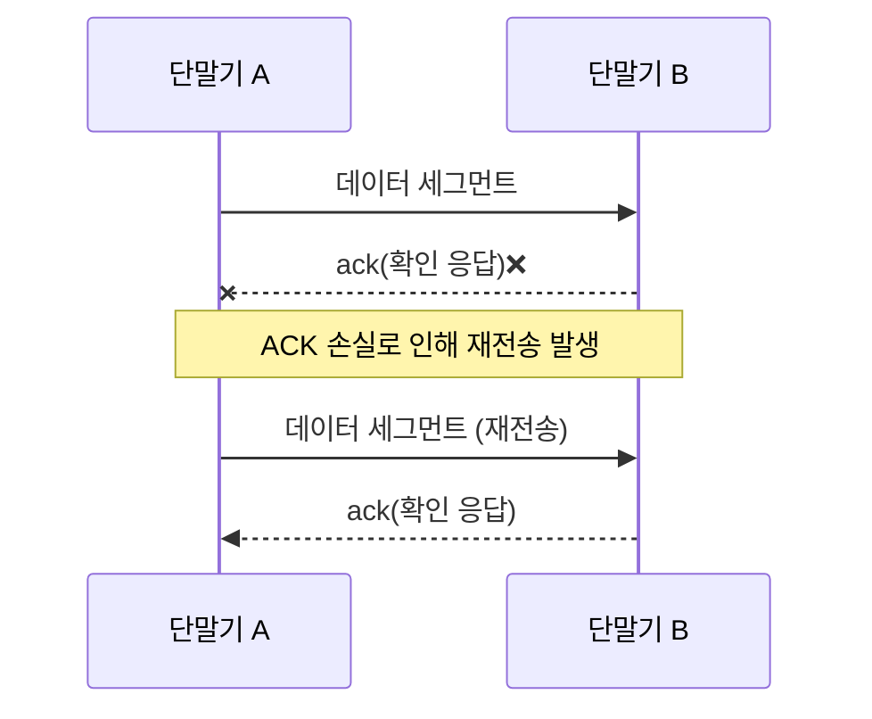

이 글은 아래의 책을 자세히 정리한 후, 정리한 글을 GPT에게 요약을 요청하여 작성되었습니다.  
게임 서버 프로그래밍 교과서, 배현직 저자
{: .notice--warning}

# 📦 2. 컴퓨터 네트워크
## 👉🏻 항목 6: 컴퓨터 네트워크에서 데이터 보내기와 받기

## 1. UDP 네트워킹 📤

### 1.1. UDP의 특징

**메시지 방식:**

- `a`, `bb`, `ccc`, `dddd` 전송 시, 동일하게 수신된다.
- 데이터 일부가 뭉치거나 쪼개지지 않는다.

**데이터그램:**

- 64KB 이하의 이진 데이터
- 스트림이 아닌, 메시지의 성질을 가진다.
- 0바이트 메시지도 허락한다.

**UDP (User Datagram Protocol):**

- 사용자가 정의한 데이터그램을 상대방에게 보낼 수 있게 하는 통신 규약(프로토콜)이다.
- 데이터그램의 성질로 인해 데이터 일부가 뭉치거나 쪼개지지 않는다.
- **주의사항:**
    - 패킷 유실, 패킷 중복, 순서 뒤바뀜 현상이 생길 수 있다.
    - 데이터 검사와, 잘못되면 재전송이 필요하다.
- **장점:**
    - 데이터그램 내용이 훼손되지 않는다.
    - 1:N 통신이 가능하다.
    

**UDP 사용 시나리오:**

- 데이터그램이 유실되거나 중복되어도 괜찮은 상황에서 UDP를 사용한다.
- 예: 동영상, 음성 데이터, 캐릭터 위치(보간)

---

### 1.2. UDP 예시 코드

### 송신자 📡

```cpp
main() {
	s = socket(UDP); // 1
	s.bind(any_port); // 2
	s.sendTo("55.66.77.88:5959", "hello"); // 3
	s.close(); // 4
```

**동작 과정:**

1. UDP 소켓을 생성하고, 소켓 핸들을 받는다.
2. `bind` 함수를 통해 포트를 할당한다.
    - `any_port` 또는 `0`을 넣으면 운영체제가 알아서 사용 가능한 포트를 할당한다.
3. 수신자의 IP 주소와 포트에 데이터를 보낸다.
    - `'h', 'e', 'l', 'l', 'o', 0x00`을 보낸다.
4. `close` 함수를 통해 소켓을 닫는다.
    - 할당받은 포트는 사용 가능한 상태가 된다.

---

### 수신자 📥

```cpp
main() {
	s = socket(UDP); // 1
	s.bind(5959); // 2
	r = s.recvfrom(); // 3
	print(r.srcAddrPort, r.data); // 4
	s.close(); // 5
```

**동작 과정:**

1. 송신 측과 비슷하게 UDP 소켓을 생성한다.
2. 이번엔 포트 5959번을 **명시적으로** 할당하였다.
    - `any_port` 또는 `0`을 넣어도 되지만, 송신 측은 어떤 포트가 할당받았는지 알아내야 한다.
3. 데이터를 수신할 때까지 **블로킹 상태**로 남는다.
    - 수신되면 수신 데이터와 송신자 주소가 `r`에 저장된다.
4. 받은 데이터를 출력한다.
    - `11.22.33.44:53234 hello`와 같이 출력된다.
    - `53234`는 송신자 측에서 임의 할당된 포트 번호이다.
5. 소켓을 닫는다.
    - 데이터가 다 빠져나가지 않았을 수 있기에, 원래는 이렇게 짜면 안 된다.

---

## 2. TCP 네트워킹 🔗

### 2.1. TCP의 특징

**스트림 방식:**

- `a`, `bb`, `ccc`, `dddd` 전송 시, 형태가 달라질 수 있다.
- 데이터를 뭉치거나 쪼갤 수 있다.
    - 예: `abb`, `cccdddd`
- 0바이트 스트림을 받으면 아무것도 하지 않는다.
    - 즉, **연결 종료**를 뜻한다.
    

**TCP (Transmission Control Protocol):**

- **신뢰성을 보장한다:**
    1. 데이터의 수신을 보장한다.
        - 흐름 제어 기능(data flow control) 때문이다.
    2. 송신자/수신자의 데이터가 동일함을 보장한다.
- UDP와 달리 **연결 지향형**이다.
    - 즉, 데이터를 주고받기 전 연결 과정을 거쳐야 한다.
- **1:1 통신만 가능**하다.
- 메시지 형태가 아닌 **스트림 형태**이다.

---

### 2.2. TCP 통신 과정 🔄



**동작 과정:**

1. TCP에서 스트림 데이터를 보내려 한다.
2. IP 패킷에 넣을 수 있는 크기의 단위(세그먼트)로 쪼개진다.
3. IP 패킷에 세그먼트를 넣고, 수신자에게 송신한다.
4. 수신자는 IP 패킷에서 세그먼트를 꺼내, 세그먼트 응답을 송신자에게 반송한다.
    - 응답을 **ack(acknowledge)** 라고 한다.
5. 만약 송신자가 수신자의 ack를 회신받지 못하면, ack를 받을 때까지 **재전송**한다.

---

### 2.3. TCP 예시 코드

### 송신자 📡

```cpp
main() {
	s = socket(TCP); // 1
	s.bind(any_port); // 2
	s.connect("55.66.77.88:5959"); // 3
	s.send("hello"); // 4
	s.close(); // 5
}
```

**동작 과정:**

1. TCP 소켓을 생성한다.
2. 자신의 포트를 할당한다.
3. 수신자와 연결을 시도한다.
    - 함수에 수신자의 끝점을 매개변수로 넣어준다.
    - 연결될 때까지 **블로킹**된다.
4. `send` 함수를 호출하여 데이터를 전송한다.
    - `sendTo`가 아닌 `send` 함수이다.
    - 수신 대상의 끝점을 입력하지 않는다.
    → `connect()` 함수에서 이미 끝점을 지정했기 때문
    - `'h', 'e', 'l', 'l', 'o', 0x00`을 보낸다.
5. 연결을 종료한다.

---

### 수신자 📥

```cpp
main() {
	s = socket(TCP); // 1
	s.listen(5959); // 2
	s2 = s.accept(); // 3
	print(getpeeraddr(s2)); // 4
	while(true) {
		r = s2.recv(); // 5
		if(r.length == 0) break; // 6
		print(r); // 7
	}
	s2.close(); // 8
}
```

**동작 과정:**

1. TCP 소켓을 생성한다.
    - 이 소켓은 **listen socket**용으로, TCP 연결을 받아들인다.
2. listen socket을 위한 포트를 할당한다.
3. TCP 연결이 될 때까지 **블로킹**된다.
    - 연결되면 새로운 socket이 생성되고, 핸들이 반환된다.
    - 새로운 socket은 listen socket과 **다른 포트**를 가진다.
4. 송신자의 끝점을 확인한다.
    - `getsocketaddr()`은 나의 끝점 정보를 가져온다.
5. `recv` 함수를 통해 데이터를 가져온다.
    - UDP의 `recvfrom()` 대신 `recv()` 함수를 사용한다.
6. TCP는 스트림 형식이기에, 0바이트를 받으면 마감 처리한다.
7. 데이터를 출력한다.
    - `11.22.33.44:51409 hello`와 같이 출력된다.
8. 연결을 종료한다.
    - 송신자/수신자가 `close` 함수를 호출하면:
    - 송신자/수신자 모두 호출한 프로세스 내의 `recv()` 함수가 0을 리턴한다.

---

## 3. UDP와 TCP의 공통점 🤝

### I.  OSI 모델에서의 위치

- UDP와 TCP는 **인터넷 프로토콜(IP)** 위에서 작동한다.
    - IP는 OSI 모델 **3계층**에 있다.
    - UDP/TCP는 OSI 모델 **4계층**에 있다.

### II. 소켓 사용 방식

- UDP/TCP 소켓 하나를 이용하여 **송수신 모두 가능**하다.
    - 송신/수신 소켓을 따로 만드는 것을 권장하지 않는다.

---

## 🧐 정리

| 항목 | UDP | TCP |
| --- | --- | --- |
| **데이터 형식** | 메시지 (데이터그램) | 스트림 |
| **신뢰성** | 보장 안 됨 (유실, 중복, 순서 변경 가능) | 보장됨 (ack를 통한 재전송) |
| **연결 방식** | 비연결형 | 연결 지향형 |
| **통신 방식** | 1:N 가능 | 1:1만 가능 |
| **데이터 경계** | 유지됨 | 유지 안 됨 (뭉치거나 쪼개질 수 있음) |
| **사용 예시** | 동영상, 음성, 게임 캐릭터 위치 | 파일 전송, 웹, 이메일 |