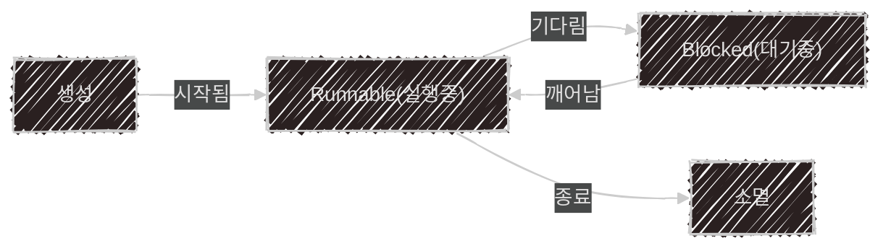

이 글은 아래의 책을 자세히 정리한 후, 정리한 글을 GPT에게 요약을 요청하여 작성되었습니다.  
게임 서버 프로그래밍 교과서, 배현직 저자
{: .notice--warning}

# 📦 1. 멀티스레딩
## 👉🏻 2. 스레드 요약

### 🧵 스레드란?

- 스레드는 프로그램을 실행하는 가장 작은 단위이다
- 각 프로세스는 자신만의 메모리 공간을 가지며, 다른 프로세스의 메모리에 접근할 수 없다

### ⚡ 스레드 vs 프로세스

- 하나의 프로세스 안에는 여러 스레드가 존재할 수 있다
- 같은 프로세스 안의 스레드들은 메모리를 공유하지만, 각각 독립적인 스택을 가진다

### 🔹 스레드 모델

- 프로그램 실행 시, 프로세스와 함께 메인 스레드가 생성된다
- 싱글스레드 모델은 하나의 스레드만 사용하는 구조이다
- 멀티스레드 모델은 여러 스레드가 병렬로 작업을 처리하는 구조이다

### 🧠 스레드의 실행 방식

- 프로그램은 여러 함수로 구성되어 있으며, 함수 실행 흐름을 관리하기 위해 호출 스택을 사용한다
- 각 스레드는 서로 다른 호출 스택을 가지며, 실행 지점이나 지역 변수 사용에 차이가 생긴다

### 🔁 스레드 생명주기

스레드는 다음과 같은 상태를 순환한다:



### 🔥 멀티스레딩 흐름 예시

멀티스레드 프로그램은 메인 스레드와 서브 스레드들이 독립적으로 작업을 진행한다

```cpp
void main() {
    t1 = CreateThread(ThreadProc, 123);  // 새 스레드 시작
    ...
    t1.join();                           // 스레드 종료 대기
}

ThreadProc(int) {
    ...
}
```

흐름도:


※ 메인 스레드가 먼저 종료되면, 다른 스레드는 여전히 동작할 수 있으며, 이를 좀비 프로세스라고 부른다

### 🛠️ 스레드 생성 방법

운영체제나 사용 언어에 따라 스레드 생성 방법이 다르다

#### Windows 예시
```cpp
DWORD threadID;
ThreadParam threadParam{123};
CreateThread(..., ThreadProc, &threadParam, ..., &threadID);
```

#### Linux/Unix 예시
```cpp
pthread_t thread;
ThreadParam threadParam{123};
pthread_create(&thread, NULL, ThreadProc, &threadParam);
```

#### Modern C++ 예시
```cpp
std::thread t1(ThreadProc, 123);
```
