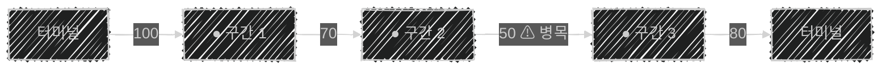

이 글은 아래의 책을 자세히 정리한 후, 정리한 글을 GPT에게 요약을 요청하여 작성되었습니다.  
게임 서버 프로그래밍 교과서, 배현직 저자
{: .notice--warning}

# 📦 2. 컴퓨터 네트워크
## 👉🏻 항목 5: 컴퓨터 네트워크의 품질과 특성

## 2.5.1. 네트워크의 품질을 저해하는 것들 🚧

- 스위치/라우터는 데이터를 받으면 데이터 내용 중 헤더를 먼저 읽는다.
- 목적지를 판단하기 위해 기기의 메모리를 읽는다.

---

### A. 스위치/라우터에 한계를 넘는 데이터가 수신되는 경우

**1. 처리할 수 없는 데이터를 버린다 (패킷 드롭)**

- 일부는 전달하고, 초과된 데이터는 버린다.
- **패킷 유실 현상**이 발생한다.

**2. 처리하지 못한 데이터를 메모리에 누적한다**

- 일부는 전달하고, 초과된 데이터는 라우터에 누적시킨다.
- 라우터가 멈추거나 재부팅하기도 한다.

---

### B. 신호에 섞이는 잡음

**송신 과정:**

1. 송신자가 데이터 전송
    - 데이터(디지털 정보)가 회선으로 나간다.
    - 디지털 신호 → 아날로그 신호
    - OSI 모델 계층 1에서 발생
2. 수신자가 신호 수신
    - 아날로그 신호 → 디지털 신호 → 디지털 정보
    - 해당 디지털 정보는 계층 1 → 계층 2 → 계층 3까지 넘어간다.
    

**문제점:**

- 이러한 과정에서 **잡음(noise)** 이 섞이거나, 신호가 약해질 수 있다.
- 계층 2, 3의 체크섬 검사로 확인하고 수정이 어려우면, 받은 패킷 혹은 프레임을 버린다.

---

### 정리 📝

- **패킷 유실이나 드롭 비율이 높을수록 네트워크 품질이 나쁘다.**

**패킷 유실이 일어날 수 있는 경우:**

1. 네트워크 기기가 처리할 수 있는 한계를 넘어가는 경우
2. 회선 신호가 약하거나 잡음이 섞이는 경우

---

## 2.5.2. 전송 속도와 전송 지연 시간 ⚡

### 1. 전송 속도 (Throughput)

- **정의**: 두 기기 간에 초당 전송될 수 있는 최대 데이터의 양
- **단위**: 초당 비트 수(bps) 혹은 바이트 수(B/s)로 표현

**영향을 주는 요인:**

1. 매체(선로)의 종류와 품질
2. 두 기기의 소프트웨어와 하드웨어 종류

---

### 2. 전송 지연 시간 (Latency)

- **정의**: 두 기기 간에 데이터를 최소량 전송할 때 걸리는 시간
- **단위**: 밀리초(ms)로 표현

**영향을 주는 요인:**

1. 매체의 종류와 품질
2. 송신자-수신자의 라우터 처리 속도

> 💡 송신자-수신자 간 네트워크 기기의 하드웨어/소프트웨어 처리 속도도 영향을 준다.
> 

---

### 실제 측정: ping을 통한 한국-남미 레이턴시 측정 🌍

**측정 결과:**

- 전송 지연 시간: 약 333ms
- 거리/빛 속력: 약 70ms

**분석:**

- 약 5배 정도 더 나온다.
- `매체 통과 시간 < 네트워크 기기 처리 시간`이기 때문이다.

---

### 실제 측정: tracert를 통한 한국-남미 경로 추적 🗺️

**측정 결과:**

- 네트워크 기기 약 26개를 거친다.

**결론:**

- `두 단말기 사이의 레이턴시 = 두 단말기 사이에 있는 네트워크 기기의 레이턴시 총합`

---

### 스루풋과 병목 현상 🚰

- **스루풋**: 단위 시간 동안 처리할 수 있는 데이터의 양 또는 작업의 양
- 각 네트워크 기기를 지날 때 최대 속도가 있으며, 느린 곳이 하나라도 있으면 **병목**이 생긴다.

**결론:**

- `두 단말기 사이의 스루풋 = 두 단말기 사이의 네트워크 기기 중 최소 스루풋`

---

## 2.5.3. 네트워크 품질 기준 세 가지 📊

### 1. 전송 속도 (스루풋)

- **정의**: 단위 시간 동안 처리할 수 있는 데이터의 양 또는 작업의 양

**영향 요인:**

- 회선 종류
- 네트워크 장비 처리 속도

---

### 2. 패킷 유실률

- **정의**: 전송되는 데이터가 중간에 버려지는 비율

**영향 요인:**

- 회선 품질
- 경로 상 라우터 개수
- 라우터 처리 성능

---

### 3. 전송 지연 시간 (Latency)

- **정의**: 전송되는 데이터가 목적지에 도착하는 데 걸리는 시간

**영향 요인:**

- 경로 상 라우터 개수
- 라우터 처리 성능

---

## 2.5.4. 무선 네트워크의 품질 📶

- 스마트폰 기기에서 ping을 사용하면 **레이턴시가 높게** 나온다.

---

### 와이파이 기기에서의 데이터 전송 과정

**CSMA (Carrier Sense Multiple Access) 방식:**

1. 데이터를 전파로 변환한다.
2. 다른 기기의 전파가 감지되는지 확인한다.
    - 다른 전파가 감지되면 → 잠시 대기한다.
    - 다른 전파가 감지되지 않으면 → 전파를 보낸다.
3. 상대방에게서 '신호 받음' 응답이 오는지 체크한다.
4. 일정 시간 응답이 오지 않으면, 보낸 신호를 다시 보낸다.

**이 과정이 필요한 이유:**

- 이 과정이 없으면 다른 기기들과 신호가 섞여 변조된다.
- 여러 명이 동시에 이야기하는 것과 같다.

---

## 🧐 정리

1. **네트워크 품질은 세 가지 기준으로 평가한다**: 전송 속도(스루풋), 패킷 유실률, 전송 지연 시간(레이턴시)
2. **패킷 유실**은 네트워크 기기의 처리 한계 초과나 신호 잡음으로 발생한다.
3. **레이턴시**는 물리적 거리보다 경로상 네트워크 기기의 처리 시간에 더 큰 영향을 받는다.
4. **스루풋**은 경로상 가장 느린 구간(병목)에 의해 결정된다.
5. **무선 네트워크**는 CSMA 방식으로 충돌을 방지하지만, 이로 인해 레이턴시가 유선보다 높다.