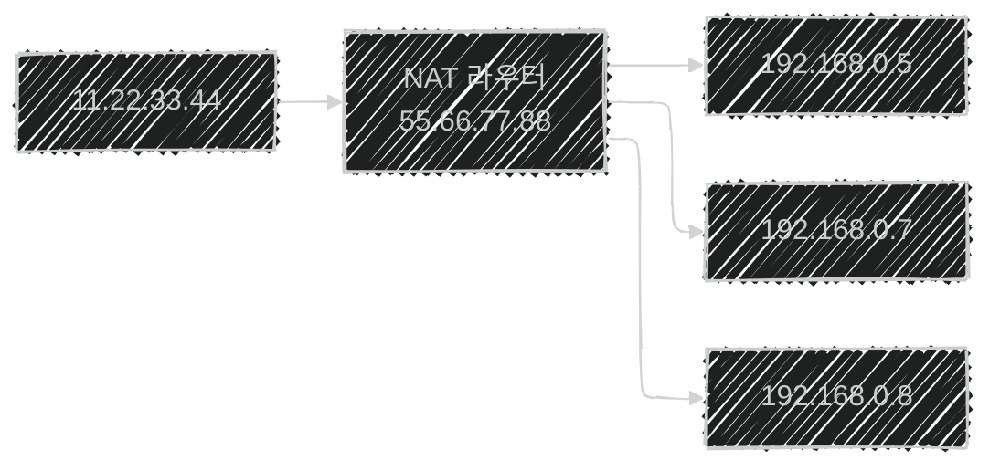

이 글은 아래의 책을 자세히 정리한 후, 정리한 글을 GPT에게 요약을 요청하여 작성되었습니다.  
게임 서버 프로그래밍 교과서, 배현직 저자
{: .notice--warning}
# 📦 2. 컴퓨터 네트워크
## 👉🏻 항목 9: 네트워크 주소 변환

### 🔄 네트워크 주소 변환(NAT)이란?

**정의:**

- 다른 단말기로 전송되던 패킷의 송신자 주소나 수신자 주소가 다른 것으로 변환되는 과정

**NAT 라우터:**

- NAT 변환을 하는 기기
- 예: 인터넷 공유기

---

### 🏠 NAT의 기본 구조

**핵심 개념:**

- IP 주소 1개를 여러 기기가 공용하도록 한다

---

### 📡 NAT 동작 과정

---

### 🔍 상세 동작 단계

**1. 패킷 송신 (내부 → 외부):**

- `192.168.0.5:10`에서 `11.22.33.44:1000`로 패킷 전송

**2. 공유기의 패킷 수신 및 분석:**

- 공유기가 패킷 수신
- 데이터 패킷에서 송신자 끝점(`192.168.0.5:10`)과 수신자 끝점(`11.22.33.44:1000`) 추출

**3. 포트 매핑 엔트리 생성:**

- 공유기는 포트 매핑 엔트리를 생성하여 가지고 있다
    - **포트 매핑 엔트리**: 송신자/수신자 끝점을 잇는 매핑 정보
- 공유기는 송신자 끝점(`192.168.0.5:10`)에 대응하는 주소(`55.66.77.88:2010`)를 만들어 포트 매핑 엔트리에 넣는다
    - 송신자 끝점(`192.168.0.5:10`)을 **내부 주소**라고 한다
    - 대응하는 주소(`55.66.77.88:2010`)를 **외부 주소**라고 한다
    - **홀펀칭**: 위처럼 포트 매핑 엔트리가 만들어지는 과정

**4. 패킷 헤더 변환:**

- 공유기는 패킷 헤더를 변경한다
    - 패킷의 송신자 필드에 있던 `192.168.0.5:10` 내부 주소를 `55.66.77.88:2010` 외부 주소로 변환한다

**5. 패킷 전송:**

- 외부 인터넷 회선으로 패킷을 전송한다

**6. 응답 패킷 수신 (외부 → 내부):**

- `11.22.33.44:1000`에 도착하고, 수신자는 응답 패킷을 전송한다
- 공유기는 응답 패킷을 수신한다

**7. 주소 역변환:**

- `55.66.77.88:2010` 외부 주소를 포트 매핑 엔트리를 통해 내부 주소로 변환한다

**8. 내부 전달:**

- 공유기 안 기기에 전달한다

---

### 🌐 NAT의 활용

**IPv4 주소 부족 문제 해결:**

- IPv4 네트워크에서 주소 개수가 모자라는 일을 해결하기도 한다

**모바일 통신에서의 NAT:**

- LTE, 5G와 같은 모바일 셀룰러 통신은 매우 많은 수의 기기를 지원해야 한다
    - 대규모 사용자용 NAT 라우터가 쓰이며, 이를 **Carrier-grade NAT**이라고 한다

---

### 🧐 정리

- NAT는 하나의 공인 IP 주소를 여러 내부 기기가 공유할 수 있게 해주는 기술이다
- 포트 매핑 엔트리를 통해 내부 주소와 외부 주소를 매핑하여 관리한다
- 홀펀칭은 포트 매핑 엔트리가 생성되는 과정을 의미한다
- IPv4 주소 부족 문제를 해결하는 데 중요한 역할을 한다
- 모바일 통신에서는 Carrier-grade NAT를 사용하여 대규모 사용자를 지원한다