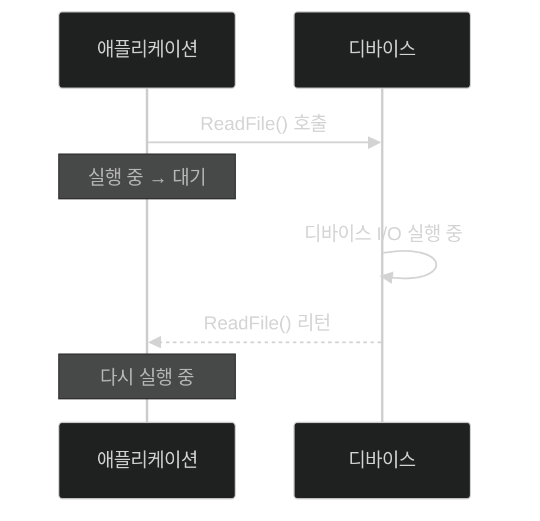

# 📦 3. 소켓 프로그래밍
## 👉🏻 항목 1: 블로킹 소켓

> 블로킹
- 디바이스에 처리 요청을 걸고, 응답을 대기하는 함수를 호출할 때 스레드에서 발생하는 대기 현상
- 해당 스레드는 waitable state 상태며, CPU 사용량이 0%가 된다.

## 📄 디스크에 접근하는 경우

- 디스크 처리가 완전히 종료될 때까지, 애플리케이션은 대기 상태로 남는다.

**문제점:**

1. 스레드에서 네트워크 수신을 하는 함수를 호출했으며
2. 상대 컴퓨터에서 데이터를 보내지 않으면  

→ 영원히 블로킹이 발생한다.