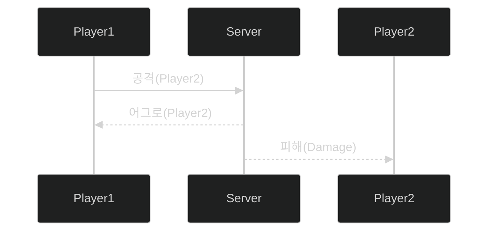

# 📦 4. 게임 서버와 클라이언트
## 👉🏻 항목 4: 게임 클라이언트와 서버의 상호 작용

### 🔄 상호작용이란?

**정의:**

- 클라이언트-서버 간에 메시지가 오가는 과정

**주요 상호작용 유형:**

- 연결
- 요청-응답
- 능동적 통보
- 연결 해제

---

### 🔌 연결 (Connection)

**정의:**

- 최초로 클라이언트가 서버와 데이터를 주고받을 준비를 하는 것

**예시:**

- TCP 연결이 이 과정 중 하나

---

### 📨 요청-응답 (Request-Response)

**정의:**

- 클라이언트가 서버에게 요청하고 응답하는 과정

**⚠️ 중요한 원칙:**

- 요청한 행동이 항상 허락될 수는 없다!
    - 해커면 추방할지 판단해야 한다

**특징:**

- 클라이언트의 모든 요청은 서버의 검증을 거쳐야 함
- 서버는 요청의 적법성, 타이밍, 게임 규칙 등을 확인
- 부적절한 요청은 거부하거나 패널티 부여

---

### 📢 능동적 통보 (Notification)

**클라이언트 → 서버:**

- 클라이언트는 서버에게 통보하고, 응답을 받지 않아도 되는 경우

**서버 → 클라이언트:**

- 서버에서 클라이언트에게 특정 상황을 통보해야 하는 경우

**게임 서버의 특성:**

- 게임 서버는 세션을 하나 이상 가지는 **상태 기계**이며, 시간이 지나며 변화한다
    - 이러한 경우 서버는 클라이언트에게 능동적 통보해야 한다

---

### 🎮 능동적 통보 예시

**동작 과정:**

1. **Player1 → Server**: 공격 요청 (Player2를 공격)
2. **Server → Player1**: 공격 판정 결과 응답 (어그로 정보)
3. **Server → Player2**: 능동적 통보 (피해 발생 알림)

**핵심:**

- Player2는 서버에 요청하지 않았지만, 서버가 능동적으로 피해 정보를 통보
- 게임 상태 변화를 모든 관련 클라이언트에게 전파

---

### 🔌 연결 해제 (Disconnection)

**정의:**

- 클라이언트와 서버 간의 연결을 종료하는 과정

---

# 🧐 정리

| 상호작용 유형 | 방향 | 응답 필요 여부 | 주요 용도 |
| --- | --- | --- | --- |
| **연결** | C → S | 필요 | 초기 연결 수립 |
| **요청-응답** | C → S → C | 필요 | 플레이어 행동 처리 |
| **능동적 통보 (C→S)** | C → S | 불필요 | 상태 업데이트 전송 |
| **능동적 통보 (S→C)** | S → C | 불필요 | 게임 상태 변화 전파 |
| **연결 해제** | C ↔ S | - | 세션 종료 |

**핵심 개념:**

**요청-응답:**

- 클라이언트 주도적
- 반드시 서버의 검증 필요
- 보안과 공정성의 핵심

**능동적 통보:**

- 서버 주도적 (대부분)
- 응답 불필요
- 게임 상태 동기화의 핵심
- 멀티플레이어 게임에서 필수

**게임 서버의 역할:**

- 상태 기계로서 게임 월드 관리
- 모든 클라이언트 요청 검증
- 게임 상태 변화를 관련 클라이언트들에게 전파
- 공정하고 일관된 게임 환경 유지