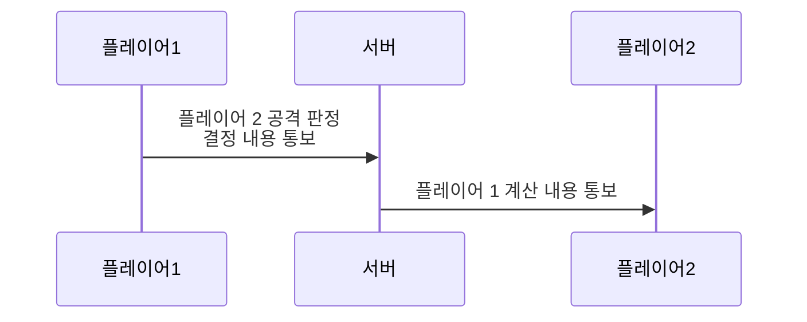
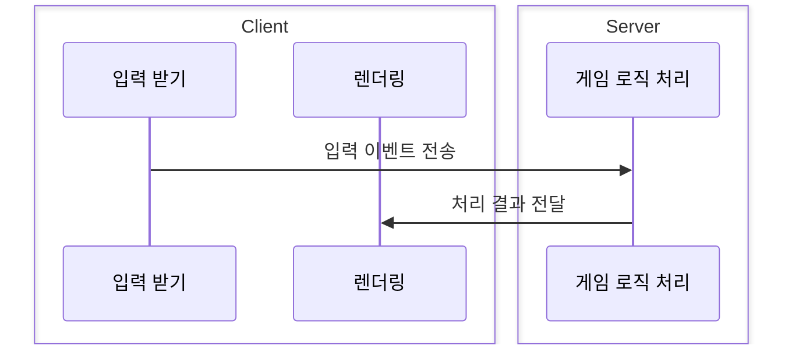

# 📦 4. 게임 서버와 클라이언트
## 👉🏻 항목 5: 게임 서버가 하는 일

### 📋 게임 서버의 주요 역할

**핵심 업무:**

- 여러 사용자와 상호 작용
- 클라이언트 데이터 검수
- 플레이어 상태 보관

---

### ❌ 클라이언트가 계산하는 방식

**문제점:**

- 플레이어가 서버에게 결정 내용을 통보할 때, 잘못된 값을 전달할 수 있다
- 해킹이나 조작에 취약
- 공정성을 보장할 수 없음

---

### 🐌 서버가 모두 계산하는 방식

**문제점:**

- 컴퓨터 네트워크는 레이턴시가 존재한다
- 즉, **렉이 걸릴 것이다**
- 사용자 경험이 저하됨

---

### ✅ 분할해서 계산하는 방식 (하이브리드)

**서버의 역할:**

- 클라이언트에게 통보받은 것에 대해 **검수**하고, 이후 처리를 진행한다

**클라이언트의 역할:**

- 판정을 마친 뒤, 서버에게 통보해준다

**예시 - 언리얼 엔진의 CharacterMovementComponent:**

1. 클라이언트에서 이동을 **예측/진행**한 뒤, 서버에게 전달한다
2. 서버는 클라이언트의 결과를 **검수**한 뒤, 서버의 예상과 다르다면 **조정**해준다

---

### 📊 세 가지 방식 비교

| 방식 | 장점 | 단점 | 적합한 용도 |
| --- | --- | --- | --- |
| **클라이언트 계산** | 반응 속도 빠름 | 보안 취약 해킹 가능 | 비경쟁적 싱글플레이 |
| **서버 전체 계산** | 완전한 검증 공정성 보장 | 렉 발생 서버 부하 높음 | 턴제 게임 전략 게임 |
| **분할 계산** | 반응 속도 유지 보안 확보 | 구현 복잡 동기화 이슈 | 실시간 액션 게임 FPS, MMORPG |

---

### 🎯 분할 계산 방식의 동작 원리

**클라이언트 측:**

1. 사용자 입력 발생
2. 로컬에서 즉시 예측 실행 (낙관적 업데이트)
3. 서버에 입력 정보 전송

**서버 측:**

1. 클라이언트 입력 수신
2. 게임 규칙에 따라 검증
3. 서버 권위(authoritative) 결과 계산
4. 클라이언트 예측과 비교
5. 차이가 있으면 보정 값 전송

**클라이언트 보정:**

1. 서버 보정 값 수신
2. 로컬 상태를 서버 상태에 맞춰 조정
3. 부드러운 보간으로 자연스럽게 처리

---

# 🧐 정리

**게임 서버의 핵심 원칙:**

- **서버가 권위(authority)를 가진다**: 최종 결정권은 항상 서버
- **클라이언트는 예측한다**: 반응성을 위해 로컬에서 먼저 실행
- **서버는 검증한다**: 모든 클라이언트 데이터를 검수
- **불일치 시 조정한다**: 서버 결과로 클라이언트 상태 보정

**현대 게임 서버의 접근 방식:**

- 실시간 게임은 대부분 **분할 계산 방식** 사용
- 클라이언트 예측 + 서버 검증 = 최적의 균형
- 네트워크 레이턴시를 사용자가 느끼지 못하도록 처리
- 보안과 사용자 경험을 동시에 만족

**구현 시 고려사항:**

- 어떤 로직을 클라이언트에서 처리할지 결정
- 서버 검증 로직의 강도 설정
- 보정 시 부드러운 전환 처리
- 치트 방지를 위한 추가 검증 레이어