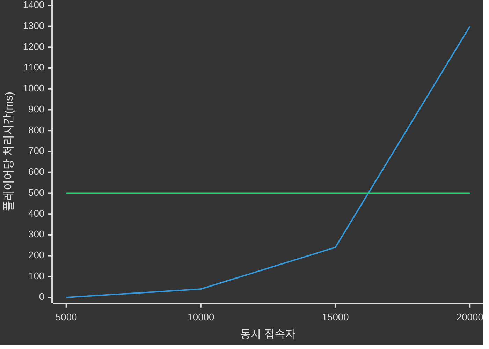

# 📦 4. 게임 서버와 클라이언트
## 👉🏻 항목 6: 게임 서버의 품질

### 🎯 서버 개발 시 목표

**4대 핵심 목표:**
- 안정성
- 확장성
- 성능
- 관리 편의성

---

### 🛡️ 1. 안정성

**정의:**
- 기본적으로 게임 서버가 죽지 않거나, 오작동하지 않는가를 의미한다
- 버그로 인한 오작동도 포함된다
    - 예: 구매한 아이템이 사라지거나, 추가로 생기거나 하는 문제

---

#### ✅ 안정성을 위해 노력할 점

**1. 치밀한 개발과 유닛 테스트:**
- 코드 검수, 코딩 가이드라인, 자가 검증을 진행해야 한다

**2. 80:20 법칙:**
- 코드의 20%에서 성능이 결정된다는 파레토 법칙이다
- 20% 코드에서는 최적화를 염두에 두고, 80% 코드에서는 유지보수를 염두에 둔다

**3. 1인 이상 코드 리뷰:**
- 동료의 코드를 읽으며 검수한다

**4. 가정 대신 검증:**
- 실제 상황과 같이 테스트하며 검증한다
- 사전 정의된 행동을 수행하는 컴퓨터를 대량 이용하여 테스트하기도 한다
    - 이를 **봇 테스트/더미 클라이언트 테스트/스트레스 테스트**라고 한다

---

#### 🚨 문제에 대처하는 방법

**1. 서버가 죽더라도, 최대한 빨리 살아나게 한다:**
- 말 그대로 서버가 죽으면 다시 실행시키도록 만든다

**2. 서버가 죽더라도, 최대한 적은 서비스만 죽게 한다:**
- 서버 프로세스 여러 개를 두고, 각자 맡는 파트를 다르게 할 수 있다
- 예비 서버를 한 대 더 두고, 메인 서버가 죽으면 이어받도록 한다
    - 9장 분산 서버 구조의 서버 분산 처리와 고가용성 부분에서 설명한다

**3. 서버 오작동에 대해 로그를 남긴다:**
- 크래시 덤프(마지막 프로세스 상태)를 파일로 남긴다
- 최근에 받았던 메시지 종류를 남기는 방법도 있다

---

### 📈 2. 확장성

**정의:**
- 사용자 수가 늘어나더라도 서비스 품질이 떨어지지 않고 유지되느냐를 의미한다

**확장 방식:**
- 수직적 확장과 수평적 확장이 있다

---

#### 📊 수직적 확장 vs 수평적 확장

| 구분 | 수직적 확장 | 수평적 확장 |
| --- | --- | --- |
| **확장 종류** | 부품 업그레이드 혹은 CPU/RAM을 증설 | 서버 머신의 개수 증설 |
| **서버 소프트웨어 설계 비용** | 낮다 | 높다 |
| **확장 비용** | 높다 (기하급수적) | 낮다 (선형적) |
| **과부하 지점** | 서버 컴퓨터 자체 | 네트워크 장치 |
| **오류 가능성** | 낮다 (로컬 머신에서 동기 프로그래밍 방식 작동) | 높다 (여러 머신에서 비동기 프로그래밍 방식 작동) |
| **단위 처리 속도** | 높다 (로컬 컴퓨터의 CPU/RAM 사용) | 낮다 (여러 머신 간 메시지 전달하며 처리) |
| **처리 가능 총량** | 낮다 (서버 한 대 성능만 사용) | 높다 (여러 머신으로 부하 분산) |

---

### ⚡ 3. 성능

**정의:**
- 얼마나 빠르게 처리하는지를 의미한다

**중요도:**
- 실시간으로 0.01초 차이로 승패가 갈리는 FPS 게임에서는 중요도가 커진다
- 이에 반해 턴을 가지는 카드 게임에서는 레이턴시가 크게 체감되지 않는다

**핵심 원칙:**
- **성능과 확장성의 적절한 균형이 중요하다**

---

#### 📉 성능 vs 확장성 그래프

- 🟦 **성능만 좋음**: 낮은 부하에서는 빠르지만, 부하 증가 시 급격히 느려짐
- 🟩 **확장성만 좋음**: 일정한 속도를 유지하지만, 기본 처리 시간이 김

---

#### 🔧 성능 개선 방법

**1. 서버의 단위 처리 속도 높이기:**
- 알고리즘 최적화
- 더 빠른 프로그래밍 언어
- 더 좋은 하드웨어

**2. 서버의 과부하 영역 분산:**
- 코드 프로파일링을 통해 어떤 함수가 성능에 주요한 영향을 주는지 탐색한다
- 처리 속도를 높이거나, 실행 빈도를 낮출 수 있는 방법이 없다면 사용해야 한다
- 해당 함수를 실행하는 서버를 여러 대로 나눔으로써 해결한다

**3. 네트워크 프로토콜 최적화**

---

#### 📦 3.1. 메시지 양 줄이기

**메시지 압축:**
- 압축할 수 있는 데이터 패턴을 이룰 수 있다면 사용할 수 있다

**양자화:**
- 정수 혹은 부동소수점 값의 정밀도를 낮춰, 값이 차지하는 데이터 크기를 줄일 수 있다
- 네트워크 송수신 시에만 양자화하고, 가지고 있을 때는 복원해도 된다
- **예시**: 체력(float)의 범위가 0~100이다. 체력(int)을 2배하여 0~200으로 만들면 여전히 1바이트로 소수점 값을 표현할 수 있다

**메시지 교환 횟수 줄이기:**
- 보내야 할 메시지 A, B, C, D를 보내야 한다
- 각 메시지를 1개씩 보내면 4번을 보내야 한다
- 가능하다면 A,B와 C,D로 묶어서 2번만 보낼 수도 있다

---

#### 🌐 3.2. 네트워크 전송 시간 줄이기

**고품질 네트워크 회선:**
- 고품질 네트워크 회선을 가진 데이터센터에 서버 설치

**지리적 분산:**
- 지리적으로 가까운 데이터센터에 서버 분산 설치
    - 한국 서버, 중국 서버, 일본 서버, 미국 서버와 같이 분산 설치한다
    - 지리적으로 가까운 클라이언트끼리 매칭시켜준다

**P2P 네트워킹:**
- 클라이언트끼리 직접 통신함으로써 서버 부담을 줄인다
- 클라이언트끼리 통신하므로, **해킹당하면 곤란하다**
- FPS에서 자주 사용된다

---

### 🔧 4. 관리 편의성

**기본 형태:**
- 일반적인 게임 서버는 콘솔 프로그램 형태로 작동하며, 조작이 불가능하다
    - 서버 On/Off만 가능하다
- 백그라운드 프로세스로 서버를 실행시키기도 하며, 시작 프로그램으로 등록해두기도 한다
    - 이를 윈도에서는 **서비스**, 리눅스/유닉스에서는 **데몬**이라 한다

---

#### 🛠️ 4.1. 관리 방법

**관리 도구 구성:**
- 서버 프로그램을 원격 관리하는 프로그램을 따로 둔다
- 이를 **관리 도구** 혹은 **운영 도구**라고 하며, 필수 역할은 다음과 같다:
    - 서버 On/Off
    - 동시접속자 수 보기
    - CPU/RAM 사용량 확인

**권한 분리:**
- **서버 관리자(SA)**와 **게임 운영자(GM)**의 역할을 다르게 한다
    - **서버 관리자**: 서버 관련 업무를 할 수 있는 권한을 가진다
    - **게임 운영자**: 게임 관련 업무를 할 수 있는 권한을 가진다
        - 예: 추방이나 아이템 회수, 지급 등

---

# 🧐 정리

**게임 서버 품질의 4대 요소:**

| 요소 | 핵심 개념 | 주요 전략 |
| --- | --- | --- |
| **안정성** | 서버 다운타임 최소화 | 테스트, 코드 리뷰, 로그, 자동 복구 |
| **확장성** | 사용자 증가에 대응 | 수평적 확장 (서버 대수 증설) |
| **성능** | 빠른 응답 속도 | 알고리즘 최적화, 프로토콜 최적화 |
| **관리 편의성** | 운영 효율성 | 관리 도구, 권한 분리 |

**균형의 중요성:**
- 4가지 요소는 서로 트레이드오프 관계
- 프로젝트 특성에 맞는 적절한 균형점 찾기가 중요
- 성능과 확장성은 특히 신중한 균형 필요

**실무 적용:**
- 초기: 안정성 > 성능 > 확장성 > 관리 편의성
- 성장기: 확장성 > 안정성 > 성능 > 관리 편의성
- 성숙기: 관리 편의성 > 안정성 > 확장성 > 성능