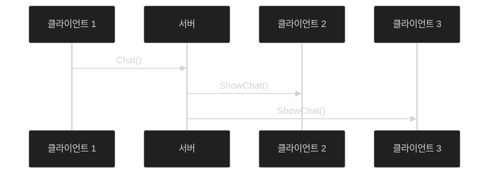
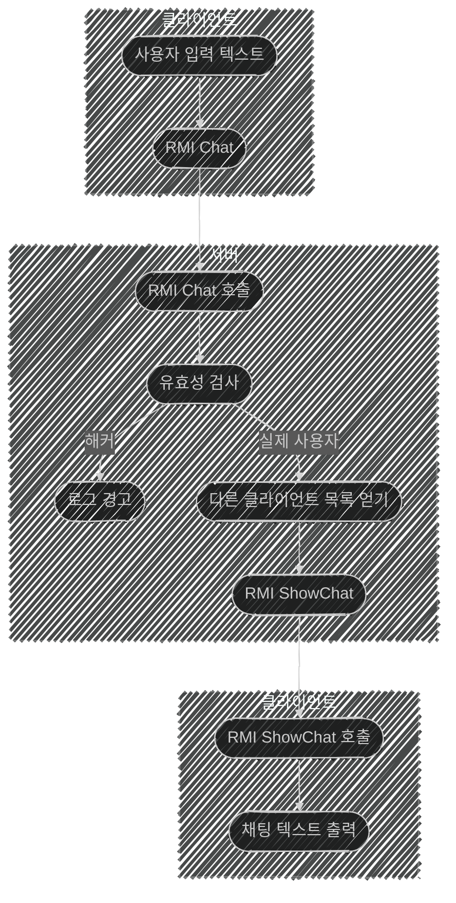

# 📦 5. 게임 네트워킹
## 👉🏻 1. UML

### 📐 UML이란?

**정의:**

- 프로그램 구조 명세를 표현할 수 있다
- 여러 가지 다이어그램 종류가 있다

---

### 📊 1. UML 시퀀스 다이어그램

**구성 요소:**

**객체 (Object):**

- 상호 작용의 주체로, 네모 상자로 표현된다
- 예: 클라이언트, 서버

**메시지 (Message):**

- 상호 작용의 내용으로, 화살표로 표현된다
- 예: `Chat()`, `ShowChat()`

**한계점:**

- 주고받은 메시지 처리 방식에 대한 표현은 한계가 있다

---

### 🔄 2. 액티비티 다이어그램

**구성 요소:**

**타원 도형:**

- 활동 상태를 의미한다

**최초 도형:**

- 각 서브 다이어그램 내 최초 도형은 최초 상태를 의미한다

**조건 분기:**

- 조건 분기문도 쓸 수 있다
- 예: "해커" vs "실제 사용자"

---

# 🧐 정리

### 시퀀스 다이어그램 vs 액티비티 다이어그램

| 구분 | 시퀀스 다이어그램 | 액티비티 다이어그램 |
| --- | --- | --- |
| **목적** | 시간 순서에 따른 상호작용 표현 | 처리 흐름과 로직 표현 |
| **표현 방식** | 객체 간 메시지 전달 | 활동 상태와 전환 |
| **강점** | 시간적 순서 명확 | 조건 분기, 병렬 처리 표현 |
| **약점** | 복잡한 로직 표현 어려움 | 시간적 순서 불명확 |
| **사용 시기** | 통신 프로토콜 설계 | 게임 로직 흐름 설계 |