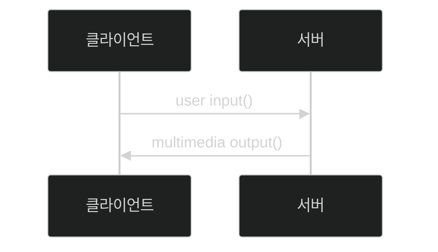
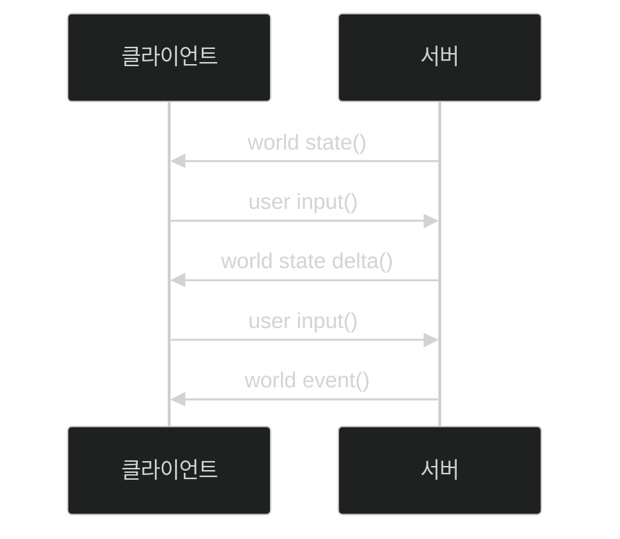

# 📦 5. 게임 네트워킹
## 👉🏻 2. 게임 플레이 네트워킹

### 🌐 레이턴시에 영향을 주는 요인들

**주요 원인:**

- 서버가 멀리 있는 경우
- 클라우드 서버에서 다른 가상 머신이 CPU 사용량을 잠식하는 경우
- 패킷 드롭으로 인한 재송신
- 인구가 낮은 국가
- 무선 네트워크인 경우 레이턴시/패킷 드롭률 증가

---

### 🎮 1. 모든 역할을 서버에서 하기

**특징:**

- 가장 오래된 방식이다
    - MUD 게임에서나 썼고, 현대 게임에서는 어림도 없다

**역할 분담:**

**클라이언트 역할:**

1. 사용자 입력 (키 입력, 마우스 좌표)
2. 화면 출력

**서버 역할:**

1. 게임 로직 연산
2. 화면 렌더링 (그래픽 데이터 보유)
3. 화면 송출 (비디오 스트리밍)

---

### 🖼️ 2. 렌더링은 클라이언트에서

**특징:**

- 렌더링을 위한 최소 정보인 게임 월드 상태만 클라이언트에게 보내고, 월드 상태 연산은 서버가 함
- 렌더링은 클라이언트가 수행하고, 그래픽 리소스는 클라이언트가 가짐
- 서버와 클라이언트의 월드 상태를 동기화하여 동일하게 유지

**동작 과정:**

1. 클라이언트에게 씬 상태 (모든 캐릭터 위치, 기타 정보)를 전송한다
2. 클라이언트가 행동을 취하면, 메시지로 만들어 서버에 전송한다
3. 월드 상태가 변하면, 변한 부분만 클라이언트에게 전송한다
4. 2-3번 반복

---

### 📍 이벤트 유형

**지속성 이벤트:**

- 씬의 상태에 영구적 변화를 가하는 것
- 예: 이동, 생성, 소멸, 변경

**단발성 이벤트:**

- 씬의 상태에 일시적 변화를 가하는 것
- 예: 수류탄 (생성→폭발→소멸→파티클): 항상 동일

---

### ⚠️ 원활한 작동을 위한 문제와 해결

**이상적인 과정:**

1. 서버는 1/60초마다 월드 상태 업데이트
2. 서버는 클라이언트에게 1/60초마다 월드 상태 변화 전송
3. 클라이언트는 수신 데이터를 자기 월드 상태에 반영하고, 다음 렌더링 프레임에서 렌더링 진행

**문제점 1:**

- 서버/클라이언트 간의 레이턴시가 1/60초보다 낮으며 균일해야 한다

**해결법 1:**

- 전송 텀을 더 길게 잡는 대신, 끊기는 값에 대해 **상태 값 보정**을 사용한다
- 상태 값 보정에는 선형 보간/스플라인이 있다

**문제점 2:**

- 그렇더라도 레이턴시로 인해 한 템포 늦어 보인다

**해결법 2:**

- 이를 위해 **추측 항법**을 사용한다

---

### 🎯 3. 추측항법

**기본 개념:**

- 레이턴시로 인해 상대의 위치가 한 템포 늦었다
- 지나간 약간의 시간만큼 위치 정보를 예측해주면 된다

---

### ⏱️ 레이턴시 측정

**라운드 트립 레이턴시 (RTT):**

1. 기기 A에서 기기 B에 패킷을 보낸다
2. 기기 B가 패킷을 받으면, 기기 A에게 패킷을 보낸다
3. 기기 A는 `(현재 시간 - A가 보낸 시간) / 2`를 구한다

---

### 🧮 추측 항법 과정

**변수 정의:**

- 송신자 측 위치: `P0`
- 수신자 측 위치: `P`
- 레이턴시: `a`

**t=0 시점:**

- 송신자: `P0(t=0)`
- 수신자는 `P(t=0+a)`를 모름
- 예측: `P(t=0+a) = P0(t=0) + a * V0(t=0)`

**t=1 시점:**

- 송신자: `P0(t=1)`
- 다시 예측: `P(t=1+a) = P0(t=1) + a * V0(t=1)`

**문제점:**

- `P(t=0+a+?)`: 기존에 예측 중이던 위치
- `P(t=1+a)`: 원본 위치를 기준으로 다시 예측한 위치
- 예측한 것이기에 동일할 수가 없다

**해결법:**

- `P_follow`: 새로운 위치 값 (실제 렌더링 위치)
- `P_target`: 예측된 목표 위치
- `P_follow`는 `P_target`을 향해 선형 보간하며 이동한다

---

### 🎭 레이턴시 마스킹

**정의:**

- 레이턴시로 발생하는 문제를 감추는 방법을 **레이턴시 마스킹**이라고 한다

---

# 🧐 정리

| 방식 | 장점 | 단점 | 사용 예시 |
| --- | --- | --- | --- |
| **서버 전담** | 보안 완벽 | 엄청난 레이턴시 | MUD, 텍스트 게임 |
| **클라 렌더링** | 레이턴시 감소 보안 유지 | 동기화 복잡 | 현대 온라인 게임 |
| **추측항법** | 부드러운 움직임 | 예측 오차 | FPS, MMORPG |

**핵심 기술:**

- 상태 값 보정 (선형 보간)
- 추측 항법 (위치 예측)
- 레이턴시 마스킹