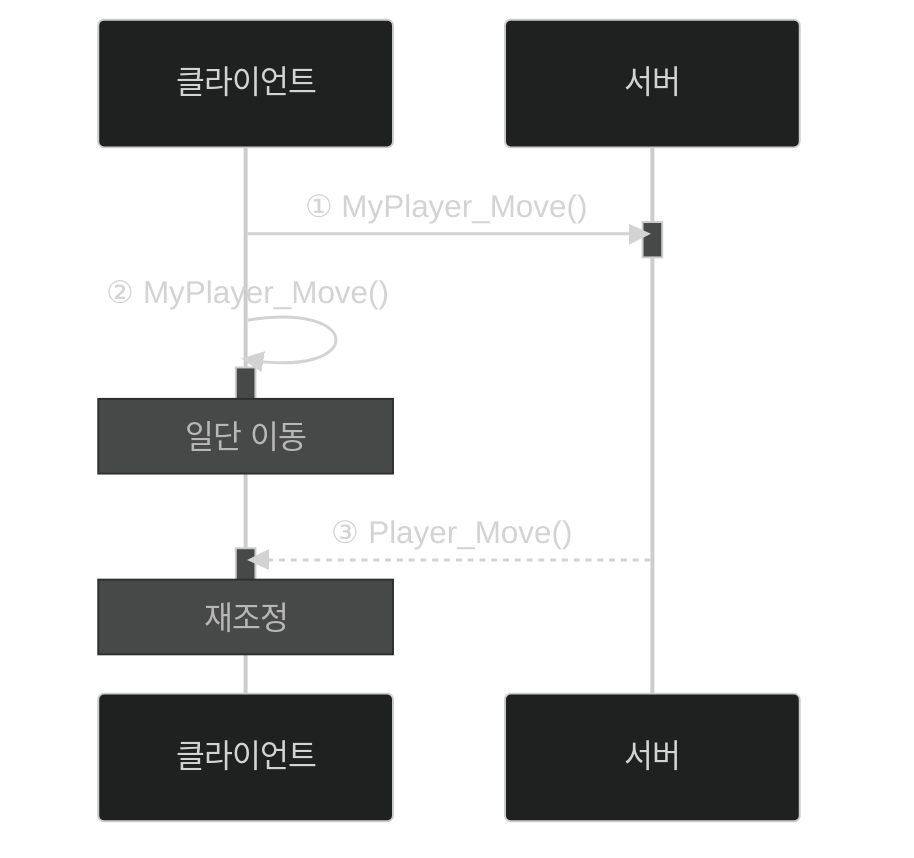

# 📦 5. 게임 네트워킹
## 👉🏻 3. 레이턴시 마스킹

### 🎮 기본 동작 방식

**일반적인 과정:**

1. 클라이언트에서 서버에 플레이어 캐릭터를 조종하는 명령 전송
2. 서버는 플레이어의 캐릭터 이동 연산 수행
3. 일정 시간(1/30~1/10초)마다 클라이언트에 이동 정보 메시지 전송
4. 클라이언트는 이동 정보 메시지를 통해 추측항법으로 캐릭터 위치를 부드럽게 업데이트

**문제점:**

- 위대로만 하면 답답하게 느껴짐
    - 명령을 보낸 즉시 움직이지 않고, 서버에게 메시지를 받으면 그제서야 움직이기 때문

---

### 💡 1. 사소한 것은 클라이언트에서

### 📋 과정

1. 클라이언트에서 캐릭터 위치 계산 진행
2. 서버에게 판단 결과를 보내줌

### 🛡️ 치터 문제 해결 방법

**방법 1: 값 검증**

- 클라이언트는 이동 정보를 서버에게 보낸다
- 서버는 정상적인 값 범위인지 검사한다

**방법 2: 예측/보정**

- 클라이언트는 먼저 움직이고, 명령 정보만 서버에게 보낸다
- 서버는 명령 정보 기반 캐릭터 이동을 시뮬레이션한 뒤, 해당 이동 정보 메시지 전송
- 클라이언트는 이동 정보 메시지에 따라 본인의 이동을 보정한다

---

### 🔄 예측/보정 동작 흐름

**단계별 설명:**

1. 서버에 이동 명령 전송
2. 클라이언트에서 즉시 이동 처리
3. 서버 검증 결과에 따라 위치 재조정

---

### ⚠️ 예측/보정의 문제점

**한계:**

- 예측/보정은 해킹을 막는 데 제일 좋지만, **레이턴시가 100ms가 넘으면 캐릭터 움직임이 손상**된다
- 레이턴시가 균일하고 낮을 때(50ms 이하) 사용하는 것이 제일 좋다

---

### 🎬 2. 일단 보여주고, 나중에 해결

### 📋 과정

1. **클라이언트는 서버에 행동 명령에 대한 메시지 전송**
    - 동시에 행동 연출 일부 즉시 시작
2. **서버는 클라이언트에게 행동 명령 처리 결과 전송**
3. **클라이언트는 행동 연출 나머지 부분 진행**

---

### 🎭 특징

**동작 방식:**

- 레이턴시가 높으면 행동 모션을 취하지만, 이후에서야 사운드와 이펙트 연출이 발생한다

**사용 사례:**

- 스타크래프트
- 디아블로 3

---

# 🧐 정리

### 레이턴시 마스킹 기법 비교

| 기법 | 동작 방식 | 장점 | 단점 | 적합한 상황 |
| --- | --- | --- | --- | --- |
| **값 검증** | 결과 전송 후 검증 | 구현 간단 | 보안 취약 | 신뢰 환경 |
| **예측/보정** | 즉시 이동 → 보정 | 보안 우수 즉각 반응 | 고레이턴시 시 끊김 | 저레이턴시(50ms↓) |
| **분할 연출** | 모션 먼저 → 이펙트 나중 | 고레이턴시 대응 | 시각적 위화감 가능 | RTS, ARPG |