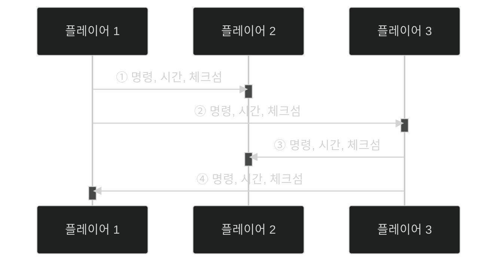

# 📦 5. 게임 네트워킹
## 👉🏻 5. 실시간 전략 시뮬레이션 게임에서 네트워크 동기화

### ⚙️ 락스텝(Lockstep) 구동원리

**기본 동작:**

1. 각 플레이어는 다른 플레이어들에게 입력 명령을 보낸다
2. 플레이어의 입력 명령에 따라 모든 클라이언트가 동시에 씬 업데이트를 한다

**효과:**

- 입력 명령만 주고받고, 이동 상태를 주고받지 않기에 **통신량이 적다**

---

### 💻 구현 방법

**기본 가정:**

- 네트워크 지연 시간이 없고, 월드는 1/60초마다 업데이트된다고 가정한다



**동작 과정:**

- 플레이어 1의 입력 명령이 발생하면, 나머지 플레이어들에게 메시지를 보낸다
- 플레이어 3의 입력 명령이 발생하면, 나머지 플레이어들에게 메시지를 보낸다
- 상대방에게 메시지가 오지 않으면 업데이트하지 않고 대기한다
- 해커가 있는 경우를 대비해 **체크섬**을 함께 보내 감지한다

---

### ⚠️ 문제점과 해결

**레이턴시 문제:**

- 레이턴시가 없을 때나 작동한다
- 언제 작동해야 할지에 대한 **미래 시간**을 함께 보낸다

**미래 시간 계산:**

```
미래 시간 = 현재 시간 + 왕복 레이턴시(RTT) / 2 + 임의의 일정 값
```

**미래 시간 설정의 딜레마:**

- **미래 시간이 너무 먼 경우**: 입력과 출력 간의 간격이 멀어지는 렉이 생긴다
- **미래 시간이 너무 가까운 경우**: 캐릭터 움직임이 끊기는 Stuttering 현상이 생긴다

**해결책:**

- 이전에 배웠던 레이턴시 마스킹 중, **일단 보여주고 나중에 해결**을 하기도 한다

---

### ❌ 락스텝의 단점

1. **진행 중인 게임 난입 기능을 만들기 까다롭다**
2. **게임 플레이 연산에 부동소수점을 사용할 수 없다**
3. **플레이어 수가 많아지면 통신량이 크게 증가한다**
4. **씬 업데이트가 일시 정지할 확률이 높다**
    - 레이턴시가 가장 높은 사람을 기준으로 미래 시간을 결정해야 한다
5. **입력 명령 속도에 민감한 게임에 부적합하다**

---

# 🧐 정리

| 항목 | 장점 | 단점 |
| --- | --- | --- |
| **통신량** | 매우 적음 (명령만 전송) | 플레이어 증가 시 급증 |
| **동기화** | 완벽한 동기화 보장 | 느린 플레이어에 영향받음 |
| **적합한 게임** | RTS (스타크래프트) | FPS, 액션 게임 |

**핵심 개념:**

- 모든 클라이언트가 동일한 입력으로 동일한 시뮬레이션 실행
- 결정론적 시뮬레이션 필수 (부동소수점 사용 불가)
- 가장 느린 플레이어 기준으로 동기화