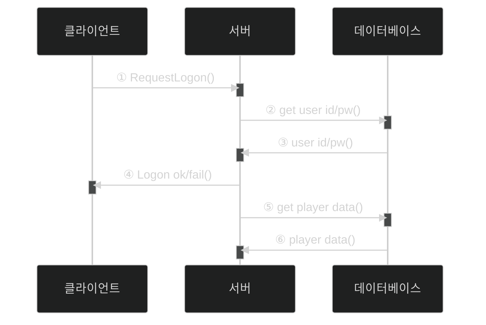
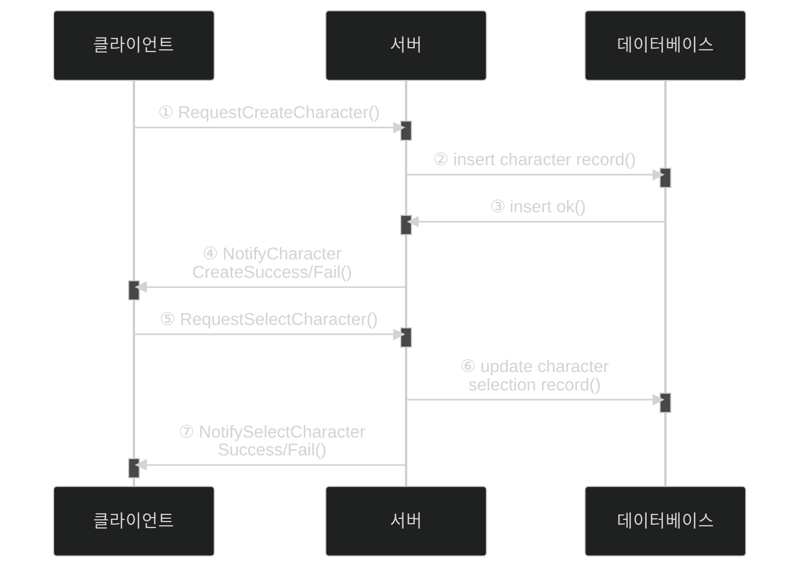
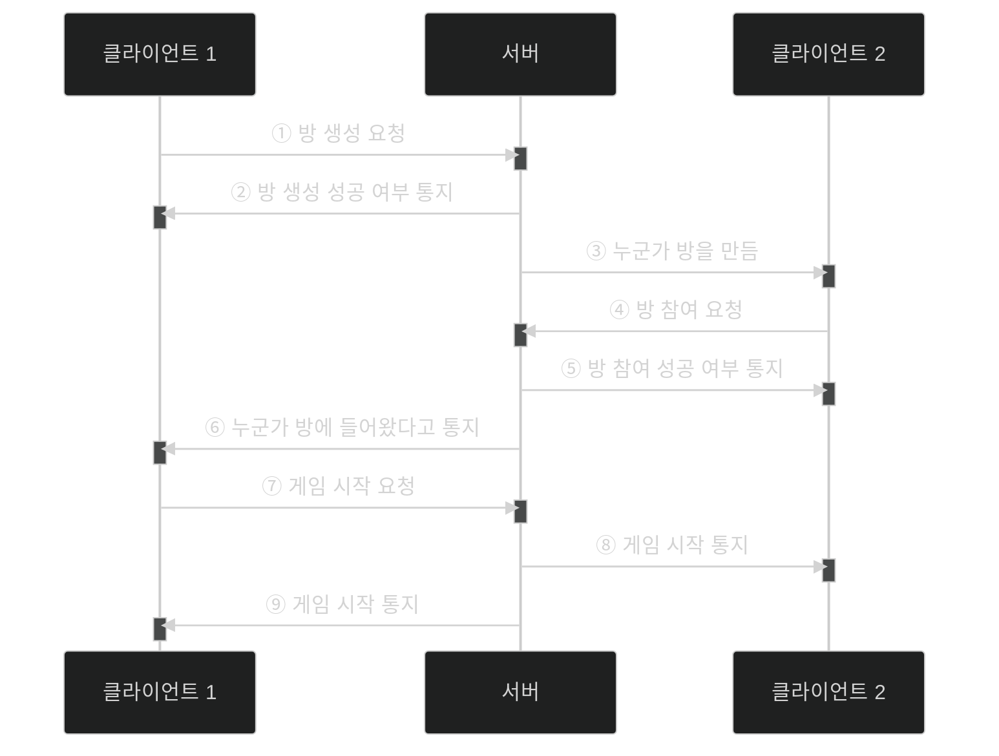
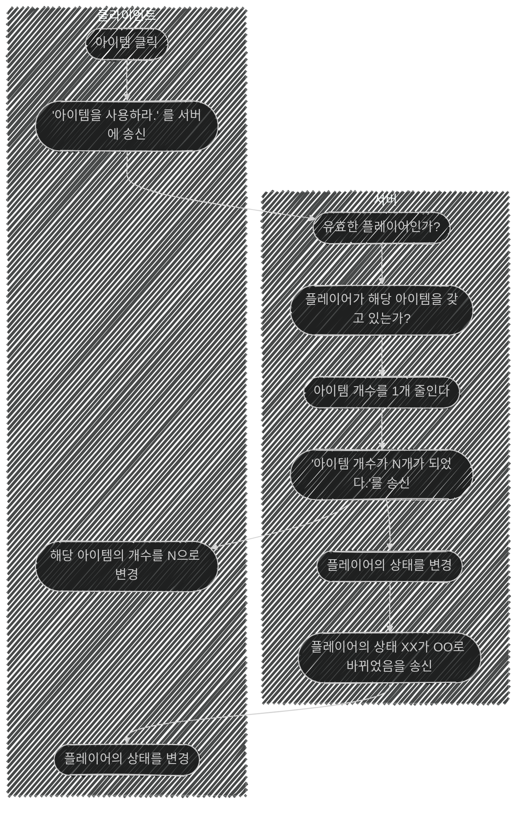

# 📦 5. 게임 네트워킹
## 👉🏻 7. 게임 플레이 이외의 네트워킹

### 💡 개발 팁

**시퀀스 다이어그램을 그리며 개발하는 것이 좋다**

---

### 🔐 로그온 과정

**과정:**

1. 로그온 요청 메시지를 서버로 전송
2. 서버는 파일이나 데이터베이스에서 해당 유저의 ID와 비밀번호를 받아서 식별
3. 식별 결과를 클라이언트에 통보
4. 성공 시 플레이어 정보를 데이터베이스에서 로딩해 게임 서버 메모리에 보관

---

### 👤 캐릭터 생성/선택 과정

**생성 과정:**

1. 클라이언트는 서버에 캐릭터 생성 요청
2. 서버는 데이터베이스에 새 캐릭터 개체 생성 요청
3. 데이터베이스는 서버에 생성 요청 성공 여부 반환 (동일 캐릭터가 있으면 실패)
4. 서버는 클라이언트에 성공 여부 통지

**선택 과정:**
5. 클라이언트는 서버에 캐릭터 선택 요청
6. 서버는 데이터베이스에 캐릭터 선택 기록 (존재하는 정보 기반이라 즉시 성공)
7. 서버는 클라이언트에 캐릭터 선택 성공 여부 반환

---

### 🎮 매치메이킹

**핵심 원칙:**

- 방 입장/목록은 클라이언트가 아닌 **서버에서 판단**
- 클라이언트는 서버에게 **요청**하고 결과에 따라 행동
- 서버는 **요청 판단 후 영향받는 모든 클라이언트에게 통보**

---

### 🎁 아이템 사용

**과정:**

1. 클라이언트는 서버에게 아이템ID를 담은 메시지 전송
2. 서버는 플레이어 사용 가능 여부 판단 후 사용 결과 판정
3. 서버는 클라이언트에게 아이템 사용됨 통지

---

# 🧐 정리

**공통 패턴:**

- 클라이언트 → 서버: 요청
- 서버: 검증 및 판단
- 서버 → 클라이언트(들): 결과 통보
- 모든 중요한 판단은 서버에서 수행