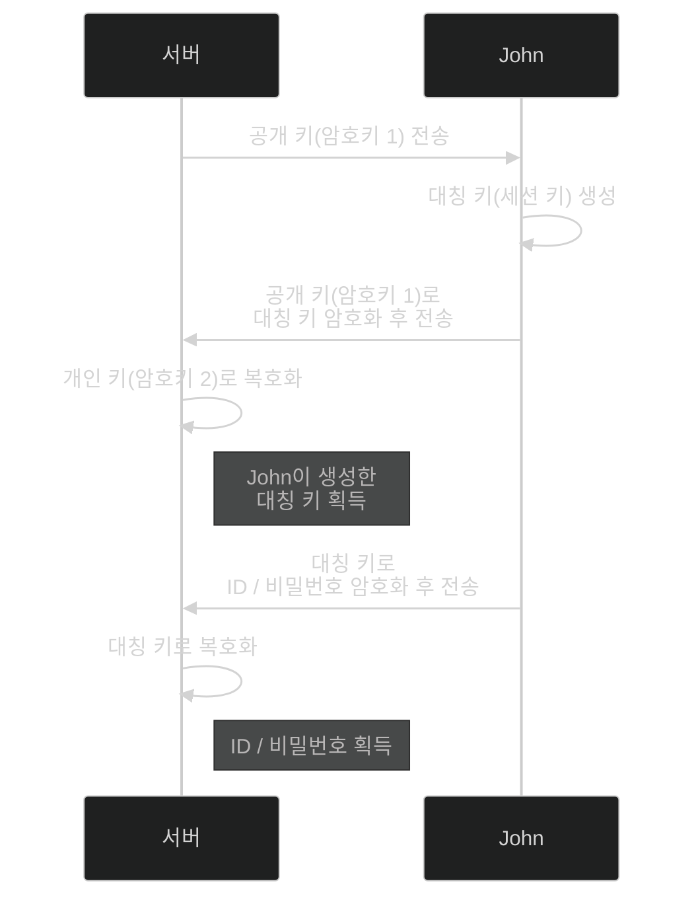

# 📦 5. 게임 네트워킹
## 👉🏻 8. 해킹과 보안

### 🚨 해킹 유형

**1. 크래킹:**
- 다른 사람의 ID/PW를 도용
- 서버 데이터 훼손 및 훔치기

**2. 치트/조작:**
- 능력치 조작
- 다른 사람의 플레이 방해

---

### 🔒 1. 네트워크 해킹

**스니핑/스누핑:**
- 다른 사람의 정보를 도청한다
- 이를 방지하기 위해 **암호화 알고리즘**을 사용한다

**암호화 알고리즘 종류:**

**대칭 키 알고리즘:**
- 대칭 키(세션 키)로 암호화/복호화를 하는 알고리즘
- 주로 **AES** 알고리즘을 사용한다

**비대칭 키 알고리즘:**
- 공개 키(암호 키 1), 개인 키(암호 키 2)로 암호화/복호화를 하는 알고리즘
- 주로 **RSA** 알고리즘을 사용한다

**⚠️ 한계:**
- 이렇게 해도 모든 것이 완벽하게 암호화되지 않는다
    - **중간자 공격**이라는 것도 있다
- **DDoS 공격**: 서버에 대량의 네트워크 데이터를 보내 마비시킨다
    - 현재로서는 방어할 방법이 마땅치 않다

---

### 💻 2. 클라이언트 컴퓨터 해킹

**주요 경로:**
- 컴퓨터에 악성 프로그램을 설치하는 경우
- 운영체제/프로그램 결함을 이용해서 전파
- 사용자의 허술한 보안 설정을 뚫고 해킹

---

### 🖥️ 3. 서버 컴퓨터 해킹

**방어 방법:**
- 일반적인 유저가 접속하는 리스닝 포트를 제외하고, **방화벽으로 차단**하자
- 웹 서버나 데이터베이스 서버에서도 주의하자
    - **질의 구문 인젝션(SQL Injection)**이 있다
    - 일반 유저는 접속할 수 없도록 방화벽으로 차단하자

---

### 🎮 4. 게임 치트

**문제점:**
- 클라이언트 측 게임 플레이 판단은 쉽게 해킹당할 수 있다
- 방어와 네트워크 품질을 서로 **절충**해야 한다

**방어 방법:**
- 안티치트 프로그램을 사용하는 것도 한 방법이다

---

### 🕵️ 네트워크 도청 및 조작

**공격 방식:**
- 클라이언트가 서버에 공격 메시지를 전송한다
- 해커는 해당 메시지를 복제 및 전송하여 모든 플레이어를 처리한다

**방어 방법:**
- 서버에서 받는 메시지가 **시간 차이도 유효한지** 알아보아야 한다

---

### 💥 유사 DDoS

**공격 방식:**
- 해커는 정밀하게 조작하지 않아도 되는 캐릭터를 가지고 있다
- 서버나 다른 클라이언트들에게 대량의 네트워크 데이터를 보내 마비시킨다
- 정밀한 컨트롤이 필요한 다른 플레이어를 상대로 **우위를 가진다**

**기타 치트:**
- 에임핵, 월핵, 스피드핵 등 다양한 종류가 있다
- 예시: 서든어택의 수류탄 마구 퍼붓는 핵

---

# 🧐 정리

| 해킹 유형 | 공격 방식 | 방어 방법 |
| --- | --- | --- |
| **네트워크 도청** | 패킷 스니핑 | AES/RSA 암호화 |
| **서버 해킹** | SQL 인젝션, 포트 공격 | 방화벽, 포트 차단 |
| **클라이언트 해킹** | 악성 프로그램 | 보안 설정 강화 |
| **게임 치트** | 능력치 조작, 유사 DDoS | 서버 검증, 안티치트 |
| **DDoS** | 대량 패킷 전송 | 현재 완벽한 방어 없음 |