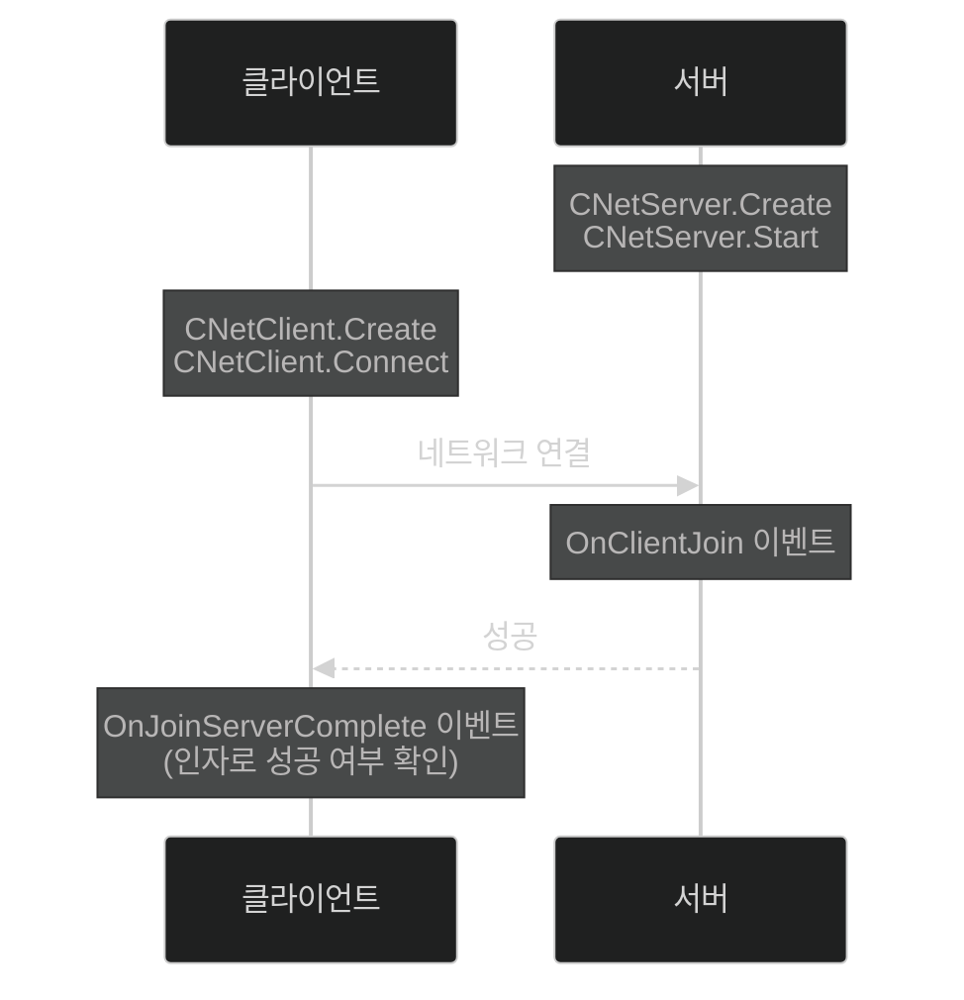
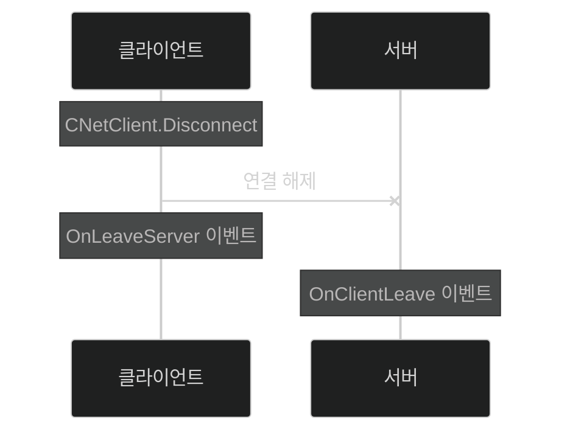

# 📦 6. 게임 네트워크 엔진 프라우드넷
## 👉🏻 3. 게임 클라이언트-서버 간 통신

### 🔌 연결 과정



**기본 흐름:**
1. `CNetServer.Create()`로 CNetServer 인스턴스 생성
2. `CNetServer.Start()`로 서버가 클라이언트 접속할 수 있도록 함
    - 필수 매개변수: 프로토콜 버전, 리스닝 포트 번호
3. `CNetClient.Create()`로 클라이언트 인스턴스 생성
4. `CNetClient.Connect()`로 서버에 접속
    - 입력 값: 서버 주소, 포트 값, 프로토콜 버전 값

---

### 🚪 연결 해제 과정



**정상적으로 나가는 경우:**
1. 클라이언트에서 `Disconnect()` 함수로 연결 해제
2. 서버에서 `OnClientLeave()` 이벤트 호출

**연결이 끊어진 경우:**
1. 서버/클라이언트 연결 끊김
2. 클라이언트에서 `OnLeaveServer()` 이벤트 호출
3. 서버에서 `OnClientLeave()` 이벤트 호출

---

### 🔑 HostID

**식별자:**
- 서버/클라이언트는 정수 타입 식별자인 **HostID**로 구분
- 서버는 항상 고정 값인 `HostID_Server`를 가짐
- 클라이언트는 서로 다른 HostID를 가짐

---

### 💻 서버 코드 예시

```cpp
CNetServer* s = CNetServer::Create(); // 1
param.m_tcpPorts.Add(44444); // 2
param.m_udpPorts.Add(44444);
// 3
param.m_protocolVersion = Guid(
	{ 0x5dca93f4,
		0x8133,
		0x44a0,
		{0xb5, 0x7b, 0x75, 0x7d, 0x9c, 0x78, 0xd5, 0x2e}
	}
);
s->Start(param);

// 4
s->OnClientJoin = [](CNetClientInfo* info) {
	// info에는 새 클라이언트 정보가 있다.
	...
};

// 5
s->OnClientLeave = [](CNetClientInfo* client,
	ErrorInfo* reason,
	const ByteArray& comment) {
	// 여기에 이벤트 처리 코드 추가
};
```

**설명:**
1. 서버 생성 과정
2. TCP 리슨 포트 값 설정
    - 상업용 게임은 포트를 2개 사용하기도 하기에, tcpPorts는 배열 타입
3. 서버/클라이언트 프로토콜 버전 값을 서로 같게 맞춰야 한다
4. 서버가 클라이언트 연결을 성공적으로 받으면 `OnClientJoin` 이벤트가 호출된다
    - info를 통해 클라이언트의 HostID와 다양한 정보를 얻을 수 있다
5. 클라이언트가 나가는 것이 감지되면 `OnClientLeave()` 함수가 호출된다
    - 매개변수 CNetClientInfo를 통해 무슨 클라이언트가 왜 나갔는지 알 수 있다

---

### 🖥️ 클라이언트 코드 예시

```cpp
CNetClient* c = CNetClient::Create();
param.m_serverAddr = _PNT("my.game.com"); // 1
param.m_serverPort = 44444; // 1
param.m_protocolVersion = Guid(...);
c->Connect(params);

// 2
c->OnJoinServerComplete = [](ErrorInfo* result) {
	if(result->m_errorType == ErrorType_Ok) {
		... // 성공 처리
	}
	else {
		print(result->ToString());
		... // 실패 처리
	}
};

c->FrameMove(); // 3

// 4
c->OnLeaveServer = [](ErrorInfo* reason) {
	// reason에는 끊긴 이유가 담겨 있다.
	...
};
```

**설명:**
1. 서버의 끝점 값을 넣는다
2. 서버 접속이 완료되었을 때 호출할 이벤트 함수를 작성한다
    - 매개변수는 ErrorInfo 인스턴스로, 성공 유무/실패 이유를 알려준다
3. `FrameMove()` 함수를 호출하면, 마지막 FrameMove()부터 지금까지 누적된 이벤트나 수신된 메시지에 대한 이벤트 콜백이 일어난다
4. 서버와의 연결이 끊어질 때 `OnLeaveServer()` 함수를 호출한다
    - reason에는 끊긴 이유에 대한 정보가 담겨 있다

---

# 🧐 정리

**전체 과정:**
1. NetServer를 생성하고 `Start()` 함수 호출
2. NetClient를 생성하고 `Connect()` 함수 호출
3. `NetServer.OnClientJoin()`, `OnClientLeave()`에서 클라이언트 입장/퇴장 처리
4. `NetClient.OnJoinServerComplete()`, `OnLeaveServer()`에서 서버 접속 성공/실패/중도 연결 해제 처리
5. `NetClient.FrameMove()`를 지속적으로 호출

**핵심 개념:**
- 프로토콜 버전으로 호환성 검증
- HostID로 각 클라이언트 식별
- 이벤트 기반 비동기 처리
- FrameMove()로 이벤트 폴링