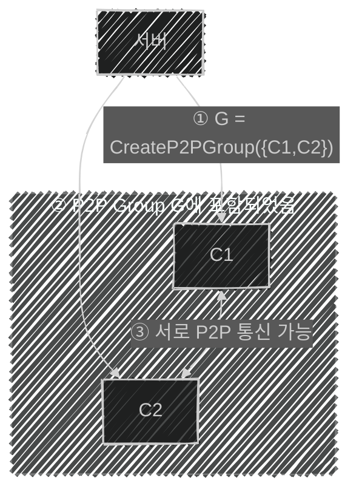

# 📦 6. 게임 네트워크 엔진 프라우드넷
## 👉🏻 7. 클라이언트끼리 P2P 통신

### 🔗 1. P2P 네트워킹

**특징:**

- 서버를 거치지 않고 클라이언트끼리 통신하는 기능
- P2P 연결을 생성하는데 시간이 걸리지 않는다
- 클라이언트끼리 P2P 연결/해제는 임의로 결정할 수 없으며, **서버가 승인**해야 한다
- 프라우드넷에서는 **P2P 그룹**이라는 개념을 제공한다

---

### 👥 2. P2P 그룹



**특징:**

- G는 그룹 식별자로, HostID와 같이 쓰인다
- P2P 그룹에는 클라이언트를 0개 이상 넣을 수 있다
- 클라이언트 하나가 여러 P2P 그룹에 들어갈 수 있다
- 서버도 P2P 그룹에 들어갈 수 있다

---

### 💻 2.1. 예시 코드

### 1️⃣ 그룹 만들기

```cpp

HostID list[2];
list[0] = C1;
list[1] = C2;
G = s->CreateP2PGroup(list, 2);
```

---

### 2️⃣ 그룹 참여 이벤트

```cpp
c->OnP2PMemberJoin = [...] // 1
	(HostID memberHostID,
	HostID groupHostID,
	int memberCount,
	const ByteArray &customField)
{
	G = groupHostID; // 2
	Peers.Add(memberHostID); // 2
};
```

**매개변수:**

- `memberHostID`: 새로 들어온 멤버의 HostID
- `groupHostID`: 현재 P2P 그룹의 ID
- `memberCount`: 새 멤버를 포함한 그룹 총 인원 수
- `customField`: 그룹 생성 시 전달된 사용자 정의 데이터 (보통 방 옵션)

**호출 시나리오:**

**내가 호스트인 경우 (첫번째 멤버):**

- `OnP2PMemberJoin`이 호출되며, memberHostID는 나 자신이 된다

**다른 사람이 방에 들어온 경우:**

- 기존 멤버 각각 `OnP2PMemberJoin` 이벤트가 호출된다
- memberHostID는 새로운 멤버의 HostID가 된다

**내가 다른 사람의 방에 들어온 경우:**

- `OnP2PMemberJoin` 이벤트가 **기존 멤버 + 나 자신** 횟수만큼 호출된다

---

### 3️⃣ 그룹 탈퇴 이벤트

- 자신 혹은 다른 클라이언트가 나가면 `OnP2PMemberLeave` 함수가 호출된다
- 이를 통해 누가 나갔는지 알 수 있다

---

### 4️⃣ 메시지 전송

```cpp
c->SendUserMessage(G, RmiContext::ReliableSend, data, length);
```

**전송 방식:**

- 첫번째 매개변수로 다른 호스트의 ID를 넣으면 P2P로 전송되며, 그룹 ID를 넣으면 모든 호스트에게 멀티캐스트를 할 수 있다
- 보내는 방법으로는 `SendUserMessage` 함수 호출 또는 RMI를 사용할 수 있다

---

### 5️⃣ 그룹에 멤버 추가/삭제/파괴

**멤버 추가:**

- 생성된 P2P 그룹에 `JoinP2PGroup` 함수를 통해 클라이언트를 그룹에 추가할 수 있다

**멤버 삭제:**

- `NetServer.LeaveP2PGroup()`을 통해 그룹에서 호스트를 제거할 수 있다

**그룹 파괴:**

- 그룹을 파괴하려면 `DestroyP2PGroup` 함수를 호출할 수 있다

---

### 🕳️ P2P 홀펀칭

**정의:**

- 인터넷 공유기 외부에 있는 클라이언트끼리 P2P 통신을 할 수 있는 기법을 뜻한다

**한계:**

- 홀펀칭이 되지 않는 공유기도 존재한다
- 이러한 경우 **P2P 릴레이**를 사용한다

---

### 🔄 P2P 릴레이

**정의:**

- 서버를 통해 간접적으로 P2P 네트워킹을 하는 것을 뜻한다

**단점:**

- 릴레이 서버를 통해 네트워킹을 하기에 일반적인 방법보다 비효율적이다

**상태 확인:**

```cpp
c->OnChangeP2PRelayState = [...]
	(HostID remoteHostID, ErrorType reason)
{
	...
}
```

- 홀펀칭 성공, 중도 해지 시에도 통지 받는다
- reason이 OK면 홀펀칭 상태, 다른 값이면 중도 해지를 뜻하며 이유를 알 수 있다

---

### 📞 P2P에서의 RMI

```cpp
// MyGame.pidl
global MyGameP2P { // 1
	Player_Move([in] Vector3 position);
}
```

```cpp
// C++
MyGameP2P::Proxy P2PProxy; // 2
MyGameP2P::StubFunctional P2PStub;

P2PStub.Player_Move_Function = [...]PARAM_MyGameP2P_Player_Move { // 3
	...
};

c->AttachProxy(&P2PProxy); // 4
c->AttachStub(&P2PStub);

P2PProxy.Player_Move(G, RmiContext::UnreliableSend, myPosition); // 5
```

**과정:**

- **1번**: P2P 통신용 RMI 정의
- **2번**: P2P RMI의 Proxy/Stub 클래스 인스턴스
- **3번**: Stub에 함수 할당
- **4번**: NetClient에 Proxy/Stub 부착
- **5번**: P2P 클라이언트에 원격 함수 호출(송신)

---

# 🧐 정리

| 구분 | 설명 | 장점 | 단점 |
| --- | --- | --- | --- |
| **P2P 직접 통신** | 클라이언트끼리 직접 통신 | 레이턴시 최소화 | 홀펀칭 실패 가능 |
| **P2P 릴레이** | 서버 경유 P2P | 홀펀칭 실패 시 대안 | 레이턴시 증가 |

**핵심:**

- P2P 그룹으로 멀티캐스트 구현
- 서버가 P2P 연결 승인 및 관리
- 홀펀칭 실패 시 자동 릴레이 전환
- RMI로 편리한 P2P 통신