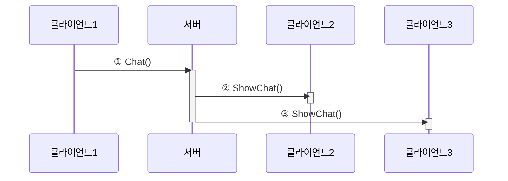

# 📦 6. 게임 네트워크 엔진 프라우드넷
## 👉🏻 8. 예시: 채팅 처리

### 📊 채팅 처리 흐름



**기본 구조:**
- 서버는 클라이언트에게 메시지를 수신받고, 다른 클라이언트에게 뿌려주는 형식으로 구현한다

---

### 🖥️ 서버 측 의사 코드

#### 기본 구조

```cpp
class MyGameServer {
	CNetServer* m_netServer;
	CriticalSection m_critSec;
	map<HostID, shared_ptr<RemoteClient>> m_remoteClients;
	
	OnClientJoin(clientInfo) {
		CriticalSectionLock lock(m_critSec, true);
		shared_ptr<RemoteClient> newRemote =
			shared_ptr<RemoteClient>(new RemoteClient);
		fill_something(newRemote);
		m_remoteClients.Add(clientInfo->m_hostID, newRemote);
	}
	
	OnClientLeave(clientInfo) {
		CriticalSectionLock lock(m_critSec, true);
		m_remoteClients.Remove(clientInfo->m_hostID);
	}
	
	Init() {
		m_netServer->OnClientJoin = OnClientJoin;
		m_netServer->OnClientLeave = OnClientLeave;
	}
}

```

**핵심 사항:**
- CNetServer는 기본적으로 **멀티스레드**로 작동하며, 싱글스레드로 만들 수도 있다
- `m_remoteClients`로 접속한 클라이언트들의 목록을 저장한다
- `CriticalSectionLock`으로 데이터를 보호한다
    - RMI나 이벤트 함수 호출이 여러 스레드에서 실행되기 때문
- `OnClientJoin()`/`OnClientLeave()` 함수에서 클라이언트 접속/퇴장을 처리한다

---

#### 채팅 처리

```cpp
class RemoteClient {
	string m_name;
};

MyGameServer:public MyGameC2S::Stub {
	MyGameS2C::Proxy m_s2cProxy;
	
	MyGameC2S:Stub::Chat(senderHostID, rmiContext, text) {
		CriticalSectionLock lock(m_critSec, true);
		
		// 1
		shared_ptr<RemoteClient> sender =
			m_remoteClients.find(senderHostID).second;
		
		// 2
		vector<HostID> sendTo;
		for(auto r : m_remoteClients) {
			if(r.first != senderHostID)
				sendTo.push_back(r.first);
		}
		
		// 3
		m_s2cProxy.ShowChat(&r[0], r.size(), sender->m_name, text);
	}
}

```

**처리 과정:**
- **1번**: senderHostID를 통해 송신자의 정보를 알아낸다
- **2번**: 송신자를 제외한 클라이언트들, 즉 수신자 목록을 만든다
- **3번**: 멀티캐스트를 진행한다

---

### 💻 클라이언트 측 의사 코드

```cpp
class MyGameClient {
	CNetServer* m_netClient;
	
	OnJoinServerComplete(info, replyFromServer) {
		if(info.type == OK)
			do_success();
		else
			do_failure();
	}
	
	OnLeaveServer(info) {
		do_leave();
	}
	
	Init() {
		m_netClient->OnJoinServerComplete = OnJoinServerComplete
		m_netClient->OnLeaveServer = OnLeaveServer;
	}
	
	MainLoop() {
		while(true) {
			m_netClient->FrameMove();
			update_scene();
			render_scene();
		}
	}
}

```

**핵심 사항:**
- `FrameMove()` 함수에서 이벤트 및 수신 처리를 진행한다
- `OnJoinServerComplete()`/`OnLeaveServer()` 함수에서 서버 연결 여부/연결 중도 해제를 처리한다
    - 직접 구현한다

---

# 🧐 정리

**서버 역할:**
- 클라이언트 목록 관리 (접속/퇴장)
- 채팅 메시지 수신 및 멀티캐스트
- 멀티스레드 환경에서 데이터 보호

**클라이언트 역할:**
- 서버 연결/해제 처리
- FrameMove()로 이벤트 폴링
- 메시지 수신 및 화면 업데이트

**핵심 패턴:**
- 서버 중심 메시지 중계
- 멀티캐스트로 효율적 전송
- 스레드 안전성 보장