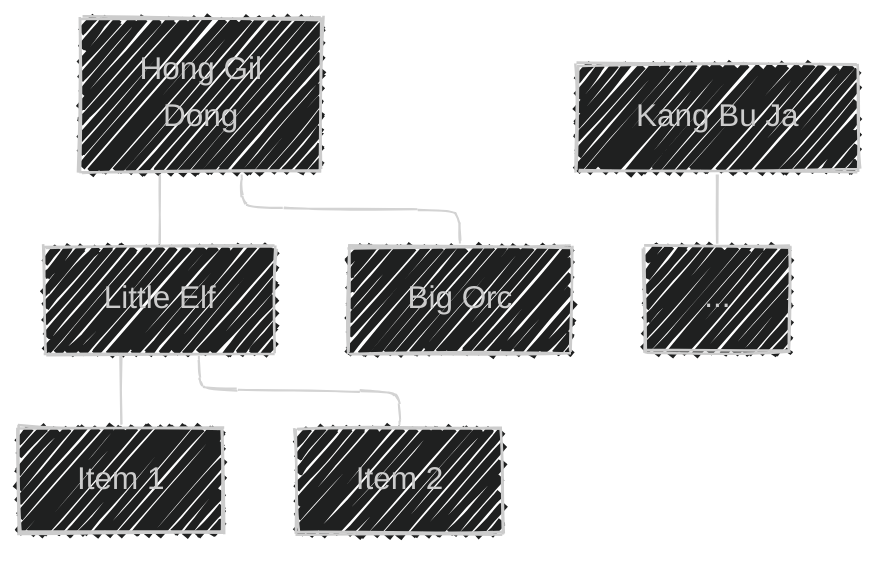

이 글은 아래의 책을 자세히 정리한 후, 정리한 글을 GPT에게 요약을 요청하여 작성되었습니다.  
게임 서버 프로그래밍 교과서, 배현직 저자
{: .notice--warning}

# 📦 7. 데이터베이스 기초
## 👉🏻 7. 플레이어 정보를 데이터베이스에 저장하는 방법 1

### 🌳 플레이어 데이터 구조



**데이터 특징:**
- 트리 구조로 표현된 플레이어 데이터

---

### 📝 두 가지 저장 방법

**방법 1:**
- 플레이어 데이터 전체를 **문서 형태**로 만들어 테이블에 넣는다
- 대표적으로 **JSON, XML** 형태를 사용한다
- **우선 이 방법부터 알아본다**

**방법 2:**
- 플레이어 데이터를 구성하는 트리 노드 각각을 테이블에 넣는다

---

### 📄 JSON 형식

```json
{
  "id": "Hong Gil Dong",
  "email": "gildong@foofoomail.com",
  "password": "xxiuhwdqwddwdwafd",
  "characters": [
    {
      "id": "Little Elf",
      "gender": "Female",
      "level": 35,
      "items": [
        {
          "type": 123,
          "amount": 1
        }
      ]
    },
    {
      "id": "Big Orc",
      "gender": "Male",
      "level": 23,
      "items": []
    }
  ]
}

```

---

### 📋 XML 형식

```xml
<?xml version="1.0" encoding="UTF-8"?>
<User>
  <ID>Hong Gil Dong</ID>
  <Email>gildong@foofoomail.com</Email>
  <Password>xxiuhwdqwddwdwafd</Password>

  <Characters>
    <Character>
      <ID>Little Elf</ID>
      <Gender>Female</Gender>
      <Level>35</Level>
      <Items>
        <Item>
          <Type>123</Type>
          <Amount>1</Amount>
        </Item>
      </Items>
    </Character>

    <Character>
      <ID>Big Orc</ID>
      <Gender>Male</Gender>
      <Level>23</Level>
      <Items />
    </Character>
  </Characters>
</User>

```

---

### 💾 데이터베이스 저장 방식

**특징:**
- 트리 구조의 데이터를 **문자열**로 표현하며, 이름과 값의 짝으로 이루어진다
- 이것을 **한 줄로 붙여** 테이블에 **text 타입**으로 저장한다
    - text 타입은 **문자열 길이가 제한되지 않는다**
    - 얼마나 길어질지 알 수 없기 때문이다

---

# 🧐 정리

### 문서 형태 저장 방식

| 구분 | JSON | XML |
| --- | --- | --- |
| **가독성** | 높음 | 중간 |
| **크기** | 작음 | 큼 (태그 중복) |
| **파싱 속도** | 빠름 | 느림 |
| **사용 편의성** | 높음 | 낮음 |
| **데이터베이스 지원** | JSON 타입 있음 | XML 타입 있음 |

### 장단점

**장점:**
- 구현이 간단함
- 계층 구조를 자연스럽게 표현
- 스키마 변경이 자유로움
- 전체 데이터를 한 번에 로드 가능

**단점:**
- 특정 필드만 검색하기 어려움
- 부분 업데이트 불가능 (전체 교체 필요)
- 데이터 중복 검사 어려움
- 인덱싱 불가능 (검색 성능 저하)

### 권장 사용 사례

**문서 형태가 적합한 경우:**
- 데이터 구조가 자주 변경됨
- 전체 데이터를 한 번에 읽고 쓰는 경우
- 복잡한 검색이 필요 없는 경우
- 소규모 데이터

**문서 형태가 부적합한 경우:**
- 특정 필드만 자주 검색/수정
- 복잡한 쿼리 필요
- 데이터 무결성 검증 필요
- 대규모 데이터