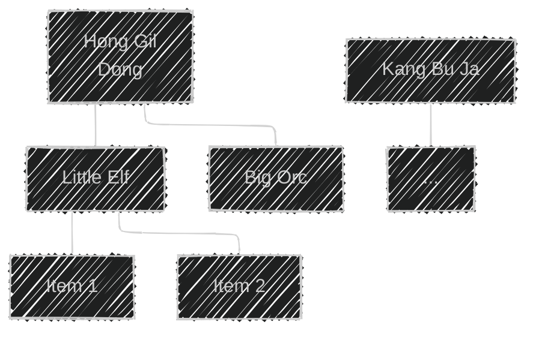
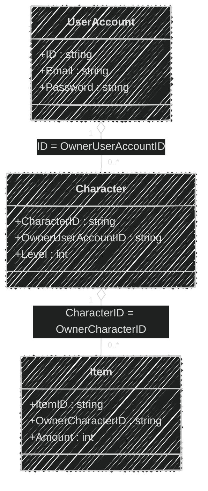
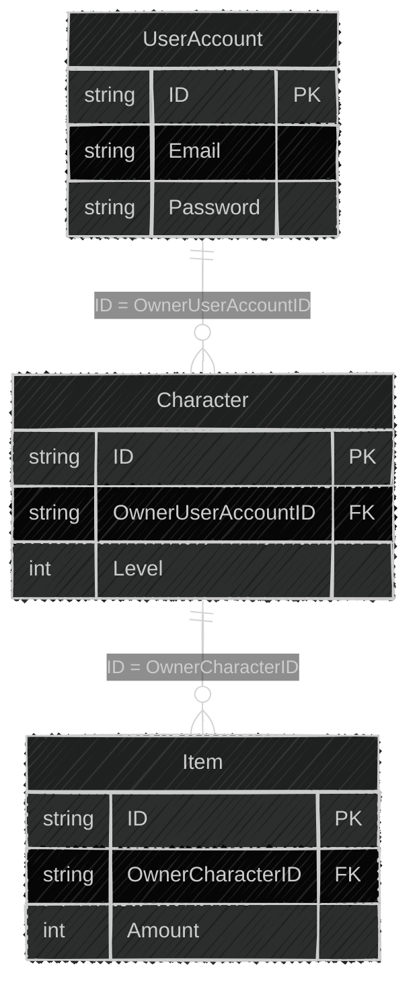

이 글은 아래의 책을 자세히 정리한 후, 정리한 글을 GPT에게 요약을 요청하여 작성되었습니다.  
게임 서버 프로그래밍 교과서, 배현직 저자
{: .notice--warning}

# 📦 7. 데이터베이스 기초
## 👉🏻 8. 플레이어 정보를 데이터베이스에 저장하는 방법 2

### 🌳 플레이어 데이터 구조

**저장 방식:**

- 플레이어 데이터를 구성하는 **트리 노드 각각을 테이블에 넣는 방법**을 알아본다

**표기법:**

- 🟥 : 기본 키 (Primary Key)
- 🟦 : 외래 키 (Foreign Key)

---

### 👤 UserAccount 테이블

**플레이어 정보가 담긴 테이블:**

| 🟥 ID | Email | Password |
| --- | --- | --- |
| Hong Gil Dong | hgd@gs.pm | qwer1234 |
| Kang Bu Ja | kbj@gs.pm | kbj |

**키 설정:**

- ID는 서로 중복되면 안 된다
    - 유니크 속성이 있는 인덱스를 추가하거나
    - **프라이머리 키를 설정**한다

---

### 🎮 Character 테이블

**캐릭터와 소유주가 담긴 테이블:**

| 🟥 CharacterID | 🟦 OwnerUserAccountID | Level |
| --- | --- | --- |
| Little Elf | Hong Gil Dong | 10 |
| Big Orc | Hong Gil Dong | 5 |

**외래 키 설정:**

- `OwnerUserAccountID`는 UserAccount 테이블의 ID 필드를 가리키는 **외래 키**이다
    - **외래 키**: 한 테이블의 열이 다른 테이블의 기본 키를 참조하여 두 테이블 간의 논리적 연결 고리를 설정하는 키
- 외래 키로 CRUD를 자주 수행하며, 중복을 허락해야 하는 상황이다
    - → **논유니크 인덱스**로 설정한다

---

### 🎁 Item 테이블

**아이템 개체가 들어있는 테이블:**

| 🟥 ItemID | 🟦 OwnerCharacterID | Amount |
| --- | --- | --- |
| Red_Potion | Little Elf | 3 |
| Blue_Potion | Little Elf | 7 |

---

### 📊 다이어그램

**데이터베이스 표현 방식:**

- 개체-관계 다이어그램 (E-R 다이어그램)
- UML (Unified Modeling Language)

---

### 🔷 UML 다이어그램

**관계 표기:**

- `1` : 하나
- `0..*` : 0개 이상
- `o--` : 집합 관계 (Aggregation)

> UML 다이어그램의 화살표에 대해



---

### 📐 E-R 다이어그램

**관계 표기:**

- `||` : 정확히 하나
- `o{` : 0개 이상
- `-` : 관계 연결선

---

# 🧐 정리

### 정규화된 테이블 구조

**장점:**

- 특정 필드만 검색/수정 가능
- 인덱스를 통한 빠른 검색
- 데이터 무결성 보장 (외래 키)
- 부분 업데이트 가능
- 중복 데이터 최소화

**단점:**

- 구현 복잡도 증가
- JOIN 연산 필요 (성능 저하 가능)
- 스키마 변경 어려움
- 전체 데이터 로드 시 여러 쿼리 필요