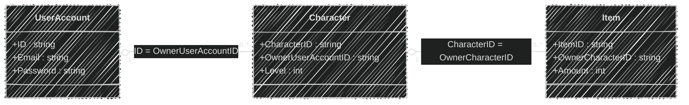
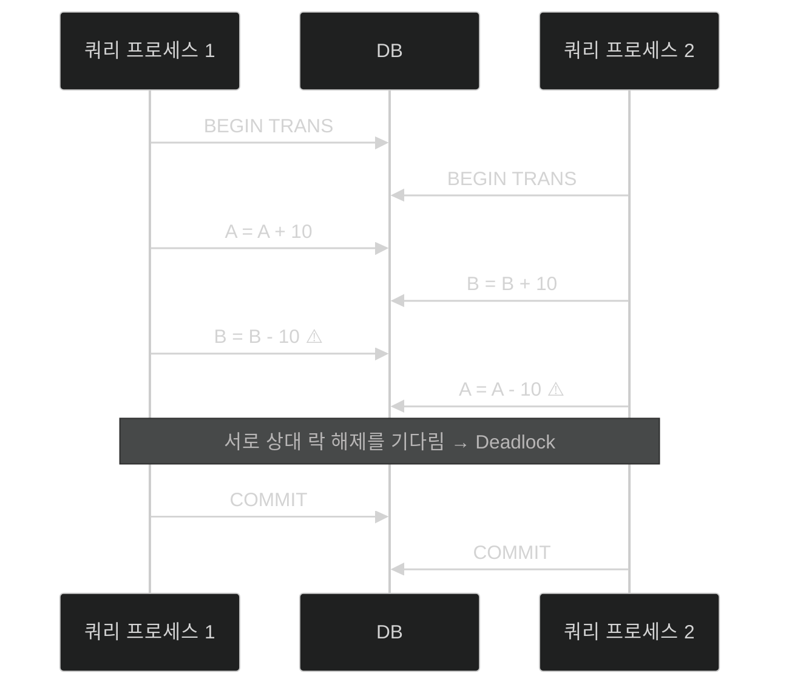

이 글은 아래의 책을 자세히 정리한 후, 정리한 글을 GPT에게 요약을 요청하여 작성되었습니다.  
게임 서버 프로그래밍 교과서, 배현직 저자
{: .notice--warning}

# 📦 7. 데이터베이스 기초
## 👉🏻 9. 질의 구문 실행

### 🗂️ 데이터베이스 구조



---

### 📝 질의 구문 예시

**조회 (SELECT):**

```sql
// select: ID, Password 가져오기
// from: UserAccount 테이블에서
// where: ID가 'Hong Gil Dong'인 레코드의
select ID, Password from UserAccount where ID='Hong Gil Dong'

// select: CharacterID 가져오기
// from: Character 테이블에서
// where: OwnerUserAccountID가 'Hong Gil Dong'인 레코드의
select CharacterID from Character where OwnerUserAccountID='Hong Gil Dong'

// select: 모든 필드 가져오기
// from: Character 테이블에서
// where: CharacterID가 'Little Elf'인 레코드의
select * from Character where CharacterID='Little Elf'

// select: 모든 필드 가져오기
// from: Item 테이블에서
// where: OwnerCharacterID가 'Little Elf'인 레코드의
select * from Item where OwnerCharacterID='Little Elf'
```

**수정/삽입/삭제:**

```sql
// update: Character 테이블에서 업데이트
// set: Level을 3으로 변경
// where: CharacterID가 'Little Elf'인 레코드의
update Character set Level=3 where CharacterID='Little Elf'

// insert into: Item 테이블에 (A,B,C) 필드를 가진 레코드 삽입
// values: 해당 값 넣기
insert into Item (ItemID,OwnerCharacterID,Amount) values (37485,'Little Elf',3)

// update: Item 테이블에서 업데이트
// set: Amount를 2로 변경
// where: ItemID가 37485인 레코드의
update Item set Amount=2 where ItemID=37485

// delete from: Item 테이블에서 삭제
// where: ID가 37485인 레코드
delete from Item where ID=37485
```

---

### ⚠️ 문제점

**비효율성:**
- 게임 서버가 데이터베이스에 질의구문을 던지는 것은 비효율적이다
    - 질의구문 송신/수신까지 디바이스 타임이 발생한다
    - 게임 서버와 데이터베이스 간 네트워크 레이턴시를 모아보면 꽤 긴 시간이다
    - 데이터베이스는 매 질의 구문을 수신마다 준비 작업 연산이 발생한다

---

### 📦 저장 프로시저 (Stored Procedure)

**정의:**
- 데이터베이스에 미리 질의 구문 집합을 저장해두는 것

**생성:**

```sql
create procedure LoadCharacterAndItem
	@ID nvarchar(50) -- 저장 프로시저 입력 매개변수
as
begin -- 저장 프로시저 루틴 시작
	select * from Character where ID=@ID
	select * from Item where OwnerCharacterID=@ID
end -- 저장 프로시저 루틴 끝
```

**실행:**

```sql
EXEC LoadCharacterAndItem @ID='xxx'
```

---

### 🔄 트랜잭션 (Transaction)

**기본 사용:**

```sql
begin transaction
update UserAccount set Money=Money+100 where ID='Kang Bu Ja'
update UserAccount set Money=Money-100 where ID='Hong Gil Dong'
// commit 또는 rollback transaction 구문 실행
```

**필요성:**
- 실수 또는 시스템 결함으로 인해 둘 중 하나만 실행되면 대참사다

**동작 방식:**
- `begin transaction`구문으로 시작한다
- 두 번째 구문 실행 후 문제가 없다 판단되면 `commit`
- 문제가 있다 판단되면 `rollback transaction`을 실행한다
    - `begin transaction` 이후의 데이터들이 원상복구된다

---

### 🔒 트랜잭션 중 액세스

**시나리오:**

게임 서버 1, 2가 있다.

1. 게임 서버 1에서 트랜잭션을 시작하고, update 구문 실행
2. 게임 서버 2에서 게임 서버 1이 액세스한 레코드 읽음
    - `select Money from UserAccount where ID='Kang Bu Ja'`
3. 게임 서버 1에서 트랜잭션 롤백

**결과:**
- 2번에서 게임 서버 1의 트랜잭션이 끝날 때까지 **블로킹**된다
- 멀티스레드 프로그래밍의 뮤텍스 잠금과 비슷하다
- 즉, **데드락을 주의**해야 한다

---

### ⚰️ 데드락 (Deadlock)



**예방 방법:**
- 질의 구문은 반드시 레코드 **A→B 순서**로 액세스해야 한다
- 트랜잭션 내 레코드 최소, 데이터 액세스 횟수도 최소로 한다
- 교착 상태로 구문 실행이 블로킹/실패 시에도 오류를 처리해야 한다

**성능 이슈:**
- 트랜잭션 영향을 받는 레코드는 쿼리 프로세스에서 액세스하면 블로킹이 발생한다
- 병렬 처리 효율성이 떨어진다
- 주변의 다른 레코드나 해당 레코드가 있는 테이블 전체가 잠금될 수도 있다

---

### 🎮 게임 서버와 데이터베이스

```cpp
// 플레이어 1,2가 아이템 1,2를 교환
void RequestExchangeItems(player1, player2, item1, item2) {
	// 사전 검증
	if(!player1.hasItem(item1)) {
		ResponseExchangeItemsFail(...);
		return;
	}
	if(!player2.hasItem(item2)) {
		ResponseExchangeItemsFail(...);
		return;
	}
	...; // 기타 필요한 연산 수행
	
	player1.removeItem(item1);
	player2.removeItem(item2);
	player1.addItem(item2);
	player2.addItem(item1);
	
	db.execute("update Item set owner={player2} where itemID={item1}");
	db.execute("update Item set owner={player1} where itemID={item2}");
}
```

**특징:**
- 게임 서버 메모리에서 사전 검증을 수행하기 때문에 트랜잭션이 필요한 상황이 적다
- 트랜잭션을 사용하면 성능 저하와 데드락 가능성이 생길 수 있다
- 데이터베이스가 세이브 데이터 역할 정도만 한다면, 트랜잭션을 사용하였을 때 이득보다 손실이 더 많을 수도 있다

**→ 이 점으로 트랜잭션을 사용하지 않고 싶을 수 있다**

**크래시 대응:**
- 게임 서버에서 크래시가 발생하는 경우
    - 마지막 질의 구문을 실행하지 못하게 된다
    - 로그를 남겨두었다가, 성공하면 로그를 삭제한다

---

# 🧐 정리

| 기법 | 장점 | 단점 | 사용 시기 |
| --- | --- | --- | --- |
| **저장 프로시저** | 네트워크 비용 감소<br>미리 컴파일됨 | 유지보수 복잡 | 자주 사용하는 쿼리 |
| **트랜잭션** | 데이터 무결성 보장 | 성능 저하<br>데드락 위험 | 금융 거래 등 |
| **메모리 우선** | 빠른 처리<br>데드락 없음 | 크래시 시 손실 | 게임 서버 일반 |

**게임 서버 권장 패턴:**
- 게임 로직은 메모리에서 처리
- DB는 세이브 용도로만 사용
- 중요 거래만 트랜잭션 사용
- 크래시 대비 로그 기록